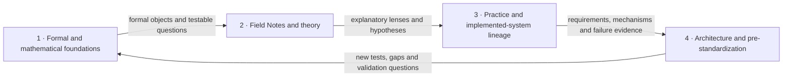
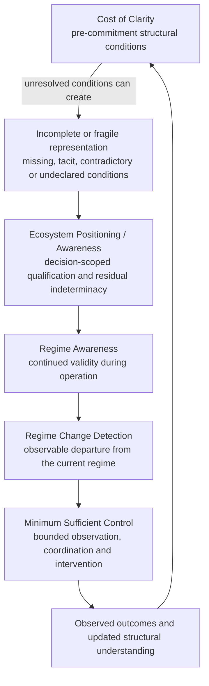

# Structural Awareness Programme

> **Public contribution repository — working material for review and discussion; not a validated method, adopted standard or institutional position**

Structural Awareness is a connected research and architecture programme about a recurring problem: technical and institutional systems act through incomplete representations of their own structure, dependencies and operating conditions. The programme studies how that incompleteness arises, how it appears in practice, how its consequences can be detected, and how AI-enabled systems can respond with sufficient but bounded control.

The programme is hosted in the public research context of [Tegrity.AI](https://tegrity.ai/structural-awareness-program/), an initiative of **The Integral Management Society, a Swiss non-profit association**. Applied engineering and productisation remain with their respective owners, including the JubAp.Net / JubAp.EU lineage. Individual workstreams retain separate evidence, ownership, institutional routes and validation requirements; their connection must not be used to transfer validation from one workstream to another.

## Start here — four levels of the programme

This repository is the public entry point across four connected but distinct levels:

| Level | What it contains | Primary entry |
|---|---|---|
| **1 · Formal and mathematical foundations** | Logic, information, representation, computational exergy, semantic windows and early-warning formulations that supply formal questions and candidate mathematical objects. | [Iván Abril Palma — ResearchGate profile and publications](https://www.researchgate.net/profile/Ivan-Abril-Palma-2) |
| **2 · Field Notes and theoretical research** | The Tegrity.AI series that explain why structural awareness is lost, what it costs, and what operational integrity requires. | [Structural Awareness synthesis and reader index](https://tegrity.ai/structural-awareness-program/) · [Research Initiatives](https://tegrity.ai/research-initiatives/) · [Field Notes](https://tegrity.ai/articles/) |
| **3 · Practice and implemented-system lineage** | Deployed-system retrospectives and current practice lines: xSeil, Phylons and mobility orchestration. They provide engineering provenance and testable cases, not automatic validation of later general architectures. | [Regime Awareness field reconstruction](https://tegrity.ai/evolution-of-regime-awareness-capability/) · [Tegrity.AI research contributions](https://tegrity.ai/research-contributions/) |
| **4 · Architecture and pre-standardization** | The current architecture work: Ecosystem Positioning / Awareness, Regime Awareness, Minimum Sufficient Control, interfaces, validation profiles, failure scenarios and standards-facing contributions. | [Ecosystem Awareness router](./research/ecosystem-awareness/) |

The arrows describe a reading and research relationship, not a claim that each layer proves the next. Mathematical propositions, field observations, implemented systems and current architectural proposals retain different evidence burdens.

## Level 1 — formal and mathematical foundations

The formal layer collects mathematical and mathematical-adjacent contributions across logic, representation, information theory, computational exergy, regime-aware semantic windows and sufficiently-good early warning. The public publication index is the [ResearchGate profile of Iván Abril Palma](https://www.researchgate.net/profile/Ivan-Abril-Palma-2).

The profile is a route to the individual publications, not a blanket validation claim. Each contribution must be read according to its own proof, preprint, working-paper or experimental status.

## Level 2 — Field Notes and theoretical research

The [Structural Awareness synthesis](https://tegrity.ai/structural-awareness-program/) explains the common programme and provides a deep reader index. The [Research Initiatives](https://tegrity.ai/research-initiatives/) page gives the current initiative map, while the [Field Notes hub](https://tegrity.ai/articles/) provides the complete publication stream.

### Principal Tegrity.AI series

| Series | Role in the programme |
|---|---|
| [**The Cost of Clarity**](https://tegrity.ai/series/cost_of_clarity/) | The information cost and risk of establishing what must be known before commitment. |
| [**Human Intelligence Debt / The Human Intelligence Gap**](https://tegrity.ai/series/human-intelligence-gap/) | The human cognitive capacity absorbed by fragmentation, reconciliation, validation and work that architecture or technology could have prevented. |
| [**The Attribution Gap**](https://tegrity.ai/series/attribution_gap/) | How contribution, recognition, authority and ownership diverge, making load-bearing capabilities structurally vulnerable. |
| [**Informational Friction**](https://tegrity.ai/series/informational_friction/) | The systems-theory account of what happens when a representation used as a control surface diverges from the flow it governs. |
| [**Regime Awareness in Adaptive Systems**](https://tegrity.ai/series/regime-awareness-in-adaptive-systems/) | Whether the context supporting a current inference or control posture remains valid as conditions change. |
| [**AI Operational Integrity Management Architecture**](https://tegrity.ai/series/ai-operational-integrity-architecture/) | The architecture surrounding statistical AI, its deterministic envelopes and their structural limits under regime change. |
| [**AI Integrity Management**](https://tegrity.ai/series/ai_integrity/) | The enterprise governance and management function connecting AI safety, reliability, security, explainability and compliance. |

These series are explanatory and research layers. Their convergence motivates shared tests and architecture work; it is not multiple independent proof of the same claim.

## Level 3 — practice and implemented-system lineage

The practical layer exposes implemented systems and current application lines from which later research questions were reconstructed. The continuity is architectural and retrospective: historical systems did not implement today's Ecosystem Awareness or Minimum Sufficient Control specifications under those names.

### xSeil — mission-critical mobility and logistics orchestration

- [**xSeil: Vehicle Routing Under Fully Committed Tourism Demand**](https://jubap.net/xseil-vrp/) — a code-grounded reconstruction of the deployed 2016–2017 rich-VRP architecture, including persistent route memory, state-dependent objective pricing, sequential commitment and bounded repair. The comparative historical replay is designed but no replay superiority result is claimed.
- [**Regime Awareness: Capability Development Across Four Field Cases**](https://tegrity.ai/evolution-of-regime-awareness-capability/) — the bounded retrospective connecting xSeil with other implemented systems while keeping engineering provenance separate from present-framework validation.

### Phylons — adaptive signal and combinatorial structures

- [**Phylons: Predictive Factors to Semantic Windows**](https://jubap.net/phylons-predictive-factors-cascade/)
- [**Phylons: Dynamic Combinatorial Search**](https://jubap.net/phylons-dynamic-combinations/)
- [**Phylons: Revision-Aware Event Semantics and Relabeling Cascades**](https://jubap.net/phylons-relabeling-cascades/)

The Phylons studies expose practical questions about context boundaries, compositional search, revision and cascade effects. They are candidate sources for comparison and reconstruction, not proof that current domain-agnostic formulations are valid.

### Mobility practice line — JubAp.EU

- [**Mobility Operating System / Car Evolution**](https://jubap.eu/car-pooling-orchestration/) — the current JubAp.EU mobility practice line, extending bounded orchestration toward shared and institutional mobility.
- [**Orchestration capabilities**](https://jubap.eu/orchestration-capabilities/) — the wider mission-critical planning, coordination and implementation lineage.

Scientific formalisation and public research are developed through Tegrity.AI. Applied research, engineering and productisation remain with the applicable JubAp.Net / JubAp.EU entities and projects.

## Level 4 — architecture and pre-standardization

### Ecosystem Positioning / Awareness — the architectural core

The principal architecture component currently being developed is **Ecosystem Positioning within Ecosystem Awareness**: a participant-local situational core that qualifies where an agent or system is operating, which evidence and constraints apply, what it can rely on, what remains unresolved, and which part of the current frame must be requalified when the ecosystem changes.

Start with the **[Ecosystem Awareness router](./research/ecosystem-awareness/)**. It is the second-level README and the stable route into:

- the [canonical Ecosystem Awareness corpus](./research/ecosystem-awareness/baseline/README.md);
- the architecture topology, functional interfaces and agentic-security boundaries;
- the 100 Million Tokens and smart-city mobility failure scenarios;
- validation profiles, benchmark design, pre-registration and test artifacts;
- the separate Minimum Sufficient Control and Regime Awareness corpora; and
- the FG-TIDA-specific application package and provenance.

The router is deliberately short. Detailed document/version navigation belongs in the routed canonical indexes rather than being duplicated at the repository root.

### Operational architecture

This is one important causal and operational path, not a claim that every regime change begins with poor initial clarity. External shocks and endogenous dynamics can invalidate even a well-specified representation.

## Repository map

| Area | Question | Repository entry | Current status |
|---|---|---|---|
| **Cost of Clarity** | Are the information, distinctions and authority required for commitment actually available? | [`applied-research/cost-of-clarity-rup/`](./applied-research/cost-of-clarity-rup/) | Applied-research project under an EIS Estonia RUP assessment route; no funding or approval claim |
| **Ecosystem Positioning / Awareness** | What is sufficiently determined, unresolved or outside the current decision frame, and when must that frame be requalified? | [`research/ecosystem-awareness/`](./research/ecosystem-awareness/) | Candidate pre-standardization architecture with a frozen core and additive working annexes; not an adopted standard |
| **Regime Awareness** | Does the context supporting a decision remain valid as the system operates? | [`research/regime-awareness/`](./research/regime-awareness/) | Public research direction and field-derived candidate framework |
| **Regime Change Detection** | Is observable behaviour departing from the regime against which current assumptions were established? | [`research/regime-awareness/regime-change-qava-uv.md`](./research/regime-awareness/regime-change-qava-uv.md) | Preliminary methodological review route; no validation or institutional endorsement claim |
| **Minimum Sufficient Control** | What minimum observation, coordination and intervention capacity can maintain or recover a declared objective? | [`standards/minimum-sufficient-control/`](./standards/minimum-sufficient-control/) | Standards-oriented research input; not an adopted ITU position or recommendation |

## Evidence, validation and contributions

For engineering detail, the [canonical EA corpus index](./research/ecosystem-awareness/baseline/README.md) distinguishes general architecture from programme-specific application material. The [validation reader index](./research/ecosystem-awareness/baseline/VALIDATION_PROFILE_READING_NOTE.md) leads to the general validation profiles. The separate [EA / FG-TIDA application package](./research/ecosystem-awareness/fg-tida/) contains Charter/specification preparation, ideal/current interface mappings and FG-TIDA-specific cases and tests.

The [`submissions/`](./submissions/) library preserves public-ready documents and discussion contributions routed to UNECE WP.5, the UN CSTD Working Group on Data Governance at All Levels, ITU-T FG-AI4SSC and ITU-T FG-TIDA. It records procedural status rather than implying adoption.

The [Delegated Authority OS under Context Change](./submissions/itu-fg-tida/2026-theme-contributions/delegated-authority-os-under-context-change/) package links a minimal operational case, bounded extensibility, challenges and FG-TIDA Terms-of-Reference traceability. Its mobility scenario is one bounded instantiation; it is not an adopted FG-TIDA position.

### Current maturity boundary

- Architecture and interfaces: proposed and inspectable.
- Failure scenarios and validation profiles: documented.
- Benchmark and testbed: designed and partly pre-registered.
- Published comparative benchmark execution: not yet completed.
- Independent validation or standards adoption: not claimed.

### Evidence discipline

- Field cases provide engineering provenance, not universal validation.
- A mathematical or public working paper must be assessed according to its own proof and evidence status.
- A preliminary academic review does not imply institutional endorsement.
- A programme assessment route does not imply funding or approval.
- Participation in a standards discussion does not imply adoption by the standards body.
- Similar structural patterns across domains motivate testing; they do not prove transferability.

See [`governance/CLAIM_BOUNDARIES.md`](./governance/CLAIM_BOUNDARIES.md) for the current attribution and status boundaries.

## Repository status and licensing

This is the curated public contribution repository for material released for review and discussion. No open-source or content licence has yet been selected. Unless and until a licence is added, no permission beyond GitHub's applicable platform terms should be inferred.

---

**Ivan Abril**  
Research architecture and programme coordination.
