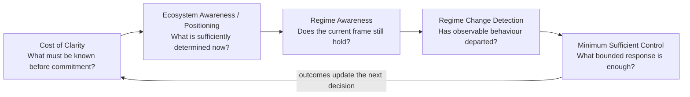

# Structural Awareness Programme

> **You are here:** [Iván Abril Palma](https://github.com/dakleyer/dakleyer) → **Structural Awareness Programme**

Structural Awareness is a research and architecture programme about a practical problem: **systems make decisions using representations that are always incomplete, can become stale, and may no longer describe the conditions under which action is justified**.

The programme asks how that incompleteness appears, how it can be detected before and during operation, and how organizations and AI-enabled systems can respond without assuming unlimited information, unlimited human attention or centralized control.

The work is developed through **Tegrity.AI, part of The Integral Management Society**. Different workstreams have different evidence, owners and institutional routes. They are connected because they address different parts of the same structural problem; one workstream does not automatically validate another.

---

## The programme in one view

A complex initiative can fail at several different moments:

1. **Before commitment**, because important information, distinctions or authority were never established.
2. **At decision time**, because the available evidence supports only part of the conclusion being made.
3. **During operation**, because the environment changes and yesterday's valid frame becomes stale.
4. **At detection**, because the system does not notice that its operating regime has changed.
5. **At response**, because even a correct warning is useless if there is no legitimate and sufficient capacity to act.

Those five moments correspond to the main workstreams in this repository.

This is a reading logic, not a claim that every real failure follows the same sequence.

---

## Where this work comes from

The present architecture did not begin as a document taxonomy. It grew from three bodies of work that gradually converged.

### Formal and mathematical foundations

The formal line includes work on logic, representation, information, incompleteness, computational exergy, semantic windows and regime-aware formulations. These contributions supply mathematical objects, limits and testable propositions rather than a finished operational architecture.

**Read more:** [Iván Abril Palma — ResearchGate publications](https://www.researchgate.net/profile/Ivan-Abril-Palma-2)

### Field Notes and theoretical research

The Tegrity.AI Field Notes explain the structural mechanisms in ordinary language: why clarity has a cost, why human attention becomes a hidden bottleneck, how attribution and authority diverge, how representations become stale and why nominal oversight can cease to be effective.

Key series include:

- [The Cost of Clarity](https://tegrity.ai/series/cost_of_clarity/)
- [Human Intelligence Debt / The Human Intelligence Gap](https://tegrity.ai/series/human-intelligence-gap/)
- [The Attribution Gap](https://tegrity.ai/series/attribution_gap/)
- [Informational Friction](https://tegrity.ai/series/informational_friction/)
- [Regime Awareness in Adaptive Systems](https://tegrity.ai/series/regime-awareness-in-adaptive-systems/)
- [AI Operational Integrity Management Architecture](https://tegrity.ai/series/ai-operational-integrity-architecture/)
- [AI Integrity Management](https://tegrity.ai/series/ai_integrity/)

**Start here:** [Structural Awareness Programme at Tegrity.AI](https://tegrity.ai/structural-awareness-program/) · [Field Notes](https://tegrity.ai/articles/)

### Implemented-system lineage

The practical line comes from systems built and operated before the present research language existed. They provide engineering provenance and concrete mechanisms to test; they are not automatic proof of the later general architecture.

Examples include:

- [xSeil — mission-critical mobility orchestration](https://jubap.net/xseil-vrp/)
- [Regime Awareness capability development across field cases](https://tegrity.ai/evolution-of-regime-awareness-capability/)
- [Phylons — predictive factors to semantic windows](https://jubap.net/phylons-predictive-factors-cascade/)
- [Phylons — dynamic combinatorial search](https://jubap.net/phylons-dynamic-combinations/)
- [Mobility Operating System / Car Evolution](https://jubap.eu/car-pooling-orchestration/)

These cases are useful because they expose the same practical tensions: incomplete context, changing conditions, competing objectives, limited response windows and distributed authority.

---

# The five workstreams

## 1. Cost of Clarity — before commitment

**Question:** do we actually have the information, distinctions and authority required to make a defensible commitment?

Organizations can perform extensive readiness, due-diligence or maturity work and still commit on a structurally incomplete basis. Relevant facts may be missing, contradictory, tacit, distributed across people or never institutionally declared.

The Cost of Clarity work asks whether those conditions can be identified **before** commitment, at an economically useful cost, and whether a sealed pre-commitment assessment later predicts information-acquisition burden or decision difficulty.

**Go to:** [Cost of Clarity / EIS Estonia RUP applied research](./applied-research/cost-of-clarity-rup/README.md)

---

## 2. Ecosystem Awareness / Ecosystem Positioning — what can be justified now?

**Question:** given an incomplete and changing ecosystem, what is actually established for this participant, this decision and this moment?

No agent, organization or human observer has the whole ecosystem. A local result can be correct while the larger conclusion remains unsupported.

Ecosystem Awareness therefore keeps explicit:

- what is established;
- how strongly it is established;
- what remains knowable within current capabilities;
- what remains outside the active or knowable boundary;
- which evidence depends on other evidence;
- and when the current frame must be requalified.

**Ecosystem Positioning** is the participant-local situational view produced from that qualification: where am I, what applies here, what can I rely on, what remains unresolved and where would additional determination still change the decision?

It does **not** replace identity, delegated authority, policy, attestation, human governance or control systems. It consumes their bounded state and keeps their meaning explicit.

**Go to:** [Ecosystem Awareness — entry-point router](./research/ecosystem-awareness/README.md)

---

## 3. Regime Awareness — does the current frame still hold?

**Question:** even if the current decision was justified, are the assumptions and evidence that supported it still valid as the system operates?

Actors change. Dependencies move. Objectives change. Service availability changes. Historical correlations stop holding. New constraints appear.

Regime Awareness is therefore about **continued validity**, not simply prediction. It asks whether the current evidence still belongs to the operating regime for which it was qualified.

**Go to:** [Regime Awareness — corpus index](./research/regime-awareness/README.md)

### Regime Change Detection

Regime Change Detection is the narrower quantitative problem inside Regime Awareness.

It asks whether observable behaviour has departed materially from the regime against which current assumptions were established, how early that can be detected, and whether the signal is useful enough to support action.

A detector can establish observable departure without reconstructing the complete hidden state of the world.

---

## 4. Minimum Sufficient Control — can the system respond?

**Question:** what is the smallest authorized combination of observation, coordination, intervention and enabling means that is sufficient for the declared objective?

A correct diagnosis is not enough. A system may know that something has changed and still lack authority, intervention reach, time or resources to respond.

MSCA treats control as a **conditional sufficiency problem**, not a maximization problem. More data, more orchestration or more centralization is not automatically better.

The architecture asks whether a candidate configuration is sufficient for the current Objective Envelope and operating assumptions, and whether a lower-burden supported alternative exists.

**Go to:** [Minimum Sufficient Control / MSCA — corpus index](./standards/minimum-sufficient-control/README.md)

---

## 5. AI Integrity Management — putting the responsibilities together

AI Integrity Management is the management and architecture layer that connects these questions to operational AI governance.

It does not collapse them into one mechanism. Instead, it asks whether an AI-enabled operating model has:

- a defensible commitment basis;
- a qualified current position;
- awareness of changing operating conditions;
- a meaningful detection path;
- legitimate and sufficient response capacity;
- and evidence that those responsibilities remain connected during operation.

This is where the programme becomes relevant to enterprise AI governance, safety, reliability, security, assurance and accountability.

**Public context:** [AI Integrity Management](https://tegrity.ai/series/ai_integrity/)

---

## How the pieces fit without becoming one system

The workstreams have different responsibilities:

| Workstream | Owns this question | Does **not** automatically own |
|---|---|---|
| **Cost of Clarity** | Is the commitment basis sufficiently established? | Runtime regime validity |
| **Ecosystem Awareness / Positioning** | What is established, unresolved or worth requalifying for this decision? | Identity, authority or execution |
| **Regime Awareness** | Does the operating frame remain valid? | Complete ecosystem truth |
| **Regime Change Detection** | Has observable behaviour materially departed? | Legitimate response authority |
| **MSCA** | Is a proposed control configuration sufficient and authorized? | Epistemic truth |
| **AI Integrity Management** | Are these responsibilities coherently governed? | Automatic validation of any component |

The value of the programme is precisely in keeping these boundaries visible while making their interfaces testable.

---

## Architecture, evidence and pre-standardization

The architecture work is public and inspectable, but its evidence status matters.

Current public material includes:

- architecture and interface proposals;
- reference failure scenarios;
- benchmark design and comparison arms;
- validation profiles;
- implementation profiles;
- pre-registration and test-harness design;
- public contribution packages and standards-facing discussion.

This does **not** mean comparative superiority, independent validation or standards adoption has already been established.

For detailed technical work, enter through the relevant corpus rather than through this page.

---

## Public submissions and institutional routes

A separate library records material sent to or publicly discussed through UNECE, UN CSTD and ITU processes.

It preserves exact procedural status so that “submitted”, “received”, “posted”, “discussed” and “adopted” are not confused.

**Go to:** [Public submissions and contributions](./submissions/README.md)

---

## Evidence discipline

- Field cases provide engineering provenance, not universal validation.
- A working paper is inspectable research, not a proven method.
- A preliminary academic review does not imply institutional endorsement.
- A programme assessment route does not imply funding or approval.
- Participation in a standards discussion does not imply adoption by the standards body.
- Similar structural patterns across domains justify testing; they do not prove transferability.

---

## For maintainers

The public pages are written for human readers. Repository maintenance rules, the sitemap and document-migration controls are kept separately in [DOCUMENT_CONTROL.md](./DOCUMENT_CONTROL.md).

That file must be consulted before moving, renaming or removing routed material, but it is **not** a substitute for the explanatory content of this README.

---

**Ivan Abril**  
Research architecture and programme coordination.
