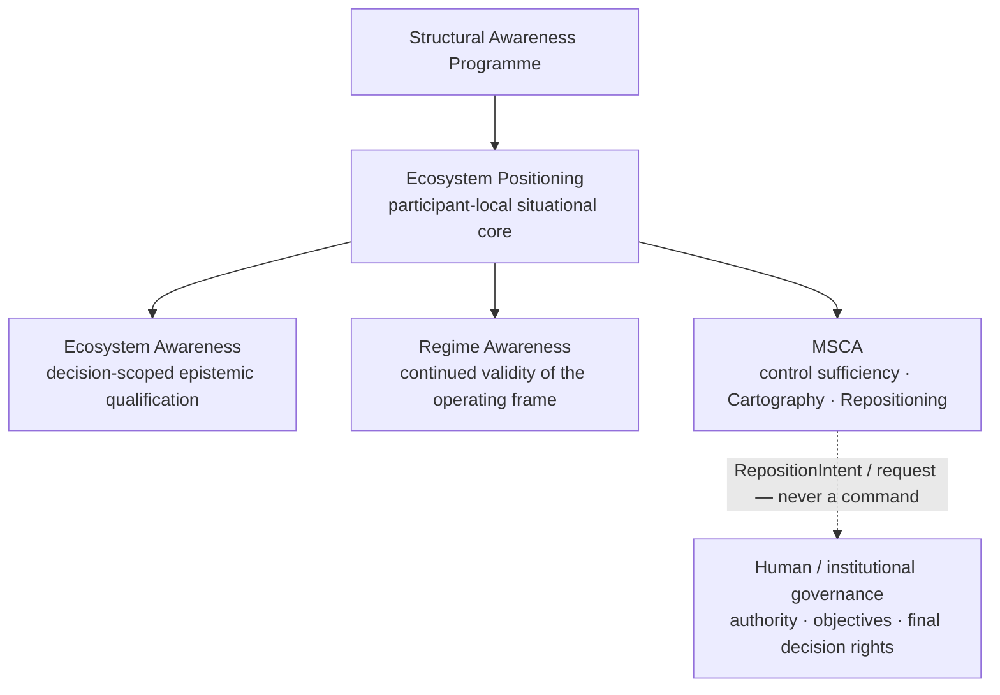

# Structural Awareness Programme

> **You are here:** [Iván Abril Palma](https://github.com/dakleyer/dakleyer) → **Structural Awareness Programme**

## Start here — Ecosystem Positioning

**The main architectural entry point for the Structural Awareness Programme.**

**Architecture:** [Ecosystem Positioning](./architectural-contributions/ecosystem-positioning/README.md)  
**Technical gates:** [Ecosystem Awareness](./research/ecosystem-awareness/README.md) · [Regime Awareness](./research/regime-awareness/README.md) · [MSCA](./standards/minimum-sufficient-control/README.md)

---

Structural Awareness is the umbrella programme. It connects four different kinds of work that answer four different questions about the same problem: **how do we understand enough of a complex system to act without destroying what actually makes it work?**

The programme is developed through **Tegrity.AI, part of The Integral Management Society**.

It is deliberately organized in **four parts**:

1. **Mathematical Contributions** — the formal and mathematical work published through the ResearchGate route.
2. **Field Notes / Research Series** — the explanatory series that make the structural problem understandable in organizational, economic and systems terms.
3. **Field Practice / Engineering** — systems that were actually built or operated and that expose the problem under real constraints.
4. **Architectural Contributions / pre-standardization** — current architecture contributions derived from the programme. The first maintained contribution is **Ecosystem Positioning**, a participant-local Agentic Architecture for remaining situated and requalifying as evidence, authority, roles and the surrounding ecosystem change.

These are four parts of one programme, not four competing indexes.

**Visual navigation:** [Structural / Ecosystem Awareness Visual Guide](./research/ecosystem-awareness/VISUAL_GUIDE.md) — cumulative lineage, architecture ownership, runtime cycle, requirements-to-evidence route, scenarios/profiles, validation/case map and FG-TIDA layering.

---

# 1. Mathematical Contributions

## What this part is

The mathematical line asks what can be said about representation, incompleteness, information, semantic boundaries, regime change and related limits **before** turning them into an enterprise or agentic architecture.

It supplies formal objects, proofs, candidate theorems and mathematical questions. It is not the same thing as the later applied architecture, and a mathematical result does not automatically validate an engineering design.

The public publication route is:

**[Iván Abril Palma — ResearchGate publications](https://www.researchgate.net/profile/Ivan-Abril-Palma-2)**

That is the place to start if the question is:

- What is the formal theory behind the programme?
- Which mathematical objects or limits are being proposed?
- Which results are proofs, preprints, working papers or hypotheses?

---

# 2. Field Notes / Research Series

## What this part is

The Field Notes translate the structural problem into human, organizational, economic and systems language.

They explain **why structural awareness is lost**, why organizations can keep operating while their formal map drifts away from the real flow, and why more controls, more review or more automation can sometimes make the problem worse instead of better.

The principal series are complementary.

### The Cost of Clarity

Asks what it costs — in time, evidence, process and organizational effort — to establish enough clarity before making a commitment.

It treats clarity as something that has an economic cost and sometimes a risk of its own.

**Read:** [The Cost of Clarity](https://tegrity.ai/series/cost_of_clarity/)

### Human Intelligence Debt

Asks how much human intelligence is being consumed simply to compensate for fragmented systems, unclear ownership, incompatible representations and manual reconciliation.

Its central question is whether people are using scarce cognitive capacity for judgment and design — or merely acting as middleware between badly integrated structures.

**Read:** [Human Intelligence Debt / The Human Intelligence Gap](https://tegrity.ai/series/human-intelligence-gap/)

### The Attribution Gap

Asks why real contribution and formal credit, ownership or investment can diverge.

A capability can be load-bearing in practice while remaining weakly represented in the organizational map. That gap can make valuable capabilities appear disposable.

**Read:** [The Attribution Gap](https://tegrity.ai/series/attribution_gap/)

### Informational Friction

Expresses the same underlying problem as a systems/control problem.

A system acts through a representation of itself. When the representation diverges materially from the real flow, locally rational decisions can damage the system they are intended to optimize.

**Read:** [Informational Friction](https://tegrity.ai/series/informational_friction/)

### Regime Awareness in Adaptive Systems

Asks when a representation that was once valid stops describing the current operating regime.

This series is the bridge from the explanatory Field Notes into the operational architecture below.

**Read:** [Regime Awareness in Adaptive Systems](https://tegrity.ai/series/regime-awareness-in-adaptive-systems/)

### Why these series belong together

They do not repeat the same claim.

- **Cost of Clarity** looks at the economics of establishing the map.
- **Attribution Gap** looks at distorted visibility of contribution and ownership.
- **Human Intelligence Debt** looks at the human cost of compensating for structural fragmentation.
- **Informational Friction** looks at the map–flow mismatch as a general systems problem.
- **Regime Awareness** asks when a previously valid map has become stale.

Together they explain different mechanisms through which structural awareness can be lost.

**Programme context:** [Structural Awareness at Tegrity.AI](https://tegrity.ai/structural-awareness-program/)  
**Browse the Field Notes:** [Tegrity.AI Field Notes](https://tegrity.ai/articles/)

---

# 3. Field Practice / Engineering

## What this part is

The third part is not theory. It is the engineering lineage from systems that were actually built, operated or reconstructed from operational evidence.

These systems pre-date much of the current terminology. They are useful because they show what the structural problem looks like when decisions have to be made under real limits: incomplete information, competing objectives, changing conditions, scarce response time and distributed authority.

They are **engineering provenance and test material**, not automatic validation of the later general architecture.

### Phylons

Phylons explores adaptive signal structures, semantic states, dynamic combinations and revision-aware cascades.

It provides a field and computational lineage for questions about how context is represented, how signals are combined, how states are relabelled and how a change in one part can propagate through a larger structure.

- [Predictive Factors to Semantic Windows](https://jubap.net/phylons-predictive-factors-cascade/)
- [Dynamic Combinatorial Search](https://jubap.net/phylons-dynamic-combinations/)
- [Revision-Aware Event Semantics and Relabeling Cascades](https://jubap.net/phylons-relabeling-cascades/)

### xSeil

xSeil is the mission-critical mobility and logistics line.

It dealt with large-scale routing and orchestration under fully committed demand, operational constraints, persistent route state, re-planning and bounded repair.

The importance of xSeil here is not that it “implemented Ecosystem Awareness” before the term existed. It is that it provides a concrete engineering case in which **local decisions, changing conditions and bounded coordination had to remain coherent under operational pressure**.

**Read:** [xSeil — Vehicle Routing Under Fully Committed Tourism Demand](https://jubap.net/xseil-vrp/)

### Mobility Operating System / Car Evolution

The Mobility Operating System extends the same field lineage toward shared and institutional mobility: multiple actors, different objectives, distributed decisions and real-time adaptation.

It is the current practice line in which orchestration starts to become **ecosystem coordination rather than one centralized optimization problem**.

- [Mobility Operating System / Car Evolution](https://jubap.eu/car-pooling-orchestration/)
- [Orchestration capabilities](https://jubap.eu/orchestration-capabilities/)

### Why the field work matters

The field cases let the programme ask better questions of the theory:

- What information was actually necessary?
- Which dependencies were invisible until something changed?
- What could be coordinated centrally and what could not?
- Which local decisions remained valid after the surrounding regime changed?
- What had to be requalified rather than merely recomputed?

That is the bridge into the current architecture.

---

# 4. Architectural Contributions / pre-standardization

## What this part is

This is where Structural Awareness becomes architecture.

Architectural Contributions translate the mathematical, Field Notes and Field Practice work into inspectable components that can be reviewed, benchmarked and, where appropriate, carried into pre-standardization discussions.

For now there is **one maintained architectural contribution in this section: Ecosystem Positioning**.

## Ecosystem Positioning — Agentic Architecture

Ecosystem Positioning addresses agentic and institutional systems in which **no participant has the complete ecosystem, roles and authority can change, evidence arrives from independently governed sources, and there may be no central orchestrator capable of maintaining one global state**.

Its core question is:

> **For this participant, this decision and this moment, what can be relied on, what remains unresolved, what has changed, and where would additional determination still matter?**

Ecosystem Positioning is the participant-local situational core. It is supported by separate technical responsibilities — **Ecosystem Awareness, Regime Awareness and Minimum Sufficient Control Architecture (MSCA)** — without absorbing their semantic ownership.

### Canonical presentation

The presentation is the **visual router** for Ecosystem Positioning and the fastest way to enter this architectural contribution.

### ⬇️ Canonical PowerPoints
[Requirements & Evidence (.pptx)](https://raw.githubusercontent.com/dakleyer/structural-awareness-contributions/main/presentations/ecosystem-positioning/Ecosystem_Positioning_Requirements_Evidence_Canonical_v1.1.pptx) · [Architecture & Implementation (.pptx)](https://raw.githubusercontent.com/dakleyer/structural-awareness-contributions/main/presentations/ecosystem-positioning/Ecosystem_Positioning_Architecture_Implementation_Canonical_v1.1.pptx)

### 📄 [Open the canonical PDF](./presentations/ecosystem-positioning/Ecosystem_Positioning_Canonical.pdf)

[Presentation manifest](./presentations/ecosystem-positioning/PRESENTATION_MANIFEST.md) · [Ecosystem Positioning README](./architectural-contributions/ecosystem-positioning/README.md)

The deck routes upward to the **Structural Awareness Programme** and downward to the three maintained technical gates:

- **Ecosystem Awareness** — decision-scoped epistemic qualification;
- **Regime Awareness** — continued validity of the operating frame and regime-change detection;
- **MSCA** — control sufficiency under the current Objective Envelope, authority and operating conditions.

It also preserves the benchmark and FG-TIDA reference routes used by the working architecture.

### Technical gates

The diagram is a navigation aid over the text below. It does not merge semantic ownership or introduce a central controller.

**Ecosystem Awareness:** [entry-point README](./research/ecosystem-awareness/README.md)

**Regime Awareness:** [corpus README](./research/regime-awareness/README.md)

**Minimum Sufficient Control / MSCA:** [corpus README](./standards/minimum-sufficient-control/README.md)

These corpora remain separate because they answer different questions. Ecosystem Positioning composes their decision-relevant state; it does not redefine their responsibilities.

---

# Where should I go?

If you arrived here with a particular question:

| I want to understand… | Go here |
|---|---|
| the mathematical/formal work | [ResearchGate](https://www.researchgate.net/profile/Ivan-Abril-Palma-2) |
| the explanatory theories and Field Notes | [Tegrity.AI Field Notes](https://tegrity.ai/articles/) |
| the Field Practice / Engineering cases | Phylons, [xSeil](https://jubap.net/xseil-vrp/) and [Mobility Operating System](https://jubap.eu/car-pooling-orchestration/) above |
| the current architectural contribution | [Ecosystem Positioning README](./architectural-contributions/ecosystem-positioning/README.md) · [Requirements & Evidence](https://raw.githubusercontent.com/dakleyer/structural-awareness-contributions/main/presentations/ecosystem-positioning/Ecosystem_Positioning_Requirements_Evidence_Canonical_v1.1.pptx) · [Architecture & Implementation](https://raw.githubusercontent.com/dakleyer/structural-awareness-contributions/main/presentations/ecosystem-positioning/Ecosystem_Positioning_Architecture_Implementation_Canonical_v1.1.pptx) |
| the Ecosystem Awareness corpus | [Ecosystem Awareness README](./research/ecosystem-awareness/README.md) |
| the six-principle proof spine | [Foundation→Principles semantics](./research/ecosystem-awareness/baseline/02A_FOUNDATION_TO_OPERATIONAL_PRINCIPLE_DERIVATION_PROOF_v0.1.md) · [Foundation syntax closure](./research/ecosystem-awareness/baseline/02B_FOUNDATIONAL_SYNTAX_CLOSURE_AND_P1_P6_NORMAL_FORM_PROOF_v0.1.md) · [Principles↔Requirements traceability](./research/ecosystem-awareness/baseline/00K_A19_PRINCIPLE_REQUIREMENT_TRACEABILITY_AND_CONSERVATION_PROOF_v0.1.md) · [Requirement normal-form closure](./research/ecosystem-awareness/baseline/00K_A21_REQUIREMENT_BASIS_CLOSURE_AND_RELATIVE_COMPLETENESS_PROOF_v0.1.md) · [P↔S information gain / non-equivalence](./research/ecosystem-awareness/baseline/00K_A24_PRINCIPLE_REQUIREMENT_INFORMATION_GAIN_AND_NON_EQUIVALENCE_v0.1.md) · [Failure→Success case extensibility](./research/ecosystem-awareness/baseline/00K_A26_FAILURE_TO_SUCCESS_MODEL_CASE_AND_EXTENSIBILITY_v0.1.md) · [Failure case-study extensibility](./research/ecosystem-awareness/baseline/00K_A25_FAILURE_CASE_STUDY_EXTENSIBILITY_AND_CONFORMANCE_TRANSFER_v0.1.md) · [Complete 00K Testbook](./research/ecosystem-awareness/baseline/00K_A15_COMPLETE_SIX_PRINCIPLE_ABLATION_TESTBOOK_v0.1.md) · [Corpus-grounded independence](./research/ecosystem-awareness/baseline/00K_A16_FORMAL_RELATIVE_INDEPENDENCE_PROOF_P1_P6_v0.1.md) · [Shared-substrate mathematical independence](./research/ecosystem-awareness/baseline/00K_A20_SHARED_SUBSTRATE_MATHEMATICAL_INDEPENDENCE_P1_P6_v0.1.md) · [Boolean diagnostic minimality](./research/ecosystem-awareness/baseline/00K_A22_FULL_CUBE_BOOLEAN_DIAGNOSTIC_MINIMALITY_v0.1.md) · [Documentation Map](./research/ecosystem-awareness/baseline/00K_A17_DOCUMENTATION_REPRODUCIBILITY_AND_PROOF_MAP_v0.1.md) |
| failure→success case extensibility | [A25 failure-family admission & conformance transfer](./research/ecosystem-awareness/baseline/00K_A25_FAILURE_CASE_STUDY_EXTENSIBILITY_AND_CONFORMANCE_TRANSFER_v0.1.md) · [A26 Success Model Cases & three-axis extensibility](./research/ecosystem-awareness/baseline/00K_A26_FAILURE_TO_SUCCESS_MODEL_CASE_AND_EXTENSIBILITY_v0.1.md) · [EA extensibility index](./research/ecosystem-awareness/README.md#failure--success-case-study-extensibility) · [machine-readable CASE-EXTENSION registry](./research/ecosystem-awareness/baseline/fixtures/CASE-EXTENSION/README.md) |
| case-study extensibility / reusable success patterns | [A25 failure-family extensibility](./research/ecosystem-awareness/baseline/00K_A25_FAILURE_CASE_STUDY_EXTENSIBILITY_AND_CONFORMANCE_TRANSFER_v0.1.md) · [A26 Failure→Success Model Cases](./research/ecosystem-awareness/baseline/00K_A26_FAILURE_TO_SUCCESS_MODEL_CASE_AND_EXTENSIBILITY_v0.1.md) · [CASE-EXTENSION registry](./research/ecosystem-awareness/baseline/fixtures/CASE-EXTENSION/README.md) |
| regime validity / regime change | [Regime Awareness README](./research/regime-awareness/README.md) |
| sufficient authorized response | [MSCA README](./standards/minimum-sufficient-control/README.md) |
| public institutional contributions | [Submissions](./submissions/README.md) |

---

## Evidence boundary

The four parts of Structural Awareness do not have the same evidential status.

- A mathematical contribution must be judged by its proof or formal argument.
- A Field Note is explanatory research, not a validated method.
- A field case is engineering provenance, not universal validation.
- An architecture proposal is inspectable and testable, not automatically demonstrated.
- A public contribution or standards discussion is not adoption or endorsement.

### Evidence-boundary reading table

The bullets above remain the compact rule. The table below makes the same boundary explicit for external review; it does not upgrade the evidential status of any workstream.

| Part | Judge it by | It can establish | It does not establish by itself |
|---|---|---|---|
| **Mathematical Contributions** | Proof, formal argument and declared assumptions | That a stated limit, relation or mechanism follows within the formal frame | That an engineering architecture works in operation |
| **Field Notes / Research Series** | Explanatory coherence, source quality and usefulness of the conceptual distinction | A structured way to understand a problem and formulate testable questions | A validated method, benchmark result or production capability |
| **Field Practice / Engineering** | Engineering provenance, operational records and the scope of the observed case | That a mechanism, constraint or architectural problem occurred under stated real conditions | Universal transferability or validation of the later general architecture |
| **Architectural Contributions / pre-standardization** | Inspectability, internal coherence, falsifiability, interfaces and the declared benchmark/test route | A reviewable and testable architecture proposal | Demonstrated superiority over strong peers, standards adoption or deployed interoperability |
| **Public submissions / standards discussion** | The dated source record and the status of the relevant process | That a contribution, discussion or mapping was publicly made | Adoption, endorsement, institutional ownership or validation |

External evidence used inside the EA benchmark is additionally graded E1–E4 in [00D — Canonical Architecture Benchmark and Reference-Scenario Evidence v0.2](./research/ecosystem-awareness/baseline/00D_CANONICAL_ARCHITECTURE_BENCHMARK_AND_REFERENCE_SCENARIO_EVIDENCE_v0.2.md). Evidence grades must not be silently promoted across categories.

---

## For maintainers

This README is written for **human readers first**. It must continue to explain the four parts of Structural Awareness and how they connect.

Repository sitemap, migration rules, controlled README count and editor/bot procedures are maintained separately in [DOCUMENT_CONTROL.md](./DOCUMENT_CONTROL.md). Those controls support this human explanation; they do not replace it.

---

**Ivan Abril**  
Research architecture and programme coordination.
