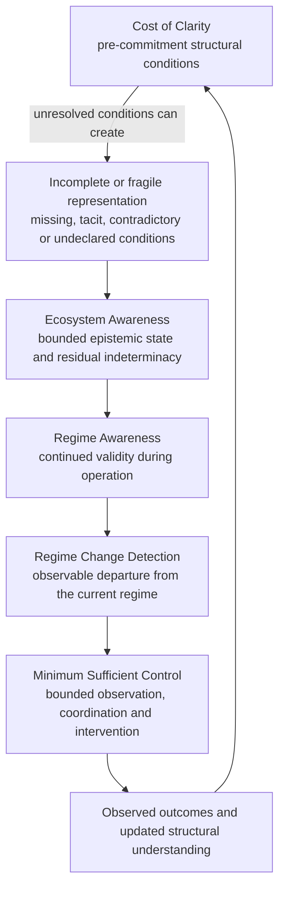

# Structural Awareness Programme

> **Public contribution repository — working material for review and discussion; not a validated method, adopted standard or institutional position**

This repository organizes a connected body of work on how technical and institutional systems understand the structure on which their decisions depend, recognize when that understanding is incomplete or no longer valid, and respond with sufficient but bounded control.

The programme is hosted in the public research context of [Tegrity.AI](https://tegrity.ai/structural-awareness-program/), an initiative of **The Integral Management Society, a Swiss non-profit association**. Individual workstreams have different owners, evidence sets, institutional routes and validation requirements. Their connection must not be used to transfer validation from one workstream to another.

## Programme logic

This is one important causal and operational path, not a claim that every regime change begins with poor initial clarity. External shocks and endogenous dynamics can invalidate even a well-specified representation.

## Repository map

| Area | Question | Repository entry | Current status |
|---|---|---|---|
| **Cost of Clarity** | Are the information, distinctions and authority required for commitment actually available? | [`applied-research/cost-of-clarity-rup/`](./applied-research/cost-of-clarity-rup/) | Applied-research project under an EIS Estonia RUP assessment route; no funding or approval claim |
| **Ecosystem Awareness** | What is sufficiently determined, unresolved or outside the current decision frame, and when must that frame be requalified? | [`research/ecosystem-awareness/`](./research/ecosystem-awareness/) | Frozen public reference corpus; candidate pre-standardization architecture, not an adopted standard |
| **Regime Awareness** | Does the context supporting a decision remain valid as the system operates? | [`research/regime-awareness/`](./research/regime-awareness/) | Public research direction and field-derived candidate framework |
| **Regime Change Detection** | Is observable behaviour departing from the regime against which current assumptions were established? | [`research/regime-awareness/regime-change-qava-uv.md`](./research/regime-awareness/regime-change-qava-uv.md) | Preliminary methodological review route with QAVA–Universitat de València; no validation or institutional endorsement claim |
| **Minimum Sufficient Control** | What minimum observation, coordination and intervention capacity can maintain or recover a declared objective? | [`standards/minimum-sufficient-control/`](./standards/minimum-sufficient-control/) | Standards-oriented research input; not an adopted ITU position or recommendation |

## Navigate the public work

This repository keeps different evidence and institutional routes separate while giving readers a continuous path through them. For a first pass, follow [Cost of Clarity / RUP](./applied-research/cost-of-clarity-rup/) (pre-commitment information and authority), the [Ecosystem Awareness reading map](./research/ecosystem-awareness/READING_MAP.md) (decision-scoped epistemic qualification and residual), [Regime Awareness](./research/regime-awareness/) (continued operating validity), and [Minimum Sufficient Control](./standards/minimum-sufficient-control/) (bounded response architecture). This is a candidate programme relationship, not a validation chain or a claim that all objects have already been integrated.

For EA engineering detail, the [canonical corpus index](./research/ecosystem-awareness/) distinguishes the general EA architecture from programme-specific application material; the [validation reader index](./research/ecosystem-awareness/baseline/VALIDATION_PROFILE_READING_NOTE.md) leads to the general EA validation profiles, while the separate [EA / FG-TIDA application package](./research/ecosystem-awareness/fg-tida/) contains Charter/specification preparation, FG-TIDA ideal/current interface mappings and FG-TIDA-specific cases/tests. For the external parent case and its challenges, use the separately preserved [TIDA — Delegated Authority OS under Context Change package](./submissions/itu-fg-tida/2026-theme-contributions/delegated-authority-os-under-context-change/). The [submissions library](./submissions/) records procedural status rather than implying adoption.

## How the workstreams connect

### 1. Before commitment — Cost of Clarity

The first problem is whether the system or organization has represented the conditions that matter before it commits resources or establishes a decision architecture. Missing, contradictory, tacit or institutionally undeclared conditions can create structural blindness at the outset.

### 2. Bounded epistemic state — Ecosystem Awareness

No agent, human or subsystem has the complete ecosystem. Ecosystem Awareness asks what is sufficiently determined for the current decision, what remains unresolved, what potentially relevant state can reasonably be brought into the active window, and what structural residual remains beyond the bounded representation. Current additive annexes make explicit that this qualification may remain participant-local in a non-orchestrated signalling mesh and separately explore a human-governed agent-participation/citizenship profile; neither extension replaces the frozen architecture or external identity, authority, policy or governance owners. The public reference freeze preserves the current architecture, validation profile and public FG-TIDA provenance without implying standards adoption.

### 3. During operation — Regime Awareness

Even a sound initial representation can become stale. Actors, data, constraints, objectives, capacities and available interventions change. Regime Awareness asks whether the evidence and context supporting present decisions remain valid.

### 4. Detection — Regime Change Detection

The quantitative subline asks how departure from the current observable regime can be detected under finite and incomplete observation, and how that signal should be compared with simpler baselines and negative cases.

### 5. Response — Minimum Sufficient Control

Detection does not imply response capacity. Minimum Sufficient Control asks what combination of observation, coordination, interoperability and intervention is sufficient to keep a declared objective within acceptable ranges without assuming maximum data collection or centralized control.

## Evidence discipline

- Field cases provide engineering provenance, not universal validation.
- A public working paper is inspectable research, not a proven method.
- A preliminary academic review does not imply institutional endorsement.
- A programme assessment route does not imply funding or approval.
- Participation in a standards discussion does not imply adoption by the standards body.
- Similar structural patterns across domains motivate testing; they do not prove transferability.

See [`governance/CLAIM_BOUNDARIES.md`](./governance/CLAIM_BOUNDARIES.md) for the current attribution and status boundaries.

## Public corpus

- [Ecosystem Awareness — Frozen Public Reference Corpus](./research/ecosystem-awareness/)
- [Structural Awareness Programme](https://tegrity.ai/structural-awareness-program/)
- [Regime Awareness in Adaptive Systems](https://tegrity.ai/series/regime-awareness-in-adaptive-systems/)
- [The Cost of Clarity](https://tegrity.ai/series/cost_of_clarity/)

## Public-ready submissions and contributions

The [`submissions/`](./submissions/) library preserves the relevant documents and public discussion contributions routed to UNECE WP.5, the UN CSTD Working Group on Data Governance at All Levels, ITU-T FG-AI4SSC and ITU-T FG-TIDA. Each folder records provenance, file hashes and the exact procedural status without implying adoption or endorsement.

**FG-TIDA case-study package:** [Delegated Authority OS under Context Change](./submissions/itu-fg-tida/2026-theme-contributions/delegated-authority-os-under-context-change/) links the [minimal operational case (Annex I)](./submissions/itu-fg-tida/2026-theme-contributions/delegated-authority-os-under-context-change/02_ANNEX_I_Minimal_Operational_Case.md), [case extensibility (Annex II)](./submissions/itu-fg-tida/2026-theme-contributions/delegated-authority-os-under-context-change/03_ANNEX_II_Case_Extensibility.md), challenges and FG-TIDA ToR traceability. The mobility scenario is one bounded instantiation; the package is a public pre-freeze working contribution, not an adopted FG-TIDA position.

## Repository status and licensing

This is the curated public contribution repository for material released for review and discussion. No open-source or content licence has yet been selected. Unless and until a licence is added, no permission beyond GitHub's applicable platform terms should be inferred.

---

**Ivan Abril**  
Research architecture and programme coordination.
