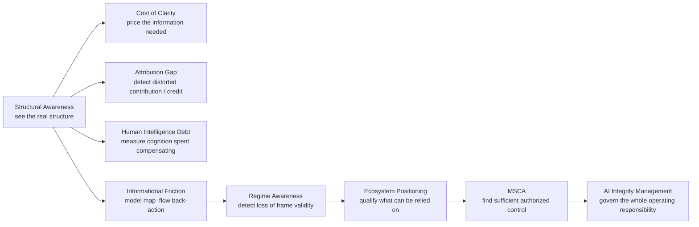

> **Historical full programme synthesis (22 September 2026).** Preserved from commit `b6a5da6` before the root router rewrite. Versions, statuses and links reflect that date; for current navigation use [README.md](./README.md). The text below is unchanged.

# Structural Awareness Programme

> **You are here:** [Iván Abril Palma](https://github.com/dakleyer/dakleyer) → **Structural Awareness Programme**

Structural Awareness is a research and architecture programme about one recurring failure: **we act on representations of systems that are incomplete, politically shaped, economically distorted or simply no longer true — and the act of managing through those representations changes the real system underneath them.**

That problem appears in transformations, enterprise architecture, automation, AI, operations, governance and control. The vocabulary changes by field, but the structural question is the same:

> **What happens when the map used to govern a system diverges from the flow that actually keeps it working?**

The programme is developed through **Tegrity.AI, part of The Integral Management Society**. It combines formal work, Field Notes, engineering reconstruction, current architecture research and standards-facing contributions. Different lines retain different evidence burdens; one line does not validate another merely because they connect.

---

## The core idea: the map and the flow

There are two things to keep separate:

- **the flow** — what is actually happening: who really does what, what depends on what, where value is produced, which workarounds are keeping the system alive;
- **the map** — the representation used to manage that flow: application inventories, org charts, ownership records, process models, KPIs, policies, architecture diagrams, agent state and other formal descriptions.

No organization, operator or AI system sees the whole flow directly. Decisions therefore have to be made through a map.

The problem is not merely that “the map is not the territory.” The stronger claim is that **the map is a control surface**. Decisions are made through it, and those decisions act back on the real system.

If the map has drifted from the flow:

1. the system can misunderstand what is load-bearing;
2. optimization can remove what the map failed to value;
3. control can become denser while coherence gets worse;
4. more automation can scale the wrong representation faster;
5. the work needed to compensate for the mismatch can migrate into human effort.

The programme uses three related terms deliberately:

- **Structural awareness** — the capacity to see enough of the real structure to act without destroying it.
- **Structural gap** — the divergence between the representation and the underlying flow.
- **Informational friction** — the loss produced when action is repeatedly mediated through a divergent representation.

This is the throughline. The rest of the programme asks **why the gap appears, why it persists, how it can be measured, how to detect when it becomes operationally dangerous, and what a bounded response should look like**. citeturn463330view0turn315947search6

---

# Four disciplines explain why structural awareness is lost

The core research programme approaches the same phenomenon from four different starting points. They are not four proofs of the same claim. Their value is that they ask different causal questions and can therefore be tested separately.

## 1. The Cost of Clarity — information economics

**Why doesn't the organization simply discover the truth and fix its map?**

Because clarity is not free.

As systems grow, dependencies become entangled: applications, teams, rules, data sources, owners and constraints interconnect faster than they can be inspected one by one. Discovering how the system really works requires lineage tracing, reconciliation, interviews, observation, exception analysis and often new institutional declarations.

The series adds a second point that is usually missed: **clarity has risk, not only cost**.

- Asking a question can change the answer: “who owns this?” can trigger repositioning before ownership is actually observed.
- Decisions often have to be made before discovery is complete.
- A “clean” target architecture can destroy value hidden in exactly the disorder being removed.

The practical consequence is that transformation cannot treat information about the current system as a free prerequisite. **The cost and risk of producing sufficient clarity belong in the business case.**

The series develops ways to measure that burden and asks whether clarity is becoming more expensive as systems become more entangled. citeturn888702search3turn315947search8

**Read:** [The Cost of Clarity](https://tegrity.ai/series/cost_of_clarity/)

---

## 2. The Attribution Gap — economics of contribution and credit

**Why does the organizational map drift in a direction that can destroy strong capabilities rather than weak ones?**

Because contribution and credit are not the same thing.

A capability can be structurally critical while receiving little formal recognition. Making a dependency explicit can create a legitimate claim for budget, authority or ownership at its source — which can reduce the credit captured elsewhere. That creates an incentive to keep important dependencies implicit.

The resulting **Attribution Gap** is the distance between:

- how much a capability actually contributes; and
- how much formal credit, ownership, investment or recognition it receives.

The theory proposes a causal chain:

**incomplete contribution visibility → attribution distortion → weak ownership/funding → capability loss**

This reframes some “legacy retirement” and rationalization failures. A capability may disappear not because it performed badly, but because the organization was unable to attribute its value correctly.

The empirical programme therefore looks for signatures such as ownership silence, discovery gaps, build-vs-buy inversion and high-contribution capabilities hidden in undocumented sets. citeturn888702search4turn315947search9

**Read:** [The Attribution Gap](https://tegrity.ai/series/attribution_gap/)

---

## 3. Human Intelligence Debt — organizational theory

**If the structure is wrong, why doesn't someone with enough authority simply step back, see the problem and correct it?**

Because the human capacity to integrate across the whole system is scarce — and the people who have it are often consumed by the very fragmentation they should be resolving.

Human Intelligence Debt measures the gap between:

- the human contribution current technology could make possible; and
- the human contribution that actually occurs when people are used as middleware: reconciling systems, re-entering data, validating exceptions, translating between silos and repairing fragmented workflows.

The series distinguishes the feasible human contribution from realized human-intelligence density and treats the deficit as debt.

The important bridge to Cost of Clarity is that **the cost of missing clarity does not disappear**. If architecture does not pay it structurally, people pay it cognitively.

That can become self-reinforcing:

**missing architectural decisions → unclear information → manual reconciliation → less capacity for architectural decisions**

The measurement programme explicitly tests the debt, its recovery coefficient and the point at which added oversight begins to create more human validation work than it removes. citeturn315947search0turn315947search1turn315947search3

**Read:** [Human Intelligence Debt research](https://tegrity.ai/series/human-intelligence-gap/)

---

## 4. Informational Friction — systems theory

**Does the same phenomenon still exist if we remove human psychology, politics and incentives entirely?**

Yes. That is the purpose of the systems-theory line.

Informational Friction treats the map–flow problem as a general control problem. A system acts using a representation of its own state. When that representation diverges materially from the real flow, actions computed from the representation can deform the flow.

This line develops several consequences:

- a **frame-bounded optimizer** can be locally rational and still destroy cross-frame coherence;
- a fully map-specified agent cannot preserve structure that is absent from its observable/declared frame;
- a system can reach **failure by compliance**: every mandatory local rule is satisfied, yet the upstream objective is lost;
- mature systems can accumulate **control density without integration**, becoming increasingly dependent on off-map compensating work;
- external selection sees outcomes, while internal selection often runs on the same distorted proxies that created the problem.

This is the same structural object with the specifically human mechanisms removed. citeturn888702search2turn315947search6turn315947search7

**Read:** [Informational Friction](https://tegrity.ai/series/informational_friction/)

---

# Why four disciplines?

The programme does **not** argue:

> four series agree, therefore the theory is proven.

The claim is narrower.

Each discipline starts from a different primitive:

| Discipline | Starting problem |
|---|---|
| **Cost of Clarity** | Resolving the state of a complex system consumes resources and carries risk. |
| **Attribution Gap** | Credit and contribution can diverge because incentives act on attribution. |
| **Human Intelligence Debt** | Cross-system human judgment is scarce and can be consumed by compensating work. |
| **Informational Friction** | A controller acting on a divergent representation can drive the real system in the wrong direction. |

The interesting result is that these different mechanisms converge on the same practical warning:

> **Do not optimize, automate or rationalize a system until you understand which structure is actually carrying the outcome.**

That convergence is a reason to test the phenomenon more seriously, not a substitute for evidence. The programme therefore emphasizes falsifiable measurements, counterfactuals and negative tests. citeturn463330view0

---

# From explanation to operational architecture

The four disciplines explain why structural awareness can be lost. The next part of the programme asks what an operating system or institution can do about it.

This is where **Regime Awareness, Ecosystem Awareness / Positioning and Minimum Sufficient Control** enter. They are not additional explanations of the same phenomenon. They are different architectural responsibilities.

---

## Regime Awareness — detect when yesterday's frame stops being valid

A system can begin with a good representation and still fail because the world changes.

Regime Awareness asks:

> **Do the evidence, assumptions, thresholds and control structures supporting the current position still belong to the operating regime for which they were qualified?**

This is deliberately different from forecasting. The objective is not perfect prediction or hidden-state reconstruction. It is to detect when current observable behaviour is no longer compatible with the regime against which the system is operating.

The field reconstruction traces this capability across logistics, finance, enterprise architecture and adaptive systems. The current research programme develops minimalistic early-warning architectures and explicit comparison tests. citeturn888702search1turn888702search13turn888702search14turn888702search18

**Read:** [Regime Awareness — corpus index](./research/regime-awareness/README.md)

---

## Ecosystem Awareness / Ecosystem Positioning — qualify what can be relied on now

Regime Awareness can tell us that a frame is becoming invalid. A harder question remains:

> **Given a changing ecosystem that no participant sees completely, what can this participant legitimately rely on for this decision now?**

Ecosystem Awareness addresses that decision-scoped epistemic problem.

It keeps separate:

- what is established;
- how strongly it is established;
- what could still be determined with current capabilities;
- what remains outside the active or knowable boundary;
- which evidence inherits other dependencies;
- and when a local result must be requalified before it is composed into a wider conclusion.

**Ecosystem Positioning** is the participant-local situational result of that qualification: where the participant is situated, what applies, what can be relied on, what remains unresolved and where additional epistemic effort still has decision value.

The architecture explicitly avoids a global supercontroller. It consumes identity, authority, policy, attestation, population evidence, human context and execution outcomes from the components that own them rather than redefining those semantics itself.

**Read:** [Ecosystem Awareness — entry-point router](./research/ecosystem-awareness/README.md)

---

## Minimum Sufficient Control — determine whether a useful response is actually possible

Knowing that the frame is wrong is not the same as being able to act.

Minimum Sufficient Control asks:

> **What authorized configuration of coordination, intervention mechanisms and enabling means is sufficient to keep or return a declared objective inside an acceptable Objective Envelope?**

It is a sufficiency problem, not a maximization problem.

More monitoring, more orchestration, more intervention and more centralization are not automatically better. The architecture compares supported configurations under stated assumptions and asks whether a lower-burden sufficient alternative exists.

This is the response side of structural awareness: not perfect control, but **enough legitimate control for the current objective and conditions**.

**Read:** [Minimum Sufficient Control / MSCA — corpus index](./standards/minimum-sufficient-control/README.md)

---

# AI Operational Integrity Architecture — what happens around statistical AI

Modern enterprise AI commonly places a probabilistic or statistical core inside a deterministic envelope of rules, validation, guardrails, policy checks, human approvals and compliance controls.

That architecture is necessary — but it has structural limits.

The AI Operational Integrity Architecture line asks what happens when:

- the operating regime shifts;
- the envelope inherits an incomplete representation;
- multiple controls become coupled;
- local guardrails interact in ways that were not designed together;
- the residual validation load moves to humans.

The key point is that downstream validators cannot recover distinctions that were never represented upstream. Oversight therefore has a residual floor, and beyond a coupling/exception threshold, adding controls can increase rather than reduce Human Intelligence Debt. citeturn888702search12turn315947search3

**Read:** [AI Operational Integrity Architecture](https://tegrity.ai/series/ai-operational-integrity-architecture/)

---

# AI Integrity Management — the enterprise function

AI Integrity Management is the governance and management proposition that sits above these architectural questions.

Its argument is organizational:

> as AI moves into mission-critical operations, operational reliability, security, compliance, governance, ethics, human authority and resilience cannot be managed as unrelated silos.

The proposed enterprise function brings those concerns together around one question:

> **Does the AI-enabled system remain reliable, controllable and aligned under real operating conditions?**

The research explicitly treats this as an emerging discipline, not an established organizational standard. It examines whether the enterprise should manage AI integrity as one integrated function or as multiple coordinated functions, and what evidence would justify either model. citeturn463330view2turn888702search6turn888702search7

**Read:** [AI Integrity Management](https://tegrity.ai/series/ai_integrity/)

---

# How the programme connects

The programme can now be read as a chain of responsibilities without pretending they are one mechanism:

The diagram is a conceptual route, not a claim that every implementation must instantiate every box.

---

# What is being tested now

The public work has moved beyond Field Notes into architecture, benchmarks, reference scenarios and pre-standardization contributions.

Current work includes:

- Regime Change Detection and minimalistic early-warning research;
- the applied Cost of Clarity / information-readiness research programme;
- Ecosystem Awareness / Ecosystem Positioning architecture;
- Minimum Sufficient Control Architecture;
- reference failure scenarios and benchmark design;
- cross-agent epistemic handoff and signalling;
- effective human oversight under bounded capacity;
- standards-facing work in ITU, UNECE and related public processes.

The important evidence boundary is simple:

**architecture is not validation; a benchmark design is not a benchmark result; public discussion is not standards adoption.**

---

# Where to go next

Choose the question you actually have:

- **I want to understand the theory behind Structural Awareness** → [Structural Awareness synthesis](https://tegrity.ai/structural-awareness-program/)
- **I want the formal/publication line** → [ResearchGate publications](https://www.researchgate.net/profile/Ivan-Abril-Palma-2)
- **I want the Field Notes and research series** → [Field Notes](https://tegrity.ai/articles/)
- **I want to understand Regime Awareness** → [Regime Awareness corpus](./research/regime-awareness/README.md)
- **I want the current agentic architecture / Ecosystem Positioning** → [Ecosystem Awareness router](./research/ecosystem-awareness/README.md)
- **I want the control-sufficiency architecture** → [MSCA corpus](./standards/minimum-sufficient-control/README.md)
- **I want the applied Cost of Clarity work** → [Cost of Clarity / RUP](./applied-research/cost-of-clarity-rup/README.md)
- **I want to see submitted/public institutional contributions** → [Submissions](./submissions/README.md)

---

## Evidence discipline

- Field cases provide engineering provenance, not universal validation.
- A working paper is inspectable research, not a proven method.
- A preliminary academic review does not imply institutional endorsement.
- A programme assessment route does not imply funding or approval.
- Participation in a standards discussion does not imply adoption by the standards body.
- Similar structural patterns across domains justify testing; they do not prove transferability.

---

## For maintainers

This README is intentionally written for **human readers first**. It must continue to explain the programme, not degrade into a sitemap or an index of indexes.

Repository-maintenance rules, the controlled sitemap and document-migration procedures are kept separately in [DOCUMENT_CONTROL.md](./DOCUMENT_CONTROL.md). Editors and bots must read that file before moving, renaming or removing routed material.

---

**Ivan Abril**  
Research architecture and programme coordination.
