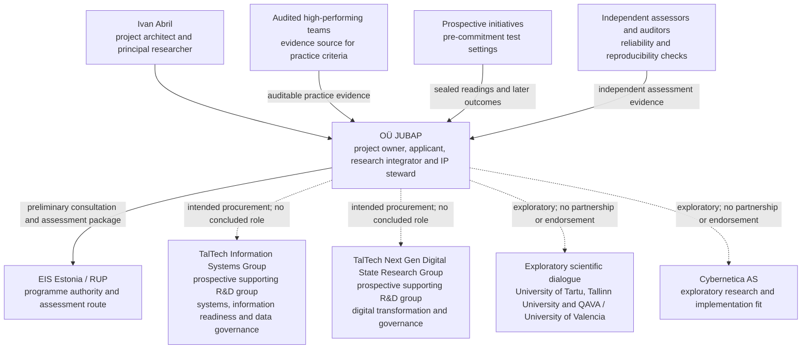

# The Cost of Clarity / EIS Estonia RUP: concrete applied-research work and stakeholder architecture

> **Public working note — project description, not evidence of funding, programme approval, institutional endorsement or a concluded partnership**

This note describes the concrete applied-research work behind **The Cost of Clarity** and the roles of the organizations and participant groups around it. Within the broader Structural Awareness Programme, Cost of Clarity addresses upstream information-and-authority conditions that can later affect operational validity, regime-change awareness and the capacity to respond. The connected objects still retain their own evidence, institutional routes and validation requirements.

The work is being developed by **OÜ JUBAP** through Estonia's [Programme for Applied Research (RUP), administered by EIS](https://eis.ee/en/services/programme-for-applied-research/). OÜ JUBAP has prepared and provided a project and application package for programme assessment. This statement does **not** mean that funding has been awarded, that EIS has validated the method, or that any organization named below has accepted a project role.

## Position within the Structural Awareness Programme

```text
Cost of Clarity — pre-commitment structural conditions
Are required information, distinctions and authority available?
                         ↓
If important conditions remain missing, tacit, contradictory or undeclared,
the system begins with an incomplete representation of what it must manage.
                         ↓
Regime Awareness — operational validity
Does that representation still describe the situation as conditions change?
  └─ Regime Change Detection: is observable behaviour departing from the regime?
                         ↓
Minimum Sufficient Control — bounded response capacity
What minimum observation, coordination and intervention can maintain
or recover the declared objective without unnecessary complexity?
                         ↺
Outcomes and interventions update the structural understanding.
```

This document develops the upstream **Cost of Clarity** object. Unresolved information and authority conditions are one possible cause of later structural blindness, but not the only cause of regime departure. [Regime Awareness](../../research/regime-awareness/) tests continued validity during operation; [Regime Change Detection](../../research/regime-awareness/regime-change-qava-uv.md) addresses the quantitative signal; and **Minimum Sufficient Control** addresses the capacity to respond. The causal connection does not merge their evidence or make success in one object validation of another.

## The concrete problem

Organizations use maturity assessments, readiness models, due diligence, audits and quality frameworks before committing resources to transformation initiatives. Yet initiatives can still fail because information required for a sound commitment was absent, contradictory, dispersed as tacit knowledge or never institutionally declared.

The research question is therefore:

> **Can initiative-specific information conditions that are absent, contradictory, tacit or institutionally undeclared be identified economically before commitment, and can a sealed pre-commitment reading anticipate later information-acquisition burden or initiative outcomes?**

The project does not begin from the claim that existing instruments are ineffective. It examines four non-exclusive explanations for the observed gap between extensive readiness practice and persistent information-related failure:

| Candidate explanation | Question to be tested |
|---|---|
| **F1 — Instrument economics** | Are potentially useful assessments applied too late, too slowly or at too high a cost for the relevant decision? |
| **F2 — Incentive structure** | Do actors have reasons not to expose missing, contradictory or undeclared conditions before commitment? |
| **F3 — Attribution convenience** | Are failures later attributed to “poor data” or execution when the earlier commitment basis was already incomplete? |
| **F4 — Coverage** | Do current instruments omit initiative-specific, authority-dependent or declaration-dependent conditions that matter to the decision? |

The current study concentrates on **F4**, measures **F1**, seeks evidence that can distinguish **F3**, and records—without pretending to resolve—the broader institutional problem in **F2**.

## What the RUP work would actually do

### Phase 1 — Coverage mapping

The first phase compares what ex-ante instruments ask with conditions that later prove decision-critical. Conditions are coded by specificity, recurrence, evidence type and information state. The aim is to determine whether a reproducible coverage gap exists, not to assume one.

### Phase 2 — Audited high-performing practice

The second phase studies teams with demonstrable outcomes. Their claimed practices are converted into explicit criteria and quality plans, then audited against evidence. This separates plausible professional narratives from practices that are observable, repeatable and transferable.

### Phase 3 — Prospective pre-mortem application

The third phase applies the candidate method before commitment to live initiatives. Each reading is sealed before advice is given. The project then records the decision taken, the additional information that had to be acquired, the conditions that changed and the later outcome. This temporal separation is essential: a method cannot claim predictive usefulness if it is reconstructed after the result is known.

## The object being built and tested

The intended output is a **pre-commitment Data and Information Readiness Instrument**, initially operated by trained experts. It would:

- classify relevant information as available, tacit or distributed, contradictory or uncertain, institutionally undeclared, or genuinely unknown;
- identify which conditions must be retrieved, elicited, reconciled or formally declared;
- connect each criterion to evidence, authority, ownership and uncertainty;
- configure an initiative-specific quality plan rather than impose one universal checklist;
- record contradictions and unresolved authority boundaries;
- produce a traceable decision position such as proceed, proceed with conditions, resequence, rescope or stop;
- seal the reading before intervention so that later evaluation remains possible.

The research architecture currently separates six functional blocks:

1. criteria and evidence model;
2. context, authority and information-state model;
3. evidence acquisition and preparation;
4. assessment and inference;
5. decision and outcome tracking;
6. quality assurance, provenance and bounded assisted processing.

The first operational mode is deliberately **expert-led**. Machine-actionable records may later support retrieval, contradiction detection, question selection and draft findings. A future agentic component would not be authorized to invent organizational facts, assign authority or ownership, make the final commitment decision, publish findings without approval or silently change the assessment rules.

## Research controls

The intended controls include:

- preregistration of hypotheses, coding rules and success conditions;
- separation between sources used to construct criteria and sources used to test them;
- inter-coder and inter-assessor reliability checks;
- sealed prospective readings;
- comparison with simpler baselines;
- explicit negative-result discipline.

A valid result may be that the proposed coverage gap is not found, that expert criteria do not transfer, that assessor agreement is insufficient, that prospective readings add no predictive value, or that the cost of acquiring the required evidence is excessive. Those outcomes would constrain or reject the proposed method rather than be reframed as success.

## Stakeholder architecture



| Stakeholder | Concrete role or relevance | Current claim boundary |
|---|---|---|
| **OÜ JUBAP** | Applicant, project owner, research integrator, IP steward and intended commercialising entity | Owns the RUP project line; this does not by itself validate the scientific claims |
| **Ivan Abril** | Project architect, principal researcher and architect-of-record | Responsible for the proposed design; authorship is not independent validation |
| **EIS Estonia / RUP** | Programme authority, preliminary-consultation and assessment route | Assessment is not a funding award, technical validation or endorsement |
| **[TalTech Information Systems Group](https://taltech.ee/en/is)** | Concrete TalTech research-group reference for prospective support on information readiness, data governance, systems architecture and large-scale information systems | Presented in the RUP line as a prospective supporting R&D group within intended contracted work; this does not mean a confirmed supporter, partner or validator |
| **[TalTech Next Gen Digital State Research Group](https://taltech.ee/en/department-of-software-science/cooperation/next-gen-digital-state-research-group)** | Concrete TalTech research-group reference for prospective support on digital transformation, governance interpretation, AI architecture, requirements and public-sector implementation | Presented in the RUP line as a prospective supporting R&D group within intended contracted work; this remains subject to scope, staffing, quote and agreement |
| **University of Tartu, Tallinn University, and QAVA / University of Valencia** | Exploratory scientific dialogue across process management, mixed methods, information systems, tacit knowledge and quantitative validation | Conversations or expressions of interest do not imply institutional participation, endorsement or a contracted role |
| **Cybernetica AS** | Exploratory fit for research and implementation capabilities | No partner, provider or validation role is claimed |
| **High-performing teams** | Audited source for candidate practice criteria | Their practices must be evidenced; reputation alone is insufficient |
| **Prospective organizations and live initiatives** | Settings for sealed pre-commitment tests and outcome observation | Participation would require case-level agreement, evidence controls and confidentiality boundaries |
| **Independent assessors and auditors** | Test reproducibility, reliability and evidence discipline | Must be sufficiently independent of rule construction and commercial delivery |
| **Future trained delivery network** | Possible expert, licensed or certified operating model if the method is validated | This is a future route, not an existing network or validated product |

Named contact-level tracking is maintained internally. The public map uses organization and role classes so that an exploratory email, a review assignment or a scientific conversation is not misrepresented as a partnership.

### TalTech research-group references in the RUP line

The RUP presentation does not refer to TalTech only at university level. It identifies two concrete groups as the intended sources of supporting R&D capacity:

- The **[Information Systems Group](https://taltech.ee/en/is)**, headed by Prof. Dirk Draheim, is the reference for information readiness, data governance, systems architecture and the treatment of large- and ultra-large-scale information systems.
- The **[Next Gen Digital State Research Group](https://taltech.ee/en/department-of-software-science/cooperation/next-gen-digital-state-research-group)**, headed by Prof. Ingrid Pappel, is the reference for digital transformation, governance interpretation, AI architecture, requirements engineering and the practical implementation of digital-government capabilities. Dr. Riina Palu is the documented scientific interface in the current stakeholder map.

In this public note, **prospective supporting R&D groups** means that these groups are the specific TalTech capabilities presented for intended subcontracted research work. It does not claim that either group has already issued a support letter, accepted a work package, endorsed the research claims or entered a contract.

## Relationship to Regime Awareness

The relationship is upstream-to-downstream, not merely thematic:

- **The Cost of Clarity** asks whether the information and organizational conditions needed for a defensible commitment exist **before execution**.
- If important distinctions, evidence or authority remain missing, contradictory or undeclared, the resulting operating representation can be structurally incomplete from the start.
- **Regime Awareness** asks whether that representation remains valid **as conditions change during operation**.
- **Regime Change Detection** looks for observable evidence of departure.
- **Minimum Sufficient Control** asks whether the system has enough observation, coordination and intervention capacity to preserve or recover the objective.

External shocks and endogenous dynamics can also produce regime departure even when the initial information was adequate. The causal pathway therefore explains an important failure mechanism, not every possible transition. The connected objects retain separate evidence sets, products, institutional routes and validation burdens; none is validated solely by the success of another.

## Public and protected layers

The public research layer can include the questions, constructs, criteria families, method, validation design, results and limitations. Protected implementation may include source code, calibration logic, thresholds, optimization and routing mechanisms, private case material and operating procedures.

The current public corpus provides the conceptual context:

- [The Cost of Clarity series](https://tegrity.ai/series/cost_of_clarity/)
- [Human Intelligence Debt](https://tegrity.ai/series/human-intelligence-gap/)
- [Structural Awareness Programme](https://tegrity.ai/structural-awareness-program/)
- [Regime Awareness in Adaptive Systems](https://tegrity.ai/series/regime-awareness-in-adaptive-systems/)

---

**Ivan Abril / OÜ JUBAP**  
Project owner and applied-research line. Tegrity.AI provides a separate public theoretical context; it is not presented here as the RUP beneficiary, programme authority or independent validator.

