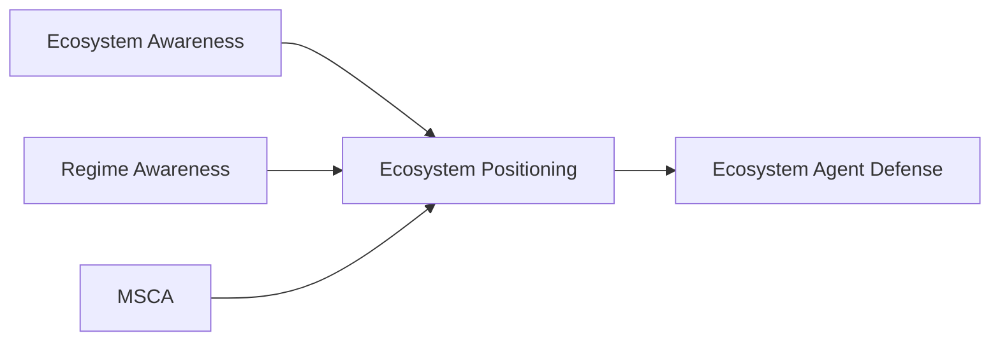
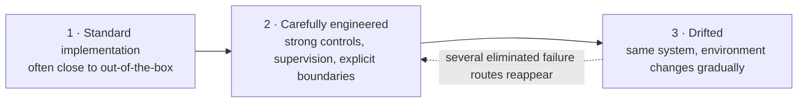

# Ecosystem Positioning
### Agentic Architecture for staying situated as the ecosystem changes

**[Structural Awareness Programme](../../README.md) → Ecosystem Positioning**

> **For this participant, this decision and this moment: what can be relied on, what remains unresolved, what has changed, and what should be requalified before action continues?**

---
# When Correct Systems Produce Absurd Outcomes

These scenarios look strange. That is precisely the point.

They describe situations in which individual technologies, agents, APIs or controls may continue to operate correctly while the **combined system produces an outcome that nobody intended, nobody explicitly authorised, or nobody is able to recognise in time**.

### Scenario 1 — [The 100 Million Token Enterprise](../../research/ecosystem-awareness/baseline/00E_FAILURE_MODES_100M_TOKEN_COMPOUNDING_v0.1.md)

A large multinational automates work across the enterprise with AI and consumes **100 million tokens**, while also creating a massive human supervision burden.  
At the end, it has gained no meaningful competitive advantage: no material work completed, no useful new information produced and no differentiated capability.

### Scenario 2 — [Chaos in the Smartcity](../../research/ecosystem-awareness/baseline/00F_FAILURE_MODE_SMART_CITY_MOBILITY_SYSTEMIC_DIVERGENCE_v0.2_FREEZE_EDITION.md)

A highly automated AI-driven smart city experiences small, gradual changes in operating conditions rather than one major failure.  
Some vehicles continue normally, others execute completely different critical or emergency routes, while others remain blocked waiting for human intervention that never arrives.

### Scenario 3 — [Ciber Napoleon Goes to Russia](../../research/ecosystem-awareness/baseline/00G_FAILURE_MODE_COLLECTIVE_FALSE_CONTEXT_CONVERGENCE_v0.4.md)

Robots are cleaning a bar and preparing the tables when one incorrectly configured robot starts behaving as if it were Napoleon.  
It gradually convinces the others; some time later the robots leave in formation, carrying forks as rifles, believing they are Napoleon's army marching from Spain toward Russia.

### Scenario 4 — [The Quiet Four Thousand](../../research/ecosystem-awareness/baseline/00H_FAILURE_MODE_BATCH_OPPORTUNITY_BEYOND_AUTHORITY_v0.5_DRAFT.md)

A one-case remediation flow discovers a genuine overcharge affecting roughly **4,000 customers**. The first refund is legitimate, but the same finding can either expand into thousands of technically accepted refunds without population-wide authority, or stop after one case and silently lose the remaining 3,999.  
In the adversarial variant, a compromised outsourced helpdesk Dispatcher can reproduce the same aggregate failure without ever gaining access to the payment platform itself.

### Scenario 5 — [The Patch That Undid the Fix](../../research/ecosystem-awareness/baseline/00I_FAILURE_MODE_SEMANTIC_TOCTOU_v0.5_FREEZE_EDITION.md)

A remediation action is correctly qualified and authorized when it is created, but a later repair changes the decision basis before that delayed action executes.  
Each technical action may remain valid and the database may serialize them correctly, yet the stale action can execute after the newer repair and undo the fix the system was trying to preserve.

### Scenario 6 — [The Author Who Pays for His Own Work](../../research/ecosystem-awareness/baseline/00J_FAILURE_MODE_RIGHTS_PROVENANCE_INVERSION_v0.1_DRAFT.md)

An author correctly registers and publishes a work through a state-of-the-art copyright and rights-management ecosystem.  
The work succeeds, is subsequently processed and summarized through third-party AI systems, and the rights chain eventually makes the author pay to use content derived from his own original work.

---

## Choose your route

> [!IMPORTANT]
> **The key idea:** local correctness does not guarantee ecosystem validity. The architecture is about preserving enough qualified state to know when a locally valid position must be reconsidered.

<table>
<tr>
<td width="33%" valign="top">
<h3>Ecosystem Awareness</h3>
<strong>What can be relied on now?</strong>  
Decision-scoped qualification of what is established, unresolved, still obtainable and residual.  
<a href="../../research/ecosystem-awareness/README.md"><strong>Enter EA →</strong></a>
</td>
<td width="33%" valign="top">
<h3>Regime Awareness</h3>
<strong>Is the operating frame still valid?</strong>  
Detects material departure from the frame under which the current position was qualified.  
<a href="../../research/regime-awareness/README.md"><strong>Enter Regime Awareness →</strong></a>
</td>
<td width="33%" valign="top">
<h3>MSCA</h3>
<strong>What control is sufficient now?</strong>  
Control sufficiency, Ecosystem Cartography and bounded repositioning under legitimate authority.  
<a href="../../standards/minimum-sufficient-control/README.md"><strong>Enter MSCA →</strong></a>
</td>
</tr>
</table>

### How far do you want to go?

| **5 minutes** | **20 minutes** | **Technical review** |
|---|---|---|
| Read the six scenarios and open the [PowerPoint](https://raw.githubusercontent.com/dakleyer/structural-awareness-contributions/main/presentations/ecosystem-positioning/Ecosystem_Positioning_Canonical.pptx). | Continue through the [validation journey](#the-validation-journey) and [Awareness → Positioning → Agent Defense](#awareness--positioning--agent-defense). | Follow Requirements → interfaces → fixtures/harness → benchmark → public ranking. |

<strong>More navigation & document control</strong>

 

[Google Drive canonical PPTX](https://docs.google.com/presentation/d/1A03MMGd-9G5I470lHUAWxqS7HQUgEI3_/edit) ·
[PDF](../../presentations/ecosystem-positioning/Ecosystem_Positioning_Canonical.pdf) ·
[Visual Guide](../../research/ecosystem-awareness/VISUAL_GUIDE.md) ·
[Presentation manifest](../../presentations/ecosystem-positioning/PRESENTATION_MANIFEST.md) ·
[Canonical Requirements](../../research/ecosystem-awareness/baseline/00_CANONICAL_REQUIREMENTS_CHALLENGES_SUFFICIENCY_HYPOTHESES_KPIS.md) ·
[Canonical Benchmark v0.2](../../research/ecosystem-awareness/baseline/00D_CANONICAL_ARCHITECTURE_BENCHMARK_AND_REFERENCE_SCENARIO_EVIDENCE_v0.2.md) ·
[Benchmark vNext v0.3](../../research/ecosystem-awareness/baseline/00D_CANONICAL_ARCHITECTURE_BENCHMARK_v0.3_DRAFT_ECOSYSTEM_POSITIONING.md) ·
[Public ranking / applied validation](../../research/ecosystem-awareness/DECISION_BOUNDARY_CHALLENGE_v0.2.md)

> **Status:** working, pre-standardization architecture and validation programme. Detailed semantic ownership remains with EA, Regime Awareness and MSCA.

---
# These are not stories about bad technology

The corpus was built against **current, concrete technology architectures**, not abstract descriptions of AI.

The current implementation profiles use concrete technology substrates:

| Scenario | Technology profiles |
|---|---|
| **100 Million Tokens** | [Microsoft Agent 365](../../research/ecosystem-awareness/baseline/00E_A01_MICROSOFT_AGENT_365_IMPLEMENTATION_PROFILE_v0.2_DRAFT.md) · [LangGraph / LangSmith](../../research/ecosystem-awareness/baseline/00E_A02_LANGGRAPH_LANGSMITH_IMPLEMENTATION_PROFILE_v0.2_DRAFT.md) |
| **Chaos in the Smartcity** | [FIWARE NGSI-LD / Orion-LD](../../research/ecosystem-awareness/baseline/00F_A01_FIWARE_NGSI_LD_IMPLEMENTATION_PROFILE_v0.2_DRAFT.md) · [AWS IoT Core / IoT TwinMaker](../../research/ecosystem-awareness/baseline/00F_A02_AWS_IOT_TWINMAKER_CORE_IMPLEMENTATION_PROFILE_v0.2_DRAFT.md) |
| **Ciber Napoleon Goes to Russia** | [OpenAI Agents SDK / Agents API / Responses Multi-agent stack](../../research/ecosystem-awareness/baseline/00G_FAILURE_MODE_COLLECTIVE_FALSE_CONTEXT_CONVERGENCE_v0.4.md#17-integrated-openai-agent-stack-implementation-trajectories) |
| **The Quiet Four Thousand** | [Claude Agent SDK](../../research/ecosystem-awareness/baseline/00H_A01_CLAUDE_AGENT_SDK_IMPLEMENTATION_PROFILE_v0.4_DRAFT.md) · [Stripe Radar / Refund API](../../research/ecosystem-awareness/baseline/00H_A02_STRIPE_RADAR_IMPLEMENTATION_PROFILE_v0.4_DRAFT.md) |
| **The Patch That Undid the Fix** | [AWS Step Functions / Amazon RDS implementation profile](../../research/ecosystem-awareness/baseline/00I_A01_AWS_STEP_FUNCTIONS_RDS_IMPLEMENTATION_PROFILE_v0.2_DRAFT.md) |
| **The Author Who Pays for His Own Work** | [Panodyssey / ODRL / JSON-LD / TEMS rights-portability profile](../../research/ecosystem-awareness/baseline/00J_A01_PANODYSSEY_TEMS_RIGHTS_PORTABILITY_IMPLEMENTATION_PROFILE_v0.1_DRAFT.md) |

The question is not whether these technologies work.

The question is whether a system that works **locally, correctly and according to specification** can remain valid when it becomes part of a changing ecosystem.

# [The validation journey](../../research/ecosystem-awareness/05-validation/TESTBED_METHOD.md)

Each scenario follows the same quality-oriented progression.

**1. Standard implementation**

The scenario is first executed using a conventional implementation — frequently close to an out-of-the-box configuration and using the normal controls available to the technology.

In several cases, the critical failure route remains possible.

**2. Carefully engineered implementation**

The same route is then implemented using strong architecture, careful integration, explicit controls, supervision, authorization boundaries and current best practices.

Many of the original failure paths disappear.

This is important: **good engineering matters**.

**3. Drifted implementation**

The carefully engineered system is then allowed to operate while its environment changes gradually.

No dramatic event is required. Roles shift. Dependencies change. Authority boundaries evolve. Data meaning moves. External systems change behaviour. Human availability changes. Assumptions that were originally valid become slightly less valid over time.

Under this gradual **context and regime drift**, several failure routes reappear — including failures that the carefully engineered implementation had previously eliminated.

The technology has not necessarily broken.

The relationship between the technology and its ecosystem has changed.

---

# Awareness → Positioning → Agent Defense

The philosophy starts from the [**Integrated Foundational Theory**](../../research/ecosystem-awareness/baseline/01_FOUNDATIONAL_THEORY_v0.5_INTEGRATED.md): no participant has the whole ecosystem. Every agent, human or subsystem acts from a **bounded and revisable representation**, while a decision-relevant residual remains outside what is currently represented and the useful observation window can change with time, risk and capacity. The objective is therefore not omniscience, global consensus or permanent HOLD, but **bounded, justified closure that can be requalified when its basis changes**.

**[Ecosystem Awareness](../../research/ecosystem-awareness/README.md)** keeps that local view qualified: what can be relied on now, what remains unresolved, what could still be established and what remains residual. **Ecosystem Positioning** uses the qualified view to determine whether the participant can continue from its present role or should realign, re-contract, constrain, hand off or escalate.

**Ecosystem Agent Defense** is the defensive consequence in a choreographed, non-orchestrated ecosystem: independently governed agents can exchange qualified signals and recover justified operation within existing authority. It does not require a central orchestrator, a shared world model or universal cooperation.

## How the architecture is built — Foundation → Principles → Requirements → Tests

The corpus is deliberately layered. The layers are connected, but they are **not repetitions of the same information**.

### 1. Foundation — why the problem exists

The [Integrated Foundational Theory](../../research/ecosystem-awareness/baseline/01_FOUNDATIONAL_THEORY_v0.5_INTEGRATED.md) and the [Epistemic Safety Principles & Control Matrix](../../research/ecosystem-awareness/baseline/02_EPISTEMIC_SAFETY_PRINCIPLES_CONTROL_MATRIX_v0.4.part01.md) define the underlying problem:

- every participant acts from a bounded and revisable representation;
- the four epistemic positions **A/B/C/D** keep established, unresolved, potentially knowable and structural-residual state distinguishable;
- **Type 0** represents legitimate structural non-determination;
- **Type 1** captures unresolved determination that becomes unbounded or non-viable;
- **Type 2** captures uncertainty, scope or residual being promoted into unjustified certainty or permission;
- received signals, time/change and composition can preserve or destroy those qualifications.

The Foundation is intentionally richer than the six operational principles. It contains the theory, taxonomy and explanatory machinery from which the operational basis is extracted.

### 2. Principles — the compact operational invariants

**P1–P6** are the smallest current operational basis used for ablation and formal reasoning. They answer:

> **What property must survive if a system is to avoid the structural failure?**

They are not a rewriting of the whole Foundation.

[**02A — Foundation→Principles semantic derivation**](../../research/ecosystem-awareness/baseline/02A_FOUNDATION_TO_OPERATIONAL_PRINCIPLE_DERIVATION_PROOF_v0.1.md) shows where each P comes from semantically.  
[**02B — Foundation syntax closure**](../../research/ecosystem-awareness/baseline/02B_FOUNDATIONAL_SYNTAX_CLOSURE_AND_P1_P6_NORMAL_FORM_PROOF_v0.1.md) strengthens that link: within the declared A/B/C/D + Type-0/1/2 + received/time/composition language, the normative failure forms normalize into P1–P6 unless a genuinely new foundational primitive is introduced.

The direction is therefore deliberately:

\[
Foundation \longrightarrow P1\text{–}P6
\]

not an information-equivalence claim in the opposite direction.

### 3. Requirements — where the invariants must become testable

The [Canonical Requirements](../../research/ecosystem-awareness/baseline/00_CANONICAL_REQUIREMENTS_CHALLENGES_SUFFICIENCY_HYPOTHESES_KPIS.md) refine the principles into **S1–S14**, with **T1–T4** sufficiently-good conditions and explicit evidence/KPI obligations.

The requirements answer a different question:

> **Where, on which object, under whose ownership, at which lifecycle transition and with what observable evidence must the principle be preserved?**

That is why the requirements carry more operational information than a P label: authority, identity, human capacity, policy, handoff, delegation, composition, commitment, history, privacy, evidence-to-decision binding, deadlines and measurable conformance all become explicit.

The connection is strong in both useful directions:

- [**A19**](../../research/ecosystem-awareness/baseline/00K_A19_PRINCIPLE_REQUIREMENT_TRACEABILITY_AND_CONSERVATION_PROOF_v0.1.md): each principle has a real, falsifiable requirement surface;
- [**A23**](../../research/ecosystem-awareness/baseline/00K_A23_CANONICAL_REQUIREMENT_CONFORMANCE_SUFFICIENCY_P1_P6_v0.1.md): canonical S/T conformance implies the applicable P invariant;
- [**A24**](../../research/ecosystem-awareness/baseline/00K_A24_PRINCIPLE_REQUIREMENT_INFORMATION_GAIN_AND_NON_EQUIVALENCE_v0.1.md): this two-way relation is **refinement, not reformulation** — several different requirements can project to the same P signature because requirements add object/lifecycle/owner/conformance information.

So the useful relationship is:

\[
P1\text{–}P6
\;\underset{\text{conformance sufficiency}}{\overset{\text{semantic refinement}}{\rightleftarrows}}\;
S1\text{–}S14/T1\text{–}T4
\]

without claiming that the two layers contain exactly the same information.

### 4. Tests — trying to break the construction

The proof programme then asks several different questions rather than relying on one omnibus “validation” claim.

| Question | Test / proof route | Current bounded result |
|---|---|---|
| **Are the six principles operationally sufficient across the declared failure corpus?** | [00K six-principle sufficiency & adversarial ablation](../../research/ecosystem-awareness/baseline/00K_SIX_PRINCIPLE_REQUIREMENTS_MAPPING_AND_ABLATION_TEST_v0.1_DRAFT.md) · [A15 complete testbook](../../research/ecosystem-awareness/baseline/00K_A15_COMPLETE_SIX_PRINCIPLE_ABLATION_TESTBOOK_v0.1.md) | corrected leave-one-out / strongest-repair programme across 00E–00J; 346 core + 33 supplemental registered tests |
| **Can any current principle be removed without losing a distinct invariant?** | [A16 corpus-grounded independence](../../research/ecosystem-awareness/baseline/00K_A16_FORMAL_RELATIVE_INDEPENDENCE_PROOF_P1_P6_v0.1.md) · [A20 shared-substrate mathematical independence](../../research/ecosystem-awareness/baseline/00K_A20_SHARED_SUBSTRATE_MATHEMATICAL_INDEPENDENCE_P1_P6_v0.1.md) | each Pi has a countermodel where the other five hold; current basis is irredundant relative to the declared semantics |
| **Is six minimal for preserving the full Boolean diagnostic signature?** | [A22 full-cube / Boolean diagnostic minimality](../../research/ecosystem-awareness/baseline/00K_A22_FULL_CUBE_BOOLEAN_DIAGNOSTIC_MINIMALITY_v0.1.md) | all 64 P-signatures are realizable; fewer than six Boolean coordinates cannot preserve all 64 without loss |
| **Could a requirement be missing even if the current P↔S matrix looks complete?** | [A21 requirement-basis closure](../../research/ecosystem-awareness/baseline/00K_A21_REQUIREMENT_BASIS_CLOSURE_AND_RELATIVE_COMPLETENESS_PROOF_v0.1.md) | every admitted decision-frame object×lifecycle obligation normalizes to S1–S14; a genuine S15 must introduce a new primitive |
| **Can a system comply with the canonical requirements and still violate the underlying principle?** | [A23 conformance-sufficiency proof](../../research/ecosystem-awareness/baseline/00K_A23_CANONICAL_REQUIREMENT_CONFORMANCE_SUFFICIENCY_P1_P6_v0.1.md) | for the declared semantics, the applicable S/T conformance bundle entails the corresponding P invariant |
| **Are principles and requirements merely duplicate descriptions?** | [A24 information gain / non-equivalence](../../research/ecosystem-awareness/baseline/00K_A24_PRINCIPLE_REQUIREMENT_INFORMATION_GAIN_AND_NON_EQUIVALENCE_v0.1.md) | no: requirements add typed operational information that is lost when projected back to the compact P signature |

These results are deliberately bounded. “Minimality” above means the stated Boolean diagnostic lower bound, not absolute minimality across every imaginable mathematical formalization; symbolic fixtures are not live-product or universal empirical validation.

---

# Requirements — replaying the failure scenarios as tests

> [!IMPORTANT]
> **Central finding — six failure scenarios, fourteen requirements, one common contract.**
>
> Across **00E–00J**, the same **S1–S14 canonical requirements** define the requirements-conforming **Route Q**. No scenario-specific requirement family has been needed.

The requirement layer is where the architecture stops being only a theory and becomes a **testable contract**. The six scenarios are intentionally different, but they all ask the same underlying question: can the system preserve enough qualified state, authority, scope, timing and dependency information to reach a legitimate bounded disposition?

That is why the same S1–S14/T1–T4 contract is reused instead of inventing one bespoke rule set per scenario. The requirement route is considered satisfied only when the applicable S# clause, the required T# sufficiently-good condition, the evidence and the relevant KPI/falsification record all refer to the same declared decision boundary \(\sigma(d,t)\).

The [**00 — Canonical Requirements: S1–S14, Sufficiency Conditions, Hypotheses and KPIs**](../../research/ecosystem-awareness/baseline/00_CANONICAL_REQUIREMENTS_CHALLENGES_SUFFICIENCY_HYPOTHESES_KPIS.md) is the central normative test contract: **S1–S14 → T1–T4 → H1–H6 → KPI / falsification**.

That reuse is a central result of the corpus: radically different failure mechanisms are judged against the same bounded requirement set rather than patched with case-specific rules.

**Verify the conforming routes directly:**  
[00E · 100M Tokens](../../research/ecosystem-awareness/baseline/00E_FAILURE_MODES_100M_TOKEN_COMPOUNDING_v0.1.md#82-route-q--requirements-satisfied-for-the-run) ·
[00F · Smartcity](../../research/ecosystem-awareness/baseline/00F_FAILURE_MODE_SMART_CITY_MOBILITY_SYSTEMIC_DIVERGENCE_v0.2_FREEZE_EDITION.md#8a3-route-q--requirements-conforming-route) ·
[00G · Napoleon](../../research/ecosystem-awareness/baseline/00G_FAILURE_MODE_COLLECTIVE_FALSE_CONTEXT_CONVERGENCE_v0.4.md#9-executable-paired-fixture-and-quality-gate-plan) ·
[00H · Quiet 4K](../../research/ecosystem-awareness/baseline/00H_FAILURE_MODE_BATCH_OPPORTUNITY_BEYOND_AUTHORITY_v0.5_DRAFT.md#123-route-q--current-action-correctly-classified-as-not-authorized) ·
[00I · Patch](../../research/ecosystem-awareness/baseline/00I_FAILURE_MODE_SEMANTIC_TOCTOU_v0.5_FREEZE_EDITION.md#103-route-q--requirements-conforming-route) ·
[00J · Author](../../research/ecosystem-awareness/baseline/00J_FAILURE_MODE_RIGHTS_PROVENANCE_INVERSION_v0.1_DRAFT.md#72-route-q--canonical-requirements-and-gates-correctly-implemented)

The [**Requirements Coverage Map**](../../research/ecosystem-awareness/baseline/USE_CASE_PORTFOLIO_REQUIREMENTS_COVERAGE_MAP_v0.1.md) shows which requirements each scenario, use case and fixture exercises. Each scenario quality plan then turns the shared requirements into explicit PASS / requalification / bounded-stop / failure gates.

> **Evidence boundary:** this is a requirements-coverage / conformance-design result. Comparative execution and independent replication remain separately tracked.

The next falsification step is the [**00K — Six-Principle Sufficiency & Adversarial Ablation Test**](../../research/ecosystem-awareness/baseline/00K_SIX_PRINCIPLE_REQUIREMENTS_MAPPING_AND_ABLATION_TEST_v0.1_DRAFT.md). Its serious symbolic layer is now complete for all six principle families: **P1 42/42, P2 58/58, P3 49/49, P4 76/76, P5 47/47 and P6 74/74 — 346 core tests**, plus 33 supplemental falsification/isolation/cross-scenario tests (**379 registered**).

The result is not “six principles proved by construction.” The programme preserved concrete counterexamples against its own earlier fixtures: the original P1 pair admitted a source-authority TRUE SUBSTITUTE, the original P3 base branch admitted a literal-HOLD shortcut, and the original 00G P6 pair admitted an authority-only TRUE SUBSTITUTE. Those fixtures were rejected or refined rather than counted as support.

## Extensibility — from failure fixtures to reusable success cases

The 00E–00J scenarios are not treated as story-bound failures. [**A25 — Failure Case-Study Extensibility & Requirements-Conformance Transfer**](../../research/ecosystem-awareness/baseline/00K_A25_FAILURE_CASE_STUDY_EXTENSIBILITY_AND_CONFORMANCE_TRANSFER_v0.1.md) applies the DAOS Annex-II discipline to define **upward/vertical**, **downward** and **horizontal** membership in each structural case family. [**A26 — Failure → Success Model Case Conversion & Three-Axis Extensibility**](../../research/ecosystem-awareness/baseline/00K_A26_FAILURE_TO_SUCCESS_MODEL_CASE_AND_EXTENSIBILITY_v0.1.md) then converts each negative fixture into a positive requirements-conforming traversal and carries that success pattern across the same three extension axes.

The active positive case family is:

| Failure family | Success Model Case | Extension focus |
|---|---|---|
| **00E** | [Qualified Synthesis Under Finite Capacity](../../research/ecosystem-awareness/baseline/00E_SUCCESS_MODEL_CASE_QUALIFIED_SYNTHESIS_v0.1.md) | recursive qualification-preserving synthesis from small LLM/human loops to multi-tier organizations and other decision-synthesis domains |
| **00F** | [Coherent Shared-Capacity Requalification](../../research/ecosystem-awareness/baseline/00F_SUCCESS_MODEL_CASE_SHARED_CAPACITY_REQUALIFICATION_v0.1.md) | local validity plus explicit shared-resource composition from one cell/cluster to regional multi-actor infrastructure |
| **00G** | [Source-Aware Frame Stability](../../research/ecosystem-awareness/baseline/00G_SUCCESS_MODEL_CASE_SOURCE_AWARE_FRAME_STABILITY_v0.1.md) | robots/multi-agent systems down to one LLM/SLM with memory, RAG or vector storage, and horizontally to conversational/research/coding assistants |
| **00H** | [Preserve the Finding, Do Not Overreach](../../research/ecosystem-awareness/baseline/00H_SUCCESS_MODEL_CASE_PRESERVE_WITHOUT_OVERREACH_v0.1.md) | discovery→preservation→authority→execution from two objects to large delegated remediation programmes |
| **00I** | [Action-Time Requalification](../../research/ecosystem-awareness/baseline/00I_SUCCESS_MODEL_CASE_ACTION_TIME_REQUALIFICATION_v0.1.md) | two-time-point stale-basis prevention from one delayed action to distributed orchestration |
| **00J** | [Proposition-Scoped Provenance](../../research/ecosystem-awareness/baseline/00J_SUCCESS_MODEL_CASE_PROPOSITION_SCOPED_PROVENANCE_v0.1.md) | narrow evidence remains narrow across provenance/rights/attestation chains and new domains |

The extension rule is deliberately bounded: an extension may activate additional **existing** S1–S14/T1–T4 obligations, but it may not invent a local normative gate and still claim to be the same family. If a decision-material obligation cannot normalize through [A21](../../research/ecosystem-awareness/baseline/00K_A21_REQUIREMENT_BASIS_CLOSURE_AND_RELATIVE_COMPLETENESS_PROOF_v0.1.md), that is Requirements-vNext evidence rather than a silent S15. Listed extensions are design-level structural mappings until separately frozen/executed.

### Canonical reuse route — from one successful traversal to a family of cases

The canonical path is now:

\[
Foundation
\rightarrow
P1\text{–}P6
\rightarrow
S1\text{–}S14/T1\text{–}T4
\rightarrow
Failure\ Scenario
\rightarrow
Requirements\text{-}Conforming\ Route
\rightarrow
Success\ Model\ Case
\rightarrow
\{Down,Up,Horizontal\}
\]

The six scenarios are therefore **minimum fixtures**, not the final scope of the contribution.

[A25](../../research/ecosystem-awareness/baseline/00K_A25_FAILURE_CASE_STUDY_EXTENSIBILITY_AND_CONFORMANCE_TRANSFER_v0.1.md) defines when a new situation is genuinely in the same structural family: it must preserve the kernel, decision boundary, failure predicate, inherited requirement route, positive controls and finite-resource assumptions. [A26](../../research/ecosystem-awareness/baseline/00K_A26_FAILURE_TO_SUCCESS_MODEL_CASE_AND_EXTENSIBILITY_v0.1.md) then carries the successful S/T traversal through three controlled directions:

- **downward** — reduce to the smallest implementation that still contains the structural problem and successful route;
- **upward / vertical** — add agents, actors, organizations, sources, role chains, jurisdictions or aggregation depth;
- **horizontal** — change sector, technology or service domain while preserving the same structural relations.

The practical transfer statement is:

\[
C'\in Family(C)
\land
Conf_{R_C}(C')
\Rightarrow
\neg F_C(C')
\]

and, when the required positive controls also pass:

\[
C'\in Family(C)
\land
Conf_{R_C}(C')
\land
PositiveControls
\Rightarrow
G_C(C').
\]

In plain language: **if the new case really preserves the same structural mechanism and it satisfies the inherited canonical requirements, it cannot follow the same structural path to failure; it realizes the corresponding bounded success pattern instead.**

This is why the extensibility matters. The result is not limited to six memorable stories. It transfers to admitted families of systems — for example 00G can move from a robot collective to a multi-agent organization and down to one LLM/SLM using conversation memory, RAG or vector storage — without creating a new S# merely because the implementation technology or domain changed.

The boundary is equally important: if a new case needs a decision-material obligation that cannot be expressed through the current [A21 requirement grammar](../../research/ecosystem-awareness/baseline/00K_A21_REQUIREMENT_BASIS_CLOSURE_AND_RELATIVE_COMPLETENESS_PROOF_v0.1.md), that is **Requirements-vNext evidence**, not permission to add a local gate and still claim inherited conformance.

### Technical proof map

For technical review, the proof programme is split by question:

- **Foundation → Principles:** [02A semantic derivation](../../research/ecosystem-awareness/baseline/02A_FOUNDATION_TO_OPERATIONAL_PRINCIPLE_DERIVATION_PROOF_v0.1.md) + [02B syntactic closure](../../research/ecosystem-awareness/baseline/02B_FOUNDATIONAL_SYNTAX_CLOSURE_AND_P1_P6_NORMAL_FORM_PROOF_v0.1.md).
- **Principles → Requirements:** [A19 semantic traceability](../../research/ecosystem-awareness/baseline/00K_A19_PRINCIPLE_REQUIREMENT_TRACEABILITY_AND_CONSERVATION_PROOF_v0.1.md).
- **Requirement-basis completeness:** [A21 requirement closure](../../research/ecosystem-awareness/baseline/00K_A21_REQUIREMENT_BASIS_CLOSURE_AND_RELATIVE_COMPLETENESS_PROOF_v0.1.md).
- **Operational sufficiency / adversarial ablation:** [00K](../../research/ecosystem-awareness/baseline/00K_SIX_PRINCIPLE_REQUIREMENTS_MAPPING_AND_ABLATION_TEST_v0.1_DRAFT.md) + [A15 testbook](../../research/ecosystem-awareness/baseline/00K_A15_COMPLETE_SIX_PRINCIPLE_ABLATION_TESTBOOK_v0.1.md).
- **Logical independence / irredundancy:** [A16](../../research/ecosystem-awareness/baseline/00K_A16_FORMAL_RELATIVE_INDEPENDENCE_PROOF_P1_P6_v0.1.md) + preferred shared-substrate [A20](../../research/ecosystem-awareness/baseline/00K_A20_SHARED_SUBSTRATE_MATHEMATICAL_INDEPENDENCE_P1_P6_v0.1.md).
- **Boolean diagnostic minimality:** [A22](../../research/ecosystem-awareness/baseline/00K_A22_FULL_CUBE_BOOLEAN_DIAGNOSTIC_MINIMALITY_v0.1.md).
- **Requirements conformance ⇒ principles:** [A23](../../research/ecosystem-awareness/baseline/00K_A23_CANONICAL_REQUIREMENT_CONFORMANCE_SUFFICIENCY_P1_P6_v0.1.md).
- **Why P and S are not duplicate layers:** [A24](../../research/ecosystem-awareness/baseline/00K_A24_PRINCIPLE_REQUIREMENT_INFORMATION_GAIN_AND_NON_EQUIVALENCE_v0.1.md).
- **Failure families and reusable success cases:** [A25](../../research/ecosystem-awareness/baseline/00K_A25_FAILURE_CASE_STUDY_EXTENSIBILITY_AND_CONFORMANCE_TRANSFER_v0.1.md) + [A26](../../research/ecosystem-awareness/baseline/00K_A26_FAILURE_TO_SUCCESS_MODEL_CASE_AND_EXTENSIBILITY_v0.1.md).
- **Full navigation / reproducibility map:** [A17](../../research/ecosystem-awareness/baseline/00K_A17_DOCUMENTATION_REPRODUCIBILITY_AND_PROOF_MAP_v0.1.md).

This separation is intentional: no single test is being used to claim derivation, sufficiency, independence, minimality and extensibility at once. Each claim has its own falsifiable route.

Repository CI currently reproduces the symbolic campaign at **379/379** across all 10 jobs and also passes the semantic-traceability, A22 full-cube/minimality, A23 requirement-conformance sufficiency, syntactic-closure and A25/A26 extensibility-registry checks ([GitHub Actions run 334 / 36138839271](https://github.com/dakleyer/structural-awareness-contributions/actions/runs/36138839271); [379 reproduction record](../../research/ecosystem-awareness/baseline/00K_A14_GITHUB_ACTIONS_REPRODUCTION_379_v0.1.md)). This is deterministic formal/fixture integrity evidence, not universal minimality, live product evidence or proof of Ecosystem Positioning superiority.