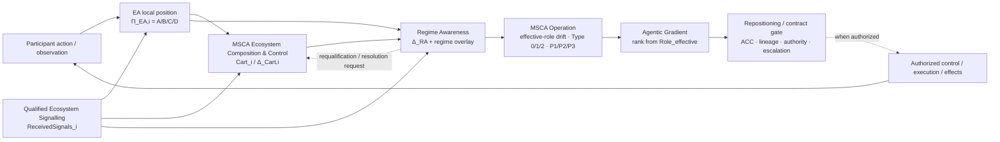

# Ecosystem Positioning — Agentic Architecture

> **You are here:** [Structural Awareness Programme](../../README.md) → **Architectural Contributions / pre-standardization** → **Ecosystem Positioning**

This README is the human entry point to the current **Ecosystem Positioning Agentic Architecture**. It mirrors the working PowerPoint deck and routes readers to the three maintained technical corpora that own the underlying responsibilities.

## Canonical presentation

### ⬇️ [Download the canonical PowerPoint (.pptx)](https://raw.githubusercontent.com/dakleyer/structural-awareness-contributions/main/presentations/ecosystem-positioning/Ecosystem_Positioning_Canonical.pptx)

### 📄 [Open the canonical PDF](../../presentations/ecosystem-positioning/Ecosystem_Positioning_Canonical.pdf)

[Presentation manifest](../../presentations/ecosystem-positioning/PRESENTATION_MANIFEST.md)

[Visual guide to the wider corpus](../../research/ecosystem-awareness/VISUAL_GUIDE.md) — cumulative lineage, ownership, current positioning cycle, requirements/test maturity, scenarios/cases and FG-TIDA application layers.

The PowerPoint above is the canonical editable presentation for this contribution; Git history provides its version lineage. The PDF is the canonical reading snapshot.

The deck is a **working proposal**, not an adopted standard. It presents Ecosystem Positioning as the participant-local architectural core, supported by Ecosystem Awareness, Regime Awareness, Minimum Sufficient Control and related participation/signalling concepts.

---

## What problem this architecture addresses

Agentic systems can remain locally correct while becoming badly situated in a changing ecosystem.

Identity may still verify. Policy may still return a permit. Attestation may still pass. A human may still approve. Yet the practical meaning of those results can change when roles, authority, dependencies, evidence and surrounding operating conditions change faster than the local control model.

Ecosystem Positioning is therefore concerned with a different question:

> **For this participant, this decision and this moment, what can be relied on, what remains unresolved, what has changed, and what should be requalified before action continues?**

It is participant-local and does not require a global controller or a complete shared state.

---

## Working process

The current circuit is event/threshold/schedule driven; it does **not** require one fixed polling cadence.

The component contract is:

- [01H](../../research/ecosystem-awareness/baseline/01H_PARTICIPANT_LOCAL_ECOSYSTEM_POSITIONING_AND_DECISION_SCOPED_EPISTEMIC_OPPORTUNITY_v0.1.md) supplies the participant-local qualified epistemic position and material local action/effect changes;
- [01J](../../research/ecosystem-awareness/baseline/01J_ECOSYSTEM_SIGNALLING_SELECTIVE_DISCLOSURE_AND_CHOREOGRAPHED_REPOSITIONING_v0.1.md) supplies receiver-qualified external messages as `ReceivedSignals_i`;
- [MSCA Ecosystem Composition & Control](../../standards/minimum-sufficient-control/03_MSCA_ECOSYSTEM_COMPOSITION_AND_CONTROL.md) maintains the participant-local qualified Ecosystem Cartography `Cart_i=[A_Cart,B_Cart,C_Cart,D_Cart]` and its cartographic change-set `Δ_Cart,i`;
- [Regime Awareness 01C](../../research/ecosystem-awareness/baseline/01C_EA_REGIME_AWARENESS_INTERFACE_ANNEX_v0.2.md) consumes those inputs plus focal MSCA/Role/decision context and returns `Δ_RA`, a regime-qualified overlay and bounded requalification requests;
- [Canonical MSCA Operation & Repositioning](../../standards/minimum-sufficient-control/04_CANONICAL_MSCA_OPERATION_AND_REPOSITIONING.md) first checks `Role_effective` drift, catalogues Type 0/1/2 and instantiates P1/P2/P3; the [Objective-Conditioned Agentic Gradient Law](./01_OBJECTIVE_CONDITIONED_AGENTIC_GRADIENT_LAW.md) then ranks candidate transitions from that effective position; ACC/lineage/authority gating produces HOLD/REALIGN_TARGET/REQUEST_CONTAINMENT/REBIND/RECONTRACT/MIGRATE/REQUEST_ISOLATION/ESCALATE outcomes. Repositioning selects/proposes/escalates; containment/isolation actuation remains with the authorized control owner.

**MSCA is cross-cutting:** control sufficiency is re-assessed when the frame, Objective Envelope, dependency map or authority changes. It does not create authority and it does not own the Semantic Window.

The cycle may be triggered by local epistemic movement, one or several material external signals, signal insufficiency/staleness, dependency-map change, action/effect mismatch, owner/policy request or a domain-appropriate periodic refresh.

---

## Three technical gates

### 1. Ecosystem Awareness

Owns the decision-scoped epistemic qualification:

- what is sufficiently determined;
- what remains unresolved;
- what could still be established within current capabilities;
- what remains structurally residual;
- how evidence, provenance and scope are preserved across handoff;
- when the frame needs targeted requalification.

**Enter the corpus:** [Ecosystem Awareness — entry-point router](../../research/ecosystem-awareness/README.md)

---

### 2. Regime Awareness

Owns continued validity of the operating frame:

- whether current observations remain compatible with the regime under which assumptions were qualified;
- the qualified **direction of regime change (`A_RA`)** and its **confidence/intensity (`B_RA`)**, with `C_RA/D_RA` preserving capability frontier and residual;
- whether the resulting delta should trigger downstream frame requalification. **RA does not decide the participant's Normal / Containment / Migration posture.**

**Enter the corpus:** [Regime Awareness — corpus index](../../research/regime-awareness/README.md)

---

### 3. Minimum Sufficient Control Architecture (MSCA)

Owns control sufficiency:

- Objective Envelope;
- operating environment;
- coordination scope;
- intervention mechanisms;
- enabling means;
- whether a supported configuration is sufficient for the current objective and authority.

**Enter the corpus:** [Minimum Sufficient Control / MSCA — corpus index](../../standards/minimum-sufficient-control/README.md)

---

## How the pieces divide responsibility

| Component | Responsibility |
|---|---|
| **Regime Awareness** | Emit a qualified ecosystem/regime delta — direction + confidence/intensity + capability frontier + residual — without deciding the participant's final posture. |
| **Ecosystem Awareness** | Qualify what can be relied on, what remains unresolved and what needs requalification. |
| **Ecosystem Positioning** | Maintain the participant-local situated view, derive the objective-conditioned agentic gradient, and hand candidate transitions to MSCA Operation/Repositioning for drift control and legitimate re-contracting. |
| **MSCA** | Determine whether control capacity is sufficient under the current Objective Envelope and authority. |
| **MSCA Operation / Repositioning** | Compare bound vs effective role, catalogue Type 0/1/2, instantiate P1/P2/P3, produce qualified `Π_RP=[A_RP,B_RP,C_RP,D_RP]`, emit `RepositionIntent` where external approval is required, and close with a bounded role/contract decision. |
| **Human / institutional governance** | Own legitimate authority, policy, objectives and final decision rights. |
| **EHD / ecosystem signalling** | Carry bounded qualified state, including `RepositionIntent` / `AuthorityResponse` compound profiles, across boundaries without turning a signal into a command. See [01J Ecosystem Signalling](../../research/ecosystem-awareness/baseline/01J_ECOSYSTEM_SIGNALLING_SELECTIVE_DISCLOSURE_AND_CHOREOGRAPHED_REPOSITIONING_v0.1.md). |

### Detailed ownership and boundary matrix

The compact responsibility table above is retained as the high-level reading view. The matrix below adds the **Owns / Emits / Never** boundary needed to prevent responsibilities from being silently merged when the components are composed.

| Component | Owns | Emits | Never | Source |
|---|---|---|---|---|
| **Ecosystem Positioning** | Participant-local situated composition across the maintained technical gates and the positioning circuit | Candidate positioning / transition context routed into the Gradient and MSCA Operation / Repositioning path | Absorbs the semantic ownership of EA, RA or MSCA; turns opportunity into permission; creates authority | This README · [Gradient Law](./01_OBJECTIVE_CONDITIONED_AGENTIC_GRADIENT_LAW.md) · [MSCA 04](../../standards/minimum-sufficient-control/04_CANONICAL_MSCA_OPERATION_AND_REPOSITIONING.md) |
| **Ecosystem Awareness** | Decision-scoped epistemic qualification `Π_EA,i(d,t)` | Qualified state; F8 epistemic envelope; requalification and evidence requests | Acts as an epistemic super-controller; issues commands; promotes local confidence to a participant-global or ecosystem-global conclusion | [Topology](../../research/ecosystem-awareness/baseline/00_CANONICAL_ARCHITECTURE_TOPOLOGY.md) · [01H](../../research/ecosystem-awareness/baseline/01H_PARTICIPANT_LOCAL_ECOSYSTEM_POSITIONING_AND_DECISION_SCOPED_EPISTEMIC_OPPORTUNITY_v0.1.md) |
| **Regime Awareness** | Continued validity of the operating frame | `Δ_RA`; regime-qualified overlay; bounded requalification requests | Decides the participant's P1/P2/P3 posture; becomes the persistent Ecosystem Cartography repository | [01C v0.2](../../research/ecosystem-awareness/baseline/01C_EA_REGIME_AWARENESS_INTERFACE_ANNEX_v0.2.md) · [RA README](../../research/regime-awareness/README.md) |
| **MSCA — canonical architecture** | Control sufficiency over the focal S/E/C/P/M architecture under the Objective Envelope | Sufficiency assessment under the declared objective, environment, coordination, intervention and enabling-means frame | Creates authority; owns the Semantic Window | [MSCA 00](../../standards/minimum-sufficient-control/00_CANONICAL_MSCA_ARCHITECTURE.md) |
| **MSCA — Composition & Control** | Participant-local Ecosystem Cartography `Cart_i` and its bounded dependency representation | `Cart_i` and `Δ_Cart,i` | Silently merges peer MSCAs into a composite without a legitimate higher-order owner; becomes Regime Awareness | [MSCA 03](../../standards/minimum-sufficient-control/03_MSCA_ECOSYSTEM_COMPOSITION_AND_CONTROL.md) |
| **Objective-Conditioned Agentic Gradient Law** | Objective-conditioned ranking of candidate transitions from the qualified effective position | Ranked candidate transitions / opportunity ordering | Treats opportunity as permission; claims a globally optimal gradient independent of the receiving participant and objective | [Gradient Law](./01_OBJECTIVE_CONDITIONED_AGENTIC_GRADIENT_LAW.md) |
| **MSCA Operation / Repositioning** | Effective-role drift control; Type 0/1/2 catalogue; P1/P2/P3 posture; ACC/lineage/authority gate; bounded role/contract transition | `Π_RP`; `RepositionIntent`; bounded role/contract outcome | Actuates containment or isolation by itself; treats effective drift as legitimate merely because it already happened | [MSCA 04](../../standards/minimum-sufficient-control/04_CANONICAL_MSCA_OPERATION_AND_REPOSITIONING.md) |
| **EHD / ecosystem signalling** | Boundary crossing of qualified state under receiver-side qualification | `ReceivedSignals_i`; bounded qualified state; `RepositionIntent` / `AuthorityResponse` compound profiles where material | Turns a signal into a command; creates a common global state or common governance | [01J](../../research/ecosystem-awareness/baseline/01J_ECOSYSTEM_SIGNALLING_SELECTIVE_DISCLOSURE_AND_CHOREOGRAPHED_REPOSITIONING_v0.1.md) |
| **Agentic Citizenship Contract** | Human-defined admissible participation conditions, including membership, roles, obligations, prohibitions, revocation and exit | Admissibility / normative constraints bound where applicable to the participant and MSCA | Owns identity, delegated authority, EA qualification, MSCA sufficiency or defence execution | [01I](../../research/ecosystem-awareness/baseline/01I_AGENTIC_CITIZENSHIP_CONTRACT_HUMAN_GOVERNED_PARTICIPATION_PROFILE_v0.1.md) |
| **Human / institutional governance** | Legitimate authority, policy, objectives and final decision rights | Decisions; permissions / refusals; `AuthorityResponse` where the signalling profile is used | Delegates away accountability merely because an architectural component proposes or ranks a transition | This README · [MSCA 04](../../standards/minimum-sufficient-control/04_CANONICAL_MSCA_OPERATION_AND_REPOSITIONING.md) |

The matrix is a boundary-reading aid over the current corpus. It does not replace the source definitions above or in the linked documents, and it does not turn cross-component composition into shared semantic ownership.

---

## Canonical positioning law

- [Objective-Conditioned Agentic Gradient Law](./01_OBJECTIVE_CONDITIONED_AGENTIC_GRADIENT_LAW.md) — current canonical working law for ecosystem-delta projection and objective-conditioned candidate opportunity.
- [Canonical MSCA Operation & Repositioning](../../standards/minimum-sufficient-control/04_CANONICAL_MSCA_OPERATION_AND_REPOSITIONING.md) — hard-decision layer for Type 0/1/2 catalogue, P1/P2/P3 posture, qualified repositioning A/B/C/D, re-contracting, escalation and role transition.

---

## Signalling and participation working extensions

- [01H — Participant-Local Ecosystem Positioning & Decision-Scoped Epistemic Opportunity](../../research/ecosystem-awareness/baseline/01H_PARTICIPANT_LOCAL_ECOSYSTEM_POSITIONING_AND_DECISION_SCOPED_EPISTEMIC_OPPORTUNITY_v0.1.md)
- [01I — Agentic Citizenship Contract](../../research/ecosystem-awareness/baseline/01I_AGENTIC_CITIZENSHIP_CONTRACT_HUMAN_GOVERNED_PARTICIPATION_PROFILE_v0.1.md)
- [01J — Ecosystem Signalling](../../research/ecosystem-awareness/baseline/01J_ECOSYSTEM_SIGNALLING_SELECTIVE_DISCLOSURE_AND_CHOREOGRAPHED_REPOSITIONING_v0.1.md)
- [00G — Collective False-Context Convergence ("Bar-to-Napoleon" Cascade)](../../research/ecosystem-awareness/baseline/00G_FAILURE_MODE_COLLECTIVE_FALSE_CONTEXT_CONVERGENCE_v0.1.md)

These are additive working extensions/cases. They do not redefine the frozen baseline.

---

## Benchmark and external application routes

- [Canonical Architecture Benchmark & Evidence v0.2](../../research/ecosystem-awareness/baseline/00D_CANONICAL_ARCHITECTURE_BENCHMARK_AND_REFERENCE_SCENARIO_EVIDENCE_v0.2.md)
- [FG-TIDA application package](../../research/ecosystem-awareness/fg-tida/README.md)
- [FG-TIDA public themes repository](https://github.com/FG-TIDA/themes)

These routes support testing and external application. They do not change the semantic ownership of Ecosystem Awareness, Regime Awareness or MSCA.
