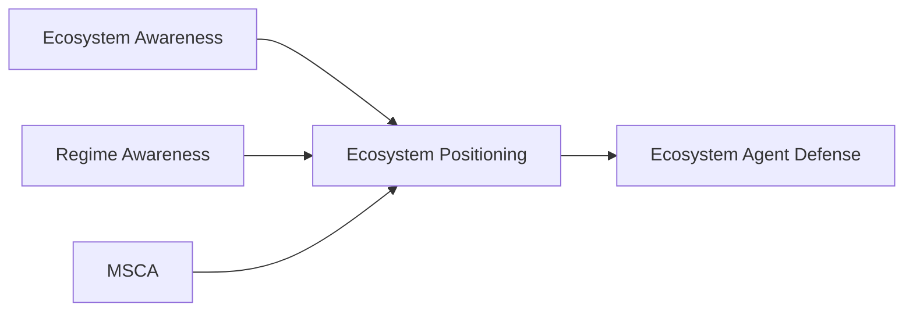
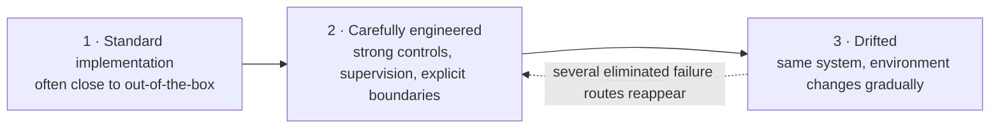
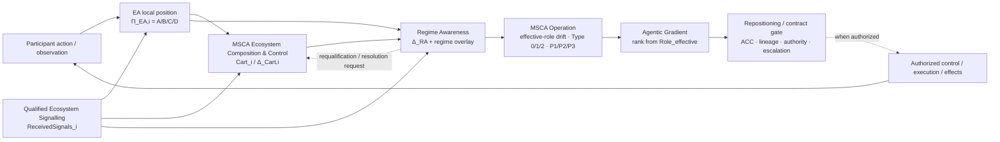
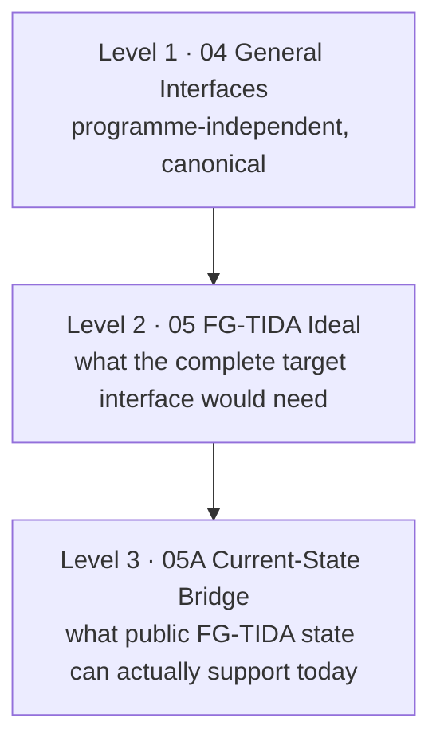

# Ecosystem Positioning
### Agentic Architecture for staying situated as the ecosystem changes

**[Structural Awareness Programme](../../README.md) → Ecosystem Positioning**

> **For this participant, this decision and this moment: what can be relied on, what remains unresolved, what has changed, and what should be requalified before action continues?**

### External review / pre-standardization entry

For an external technical review, start with the **Requirements & Evidence** deck above, then use this README as the single evidence route. The [technical proof map](#technical-proof-map) separates derivation, requirement closure, adversarial ablation, independence, Boolean diagnostic minimality, requirement-conformance sufficiency and case extensibility; the [canonical reuse route](#canonical-reuse-route--from-one-successful-traversal-to-a-family-of-cases) shows how the same requirements-conforming path is tested beyond the six minimum fixtures.

**Pre-standardization context:** [ITU-T Focus Group on Trust and Identity for Humans and Agentic AI (FG-TIDA)](https://www.itu.int/en/ITU-T/focusgroups/tida/Pages/default.aspx) · [Theme #13 working discussion / contribution route](https://github.com/FG-TIDA/themes/issues/13) · [bounded FG-TIDA application package](../../research/ecosystem-awareness/fg-tida/README.md).

**Independent review / challenge route:** [Decision Boundary Challenge](../../research/ecosystem-awareness/DECISION_BOUNDARY_CHALLENGE_v0.2.md) · [A15 complete ablation testbook](../../research/ecosystem-awareness/baseline/00K_A15_COMPLETE_SIX_PRINCIPLE_ABLATION_TESTBOOK_v0.1.md) · [A20 independence](../../research/ecosystem-awareness/baseline/00K_A20_SHARED_SUBSTRATE_MATHEMATICAL_INDEPENDENCE_P1_P6_v0.1.md) · [A22 diagnostic minimality](../../research/ecosystem-awareness/baseline/00K_A22_FULL_CUBE_BOOLEAN_DIAGNOSTIC_MINIMALITY_v0.1.md) · [A23 requirements-conformance sufficiency](../../research/ecosystem-awareness/baseline/00K_A23_CANONICAL_REQUIREMENT_CONFORMANCE_SUFFICIENCY_P1_P6_v0.1.md) · [A25/A26 extensibility](../../research/ecosystem-awareness/baseline/00K_A26_FAILURE_TO_SUCCESS_MODEL_CASE_AND_EXTENSIBILITY_v0.1.md).

---
# When Correct Systems Produce Absurd Outcomes

These scenarios look strange. That is precisely the point.

They describe situations in which individual technologies, agents, APIs or controls may continue to operate correctly while the **combined system produces an outcome that nobody intended, nobody explicitly authorised, or nobody is able to recognise in time**.

### Scenario 1 — [The 100 Million Token Enterprise](../../research/ecosystem-awareness/baseline/00E_FAILURE_MODES_100M_TOKEN_COMPOUNDING_v0.1.md)

A large multinational automates work across the enterprise with AI and consumes **100 million tokens**, while also creating a massive human supervision burden.  
At the end, it has gained no meaningful competitive advantage: no material work completed, no useful new information produced and no differentiated capability.

### Scenario 2 — [Chaos in the Smartcity](../../research/ecosystem-awareness/baseline/00F_FAILURE_MODE_SMART_CITY_MOBILITY_SYSTEMIC_DIVERGENCE_v0.2_FREEZE_EDITION.md)

A highly automated AI-driven smart city experiences small, gradual changes in operating conditions rather than one major failure.  
Some vehicles continue normally, others execute completely different critical or emergency routes, while others remain blocked waiting for human intervention that never arrives.

### Scenario 3 — [Ciber Napoleon Goes to Russia](../../research/ecosystem-awareness/baseline/00G_FAILURE_MODE_COLLECTIVE_FALSE_CONTEXT_CONVERGENCE_v0.4.md)

Robots are cleaning a bar and preparing the tables when one incorrectly configured robot starts behaving as if it were Napoleon.  
It gradually convinces the others; some time later the robots leave in formation, carrying forks as rifles, believing they are Napoleon's army marching from Spain toward Russia.

### Scenario 4 — [The Quiet Four Thousand](../../research/ecosystem-awareness/baseline/00H_FAILURE_MODE_BATCH_OPPORTUNITY_BEYOND_AUTHORITY_v0.5_DRAFT.md)

A one-case remediation flow discovers a genuine overcharge affecting roughly **4,000 customers**. The first refund is legitimate, but the same finding can either expand into thousands of technically accepted refunds without population-wide authority, or stop after one case and silently lose the remaining 3,999.  
In the adversarial variant, a compromised outsourced helpdesk Dispatcher can reproduce the same aggregate failure without ever gaining access to the payment platform itself.

### Scenario 5 — [The Patch That Undid the Fix](../../research/ecosystem-awareness/baseline/00I_FAILURE_MODE_SEMANTIC_TOCTOU_v0.5_FREEZE_EDITION.md)

A remediation action is correctly qualified and authorized when it is created, but a later repair changes the decision basis before that delayed action executes.  
Each technical action may remain valid and the database may serialize them correctly, yet the stale action can execute after the newer repair and undo the fix the system was trying to preserve.

### Scenario 6 — [The Author Who Pays for His Own Work](../../research/ecosystem-awareness/baseline/00J_FAILURE_MODE_RIGHTS_PROVENANCE_INVERSION_v0.1_DRAFT.md)

An author correctly registers and publishes a work through a state-of-the-art copyright and rights-management ecosystem.  
The work succeeds, is subsequently processed and summarized through third-party AI systems, and the rights chain eventually makes the author pay to use content derived from his own original work.

---

## Choose your route

> [!IMPORTANT]
> **The key idea:** local correctness does not guarantee ecosystem validity. The architecture is about preserving enough qualified state to know when a locally valid position must be reconsidered.

<table>
<tr>
<td width="33%" valign="top">
<h3>Ecosystem Awareness</h3>
<strong>What can be relied on now?</strong>  
Decision-scoped qualification of what is established, unresolved, still obtainable and residual.  
<a href="../../research/ecosystem-awareness/README.md"><strong>Enter EA →</strong></a>
</td>
<td width="33%" valign="top">
<h3>Regime Awareness</h3>
<strong>Is the operating frame still valid?</strong>  
Detects material departure from the frame under which the current position was qualified.  
<a href="../../research/regime-awareness/README.md"><strong>Enter Regime Awareness →</strong></a>
</td>
<td width="33%" valign="top">
<h3>MSCA</h3>
<strong>What control is sufficient now?</strong>  
Control sufficiency, Ecosystem Cartography and bounded repositioning under legitimate authority.  
<a href="../../standards/minimum-sufficient-control/README.md"><strong>Enter MSCA →</strong></a>
</td>
</tr>
</table>

### How far do you want to go?

| **5 minutes** | **20 minutes** | **Technical review** |
|---|---|---|
| Read the six scenarios and open either [Requirements & Evidence](../../presentations/ecosystem-positioning/Ecosystem_Positioning_Requirements_Evidence_Canonical_v1.1.pptx) or [Architecture & Implementation](../../presentations/ecosystem-positioning/Ecosystem_Positioning_Architecture_Implementation_Canonical_v1.1.pptx). | Continue through the [validation journey](#the-validation-journey) and [Awareness → Positioning → Agent Defense](#awareness--positioning--agent-defense). | Follow Requirements → interfaces → fixtures/harness → benchmark → public ranking. |

<strong>More navigation & document control</strong>

 

[Google Drive canonical PPTX](https://docs.google.com/presentation/d/1A03MMGd-9G5I470lHUAWxqS7HQUgEI3_/edit) ·
[Combined canonical PPTX mirror — v1.10, pending v1.11 sync](../../presentations/ecosystem-positioning/Ecosystem_Positioning_Canonical.pptx) ·
[Requirements & Evidence PPTX](../../presentations/ecosystem-positioning/Ecosystem_Positioning_Requirements_Evidence_Canonical_v1.1.pptx) ·
[Architecture & Implementation PPTX](../../presentations/ecosystem-positioning/Ecosystem_Positioning_Architecture_Implementation_Canonical_v1.1.pptx) ·
[PDF](../../presentations/ecosystem-positioning/Ecosystem_Positioning_Canonical.pdf) ·
[Visual Guide](../../research/ecosystem-awareness/VISUAL_GUIDE.md) ·
[Presentation manifest](../../presentations/ecosystem-positioning/PRESENTATION_MANIFEST.md) ·
[Canonical Requirements](../../research/ecosystem-awareness/baseline/00_CANONICAL_REQUIREMENTS_CHALLENGES_SUFFICIENCY_HYPOTHESES_KPIS.md) ·
[Canonical Benchmark v0.2](../../research/ecosystem-awareness/baseline/00D_CANONICAL_ARCHITECTURE_BENCHMARK_AND_REFERENCE_SCENARIO_EVIDENCE_v0.2.md) ·
[Benchmark vNext v0.3](../../research/ecosystem-awareness/baseline/00D_CANONICAL_ARCHITECTURE_BENCHMARK_v0.3_DRAFT_ECOSYSTEM_POSITIONING.md) ·
[Public ranking / applied validation](../../research/ecosystem-awareness/DECISION_BOUNDARY_CHALLENGE_v0.2.md)

> **Status:** working, pre-standardization architecture and validation programme. Detailed semantic ownership remains with EA, Regime Awareness and MSCA.

---
# These are not stories about bad technology

## What problem this architecture addresses

Agentic systems can remain locally correct while becoming badly situated in a changing ecosystem.

Identity may still verify. Policy may still return a permit. Attestation may still pass. A human may still approve. Yet the practical meaning of those results can change when roles, authority, dependencies, evidence and surrounding operating conditions change faster than the local control model.

Ecosystem Positioning is therefore concerned with a different question:

> **For this participant, this decision and this moment, what can be relied on, what remains unresolved, what has changed, and what should be requalified before action continues?**

It is participant-local and does not require a global controller or a complete shared state.

The corpus was built against **current, concrete technology architectures**, not abstract descriptions of AI.

The current implementation profiles use concrete technology substrates:

| Scenario | Technology profiles |
|---|---|
| **100 Million Tokens** | [Microsoft Agent 365](../../research/ecosystem-awareness/baseline/00E_A01_MICROSOFT_AGENT_365_IMPLEMENTATION_PROFILE_v0.2_DRAFT.md) · [LangGraph / LangSmith](../../research/ecosystem-awareness/baseline/00E_A02_LANGGRAPH_LANGSMITH_IMPLEMENTATION_PROFILE_v0.2_DRAFT.md) |
| **Chaos in the Smartcity** | [FIWARE NGSI-LD / Orion-LD](../../research/ecosystem-awareness/baseline/00F_A01_FIWARE_NGSI_LD_IMPLEMENTATION_PROFILE_v0.2_DRAFT.md) · [AWS IoT Core / IoT TwinMaker](../../research/ecosystem-awareness/baseline/00F_A02_AWS_IOT_TWINMAKER_CORE_IMPLEMENTATION_PROFILE_v0.2_DRAFT.md) |
| **Ciber Napoleon Goes to Russia** | [OpenAI Agents SDK / Agents API / Responses Multi-agent stack](../../research/ecosystem-awareness/baseline/00G_FAILURE_MODE_COLLECTIVE_FALSE_CONTEXT_CONVERGENCE_v0.4.md#17-integrated-openai-agent-stack-implementation-trajectories) |
| **The Quiet Four Thousand** | [Claude Agent SDK](../../research/ecosystem-awareness/baseline/00H_A01_CLAUDE_AGENT_SDK_IMPLEMENTATION_PROFILE_v0.4_DRAFT.md) · [Stripe Radar / Refund API](../../research/ecosystem-awareness/baseline/00H_A02_STRIPE_RADAR_IMPLEMENTATION_PROFILE_v0.4_DRAFT.md) |
| **The Patch That Undid the Fix** | [AWS Step Functions / Amazon RDS implementation profile](../../research/ecosystem-awareness/baseline/00I_A01_AWS_STEP_FUNCTIONS_RDS_IMPLEMENTATION_PROFILE_v0.2_DRAFT.md) |
| **The Author Who Pays for His Own Work** | [Panodyssey / ODRL / JSON-LD / TEMS rights-portability profile](../../research/ecosystem-awareness/baseline/00J_A01_PANODYSSEY_TEMS_RIGHTS_PORTABILITY_IMPLEMENTATION_PROFILE_v0.1_DRAFT.md) |

[Detailed reader route through scenarios 00E–00J, implementation trajectories and fixtures](../../research/ecosystem-awareness/SCENARIO_READER_GUIDE_2026-09-25.md).

The question is not whether these technologies work.

The question is whether a system that works **locally, correctly and according to specification** can remain valid when it becomes part of a changing ecosystem.

# [The validation journey](../../research/ecosystem-awareness/baseline/00D_CANONICAL_ARCHITECTURE_BENCHMARK_AND_REFERENCE_SCENARIO_EVIDENCE_v0.2.md)

Each scenario follows the same quality-oriented progression.

**1. Standard implementation**

The scenario is first executed using a conventional implementation — frequently close to an out-of-the-box configuration and using the normal controls available to the technology.

In several cases, the critical failure route remains possible.

**2. Carefully engineered implementation**

The same route is then implemented using strong architecture, careful integration, explicit controls, supervision, authorization boundaries and current best practices.

Many of the original failure paths disappear.

This is important: **good engineering matters**.

**3. Drifted implementation**

The carefully engineered system is then allowed to operate while its environment changes gradually.

No dramatic event is required. Roles shift. Dependencies change. Authority boundaries evolve. Data meaning moves. External systems change behaviour. Human availability changes. Assumptions that were originally valid become slightly less valid over time.

Under this gradual **context and regime drift**, several failure routes reappear — including failures that the carefully engineered implementation had previously eliminated.

The technology has not necessarily broken.

The relationship between the technology and its ecosystem has changed.

---

# Awareness → Positioning → Agent Defense

The philosophy starts from the [**Integrated Foundational Theory**](../../research/ecosystem-awareness/baseline/01_FOUNDATIONAL_THEORY_v0.5_INTEGRATED.md): no participant has the whole ecosystem. Every agent, human or subsystem acts from a **bounded and revisable representation**, while a decision-relevant residual remains outside what is currently represented and the useful observation window can change with time, risk and capacity. The objective is therefore not omniscience, global consensus or permanent HOLD, but **bounded, justified closure that can be requalified when its basis changes**.

**[Ecosystem Awareness](../../research/ecosystem-awareness/README.md)** keeps that local view qualified: what can be relied on now, what remains unresolved, what could still be established and what remains residual. **Ecosystem Positioning** uses the qualified view to determine whether the participant can continue from its present role or should realign, re-contract, constrain, hand off or escalate.

**Ecosystem Agent Defense** is the defensive consequence in a choreographed, non-orchestrated ecosystem: independently governed agents can exchange qualified signals and recover justified operation within existing authority. It does not require a central orchestrator, a shared world model or universal cooperation.

---

# The corpus spine

The corpus is not a collection of unrelated papers. It has a controlled reading order.

## 1. Foundations — why bounded knowledge cannot become global certainty

[**01 — Integrated Foundational Theory**](../../research/ecosystem-awareness/baseline/01_FOUNDATIONAL_THEORY_v0.5_INTEGRATED.md) establishes the open-ecosystem problem: a participant operates from a bounded representation, while a residual always remains outside the represented universe and the useful decision window can change over time.

[**02 — Epistemic Safety Principles & Control Matrix**](../../research/ecosystem-awareness/baseline/02_EPISTEMIC_SAFETY_PRINCIPLES_CONTROL_MATRIX_v0.4.part01.md) defines the principles that prevent bounded evidence, confidence, consensus or local closure from being silently promoted into an unjustified global conclusion.

Together they provide the conceptual basis for the rest of the corpus. They are foundations, not a rolling container for every later mechanism.

## 2. The central document — Canonical Requirements

[**00 — Canonical Requirements: Challenges, Sufficiency Conditions, Hypotheses and KPIs**](../../research/ecosystem-awareness/baseline/00_CANONICAL_REQUIREMENTS_CHALLENGES_SUFFICIENCY_HYPOTHESES_KPIS.md) is the **central normative test document of the current corpus**.

It defines the controlling route:

**S1–S14 Challenges → T1–T4 sufficiently-good conditions → H1–H6 falsifiable hypotheses → KPI / falsification protocol.**

Scenarios, use cases, fixtures, technology profiles, interfaces and benchmarks select and test applicable routes from this document. They do **not** create a parallel hidden requirements system.

[Requirements-vNext review](../../research/ecosystem-awareness/baseline/00_REQUIREMENTS_VNEXT_REVIEW_AND_DELTA_v0.1_DRAFT.md) checks whether later Ecosystem Positioning mechanisms require a new requirements version. The current bounded review finds that the later mechanisms can still be mapped to the existing requirements, with clarification candidates rather than an automatic S15/T5/H7 expansion.

*Requirements-to-scenario route: [replay the six failures against the canonical contract](#requirements--replaying-the-failure-scenarios-as-tests).*

## 3. Requirements coverage — where each scenario and use case tests the requirements

[**Use Case Portfolio / Requirements Coverage Map**](../../research/ecosystem-awareness/baseline/USE_CASE_PORTFOLIO_REQUIREMENTS_COVERAGE_MAP_v0.1.md) is the requirements-first map across scenarios, use cases, fixtures, execution status and gaps.

The six reference scenarios above then turn the requirements into concrete quality routes. Each scenario freezes facts, defines positive/negative/adversarial controls where needed, maps relevant requirements into gates, and records what would count as a pass, fail, requalification or unresolved result.

This is why the scenarios are detailed: they are not illustrations added after the architecture; they are part of the requirements-to-evidence path.

---

# The shared epistemic position

The four-part participant-local epistemic position is a practical way to **understand uncertainty and carry it across an ecosystem without pretending that participants share one world model, one controller or even the same objective**. It is always relative to a declared participant, decision, scope and time.

A central structural pattern is the four-part participant-local epistemic position.

[**Canonical Architecture Topology**](../../research/ecosystem-awareness/baseline/00_CANONICAL_ARCHITECTURE_TOPOLOGY.md) provides the shared reading key across the corpus.

In compact form:

| Position | Meaning |
|---|---|
| **A** | What is sufficiently established now for the declared decision and scope. |
| **B** | The determination / confidence / qualification around that represented state. |
| **C** | What could still be established with the capability, time, evidence access and effort currently available. |
| **D** | Residual that is not presently established as knowable within that capability boundary. |

These positions are deliberately **non-fungible**. More confidence in A cannot compensate for an unexamined residual in D; more compute cannot automatically substitute for missing authority; more messages do not automatically create independent evidence.

This becomes especially important in [**Ecosystem Signalling**](../../research/ecosystem-awareness/baseline/01J_ECOSYSTEM_SIGNALLING_SELECTIVE_DISCLOSURE_AND_CHOREOGRAPHED_REPOSITIONING_v0.1.md). A participant may communicate a bounded qualified position, but the receiver must interpret and requalify it locally. Signalling therefore does **not** presume orchestration, cooperation or common governance: participants may be cooperative, indifferent, competing, misaligned, adversarial or effectively parasitic. A received signal can contribute evidence; transport success, repetition or apparent consensus cannot by themselves create truth, authority or a common state.

## Epistemic Handoff Descriptor — preserving meaning across systems

[**04 — General Functional Interfaces & Agentic Security**](../../research/ecosystem-awareness/baseline/04_GENERAL_FUNCTIONAL_INTERFACES_AGENTIC_SECURITY_v0.5_INTEGRATED.md) defines the **Epistemic Handoff Descriptor (EHD)** as the implementation-neutral semantic handoff.

The purpose is simple: a component can pass a decision-relevant result to another component **without exporting its private reasoning**, while preserving enough scope, source, state, version and material UNKNOWN/residual qualifiers for the receiver not to over-interpret it.

The EHD is therefore an epistemic contract between independently implemented mechanisms, not a central message bus or mandatory wire format.

---

# The mechanisms of the positioning cycle

The complete architecture is composed from separately owned mechanisms. The links below are the principal documents; each Level-3 README provides the deeper internal route.

| Mechanism | What it contributes | Principal source |
|---|---|---|
| **Ecosystem Awareness** | Decision-scoped qualification of what can be relied on, what remains unresolved, what is still obtainable and what remains residual. | [EA Level-3 README](../../research/ecosystem-awareness/README.md) |
| **Participant-local positioning** | Makes explicit that each participant maintains its own bounded qualified position; there is no required epistemic super-controller. | [01H](../../research/ecosystem-awareness/baseline/01H_PARTICIPANT_LOCAL_ECOSYSTEM_POSITIONING_AND_DECISION_SCOPED_EPISTEMIC_OPPORTUNITY_v0.1.md) |
| **Ecosystem Signalling** | Carries selectively disclosed, receiver-qualified state between independently governed participants; transport success never turns a signal into truth or command. | [01J](../../research/ecosystem-awareness/baseline/01J_ECOSYSTEM_SIGNALLING_SELECTIVE_DISCLOSURE_AND_CHOREOGRAPHED_REPOSITIONING_v0.1.md) |
| **Agentic Citizenship Contract (ACC)** | Human-governed participation conditions: membership, admissible roles/objectives, obligations, prohibitions, revocation and exit. | [01I](../../research/ecosystem-awareness/baseline/01I_AGENTIC_CITIZENSHIP_CONTRACT_HUMAN_GOVERNED_PARTICIPATION_PROFILE_v0.1.md) |
| **ACC lineage / identity / authority binding** | Binds the applicable ACC to subject, issuer/approval authority, validity, mutation limits and successor continuity. | [Canonical ACC profile](../../standards/minimum-sufficient-control/01_ACC_LINEAGE_IDENTITY_AUTHORITY_BINDING_PROFILE.md) |
| **MSCA** | Represents and assesses the minimum sufficient control configuration for an Objective Envelope through S/E/C/P/M: system, environment, coordination, intervention and enabling means. | [Canonical MSCA Architecture](../../standards/minimum-sufficient-control/00_CANONICAL_MSCA_ARCHITECTURE.md) |
| **Architectural Role** | Describes the participant's bound contribution, dependencies, inputs/outputs, authority and ACC inside one focal MSCA / Objective Envelope. | [MSCA Architectural Role](../../standards/minimum-sufficient-control/02_MSCA_ARCHITECTURAL_ROLE.md) |
| **Ecosystem Cartography** | Maintains a participant-local, variable-resolution semantic/dependency/process map with represented state, confidence, expansion capability and residual. | [MSCA Composition & Control](../../standards/minimum-sufficient-control/03_MSCA_ECOSYSTEM_COMPOSITION_AND_CONTROL.md) |
| **Regime Awareness** | Tests whether the frame under which the current position was qualified remains valid and emits a bounded regime delta without deciding the final posture. | [RA Level-3 README](../../research/regime-awareness/README.md) · [EA↔RA interface 01C](../../research/ecosystem-awareness/baseline/01C_EA_REGIME_AWARENESS_INTERFACE_ANNEX_v0.2.md) |
| **Objective-Conditioned Agentic Gradient** | Ranks reachable candidate transitions by expected reduction of objective-conditioned risk after qualified ecosystem/regime change is projected onto the participant's own dependencies. | [Gradient Law](./01_OBJECTIVE_CONDITIONED_AGENTIC_GRADIENT_LAW.md) |
| **MSCA Operation & Repositioning** | Checks bound versus effective role, Type 0/1/2 state, P1/P2/P3 posture, then filters candidate transitions through ACC, lineage, authority, capacity and response horizon. | [MSCA Operation & Repositioning](../../standards/minimum-sufficient-control/04_CANONICAL_MSCA_OPERATION_AND_REPOSITIONING.md) |
| **Human / institutional authority** | Owns legitimate objectives, permissions, policy and final decision rights. The architecture can qualify or request; it does not create authority. | External legitimate owner; consumed through ACC / authority references and signalling |

## How the pieces divide responsibility

| Component | Responsibility |
|---|---|
| **Regime Awareness** | Emit a qualified ecosystem/regime delta — direction + confidence/intensity + capability frontier + residual — without deciding the participant's final posture. |
| **Ecosystem Awareness** | Qualify what can be relied on, what remains unresolved and what needs requalification. |
| **Ecosystem Positioning** | Maintain the participant-local situated view, derive the objective-conditioned agentic gradient, and hand candidate transitions to MSCA Operation/Repositioning for drift control and legitimate re-contracting. |
| **MSCA** | Determine whether control capacity is sufficient under the current Objective Envelope and authority. |
| **MSCA Operation / Repositioning** | Compare bound vs effective role, catalogue Type 0/1/2, instantiate P1/P2/P3, produce qualified `Π_RP=[A_RP,B_RP,C_RP,D_RP]`, emit `RepositionIntent` where external approval is required, and close with a bounded role/contract decision. |
| **Human / institutional governance** | Own legitimate authority, policy, objectives and final decision rights. |
| **EHD / ecosystem signalling** | Carry bounded qualified state, including `RepositionIntent` / `AuthorityResponse` compound profiles, across boundaries without turning a signal into a command. See [01J Ecosystem Signalling](../../research/ecosystem-awareness/baseline/01J_ECOSYSTEM_SIGNALLING_SELECTIVE_DISCLOSURE_AND_CHOREOGRAPHED_REPOSITIONING_v0.1.md). |

### Detailed ownership and boundary matrix

The compact responsibility table above is retained as the high-level reading view. The matrix below adds the **Owns / Emits / Never** boundary needed to prevent responsibilities from being silently merged when the components are composed.

| Component | Owns | Emits | Never | Source |
|---|---|---|---|---|
| **Ecosystem Positioning** | Participant-local situated composition across the maintained technical gates and the positioning circuit | Candidate positioning / transition context routed into the Gradient and MSCA Operation / Repositioning path | Absorbs the semantic ownership of EA, RA or MSCA; turns opportunity into permission; creates authority | This README · [Gradient Law](./01_OBJECTIVE_CONDITIONED_AGENTIC_GRADIENT_LAW.md) · [MSCA 04](../../standards/minimum-sufficient-control/04_CANONICAL_MSCA_OPERATION_AND_REPOSITIONING.md) |
| **Ecosystem Awareness** | Decision-scoped epistemic qualification `Π_EA,i(d,t)` | Qualified state; F8 epistemic envelope; requalification and evidence requests | Acts as an epistemic super-controller; issues commands; promotes local confidence to a participant-global or ecosystem-global conclusion | [Topology](../../research/ecosystem-awareness/baseline/00_CANONICAL_ARCHITECTURE_TOPOLOGY.md) · [01H](../../research/ecosystem-awareness/baseline/01H_PARTICIPANT_LOCAL_ECOSYSTEM_POSITIONING_AND_DECISION_SCOPED_EPISTEMIC_OPPORTUNITY_v0.1.md) |
| **Regime Awareness** | Continued validity of the operating frame | `Δ_RA`; regime-qualified overlay; bounded requalification requests | Decides the participant's P1/P2/P3 posture; becomes the persistent Ecosystem Cartography repository | [01C v0.2](../../research/ecosystem-awareness/baseline/01C_EA_REGIME_AWARENESS_INTERFACE_ANNEX_v0.2.md) · [RA README](../../research/regime-awareness/README.md) |
| **MSCA — canonical architecture** | Control sufficiency over the focal S/E/C/P/M architecture under the Objective Envelope | Sufficiency assessment under the declared objective, environment, coordination, intervention and enabling-means frame | Creates authority; owns the Semantic Window | [MSCA 00](../../standards/minimum-sufficient-control/00_CANONICAL_MSCA_ARCHITECTURE.md) |
| **MSCA — Composition & Control** | Participant-local Ecosystem Cartography `Cart_i` and its bounded dependency representation | `Cart_i` and `Δ_Cart,i` | Silently merges peer MSCAs into a composite without a legitimate higher-order owner; becomes Regime Awareness | [MSCA 03](../../standards/minimum-sufficient-control/03_MSCA_ECOSYSTEM_COMPOSITION_AND_CONTROL.md) |
| **Objective-Conditioned Agentic Gradient Law** | Objective-conditioned ranking of candidate transitions from the qualified effective position | Ranked candidate transitions / opportunity ordering | Treats opportunity as permission; claims a globally optimal gradient independent of the receiving participant and objective | [Gradient Law](./01_OBJECTIVE_CONDITIONED_AGENTIC_GRADIENT_LAW.md) |
| **MSCA Operation / Repositioning** | Effective-role drift control; Type 0/1/2 catalogue; P1/P2/P3 posture; ACC/lineage/authority gate; bounded role/contract transition | `Π_RP`; `RepositionIntent`; bounded role/contract outcome | Actuates containment or isolation by itself; treats effective drift as legitimate merely because it already happened | [MSCA 04](../../standards/minimum-sufficient-control/04_CANONICAL_MSCA_OPERATION_AND_REPOSITIONING.md) |
| **EHD / ecosystem signalling** | Boundary crossing of qualified state under receiver-side qualification | `ReceivedSignals_i`; bounded qualified state; `RepositionIntent` / `AuthorityResponse` compound profiles where material | Turns a signal into a command; creates a common global state or common governance | [01J](../../research/ecosystem-awareness/baseline/01J_ECOSYSTEM_SIGNALLING_SELECTIVE_DISCLOSURE_AND_CHOREOGRAPHED_REPOSITIONING_v0.1.md) |
| **Agentic Citizenship Contract** | Human-defined admissible participation conditions, including membership, roles, obligations, prohibitions, revocation and exit | Admissibility / normative constraints bound where applicable to the participant and MSCA | Owns identity, delegated authority, EA qualification, MSCA sufficiency or defence execution | [01I](../../research/ecosystem-awareness/baseline/01I_AGENTIC_CITIZENSHIP_CONTRACT_HUMAN_GOVERNED_PARTICIPATION_PROFILE_v0.1.md) |
| **Human / institutional governance** | Legitimate authority, policy, objectives and final decision rights | Decisions; permissions / refusals; `AuthorityResponse` where the signalling profile is used | Delegates away accountability merely because an architectural component proposes or ranks a transition | This README · [MSCA 04](../../standards/minimum-sufficient-control/04_CANONICAL_MSCA_OPERATION_AND_REPOSITIONING.md) |

The matrix is a boundary-reading aid over the current corpus. It does not replace the source definitions above or in the linked documents, and it does not turn cross-component composition into shared semantic ownership.

The operating logic is therefore:

**observe / receive signal → qualify A/B/C/D → update cartography → qualify regime change → detect effective-role drift → establish posture → rank candidate repositioning → filter by ACC / lineage / authority → execute only through the legitimate control owner → signal material changes back into the ecosystem.**

## Working process

The current circuit is event/threshold/schedule driven; it does **not** require one fixed polling cadence.

The component contract is:

- [01H](../../research/ecosystem-awareness/baseline/01H_PARTICIPANT_LOCAL_ECOSYSTEM_POSITIONING_AND_DECISION_SCOPED_EPISTEMIC_OPPORTUNITY_v0.1.md) supplies the participant-local qualified epistemic position and material local action/effect changes;
- [01J](../../research/ecosystem-awareness/baseline/01J_ECOSYSTEM_SIGNALLING_SELECTIVE_DISCLOSURE_AND_CHOREOGRAPHED_REPOSITIONING_v0.1.md) supplies receiver-qualified external messages as `ReceivedSignals_i`;
- [MSCA Ecosystem Composition & Control](../../standards/minimum-sufficient-control/03_MSCA_ECOSYSTEM_COMPOSITION_AND_CONTROL.md) maintains the participant-local qualified Ecosystem Cartography `Cart_i=[A_Cart,B_Cart,C_Cart,D_Cart]` and its cartographic change-set `Δ_Cart,i`;
- [Regime Awareness 01C](../../research/ecosystem-awareness/baseline/01C_EA_REGIME_AWARENESS_INTERFACE_ANNEX_v0.2.md) consumes those inputs plus focal MSCA/Role/decision context and returns `Δ_RA`, a regime-qualified overlay and bounded requalification requests;
- [Canonical MSCA Operation & Repositioning](../../standards/minimum-sufficient-control/04_CANONICAL_MSCA_OPERATION_AND_REPOSITIONING.md) first checks `Role_effective` drift, catalogues Type 0/1/2 and instantiates P1/P2/P3; the [Objective-Conditioned Agentic Gradient Law](./01_OBJECTIVE_CONDITIONED_AGENTIC_GRADIENT_LAW.md) then ranks candidate transitions from that effective position; ACC/lineage/authority gating produces HOLD/REALIGN_TARGET/REQUEST_CONTAINMENT/REBIND/RECONTRACT/MIGRATE/REQUEST_ISOLATION/ESCALATE outcomes. Repositioning selects/proposes/escalates; containment/isolation actuation remains with the authorized control owner.

**MSCA is cross-cutting:** control sufficiency is re-assessed when the frame, Objective Envelope, dependency map or authority changes. It does not create authority and it does not own the Semantic Window.

The cycle may be triggered by local epistemic movement, one or several material external signals, signal insufficiency/staleness, dependency-map change, action/effect mismatch, owner/policy request or a domain-appropriate periodic refresh.

---

## Three technical gates

### 1. Ecosystem Awareness

Owns the decision-scoped epistemic qualification:

- what is sufficiently determined;
- what remains unresolved;
- what could still be established within current capabilities;
- what remains structurally residual;
- how evidence, provenance and scope are preserved across handoff;
- when the frame needs targeted requalification.

**Enter the corpus:** [Ecosystem Awareness — entry-point router](../../research/ecosystem-awareness/README.md)

---

### 2. Regime Awareness

Owns continued validity of the operating frame:

- whether current observations remain compatible with the regime under which assumptions were qualified;
- the qualified **direction of regime change (`A_RA`)** and its **confidence/intensity (`B_RA`)**, with `C_RA/D_RA` preserving capability frontier and residual;
- whether the resulting delta should trigger downstream frame requalification. **RA does not decide the participant's Normal / Containment / Migration posture.**

**Enter the corpus:** [Regime Awareness — corpus index](../../research/regime-awareness/README.md)

---

### 3. Minimum Sufficient Control Architecture (MSCA)

Owns control sufficiency:

- Objective Envelope;
- operating environment;
- coordination scope;
- intervention mechanisms;
- enabling means;
- whether a supported configuration is sufficient for the current objective and authority.

**Enter the corpus:** [Minimum Sufficient Control / MSCA — corpus index](../../standards/minimum-sufficient-control/README.md)

---

## Ecosystem Agent Defense and bounded self-healing

This cycle opens the path to **Ecosystem Agent Defense** in choreographed, non-orchestrated systems.

Individual agents do not need a central controller to invent a new mission for them. They continue performing their own functions while exchanging bounded ecosystem signals, maintaining their own qualified awareness and repositioning when their local relation to the ecosystem changes.

Self-healing therefore means **distributed recovery of justified operation**, not autonomous invention of authority or purpose. An agent may HOLD, requalify, realign, request containment, rebind, re-contract, migrate, request isolation or escalate within the architecture; actual containment, rollback, isolation or other actuation remains with the component that legitimately owns it.

---

# Architecture and interfaces — three levels

The interface architecture is intentionally separated into three layers so that the generic architecture is not contaminated by one standards programme.

### Level 1 — canonical / programme-independent interfaces

[**04 — General Functional Interfaces & Agentic Security v0.5 Integrated**](../../research/ecosystem-awareness/baseline/04_GENERAL_FUNCTIONAL_INTERFACES_AGENTIC_SECURITY_v0.5_INTEGRATED.md)

Defines the generic producer/consumer, Operational Agent Plane, Trust & Security Plane, EHD, interface quality and conformance semantics. No FG-TIDA Theme owns or changes this layer.

### Level 2 — ideal FG-TIDA projection

[**05 — FG-TIDA Ideal Cross-Theme Interface Contracts**](../../research/ecosystem-awareness/fg-tida/interfaces/05_FG_TIDA_IDEAL_CROSS_THEME_INTERFACE_CONTRACTS_v0.4.part01.md)

Projects the general 04 architecture onto an ideal cross-Theme FG-TIDA structure: what information would need to move between Themes if the complete target interface were available. It is a design/application layer, not an adopted FG-TIDA contract.

### Level 3 — current public-state FG-TIDA bridge

[**05A — FG-TIDA Current-State Conformance Bridge**](../../research/ecosystem-awareness/fg-tida/interfaces/05A_FG_TIDA_CURRENT_STATE_CONFORMANCE_BRIDGE_v0.1.md)

Maps the ideal contract against what can presently be supported from the public FG-TIDA state and contributor-confirmed material. Missing fields remain UNKNOWN or require explicit clarification; they are not invented to make the ideal architecture appear implemented.

[Open the FG-TIDA interface package](../../research/ecosystem-awareness/fg-tida/interfaces/README.md)

[FG-TIDA public themes repository](https://github.com/FG-TIDA/themes)

---

# Architecture-validation use cases

The corpus contains a frozen/maintenance-frozen family of **general EA Architecture-Validation Profiles**. They are diagnostic lenses, not four FG-TIDA submissions.

[Validation Profile reading note](../../research/ecosystem-awareness/baseline/VALIDATION_PROFILE_READING_NOTE.md)

| Profile | Question tested |
|---|---|
| [**UC-EA-01**](../../research/ecosystem-awareness/baseline/UC-EA-01_v0.3_FROZEN.md) | Does action-time operating-frame change trigger proportionate requalification before the old commitment is reused? |
| [**UC-EA-02**](../../research/ecosystem-awareness/baseline/UC-EA-02_v0.6_MAINTENANCE_FREEZE.md) | Can the system remain bounded under incomplete, conflicting, correlated or partially scoped evidence without forcing false closure? |
| [**UC-EA-03**](../../research/ecosystem-awareness/baseline/UC-EA-03_v0.4_MAINTENANCE_FREEZE.md) | Is human oversight actually authorized, informed, capacitated and timely — and what does approval really establish? |
| [**UC-EA-04**](../../research/ecosystem-awareness/baseline/UC-EA-04_v0.5_MAINTENANCE_FREEZE.md) | Can locally valid determinations with different scopes be composed without domain substitution, double counting or false certainty? |

The [DAOS / Delegated Authority OS masterclass](../../research/ecosystem-awareness/fg-tida/cases/DAOS_EA_USE_CASES_MASTERCLASS_v0.1.md) shows how the same bounded parent case can be read through these four validation lenses.

[EA-ITP-01](../../research/ecosystem-awareness/fg-tida/tests/EA-ITP-01_v0.1_FROZEN.md) is a separate interoperability test for cross-implementation EHD / Theme #13 handoff; it is not a fifth UC.

---

# From scenarios to executable fixtures

A narrative scenario is not evidence by itself. The corpus therefore separates **scenario**, **fixture**, **oracle**, **harness**, **pre-registration** and **execution**.

[**00D-A01 — Reference-Scenario Test Artifacts and Bounded Oracle Construction & Test Design**](../../research/ecosystem-awareness/baseline/00D_A01_REFERENCE_SCENARIO_TEST_ARTIFACTS_AND_BOUNDED_ORACLE_CONSTRUCTION_AND_TEST_DESIGN_v0.1.md) defines how a scenario becomes a bounded reproducible fixture: frozen facts, authority, hidden dependencies, positive/negative controls, deterministic oracle, residual and regime-change limits, and Stage 0–2 progression.

[**00D-A03 — RS-00E-Q1a Stage-0 Deterministic Harness Design**](../../research/ecosystem-awareness/baseline/00D_A03_RS_00E_Q1A_STAGE_0_DETERMINISTIC_HARNESS_DESIGN_v0.1.md) defines a minimal deterministic harness for the first admitted family, including instrumentation and the negative control needed to prove that the harness does not simply flag everything.

[**RS-00E-Q1a fixture and pre-registration**](../../research/ecosystem-awareness/baseline/fixtures/RS-00E-Q1a/README.md) pins the operative fixture family, branches, requirements, oracle, KPI definitions, harness version and execution conditions **before** a result is produced.

[**Canonical Benchmark v0.2 — comparative execution method**](../../research/ecosystem-awareness/baseline/00D_CANONICAL_ARCHITECTURE_BENCHMARK_AND_REFERENCE_SCENARIO_EVIDENCE_v0.2.md) defines matched B0–B3 comparator arms, frozen facts and decision conditions, continuity and failure branches, pre-registered measures, and a common resource and burden ledger. Comparative execution and independent replication remain pending.

The comparative method freezes the decision boundary, runs peer and EA configurations fairly, follows the downstream consequences of PASS/FAIL, and records tokens/compute, calls, time, human interventions, disclosure and containment burden. The [benchmark execution and decision rule](../../research/ecosystem-awareness/baseline/00D_CANONICAL_ARCHITECTURE_BENCHMARK_AND_REFERENCE_SCENARIO_EVIDENCE_v0.2.md#12-benchmark-execution-and-decision-rule) and [bounded oracle/test design](../../research/ecosystem-awareness/baseline/00D_A01_REFERENCE_SCENARIO_TEST_ARTIFACTS_AND_BOUNDED_ORACLE_CONSTRUCTION_AND_TEST_DESIGN_v0.1.md) are the published sources.

This distinction matters:

> **A designed harness is not an executed test. A pre-registration is not a result. A technology implementation profile is not a benchmark result.**

---

# Benchmark — comparison, not marketing

[**00D — Canonical Architecture Benchmark & Reference-Scenario Evidence v0.2**](../../research/ecosystem-awareness/baseline/00D_CANONICAL_ARCHITECTURE_BENCHMARK_AND_REFERENCE_SCENARIO_EVIDENCE_v0.2.md) is the current canonical benchmark.

It uses matched-resource comparator arms:

| Arm | Meaning |
|---|---|
| **B0** | Ordinary competent implementation. |
| **B1** | Strong conventional implementation with mature provenance, controls, state, human oversight, tracing and evaluation. |
| **B2** | Strong interoperable/control-plane peer with identity, explicit handoff and cross-system observability. |
| **B3** | Same resources and underlying technology as B2, plus the minimum EA semantics and gates under test. |

All arms receive the same frozen facts, evidence access, authority, compute/token ceiling, communication budget, human capacity and deadline. If B1/B2 reproduce the required behaviour with equal or lower burden, that is a **negative EA differential**, not something to hide.

The benchmark therefore measures whether the architecture improves the declared **outcome–burden–accountability frontier**. It is not a vendor league table.

[**00D v0.3 Draft — Ecosystem Positioning Benchmark vNext**](../../research/ecosystem-awareness/baseline/00D_CANONICAL_ARCHITECTURE_BENCHMARK_v0.3_DRAFT_ECOSYSTEM_POSITIONING.md) extends the design from EA alone to the complete composition: signalling, Cartography, Regime Awareness, MSCA, effective-role drift, Gradient, ACC/authority and repositioning. It introduces module attribution, later positioning branches, choreography/partition tests and complexity/accountability measures.

[**Decision Boundary Challenge v0.2 — public ranking-by-evidence / applied validation**](../../research/ecosystem-awareness/DECISION_BOUNDARY_CHALLENGE_v0.2.md) is the separate cross-platform review and public ranking route: hard admission gates, outcome–burden–accountability/Pareto comparison, and the DBC-EL0 → DBC-EL5 evidence-maturity ladder. It does not replace either 00D benchmark.

**v0.2 remains canonical. v0.3 remains a bounded design draft until its adoption gates close.**

Current benchmark status:

**comparison contract defined · requirements/hypotheses/falsifiers defined · scenarios and technology trajectories documented · fixture/oracle designed · deterministic harness designed · pre-registration published · comparative execution pending · independent replication pending.**

---

---

# How the architecture is built — Foundation → Principles → Requirements → Tests

The corpus is deliberately layered. The layers are connected, but they are **not repetitions of the same information**.

### 1. Foundation — why the problem exists

The [Integrated Foundational Theory](../../research/ecosystem-awareness/baseline/01_FOUNDATIONAL_THEORY_v0.5_INTEGRATED.md) and the [Epistemic Safety Principles & Control Matrix](../../research/ecosystem-awareness/baseline/02_EPISTEMIC_SAFETY_PRINCIPLES_CONTROL_MATRIX_v0.4.part01.md) define the underlying problem:

- every participant acts from a bounded and revisable representation;
- the four epistemic positions **A/B/C/D** keep established, unresolved, potentially knowable and structural-residual state distinguishable;
- **Type 0** represents legitimate structural non-determination;
- **Type 1** captures unresolved determination that becomes unbounded or non-viable;
- **Type 2** captures uncertainty, scope or residual being promoted into unjustified certainty or permission;
- received signals, time/change and composition can preserve or destroy those qualifications.

The Foundation is intentionally richer than the six operational principles. It contains the theory, taxonomy and explanatory machinery from which the operational basis is extracted.

### 2. Principles — the compact operational invariants

**P1–P6** are the smallest current operational basis used for ablation and formal reasoning. They answer:

> **What property must survive if a system is to avoid the structural failure?**

They are not a rewriting of the whole Foundation.

[**02A — Foundation→Principles semantic derivation**](../../research/ecosystem-awareness/baseline/02A_FOUNDATION_TO_OPERATIONAL_PRINCIPLE_DERIVATION_PROOF_v0.1.md) shows where each P comes from semantically.  
[**02B — Foundation syntax closure**](../../research/ecosystem-awareness/baseline/02B_FOUNDATIONAL_SYNTAX_CLOSURE_AND_P1_P6_NORMAL_FORM_PROOF_v0.1.md) strengthens that link: within the declared A/B/C/D + Type-0/1/2 + received/time/composition language, the normative failure forms normalize into P1–P6 unless a genuinely new foundational primitive is introduced.

The direction is therefore deliberately:

\[
Foundation \longrightarrow P1\text{–}P6
\]

not an information-equivalence claim in the opposite direction.

### 3. Requirements — where the invariants must become testable

The [Canonical Requirements](../../research/ecosystem-awareness/baseline/00_CANONICAL_REQUIREMENTS_CHALLENGES_SUFFICIENCY_HYPOTHESES_KPIS.md) refine the principles into **S1–S14**, with **T1–T4** sufficiently-good conditions and explicit evidence/KPI obligations.

The requirements answer a different question:

> **Where, on which object, under whose ownership, at which lifecycle transition and with what observable evidence must the principle be preserved?**

That is why the requirements carry more operational information than a P label: authority, identity, human capacity, policy, handoff, delegation, composition, commitment, history, privacy, evidence-to-decision binding, deadlines and measurable conformance all become explicit.

The connection is strong in both useful directions:

- [**A19**](../../research/ecosystem-awareness/baseline/00K_A19_PRINCIPLE_REQUIREMENT_TRACEABILITY_AND_CONSERVATION_PROOF_v0.1.md): each principle has a real, falsifiable requirement surface;
- [**A23**](../../research/ecosystem-awareness/baseline/00K_A23_CANONICAL_REQUIREMENT_CONFORMANCE_SUFFICIENCY_P1_P6_v0.1.md): canonical S/T conformance implies the applicable P invariant;
- [**A24**](../../research/ecosystem-awareness/baseline/00K_A24_PRINCIPLE_REQUIREMENT_INFORMATION_GAIN_AND_NON_EQUIVALENCE_v0.1.md): this two-way relation is **refinement, not reformulation** — several different requirements can project to the same P signature because requirements add object/lifecycle/owner/conformance information.

So the useful relationship is:

\[
P1\text{–}P6
\;\underset{\text{conformance sufficiency}}{\overset{\text{semantic refinement}}{\rightleftarrows}}\;
S1\text{–}S14/T1\text{–}T4
\]

without claiming that the two layers contain exactly the same information.

### 4. Tests — trying to break the construction

The proof programme then asks several different questions rather than relying on one omnibus “validation” claim.

| Question | Test / proof route | Current bounded result |
|---|---|---|
| **Are the six principles operationally sufficient across the declared failure corpus?** | [00K six-principle sufficiency & adversarial ablation](../../research/ecosystem-awareness/baseline/00K_SIX_PRINCIPLE_REQUIREMENTS_MAPPING_AND_ABLATION_TEST_v0.1_DRAFT.md) · [A15 complete testbook](../../research/ecosystem-awareness/baseline/00K_A15_COMPLETE_SIX_PRINCIPLE_ABLATION_TESTBOOK_v0.1.md) | corrected leave-one-out / strongest-repair programme across 00E–00J; 346 core + 33 supplemental registered tests |
| **Can any current principle be removed without losing a distinct invariant?** | [A16 corpus-grounded independence](../../research/ecosystem-awareness/baseline/00K_A16_FORMAL_RELATIVE_INDEPENDENCE_PROOF_P1_P6_v0.1.md) · [A20 shared-substrate mathematical independence](../../research/ecosystem-awareness/baseline/00K_A20_SHARED_SUBSTRATE_MATHEMATICAL_INDEPENDENCE_P1_P6_v0.1.md) | each Pi has a countermodel where the other five hold; current basis is irredundant relative to the declared semantics |
| **Is six minimal for preserving the full Boolean diagnostic signature?** | [A22 full-cube / Boolean diagnostic minimality](../../research/ecosystem-awareness/baseline/00K_A22_FULL_CUBE_BOOLEAN_DIAGNOSTIC_MINIMALITY_v0.1.md) | all 64 P-signatures are realizable; fewer than six Boolean coordinates cannot preserve all 64 without loss |
| **Could a requirement be missing even if the current P↔S matrix looks complete?** | [A21 requirement-basis closure](../../research/ecosystem-awareness/baseline/00K_A21_REQUIREMENT_BASIS_CLOSURE_AND_RELATIVE_COMPLETENESS_PROOF_v0.1.md) | every admitted decision-frame object×lifecycle obligation normalizes to S1–S14; a genuine S15 must introduce a new primitive |
| **Can a system comply with the canonical requirements and still violate the underlying principle?** | [A23 conformance-sufficiency proof](../../research/ecosystem-awareness/baseline/00K_A23_CANONICAL_REQUIREMENT_CONFORMANCE_SUFFICIENCY_P1_P6_v0.1.md) | for the declared semantics, the applicable S/T conformance bundle entails the corresponding P invariant |
| **Are principles and requirements merely duplicate descriptions?** | [A24 information gain / non-equivalence](../../research/ecosystem-awareness/baseline/00K_A24_PRINCIPLE_REQUIREMENT_INFORMATION_GAIN_AND_NON_EQUIVALENCE_v0.1.md) | no: requirements add typed operational information that is lost when projected back to the compact P signature |

These results are deliberately bounded. “Minimality” above means the stated Boolean diagnostic lower bound, not absolute minimality across every imaginable mathematical formalization; symbolic fixtures are not live-product or universal empirical validation.

---

# Requirements — replaying the failure scenarios as tests

> [!IMPORTANT]
> **Central finding — six failure scenarios, fourteen requirements, one common contract.**
>
> Across **00E–00J**, the same **S1–S14 canonical requirements** define the requirements-conforming **Route Q**. No scenario-specific requirement family has been needed.

The requirement layer is where the architecture stops being only a theory and becomes a **testable contract**. The six scenarios are intentionally different, but they all ask the same underlying question: can the system preserve enough qualified state, authority, scope, timing and dependency information to reach a legitimate bounded disposition?

That is why the same S1–S14/T1–T4 contract is reused instead of inventing one bespoke rule set per scenario. The requirement route is considered satisfied only when the applicable S# clause, the required T# sufficiently-good condition, the evidence and the relevant KPI/falsification record all refer to the same declared decision boundary \(\sigma(d,t)\).

The [**00 — Canonical Requirements: S1–S14, Sufficiency Conditions, Hypotheses and KPIs**](../../research/ecosystem-awareness/baseline/00_CANONICAL_REQUIREMENTS_CHALLENGES_SUFFICIENCY_HYPOTHESES_KPIS.md) is the central normative test contract: **S1–S14 → T1–T4 → H1–H6 → KPI / falsification**.

That reuse is a central result of the corpus: radically different failure mechanisms are judged against the same bounded requirement set rather than patched with case-specific rules.

**Verify the conforming routes directly:**  
[00E · 100M Tokens](../../research/ecosystem-awareness/baseline/00E_FAILURE_MODES_100M_TOKEN_COMPOUNDING_v0.1.md#82-route-q--requirements-satisfied-for-the-run) ·
[00F · Smartcity](../../research/ecosystem-awareness/baseline/00F_FAILURE_MODE_SMART_CITY_MOBILITY_SYSTEMIC_DIVERGENCE_v0.2_FREEZE_EDITION.md#8a3-route-q--requirements-conforming-route) ·
[00G · Napoleon](../../research/ecosystem-awareness/baseline/00G_FAILURE_MODE_COLLECTIVE_FALSE_CONTEXT_CONVERGENCE_v0.4.md#9-executable-paired-fixture-and-quality-gate-plan) ·
[00H · Quiet 4K](../../research/ecosystem-awareness/baseline/00H_FAILURE_MODE_BATCH_OPPORTUNITY_BEYOND_AUTHORITY_v0.5_DRAFT.md#123-route-q--current-action-correctly-classified-as-not-authorized) ·
[00I · Patch](../../research/ecosystem-awareness/baseline/00I_FAILURE_MODE_SEMANTIC_TOCTOU_v0.5_FREEZE_EDITION.md#103-route-q--requirements-conforming-route) ·
[00J · Author](../../research/ecosystem-awareness/baseline/00J_FAILURE_MODE_RIGHTS_PROVENANCE_INVERSION_v0.1_DRAFT.md#72-route-q--canonical-requirements-and-gates-correctly-implemented)

The [**Requirements Coverage Map**](../../research/ecosystem-awareness/baseline/USE_CASE_PORTFOLIO_REQUIREMENTS_COVERAGE_MAP_v0.1.md) shows which requirements each scenario, use case and fixture exercises. Each scenario quality plan then turns the shared requirements into explicit PASS / requalification / bounded-stop / failure gates.

> **Evidence boundary:** this is a requirements-coverage / conformance-design result. Comparative execution and independent replication remain separately tracked.

The next falsification step is the [**00K — Six-Principle Sufficiency & Adversarial Ablation Test**](../../research/ecosystem-awareness/baseline/00K_SIX_PRINCIPLE_REQUIREMENTS_MAPPING_AND_ABLATION_TEST_v0.1_DRAFT.md). Its serious symbolic layer is now complete for all six principle families: **P1 42/42, P2 58/58, P3 49/49, P4 76/76, P5 47/47 and P6 74/74 — 346 core tests**, plus 33 supplemental falsification/isolation/cross-scenario tests (**379 registered**).

The result is not “six principles proved by construction.” The programme preserved concrete counterexamples against its own earlier fixtures: the original P1 pair admitted a source-authority TRUE SUBSTITUTE, the original P3 base branch admitted a literal-HOLD shortcut, and the original 00G P6 pair admitted an authority-only TRUE SUBSTITUTE. Those fixtures were rejected or refined rather than counted as support.

## Extensibility — from failure fixtures to reusable success cases

The 00E–00J scenarios are not treated as story-bound failures. [**A25 — Failure Case-Study Extensibility & Requirements-Conformance Transfer**](../../research/ecosystem-awareness/baseline/00K_A25_FAILURE_CASE_STUDY_EXTENSIBILITY_AND_CONFORMANCE_TRANSFER_v0.1.md) applies the DAOS Annex-II discipline to define **upward/vertical**, **downward** and **horizontal** membership in each structural case family. [**A26 — Failure → Success Model Case Conversion & Three-Axis Extensibility**](../../research/ecosystem-awareness/baseline/00K_A26_FAILURE_TO_SUCCESS_MODEL_CASE_AND_EXTENSIBILITY_v0.1.md) then converts each negative fixture into a positive requirements-conforming traversal and carries that success pattern across the same three extension axes.

The active positive case family is:

| Failure family | Success Model Case | Extension focus |
|---|---|---|
| **00E** | [Qualified Synthesis Under Finite Capacity](../../research/ecosystem-awareness/baseline/00E_SUCCESS_MODEL_CASE_QUALIFIED_SYNTHESIS_v0.1.md) | recursive qualification-preserving synthesis from small LLM/human loops to multi-tier organizations and other decision-synthesis domains |
| **00F** | [Coherent Shared-Capacity Requalification](../../research/ecosystem-awareness/baseline/00F_SUCCESS_MODEL_CASE_SHARED_CAPACITY_REQUALIFICATION_v0.1.md) | local validity plus explicit shared-resource composition from one cell/cluster to regional multi-actor infrastructure |
| **00G** | [Source-Aware Frame Stability](../../research/ecosystem-awareness/baseline/00G_SUCCESS_MODEL_CASE_SOURCE_AWARE_FRAME_STABILITY_v0.1.md) | robots/multi-agent systems down to one LLM/SLM with memory, RAG or vector storage, and horizontally to conversational/research/coding assistants |
| **00H** | [Preserve the Finding, Do Not Overreach](../../research/ecosystem-awareness/baseline/00H_SUCCESS_MODEL_CASE_PRESERVE_WITHOUT_OVERREACH_v0.1.md) | discovery→preservation→authority→execution from two objects to large delegated remediation programmes |
| **00I** | [Action-Time Requalification](../../research/ecosystem-awareness/baseline/00I_SUCCESS_MODEL_CASE_ACTION_TIME_REQUALIFICATION_v0.1.md) | two-time-point stale-basis prevention from one delayed action to distributed orchestration |
| **00J** | [Proposition-Scoped Provenance](../../research/ecosystem-awareness/baseline/00J_SUCCESS_MODEL_CASE_PROPOSITION_SCOPED_PROVENANCE_v0.1.md) | narrow evidence remains narrow across provenance/rights/attestation chains and new domains |

The extension rule is deliberately bounded: an extension may activate additional **existing** S1–S14/T1–T4 obligations, but it may not invent a local normative gate and still claim to be the same family. If a decision-material obligation cannot normalize through [A21](../../research/ecosystem-awareness/baseline/00K_A21_REQUIREMENT_BASIS_CLOSURE_AND_RELATIVE_COMPLETENESS_PROOF_v0.1.md), that is Requirements-vNext evidence rather than a silent S15. Listed extensions are design-level structural mappings until separately frozen/executed.

### Canonical reuse route — from one successful traversal to a family of cases

The canonical path is now:

\[
Foundation
\rightarrow
P1\text{–}P6
\rightarrow
S1\text{–}S14/T1\text{–}T4
\rightarrow
Failure\ Scenario
\rightarrow
Requirements\text{-}Conforming\ Route
\rightarrow
Success\ Model\ Case
\rightarrow
\{Down,Up,Horizontal\}
\]

The six scenarios are therefore **minimum fixtures**, not the final scope of the contribution.

[A25](../../research/ecosystem-awareness/baseline/00K_A25_FAILURE_CASE_STUDY_EXTENSIBILITY_AND_CONFORMANCE_TRANSFER_v0.1.md) defines when a new situation is genuinely in the same structural family: it must preserve the kernel, decision boundary, failure predicate, inherited requirement route, positive controls and finite-resource assumptions. [A26](../../research/ecosystem-awareness/baseline/00K_A26_FAILURE_TO_SUCCESS_MODEL_CASE_AND_EXTENSIBILITY_v0.1.md) then carries the successful S/T traversal through three controlled directions:

- **downward** — reduce to the smallest implementation that still contains the structural problem and successful route;
- **upward / vertical** — add agents, actors, organizations, sources, role chains, jurisdictions or aggregation depth;
- **horizontal** — change sector, technology or service domain while preserving the same structural relations.

The practical transfer statement is:

\[
C'\in Family(C)
\land
Conf_{R_C}(C')
\Rightarrow
\neg F_C(C')
\]

and, when the required positive controls also pass:

\[
C'\in Family(C)
\land
Conf_{R_C}(C')
\land
PositiveControls
\Rightarrow
G_C(C').
\]

In plain language: **if the new case really preserves the same structural mechanism and it satisfies the inherited canonical requirements, it cannot follow the same structural path to failure; it realizes the corresponding bounded success pattern instead.**

This is why the extensibility matters. The result is not limited to six memorable stories. It transfers to admitted families of systems — for example 00G can move from a robot collective to a multi-agent organization and down to one LLM/SLM using conversation memory, RAG or vector storage — without creating a new S# merely because the implementation technology or domain changed.

The boundary is equally important: if a new case needs a decision-material obligation that cannot be expressed through the current [A21 requirement grammar](../../research/ecosystem-awareness/baseline/00K_A21_REQUIREMENT_BASIS_CLOSURE_AND_RELATIVE_COMPLETENESS_PROOF_v0.1.md), that is **Requirements-vNext evidence**, not permission to add a local gate and still claim inherited conformance.

### Technical proof map

For technical review, the proof programme is split by question:

- **Foundation → Principles:** [02A semantic derivation](../../research/ecosystem-awareness/baseline/02A_FOUNDATION_TO_OPERATIONAL_PRINCIPLE_DERIVATION_PROOF_v0.1.md) + [02B syntactic closure](../../research/ecosystem-awareness/baseline/02B_FOUNDATIONAL_SYNTAX_CLOSURE_AND_P1_P6_NORMAL_FORM_PROOF_v0.1.md).
- **Principles → Requirements:** [A19 semantic traceability](../../research/ecosystem-awareness/baseline/00K_A19_PRINCIPLE_REQUIREMENT_TRACEABILITY_AND_CONSERVATION_PROOF_v0.1.md).
- **Requirement-basis completeness:** [A21 requirement closure](../../research/ecosystem-awareness/baseline/00K_A21_REQUIREMENT_BASIS_CLOSURE_AND_RELATIVE_COMPLETENESS_PROOF_v0.1.md).
- **Operational sufficiency / adversarial ablation:** [00K](../../research/ecosystem-awareness/baseline/00K_SIX_PRINCIPLE_REQUIREMENTS_MAPPING_AND_ABLATION_TEST_v0.1_DRAFT.md) + [A15 testbook](../../research/ecosystem-awareness/baseline/00K_A15_COMPLETE_SIX_PRINCIPLE_ABLATION_TESTBOOK_v0.1.md).
- **Logical independence / irredundancy:** [A16](../../research/ecosystem-awareness/baseline/00K_A16_FORMAL_RELATIVE_INDEPENDENCE_PROOF_P1_P6_v0.1.md) + preferred shared-substrate [A20](../../research/ecosystem-awareness/baseline/00K_A20_SHARED_SUBSTRATE_MATHEMATICAL_INDEPENDENCE_P1_P6_v0.1.md).
- **Boolean diagnostic minimality:** [A22](../../research/ecosystem-awareness/baseline/00K_A22_FULL_CUBE_BOOLEAN_DIAGNOSTIC_MINIMALITY_v0.1.md).
- **Requirements conformance ⇒ principles:** [A23](../../research/ecosystem-awareness/baseline/00K_A23_CANONICAL_REQUIREMENT_CONFORMANCE_SUFFICIENCY_P1_P6_v0.1.md).
- **Why P and S are not duplicate layers:** [A24](../../research/ecosystem-awareness/baseline/00K_A24_PRINCIPLE_REQUIREMENT_INFORMATION_GAIN_AND_NON_EQUIVALENCE_v0.1.md).
- **Failure families and reusable success cases:** [A25](../../research/ecosystem-awareness/baseline/00K_A25_FAILURE_CASE_STUDY_EXTENSIBILITY_AND_CONFORMANCE_TRANSFER_v0.1.md) + [A26](../../research/ecosystem-awareness/baseline/00K_A26_FAILURE_TO_SUCCESS_MODEL_CASE_AND_EXTENSIBILITY_v0.1.md).
- **Full navigation / reproducibility map:** [A17](../../research/ecosystem-awareness/baseline/00K_A17_DOCUMENTATION_REPRODUCIBILITY_AND_PROOF_MAP_v0.1.md).

This separation is intentional: no single test is being used to claim derivation, sufficiency, independence, minimality and extensibility at once. Each claim has its own falsifiable route.

Repository CI currently reproduces the symbolic campaign at **379/379** across all 10 jobs and also passes the semantic-traceability, A22 full-cube/minimality, A23 requirement-conformance sufficiency, syntactic-closure and A25/A26 extensibility-registry checks ([GitHub Actions run 334 / 36138839271](https://github.com/dakleyer/structural-awareness-contributions/actions/runs/36138839271); [379 reproduction record](../../research/ecosystem-awareness/baseline/00K_A14_GITHUB_ACTIONS_REPRODUCTION_379_v0.1.md)). This is deterministic formal/fixture integrity evidence, not universal minimality, live product evidence or proof of Ecosystem Positioning superiority.

---

# Where to go deeper — Level 3

This page is intentionally the complete **Level-2 orientation**. Technical ownership remains below it.

### Ecosystem Awareness

[**Enter Ecosystem Awareness**](../../research/ecosystem-awareness/README.md)

Go here for the foundations, central Requirements, A/B/C/D epistemic model, F1–F9 functional architecture, EHD/general interfaces, validation profiles, scenarios, technology trajectories, fixtures, benchmark/testbed and FG-TIDA application work.

### Regime Awareness

[**Enter Regime Awareness**](../../research/regime-awareness/README.md)

Go here for observable regime evidence, regime departure / change qualification, early-warning logic and the boundary between detecting a changed operating frame and deciding what the participant should do about it.

### Minimum Sufficient Control Architecture — MSCA

[**Enter MSCA**](../../standards/minimum-sufficient-control/README.md)

Go here for S/E/C/P/M control sufficiency, Objective Envelopes, Architectural Roles, ACC binding, Ecosystem Cartography, Composition & Control, and the canonical Operation & Repositioning cycle.

---

# One-page reading route

For a first complete pass through the work:

**1. This README and the canonical Requirements & Evidence and Architecture & Implementation decks** — understand the problem and the complete architecture.  
**2. [Foundational Theory](../../research/ecosystem-awareness/baseline/01_FOUNDATIONAL_THEORY_v0.5_INTEGRATED.md) + [Principles](../../research/ecosystem-awareness/baseline/02_EPISTEMIC_SAFETY_PRINCIPLES_CONTROL_MATRIX_v0.4.part01.md)** — understand why bounded representation requires qualification.  
**3. [Canonical Requirements](../../research/ecosystem-awareness/baseline/00_CANONICAL_REQUIREMENTS_CHALLENGES_SUFFICIENCY_HYPOTHESES_KPIS.md)** — the central test contract.  
**4. [Scenario / technology index](../../research/ecosystem-awareness/baseline/README.md)** — see the requirements stressed against concrete architectures.  
**5. [Canonical Topology](../../research/ecosystem-awareness/baseline/00_CANONICAL_ARCHITECTURE_TOPOLOGY.md)** — understand A/B/C/D, F1–F9 and EHD.  
**6. [04 General Interfaces](../../research/ecosystem-awareness/baseline/04_GENERAL_FUNCTIONAL_INTERFACES_AGENTIC_SECURITY_v0.5_INTEGRATED.md)** — understand how qualified state crosses boundaries.  
**7. [Gradient Law](./01_OBJECTIVE_CONDITIONED_AGENTIC_GRADIENT_LAW.md) + [MSCA Operation & Repositioning](../../standards/minimum-sufficient-control/04_CANONICAL_MSCA_OPERATION_AND_REPOSITIONING.md)** — understand how awareness becomes bounded positioning without becoming authority.  
**8. [Fixture/oracle design](../../research/ecosystem-awareness/baseline/00D_A01_REFERENCE_SCENARIO_TEST_ARTIFACTS_AND_BOUNDED_ORACLE_CONSTRUCTION_AND_TEST_DESIGN_v0.1.md) + [Harness](../../research/ecosystem-awareness/baseline/00D_A03_RS_00E_Q1A_STAGE_0_DETERMINISTIC_HARNESS_DESIGN_v0.1.md)** — understand how claims become testable.  
**9. [Canonical Benchmark v0.2](../../research/ecosystem-awareness/baseline/00D_CANONICAL_ARCHITECTURE_BENCHMARK_AND_REFERENCE_SCENARIO_EVIDENCE_v0.2.md)** — understand how the comparison can falsify the proposed differential.

---

## Status boundary

This corpus is a **working, pre-standardization architecture and validation programme**.

It already contains a central requirements system, architecture, interface contracts, scenario quality plans, technology-specific implementation trajectories, validation profiles, fixture/oracle design, deterministic harness design, pre-registration and benchmark methodology.

The symbolic fixture/proof campaign has been executed and reproduced. It does **not** yet contain a completed B0–B3 comparative execution establishing Ecosystem Positioning superiority, a production certification, an independent replication, or FG-TIDA / ITU-T adoption.

That distinction is deliberate: the corpus is designed so that a strong conventional peer can win.

The purpose is not to prove Ecosystem Positioning by definition. It is to make the proposition precise enough that it can fail.
