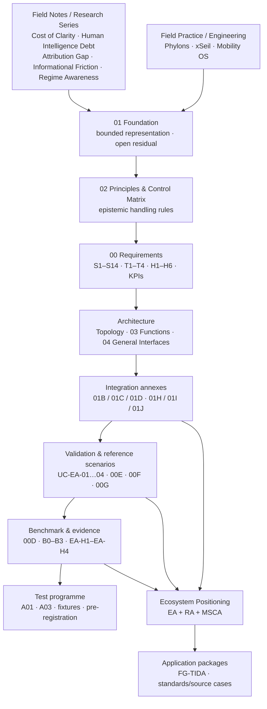
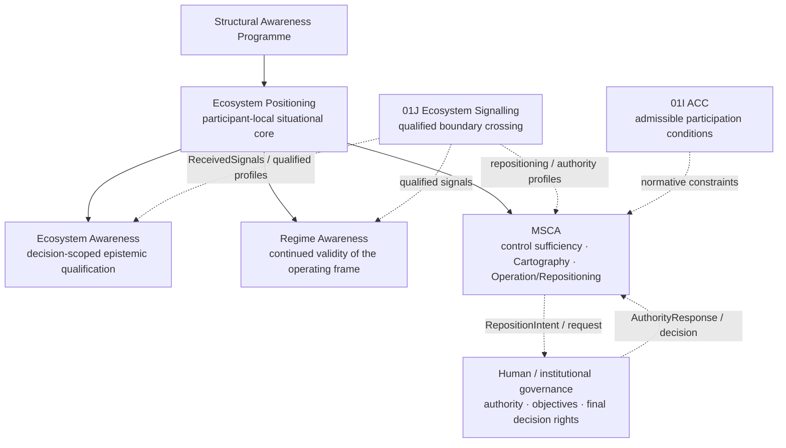
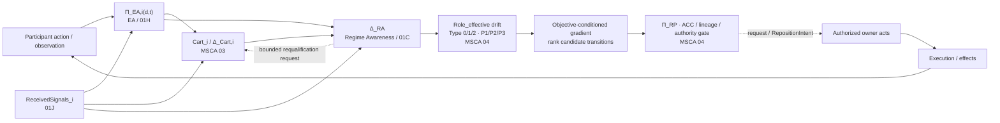
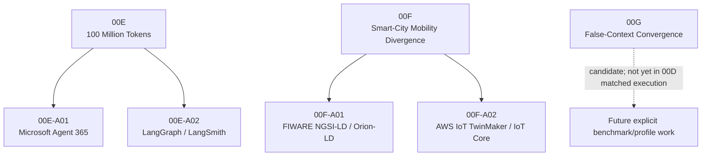
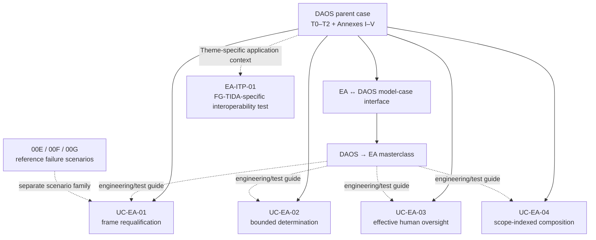
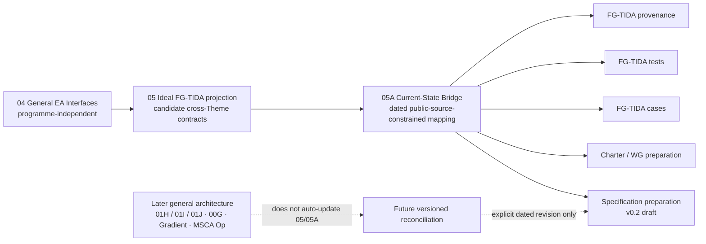
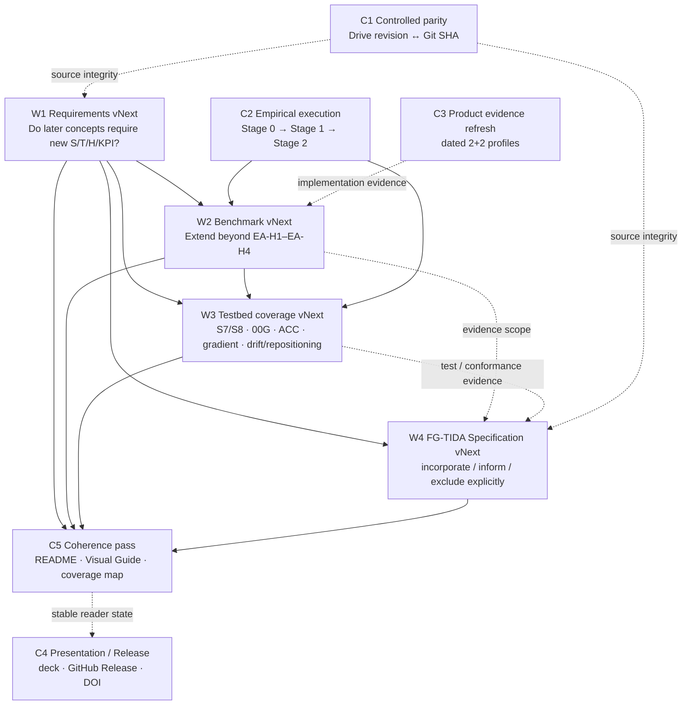
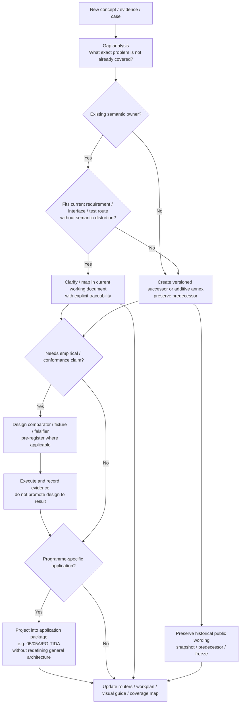

# Visual Guide — Structural / Ecosystem Awareness Corpus

> **Navigation aid — not a normative source.** This page visualizes the current public reading routes and ownership boundaries of the corpus as of 23 September 2026. The linked source documents remain authoritative for semantics, status, evidence and scope. A diagram never upgrades a working proposal, frozen source, application package or unexecuted test into validation.

## 1. How the programme accumulates

Use this map when the repository feels like many parallel documents. The programme is cumulative: later architecture and test work builds on earlier explanatory, foundational and engineering layers without deleting them.

**Read:** [Structural Awareness root](../../README.md) → [EA canonical corpus](./baseline/README.md).

---

## 2. Architectural ownership at a glance

Ecosystem Positioning composes three technical gates. It does not absorb their semantic ownership, and governance remains outside the technical components.

**Ownership rule:** signal ≠ command; opportunity ≠ permission; architecture ≠ authority.

**Read:** [Ecosystem Positioning](../../architectural-contributions/ecosystem-positioning/README.md) · [EA](./README.md) · [RA](../regime-awareness/README.md) · [MSCA](../../standards/minimum-sufficient-control/README.md).

---

## 3. Current positioning cycle

This is the current cross-corpus operating order. It shows where the major owners sit; it is not a mandatory transport protocol.

**Read:** [EP working process](../../architectural-contributions/ecosystem-positioning/README.md#working-process) · [MSCA Composition & Control](../../standards/minimum-sufficient-control/03_MSCA_ECOSYSTEM_COMPOSITION_AND_CONTROL.md) · [MSCA Operation & Repositioning](../../standards/minimum-sufficient-control/04_CANONICAL_MSCA_OPERATION_AND_REPOSITIONING.md).

---

## 4. Requirements → evidence → execution

Use this map to distinguish **requirements**, **scenario design**, **test design** and **actual evidence**.

```mermaid
flowchart LR
    F["01 Foundation"]
    P["02 Principles"]
    R["00 Requirements<br/>S1–S14 / T1–T4 / H1–H6 / KPI"]
    C["Case / scenario<br/>UC-EA · 00E · 00F · 00G"]
    Q["Quality gate / requirement route<br/>S# → T# → H# → KPI → disposition"]
    BM["00D benchmark<br/>B0–B3 · EA-H1–EA-H4"]
    TD["A01 test/oracle design"]
    PR["Pre-registration"]
    H["A03 / harness implementation"]
    S0["Stage 0<br/>deterministic verification"]
    S1["Stage 1<br/>observable comparative execution"]
    S2["Stage 2<br/>external validation"]

    F --> P --> R --> C --> Q --> BM --> TD --> PR --> H --> S0 --> S1 --> S2
```

### Current maturity boundary

| Layer | Current state |
|---|---|
| Requirements / hypotheses / KPI protocol | **Defined and versioned** |
| 00E / 00F scenarios and quality plans | **Documented** |
| 00G | **Candidate scenario; 00D integration pending** |
| B0–B3 comparison contract | **Defined** |
| A01 test/oracle construction | **Designed** |
| A03 Q1a harness design | **Designed** |
| RS-00E-Q1a pre-registration | **Published** |
| Stage-0 descriptive execution | **Pending** |
| Observable B0–B3 comparative execution | **Pending** |
| Independent validation / replication | **Pending** |

**Coverage warning:** A01/A03 are selected fixture work, not an exhaustive testbed for all S1–S14 or all later positioning layers.

---

## 5. Reference scenarios and implementation profiles

The four technology profiles are not four generic product reviews. They are scenario-specific design analyses.

**Read:** [00E](./baseline/00E_FAILURE_MODES_100M_TOKEN_COMPOUNDING_v0.1.md) · [00F](./baseline/00F_FAILURE_MODE_SMART_CITY_MOBILITY_SYSTEMIC_DIVERGENCE_v0.1.md) · [00G](./baseline/00G_FAILURE_MODE_COLLECTIVE_FALSE_CONTEXT_CONVERGENCE_v0.1.md).

---

## 6. Cases, validation profiles and FG-TIDA-specific tests

This map prevents three different artifact classes from being confused.

**Interpretation:**
- UC-EA-01…04 are **general EA Architecture-Validation Profiles**, not four FG-TIDA submissions.
- EA-ITP-01 is a **separate FG-TIDA-specific interoperability test**.
- 00E/00F/00G are **reference failure scenarios**, not DAOS annexes and not validation results.

**Read:** [Validation reading note](./baseline/VALIDATION_PROFILE_READING_NOTE.md) · [FG-TIDA cases](./fg-tida/cases/README.md) · [Portfolio coverage map](./baseline/USE_CASE_PORTFOLIO_REQUIREMENTS_COVERAGE_MAP_v0.1.md).

---

## 7. General architecture → FG-TIDA application

Use this whenever 04, 05 and 05A are easy to confuse.

**Rule:** 05A may be narrower than 05. Later general architecture does not become an FG-TIDA requirement until a dated application revision and the relevant external-owner process support it.

**Read:** [FG-TIDA package](./fg-tida/README.md) · [Interface projection](./fg-tida/interfaces/README.md) · [Specification preparation](./fg-tida/specifications/README.md).

---

## 8. Which document should I open?

| Reader question | Start here | Then continue to |
|---|---|---|
| Why can the system never treat its represented world as complete? | [01 Foundational Theory](./baseline/01_FOUNDATIONAL_THEORY_v0.5_INTEGRATED.md) | 02 Principles → Topology |
| What must any candidate solution demonstrate? | [00 Requirements](./baseline/00_CANONICAL_REQUIREMENTS_CHALLENGES_SUFFICIENCY_HYPOTHESES_KPIS.md) | 00D benchmark / coverage map |
| How does EA actually work? | [Topology](./baseline/00_CANONICAL_ARCHITECTURE_TOPOLOGY.md) | 03 Functional Architecture → 04 Interfaces |
| Where can a strong system still fail? | [00E](./baseline/00E_FAILURE_MODES_100M_TOKEN_COMPOUNDING_v0.1.md) / [00F](./baseline/00F_FAILURE_MODE_SMART_CITY_MOBILITY_SYSTEMIC_DIVERGENCE_v0.1.md) / [00G](./baseline/00G_FAILURE_MODE_COLLECTIVE_FALSE_CONTEXT_CONVERGENCE_v0.1.md) | product profiles / benchmark |
| How is the claim falsified fairly? | [00D](./baseline/00D_CANONICAL_ARCHITECTURE_BENCHMARK_AND_REFERENCE_SCENARIO_EVIDENCE_v0.2.md) | A01 → A03 → fixture/pre-registration |
| Which cases exist and what do they cover? | [Use-Case Portfolio Coverage Map](./baseline/USE_CASE_PORTFOLIO_REQUIREMENTS_COVERAGE_MAP_v0.1.md) | Validation reading note / FG-TIDA cases |
| How does EA connect to regime change? | [RA README](../regime-awareness/README.md) | 01C → 01D |
| How does control sufficiency and repositioning work? | [MSCA README](../../standards/minimum-sufficient-control/README.md) | MSCA 00 → 03 → 02 → 04 |
| How are all three gates composed? | [Ecosystem Positioning README](../../architectural-contributions/ecosystem-positioning/README.md) | Gradient Law / EA / RA / MSCA |
| What is ideal FG-TIDA versus currently defensible FG-TIDA? | [FG-TIDA interface projection](./fg-tida/interfaces/README.md) | 05 ideal → 05A current |
| Which older wording was preserved? | [Preserved Public Snapshots](../../governance/preserved-public-snapshots/README.md) | Deep / cumulative audits |

---

## 9. Status-reading rule

A visual route does not override document status:

- **Controlled / frozen** — preserved source; no silent semantic edits.
- **Canonical working** — current reader/working semantics; versioned and evolvable.
- **Integrated working successor** — current integration that does not erase the freeze.
- **Additive annex** — useful extension, not automatically core.
- **Application package** — programme-specific projection.
- **Preserved predecessor** — retained for lineage, not current semantics.

When in doubt, follow the status declaration in the source document and cite the exact Git commit read.

---

## 10. Known future visual/test extensions

The visual guide intentionally leaves these as open work rather than pretending they are already complete:

- Requirements vNext assessment for 00G / ACC / signalling / Gradient / role drift / MSCA Operation;
- benchmark extension beyond EA-H1–EA-H4;
- additional fixture/testbed coverage, including S7/S8 and later positioning layers;
- future versioned reconciliation of later architecture into FG-TIDA preparation material;
- final static SVG/PNG assets for presentations after the current Markdown/Mermaid semantics stabilize.

---

## 11. Active workfront — what is being worked on next

This map is a reader shortcut to the [Living Workplan](./WORKPLAN.md). It shows dependencies, not a rigid waterfall.

**Current first empirical milestone:** RS-00E-Q1a Stage-0 descriptive execution under operative pre-registration v0.5.

**Read:** [Living Workplan](./WORKPLAN.md).

---

## 12. How a new idea enters the corpus without deleting the past

Use this change-control map when a new concept, requirement, scenario or interface appears.

**Conservation rule:** a later clarification may change the current route, but it does not erase what an earlier dated or frozen document actually said.

**Read:** [Living Workplan](./WORKPLAN.md) · [Preserved Public Snapshots](../../governance/preserved-public-snapshots/README.md) · [Canonical Corpus Manifest](./baseline/CANONICAL_CORPUS_MANIFEST.md).

