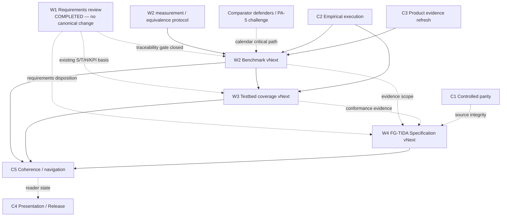

# Ecosystem Awareness / Positioning — Living Workplan

> **Status:** live control document for pending research, architecture, validation and publication work.  
> **Owner context:** Structural Awareness Programme / Ecosystem Awareness / Ecosystem Positioning.  
> **Rule:** this file records what is **not yet complete**. It is not a canonical architecture specification, benchmark result, standards claim or validation result.

## How to maintain this workplan

This is a **living queue**, not a dated backlog that accumulates forever.

When an item is completed:

1. remove it from **Active work**;
2. add one short row to **Completed work** with date, commit(s), affected artefacts and the actual outcome;
3. update any reader route or visual that materially changed;
4. preserve the predecessor/snapshot when the change supersedes a public formulation;
5. do not rewrite frozen/controlled sources merely to make them look current.

If a proposed change is reviewed and rejected, move it to **Closed / not adopted**, with the reason. If a dependency blocks execution, keep it active and mark the dependency explicitly.

## Active work — strategic vNext streams

### W2 — Benchmark vNext

**Prerequisite status:** W1 Requirements review is complete. The current requirement system remains S1–S14 / T1–T4 / H1–H6 / KPI; no S15/T5/H7/new canonical KPI was introduced. See [Requirements vNext Review & Delta v0.1 Draft](./baseline/00_REQUIREMENTS_VNEXT_REVIEW_AND_DELTA_v0.1_DRAFT.md).

**Question:** how should the matched-comparator programme extend beyond the current EA differential `EA-H1–EA-H4` without silently broadening 00D?

**Candidate layers to assess:**

- 00G false-context/signalling case;
  - latest artefact: [00G v0.3 Draft](./baseline/00G_FAILURE_MODE_COLLECTIVE_FALSE_CONTEXT_CONVERGENCE_v0.3_DRAFT.md) — preserves the v0.2 paired opaque false/genuine design and adds DBC-namespaced gates, S1 authority-applicability coverage, bidirectional DBC-C04/C06 routing and canonical KPI instrumentation; [v0.2](./baseline/00G_FAILURE_MODE_COLLECTIVE_FALSE_CONTEXT_CONVERGENCE_v0.2.md) remains the published predecessor; not yet W3-admitted or 00D-integrated;
- selective signalling/choreography;
- ACC/admissibility/lineage gates;
- Objective-Conditioned Agentic Gradient;
- effective-role drift detection;
- MSCA P1/P2/P3 posture;
- repositioning / role and contract transition;
- owner/authority-response closure.

**Required work:**

1. define the exact new hypothesis or proposition being compared;
2. decide whether B0–B3 remain suitable or require a separate comparator family;
3. hold evidence, authority, time, people, compute and access symmetric;
4. define negative results that count against the proposed layer;
5. separate architecture conformance from comparative performance;
6. preserve the current 00D claim boundary until execution exists.

**Current artefact:** [00D v0.3 Draft — Ecosystem Positioning](./baseline/00D_CANONICAL_ARCHITECTURE_BENCHMARK_v0.3_DRAFT_ECOSYSTEM_POSITIONING.md) is now the bounded Benchmark-vNext working draft. It keeps v0.2 canonical and makes adoption conditional on W1 traceability, source audits, ablation/complexity protocol and fixture admission.

**Expected output:** a Benchmark-vNext design/change proposal; no “tested” label until matched execution is actually completed.

The bounded v0.3 draft is the current implementation of that expected output; after the adoption gates close, it may become a reviewed successor proposal.


#### W2 operational order and critical path

The next W2 work is intentionally ordered so the source audit has a **stopping rule** and the strongest peers are not self-configured after the fact.

**Track A — comparator-defender search starts immediately and runs in parallel.**

- seek a named defender for **B2**;
- prioritize a named defender/challenger for **PA-5**, because PA-5 is the decisive test of the compositional differential;
- where practical, identify specialists for PA-2 / PA-3 / PA-4;
- record defender identity, allowed configuration envelope and any unresolved objection before a differential run is frozen;
- a self-configured comparator may still produce descriptive evidence, but cannot support the strongest differential claim.

**PA-5 special rule.** PA-5 should be treated as a public challenge contract, not as an internal strawman. Before execution:

1. publish the allowed PA-5 mechanism/resource envelope;
2. invite explicit challenge/improvement of the arm;
3. freeze the defended configuration before the EP run;
4. pre-register that **EP losing to PA-5 is published/reported on the same basis as an EP-supporting result**.

**Track B — complexity, burden and equivalence protocol comes before the broad source audit.**

The protocol must define, before comparator optimization:

- **outcome measures and branch-specific equivalence / non-inferiority margins**;
- **burden vector:** compute/tokens, processing or elapsed steps, messages/handoffs, bandwidth, human-review demand, external calls, privacy/disclosure burden and authority/escalation demand where material;
- **complexity surface:** semantic obligations, decision gates, interface contracts, normalized policy/profile/adapter configuration units, stateful components and cross-owner dependencies;
- **accountability / reconstructability:** reviewer steps/time, source objects consulted, reconstruction error and reviewer disagreement;
- preregistered Pareto/equivalence rules for any claim of “same result with simpler accountable composition”.

Raw lines of code/configuration are not a sufficient primary complexity measure.

**Track C — B2 / PA source audit and product capability freeze.**

After Track B defines what “strong enough”, “equal burden” and “simpler” mean:

- verify PA-1…PA-5/OR against primary literature;
- verify B2 capabilities against dated primary vendor/standard sources;
- integrate **C3 product-profile refresh into this same audit** for Microsoft Agent 365, LangGraph/LangSmith, FIWARE, AWS IoT/TwinMaker, OpenAI 00G, Claude Agent SDK 00H and Stripe Radar/merchant-control 00H trajectories;
- publish a dated **capability freeze** for every material B2/product capability used in a run.

A later vendor/framework change does **not** invalidate a frozen run. It opens a new benchmark envelope/version.

**Track D — freeze v0.3-r2 only after Tracks A–C are sufficiently closed.**

Minimum freeze inputs:

- W1 traceability already closed;
- measurement/equivalence protocol frozen;
- B2/PA capability/source audit pinned;
- PA-5 contract and defender status recorded;
- ablation/interaction protocol fixed;
- continuity admission gate defined;
- positioning-specific fixture admission path defined.


---

### W3 — Testbed coverage vNext

**Question:** which requirements and later positioning layers still lack executable fixtures, independent producer/consumer evidence or a bounded harness path?

**Known gaps / next fixture families:**

- S7 — identity and representation link;
- S8 — bounded subdelegation and non-amplification;
- the requirements-first `WB-EA-01 — Delegated Decision Integrity, Revocation and Accountable Intervention`;
- 00G signalling / false-context convergence;
  - current implementation-path draft: [00G-A01 OpenAI](./baseline/00G_A01_OPENAI_AGENTS_STACK_IMPLEMENTATION_PROFILE_v0.1_DRAFT.md), with OAI-G0 standard, OAI-G1 defended top-notch and OAI-G2 same-top-under-latent-regime-change trajectories; unexecuted;
- 00I semantic TOCTOU / stale decision-basis applicability;
  - current scenario: [00I v0.4 Draft — The Patch That Undid the Fix](./baseline/00I_FAILURE_MODE_SEMANTIC_TOCTOU_v0.4_DRAFT.md), with Q0–Q6 gates, OOTB/top-notch/frozen-top-notch-under-drift trajectories, V11 adaptive source/policy/dependency drift, positive continuity control and CAND-R4 check-to-act binding probe; not yet W3-admitted or executable;
- ACC/admissibility and lineage validation;
- gradient ranking versus permission/authority boundary;
- effective-role drift and repositioning;
- signalling + `RepositionIntent / AuthorityResponse` choreography;
- selected 00F composition branches;
- independent producer/receiver operation for EA-ITP-01.

**Pre-execution correction gate — Q1a must not execute under v0.5 as currently written.** Preserve v0.5 unchanged as frozen history and prepare a **new pre-registration v0.6** before any Stage-0 run.

v0.6 must resolve at minimum:

- distinguish **residual-field presence** from **material residual existence**; the current v0.5 combination of `R_ref = none material` and mandatory `residual.present = true` is ambiguous and can unfairly privilege B3;
- ensure B1 and B3 are evaluated against the same branch-observable envelope rather than requiring B1 to emit an EA-specific field merely because B3 does;
- distinguish **fact freeze date** from **pre-registration publication/freeze date** so the current 19/21 September wording is unambiguous;
- preserve the existing descriptive-only boundary when no comparator defender is named;
- pin trace namespaces so management condition and operational posture cannot be confused:
  - `TYPE_0_CONDITION | TYPE_1_FAILURE | TYPE_2_FAILURE | NOT_ESTABLISHED`
  - `P1_NORMAL | P2_CONTAINMENT | P3_MIGRATION`.

**Immediate execution milestone after v0.6 freezes:** publish the first **RS-00E-Q1a Stage-0 descriptive execution** under the new operative record, including the qualifier-loss instrumentation self-test and Canonical Trace v1 determinism evidence.

### Comparative admission gate — continuity first

Valid-continuity controls are an **admission gate**, not merely a later stage. Before an arm may enter a failure branch supporting a comparative claim, it must demonstrate under a matched valid-continuity branch that it does not win by:

- blanket HOLD/containment;
- unnecessary escalation;
- manufactured uncertainty/dependency warnings;
- material nominal-outcome degradation;
- unjustified burden.

Failure of the continuity gate blocks the arm from being interpreted on the corresponding failure branch until the configuration is corrected and re-frozen.

### First positioning fixtures after W2 freeze

**C9 — effective-role drift** remains a preferred first fixture, but “material drift” must be operationally frozen before observing results. The fixture should define the material role dimensions/invariants — e.g. objective, outputs, consumed inputs, intervention mechanisms, dependencies, authority lineage and ACC binding — and the exact condition under which `Role_effective ≠ Role_bound` becomes material.

**C12 — attractive inadmissible opportunity** remains a preferred paired fixture. The strong peer must have a legitimate **escalation/request path**; it cannot be artificially limited to EXECUTE-or-DROP. The comparison is whether EP improves preservation/routing of beneficial blocked opportunities, not whether only EP is permitted to ask an authority.

**00H — Batch Opportunity Beyond Authority**: the latest working artefact is [v0.5 Draft](./baseline/00H_FAILURE_MODE_BATCH_OPPORTUNITY_BEYOND_AUTHORITY_v0.5_DRAFT.md). It preserves the v0.1 scenario while cleaning causal attribution: aggregate/campaign controls remain strong-peer capabilities; the EP-BH2 comparison starts only after Q0–Q2 establish the same material/reachable-but-not-authorized state. The draft also freezes `00H-MAT-1`, a 5+2 business-day authority path, non-material/own-grant-staleness/REJECT controls, absent-vs-bypass evidence states and gate×variant coverage. v0.3 additionally freezes V14–V18 as an **Adaptive Strong-Peer Stress Family**: the peer must first pass its native/control positive tests, after which one authority-binding/campaign-membership/aggregation-key relation is changed without post-outcome recoding; the test is whether the peer requalifies the composition model itself before acting. [`v0.1`](./baseline/00H_FAILURE_MODE_BATCH_OPPORTUNITY_BEYOND_AUTHORITY_v0.1.md) remains preserved. The scenario is **not W3-admitted**; admission still requires frozen executable fixtures, expected outcomes and DBC-R# mapping.

**V19/V20 authority-laundering correction.** The next 00H stress no longer asks only whether an aggregate key becomes stale. It allows a bounded adaptive coordinator to compose **individually valid leaf grants** through legitimate routing/delegation until they share one unauthorized root objective. The U/G/I paired controls force three outcomes: prevent U, permit G, keep I independent. The quality-plan correction makes canonical S8 non-amplification plus S7/S9/S12/S13 lineage/reconstruction explicit in Q0/Q2/Q5. This is recorded as a 00H coverage/instrumentation correction; no S15/H7 is created.

**Concrete attacker freeze:** the adversarial role is the **Customer Operations Dispatcher / supervisor session** in the helpdesk/CRM layer. In the fictional Solstice operating model this layer is provided through a third-party BPO/subcontracting chain and may be operated by a remote supervisor; it routes all ordinary ticket types, with refund only one downstream outcome. It may legitimately create, route, assign and delegate ordinary individual cases, but it cannot authorize the 4,000-customer campaign and cannot forge grants, change Radar/Claude controls, alter hidden thresholds or rewrite logs. This is the reader/test fixture for v0.5.

**00H implementation trajectories / strong-peer attack:** [00H-A01 Claude](./baseline/00H_A01_CLAUDE_AGENT_SDK_IMPLEMENTATION_PROFILE_v0.4_DRAFT.md) and [00H-A02 Stripe](./baseline/00H_A02_STRIPE_RADAR_IMPLEMENTATION_PROFILE_v0.4_DRAFT.md) are the current unexecuted product-path drafts. Claude supplies the agent-runtime/pre-action-hook peer; Stripe supplies a genuinely different payment-risk/velocity peer, with the scientifically relevant strong comparator defined as **Radar + authoritative merchant pre-refund mandate/ledger control** rather than pretending Radar rules run on refund creation. Their v0.4 Draft successors are dated 24 Sep 2026 and align through V19/V20 and the U/G/I authority-lineage stress; both remain subject to capability/source refresh before any run.

**00I — Semantic TOCTOU / The Patch That Undid the Fix:** [v0.3 Draft](./baseline/00I_FAILURE_MODE_SEMANTIC_TOCTOU_v0.4_DRAFT.md) is now the working DBC-C02 scenario, with [v0.1](./baseline/00I_FAILURE_MODE_SEMANTIC_TOCTOU_v0.1.md) preserved. Its W3 purpose is narrower than 00H: freeze a queued remediation, introduce a later legitimate repair/freeze/version change, then test whether a competent technical scheduler and a strong peer requalify the decision basis at time of use. Q0–Q5 are traced to the frozen Requirements; Q6 is a CAND-R4 clarification probe, not a new S/T/H. W3 admission requires a frozen machine-readable fixture, deterministic oracle, arm configuration, DBC-R# mapping, continuity branch and trace schema before execution. The first concrete implementation trajectory is [00I-A01 AWS Step Functions / RDS](./baseline/00I_A01_AWS_STEP_FUNCTIONS_RDS_IMPLEMENTATION_PROFILE_v0.2_DRAFT.md), which freezes an ordinary route, a defended top-notch route and that same top route under latent regime/source/dependency drift; its companion `fixtures/00I-AWS/` package now exposes inspectable ASL skeletons, D1 fixture and trace contract.

**EA0 quality-plan baseline:** 00H v0.5 now includes one standard requirements-conforming EA route—not a post-hoc strengthened arm. EA0 implements the existing S1/S7/S8/S9/S12/S13/S14 surfaces plus T2/T3/T4 and is expected, at the deterministic fixture level, to block/recontract U, permit qualified G and keep I independent without an extra scenario-only gate. A future executable failure despite full compliance would reopen Requirements-vNext.

**Route separation.** 00H is parallel to the FG-TIDA UC-6 → UC-4 route: 00H is an EA/DBC-owned synthetic C12/DBC-C05 scenario, while UC-6 → UC-4 is the current cross-Theme semantic-review and executable-profile path using externally owned FG-TIDA case facts. They may inform each other but are not sequential stages of one experiment.

**Current cross-theme convergence — UC-6 → UC-4.** The 23 September public #13/#16 discussion now provides a bounded path that can proceed without waiting for the full C9/C12 programme: use UC-6 as the semantic reference, annotate the Theme #13 and Theme #16 interfaces against the same frozen facts, obtain contributor review, then import the reviewed mapping into Nelson's UC-4 as a versioned executable profile with mapping, fixtures, traces and report. This route is tracked through the [Decision Boundary Challenge v0.2](./DECISION_BOUNDARY_CHALLENGE_v0.2.md) and the [FG-TIDA Decision Boundary Evaluation Profile](./fg-tida/tests/FG_TIDA_DECISION_BOUNDARY_EVALUATION_PROFILE_v0.1_DRAFT.md). It is a conformance/test route, not evidence that DBC has been adopted by FG-TIDA.

**Coverage rule:** A01/A03 and Q1a are selected test artefacts. Their existence does not imply complete testbed coverage of S1–S14 or later Ecosystem Positioning.

**Expected outputs:** admitted fixtures, pre-registrations, executable harnesses where appropriate, traces/results and explicit coverage-map updates.

---

### W4 — FG-TIDA Specification vNext

**Question:** which developments after Specification Preparation v0.3 should be incorporated into a future FG-TIDA preparation revision, which should be mapped only as informative dependencies, and which should remain outside FG-TIDA?

**Delta review must include:**

- 01H participant-local positioning;
- 01I ACC and current canonical ACC lineage profile;
- 01J current signalling/choreography;
- 00G;
- Objective-Conditioned Agentic Gradient;
- Ecosystem Cartography;
- Canonical MSCA Operation & Repositioning;
- updated Requirements vNext disposition, if any;
- Benchmark/Testbed vNext changes, if any;
- Decision Boundary Challenge v0.2 and its FG-TIDA test/conformance projection;
- the UC-6 → UC-4 executable-profile route emerging from the 23 September #13/#16 discussion.

**For every item choose one:**

- candidate normative material;
- informative architecture context;
- conformance/test-only material;
- external-owner dependency;
- explicitly out of scope.

**Keep the application boundary:**  
`04 general EA interface → 05 ideal FG-TIDA projection → 05A dated current-state bridge → specification/charter/cases/tests/provenance`.

05/05A are not silently rewritten merely because the general architecture evolves.

**Parallel participation rule:** W4 institutional/editorial participation does **not** wait for v0.3-r2. Continue source mapping, editor/working-group participation and non-normative dependency preparation in parallel. What remains blocked is **normative promotion of untested Benchmark-vNext hypotheses/results** into FG-TIDA requirements.

**Current artefact:** [Specification Preparation v0.3 Draft](./fg-tida/specifications/EA_FG_TIDA_SPECIFICATION_PREPARATION_v0.3_DRAFT.md) now carries the Decision Boundary / cross-Theme evaluation route as **T — test/conformance only**, linked bidirectionally to the general DBC and the FG-TIDA test profile.

**Expected output:** a versioned Specification Preparation successor and, where justified, dated 05A/current-source updates. Nothing becomes an FG-TIDA requirement without the appropriate external-owner process.

---

## Recommended operational order

The current recommended sequence is:

1. **Start comparator-defender search now** — B2 and especially PA-5; run in parallel with technical work.
2. **Freeze W2 measurement / complexity / burden / equivalence protocol.**
3. **Prepare and freeze Q1a pre-registration v0.6**; only then execute Q1a Stage-0.
4. **Run B2 + PA-1…PA-5 source audit with C3 product capability freeze integrated.**
5. **Freeze Benchmark v0.3-r2** with defender status, source pins, margins and ablation protocol.
6. **Apply continuity admission gate** to comparative arms.
7. **Build C9 and C12 fixtures** with material-drift and legitimate-escalation conditions fixed in advance.
8. **Run comparative execution.**
9. **Continue W4 participation/mapping in parallel**, but do not promote untested benchmark claims into normative requirements.

This order is intended to prevent unbounded comparator search, self-authored weak peers and fixtures whose result is determined by asymmetric specification rather than architecture.

---

## Active work — cross-cutting control tracks

### C1 — Controlled-corpus parity and canonical materialization

Still open in the Canonical Corpus Manifest:

- verify pinned Google Drive revision ↔ public Git SHA-256 parity for controlled/frozen material;
- produce the missing verification inventory;
- decide/materialize intended single-file canonical v0.4 paths where appropriate;
- keep historical split parts and preserved snapshots available;
- do not describe the public mirror as exact/complete until the verification conditions are met.

**Completion evidence:** generated inventory + verified checks + manifest update.

---

### C2 — Empirical execution ladder

Design is ahead of execution. The evidence ladder must remain explicit:

```text
design → pre-registration → Stage 0 deterministic verification
      → Stage 1 observable matched execution
      → Stage 2 independent validation / replication
```

**Current first gate:** RS-00E-Q1a Stage 0.  
**Do not skip:** a design profile, harness specification or pre-registration is not an executed result.

---

### C3 — Product-profile evidence refresh / B2 capability freeze

**Dependency:** this is now an explicit input to W2 Track C, not an independent later refresh.

The maintained 2+2 profiles are dated design analyses:

- 00E → Microsoft Agent 365;
- 00E → LangGraph/LangSmith;
- 00F → FIWARE NGSI-LD / Orion-LD;
- 00F → AWS IoT TwinMaker / IoT Core.

**24 September 2026 source-basis re-audit:** completed for all four maintained profiles. Microsoft claims are now pinned to dated Microsoft Learn pages; LangGraph is pinned to the latest release preceding the original 17 September freeze and living docs carry an explicit access date; FIWARE separates ETSI NGSI-LD V1.9.1 from Orion-LD 1.12.0 and its own conformance statement; AWS rolling service docs carry an explicit 24 September access cut-off and the TwinMaker safety boundary is preserved. This closes the immediate presentation-source hygiene gap for the 2+2 set, but does **not** close W2 Track C: the broader B2/PA capability audit, defender configuration and benchmark capability freeze remain pending.

For each future refresh, record whether each material assertion is:

- directly supported by dated public product documentation;
- deployment/configuration dependent;
- an inference by the EA authors.

The Canonical Corpus Manifest currently carries a **18 December 2026** review date for the product-profile source-basis review.

Do not infer a Microsoft/Mobility profile, or any other cross-scenario profile, from the existing 2+2 set; create an explicit new profile if such work is needed.

For a benchmark run, record a dated capability/source freeze. Later provider changes open a new profile/benchmark envelope; they do not retroactively invalidate a correctly frozen earlier run.

---

### C4 — Presentation and publication finalization

**PowerPoint/PDF:** still a separate finalization wave. Remaining presentation items are controlled in the governance backlog and should be resolved before replacing the stable canonical PPTX/PDF pair together.

**Release/DOI:** publication is approved in principle but externally blocked until a real GitHub Release / Zenodo path is available. Do not fabricate DOI metadata.

This track is publication control, not research validation.

---

### C5 — Post-vNext coherence and navigation pass

After any W1–W4 change:

- update the relevant README/router;
- update [VISUAL_GUIDE.md](./VISUAL_GUIDE.md) if the reader topology changed;
- update the coverage map if test/requirement coverage changed;
- update status cards/continuity notes where necessary;
- preserve superseded public wording instead of silently deleting it;
- re-run relative-link checks;
- verify that the change does not transfer ownership among EA, RA, MSCA, ACC, signalling or governance.

This is a maintenance gate, not a reason to rewrite older snapshots.

---

## Deliberate review queue — lower urgency

These are real review items but should not interrupt W1–W4 unless they become dependencies:

| Item | Why review it | Current stance |
|---|---|---|
| Baseline / FG-TIDA compatibility duplicates | Reduce storage ambiguity without losing source/freeze provenance | Keep both until a safe physical-home decision is justified |
| MSCA 04 physical section order | The semantic runtime order is already correct; editorial section order could later mirror it | Optional editorial change only |
| Visual/static asset refresh | Current GitHub diagrams are live Mermaid; older SVG/PNG pack was verified at commit `4093bc6` | Refresh static assets when preparing final deck/PDF, not as a competing semantic source |
| New scenario/profile candidates | New domains may be useful, but domain novelty alone is not a reason to duplicate a case | Admit only if they add a new requirement/evidence/owner combination |
| Requirements clarification CAND-R1 | Make `Role_bound ↔ Role_effective` visibility explicit if a future Requirements edition needs it | Clarification candidate only; current S7/S10/S12/S13 coverage is sufficient for now |
| Requirements clarification CAND-R2 | Make `opportunity ≠ admissibility ≠ authority ≠ execution` visually explicit | Clarification candidate only; current S1/S2/S8/S11/S14 + T2/T3/T4 already carry the semantics |

---

## Workstream dependencies



**Interpretation:** W1 is now a closed review gate: later EP concepts were mapped to the existing requirement system without creating a new canonical Requirements version. The remaining arrows are practical dependencies, not a rigid project-management waterfall. Stage-0 execution continues against the pinned requirement/pre-registration versions actually cited.

---

## Current maturity / gap matrix

| Area | Current usable state | Main gap | Next controlled artefact |
|---|---|---|---|
| Foundation / principles | v0.4 sources preserved; 01 v0.5 integrated reader; 02 controlled | Later architecture is not retrofitted into frozen sources | Continuity notes + future explicit successor only if needed |
| Requirements | S1–S14 / T1–T4 / H1–H6 / KPI protocol | Later EP concepts reviewed; no canonical gap requiring S15/T5/H7 found | [Requirements vNext Review & Delta](./baseline/00_REQUIREMENTS_VNEXT_REVIEW_AND_DELTA_v0.1_DRAFT.md); two clarification candidates remain non-canonical |
| Reference scenarios | 00E + 00F full quality plans; 00G candidate | 00G and later positioning surfaces not integrated into the main comparator programme | W1/W2 disposition |
| Benchmark | 00D v0.2 canonical + bounded v0.3 draft | Measurement/equivalence protocol, defenders, B2/PA source audit and PA-5 contract still open | **W2:** protocol → defenders/source freeze → v0.3-r2 |
| Test design | A01, A02, A03, coverage map, Q1a pre-registration and trace helpers | Q1a v0.5 residual/date ambiguity must be corrected in new v0.6 before Stage-0; later layers still incomplete | **W3:** Q1a v0.6 → Stage-0 → continuity gate → C9/C12 |
| Validation profiles | UC-EA-01…04 + EA-ITP-01 preserved | No completed broad independent validation | Stage 1/2 evidence programme |
| RA / MSCA integration | Current interfaces and operation owners defined | Comparative/empirical validation of later composition/repositioning remains open | W2/W3 |
| FG-TIDA application | 05 ideal, 05A dated current bridge, spec v0.3, charter/cases/tests + Decision Boundary profile | External-owner review and first UC-6 → UC-4 executable profile still open | **W4 / W3 cross-theme conformance route** |
| Controlled provenance | Freeze manifests + public source preservation | Revision/SHA parity and single-file materialization open | **C1 parity inventory** |
| Product profiles | 2+2 dated design analyses | Dated capability freeze must be integrated with B2 audit | **C3 / W2 Track C** |
| Publication | Live corpus + visual guide + release candidate | Final deck/PDF; real release/DOI tooling | **C4** |

---

## Completed work

This table should remain short. Detailed historical maintenance records live under `governance/`.

| Date | Completed item | Evidence |
|---|---|---|
| 2026-09-23 | Conservation audit and preserved public snapshots | `governance/CORPUS_INFORMATION_CONSERVATION_AUDIT_2026-09-23.md` + preserved snapshots |
| 2026-09-23 | Deep corpus inventory / no-loss audit | `governance/DEEP_CORPUS_AUDIT_2026-09-23.md` |
| 2026-09-23 | Cumulative integration/continuity notes | `governance/CUMULATIVE_INTEGRATION_AUDIT_2026-09-23.md` |
| 2026-09-23 | Readability priorities A/B/C | `governance/NEXT_REVIEW_BACKLOG_2026-09-23.md` |
| 2026-09-23 | Live cross-corpus visual navigation | [VISUAL_GUIDE.md](./VISUAL_GUIDE.md) |
| 2026-09-23 | W1 Requirements review completed — no canonical requirement change | [Requirements vNext Review & Delta v0.1 Draft](./baseline/00_REQUIREMENTS_VNEXT_REVIEW_AND_DELTA_v0.1_DRAFT.md); benchmark traceability applied in 00D v0.3 draft |
| 2026-09-23 | Decision Boundary Challenge v0.2 + FG-TIDA cross-theme test/specification route | [DBC v0.2](./DECISION_BOUNDARY_CHALLENGE_v0.2.md) · [FG-TIDA test profile](./fg-tida/tests/FG_TIDA_DECISION_BOUNDARY_EVALUATION_PROFILE_v0.1_DRAFT.md) · [Specification Preparation v0.3](./fg-tida/specifications/EA_FG_TIDA_SPECIFICATION_PREPARATION_v0.3_DRAFT.md) |

---

## Closed / not adopted

None recorded yet.

---

## Control rule for future agents/editors

Before adding a new canonical document or modifying a current one, answer four questions:

1. **What exact gap is not already covered?**
2. **Which existing document owns the semantics?**
3. **Is this a successor, additive annex, test artefact or application projection?**
4. **What older public text must remain preserved after the change?**

If those four answers are not explicit, the change should remain a draft/change proposal rather than being merged into the canonical route.
