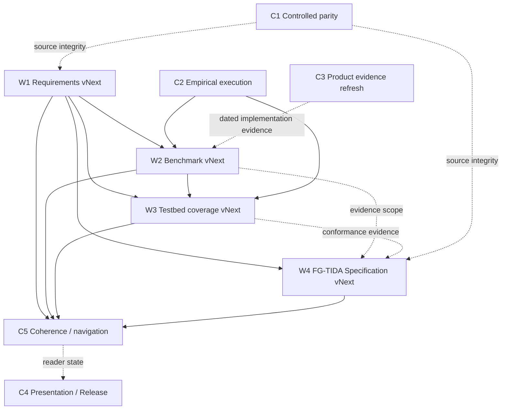

# Ecosystem Awareness / Positioning — Living Workplan

> **Status:** live control document for pending research, architecture, validation and publication work.  
> **Owner context:** Structural Awareness Programme / Ecosystem Awareness / Ecosystem Positioning.  
> **Rule:** this file records what is **not yet complete**. It is not a canonical architecture specification, benchmark result, standards claim or validation result.

## How to maintain this workplan

This is a **living queue**, not a dated backlog that accumulates forever.

When an item is completed:

1. remove it from **Active work**;
2. add one short row to **Completed work** with date, commit(s), affected artefacts and the actual outcome;
3. update any reader route or visual that materially changed;
4. preserve the predecessor/snapshot when the change supersedes a public formulation;
5. do not rewrite frozen/controlled sources merely to make them look current.

If a proposed change is reviewed and rejected, move it to **Closed / not adopted**, with the reason. If a dependency blocks execution, keep it active and mark the dependency explicitly.

## Active work — strategic vNext streams

### W1 — Requirements vNext

**Question:** do later developments require genuinely new requirements, or are they already representable inside the current `S1–S14 / T1–T4 / H1–H6 / KPI` system?

**Later developments to audit at minimum:**

- 00G collective false-context convergence;
- participant-local Ecosystem Positioning / 01H;
- Agentic Citizenship Contract, lineage and admissibility / 01I + canonical ACC profile;
- ecosystem signalling and choreography / 01J;
- Objective-Conditioned Agentic Gradient;
- Ecosystem Cartography `Cart_i / Δ_Cart,i`;
- effective-role drift;
- Type 0/1/2 catalogue as used operationally before repositioning closure;
- P1/P2/P3 operational posture;
- Canonical MSCA Operation & Repositioning;
- `RepositionIntent / AuthorityResponse` and owner-action boundary.

**Required method:** build a delta table before editing the canonical requirements:

| Later concept | Existing S/T/H/KPI coverage | Missing behaviour / evidence | Disposition |
|---|---|---|---|
| Concept under review | Exact current route | Exact gap, if any | Existing mapping / clarify wording / new S# / new T# / new H# / new KPI / out of scope |

**Decision gate:** do **not** create S15+, T5+, H7+ or new KPI families merely because a later document uses new vocabulary. A new requirement is justified only when the behaviour/evidence cannot be expressed without semantic distortion in the current system.

**Current review artefact:** [Requirements vNext Review & Delta v0.1 Draft](./baseline/00_REQUIREMENTS_VNEXT_REVIEW_AND_DELTA_v0.1_DRAFT.md). Its current W1 determination is **no new S15/T5/H7/KPI family**: later concepts are predominantly existing mappings, component conformance or benchmark-specific measures. Two future clarification candidates remain open: `Role_bound ↔ Role_effective` visibility, and explicit opportunity/admissibility/authority/execution separation.

**Expected output:** only if a later review identifies a genuine solution-requirement gap, prepare a versioned Requirements-vNext change proposal. The current canonical requirements remain unchanged.

**Must preserve:** current tests and pre-registrations remain interpretable against the requirement version/commit they cite.

---

### W2 — Benchmark vNext

**Question:** how should the matched-comparator programme extend beyond the current EA differential `EA-H1–EA-H4` without silently broadening 00D?

**Candidate layers to assess:**

- 00G false-context/signalling case;
- selective signalling/choreography;
- ACC/admissibility/lineage gates;
- Objective-Conditioned Agentic Gradient;
- effective-role drift detection;
- MSCA P1/P2/P3 posture;
- repositioning / role and contract transition;
- owner/authority-response closure.

**Required work:**

1. define the exact new hypothesis or proposition being compared;
2. decide whether B0–B3 remain suitable or require a separate comparator family;
3. hold evidence, authority, time, people, compute and access symmetric;
4. define negative results that count against the proposed layer;
5. separate architecture conformance from comparative performance;
6. preserve the current 00D claim boundary until execution exists.

**Current artefact:** [00D v0.3 Draft — Ecosystem Positioning](./baseline/00D_CANONICAL_ARCHITECTURE_BENCHMARK_v0.3_DRAFT_ECOSYSTEM_POSITIONING.md) is now the bounded Benchmark-vNext working draft. It keeps v0.2 canonical and makes adoption conditional on W1 traceability, source audits, ablation/complexity protocol and fixture admission.

**Expected output:** a Benchmark-vNext design/change proposal; no “tested” label until matched execution is actually completed.

The bounded v0.3 draft is the current implementation of that expected output; after the adoption gates close, it may become a reviewed successor proposal.

---

### W3 — Testbed coverage vNext

**Question:** which requirements and later positioning layers still lack executable fixtures, independent producer/consumer evidence or a bounded harness path?

**Known gaps / next fixture families:**

- S7 — identity and representation link;
- S8 — bounded subdelegation and non-amplification;
- the requirements-first `WB-EA-01 — Delegated Decision Integrity, Revocation and Accountable Intervention`;
- 00G signalling / false-context convergence;
- ACC/admissibility and lineage validation;
- gradient ranking versus permission/authority boundary;
- effective-role drift and repositioning;
- signalling + `RepositionIntent / AuthorityResponse` choreography;
- selected 00F composition branches;
- independent producer/receiver operation for EA-ITP-01.

**Immediate execution milestone:** publish the first **RS-00E-Q1a Stage-0 descriptive execution** under operative pre-registration v0.5, including the qualifier-loss instrumentation self-test and Canonical Trace v1 determinism evidence.

**Coverage rule:** A01/A03 and Q1a are selected test artefacts. Their existence does not imply complete testbed coverage of S1–S14 or later Ecosystem Positioning.

**Expected outputs:** admitted fixtures, pre-registrations, executable harnesses where appropriate, traces/results and explicit coverage-map updates.

---

### W4 — FG-TIDA Specification vNext

**Question:** which developments after Specification Preparation v0.2 should be incorporated into a future FG-TIDA preparation revision, which should be mapped only as informative dependencies, and which should remain outside FG-TIDA?

**Delta review must include:**

- 01H participant-local positioning;
- 01I ACC and current canonical ACC lineage profile;
- 01J current signalling/choreography;
- 00G;
- Objective-Conditioned Agentic Gradient;
- Ecosystem Cartography;
- Canonical MSCA Operation & Repositioning;
- updated Requirements vNext disposition, if any;
- Benchmark/Testbed vNext changes, if any.

**For every item choose one:**

- candidate normative material;
- informative architecture context;
- conformance/test-only material;
- external-owner dependency;
- explicitly out of scope.

**Keep the application boundary:**  
`04 general EA interface → 05 ideal FG-TIDA projection → 05A dated current-state bridge → specification/charter/cases/tests/provenance`.

05/05A are not silently rewritten merely because the general architecture evolves.

**Expected output:** a versioned Specification Preparation successor and, where justified, dated 05A/current-source updates. Nothing becomes an FG-TIDA requirement without the appropriate external-owner process.

---

## Active work — cross-cutting control tracks

### C1 — Controlled-corpus parity and canonical materialization

Still open in the Canonical Corpus Manifest:

- verify pinned Google Drive revision ↔ public Git SHA-256 parity for controlled/frozen material;
- produce the missing verification inventory;
- decide/materialize intended single-file canonical v0.4 paths where appropriate;
- keep historical split parts and preserved snapshots available;
- do not describe the public mirror as exact/complete until the verification conditions are met.

**Completion evidence:** generated inventory + verified checks + manifest update.

---

### C2 — Empirical execution ladder

Design is ahead of execution. The evidence ladder must remain explicit:

```text
design → pre-registration → Stage 0 deterministic verification
      → Stage 1 observable matched execution
      → Stage 2 independent validation / replication
```

**Current first gate:** RS-00E-Q1a Stage 0.  
**Do not skip:** a design profile, harness specification or pre-registration is not an executed result.

---

### C3 — Product-profile evidence refresh

The maintained 2+2 profiles are dated design analyses:

- 00E → Microsoft Agent 365;
- 00E → LangGraph/LangSmith;
- 00F → FIWARE NGSI-LD / Orion-LD;
- 00F → AWS IoT TwinMaker / IoT Core.

For each future refresh, record whether each material assertion is:

- directly supported by dated public product documentation;
- deployment/configuration dependent;
- an inference by the EA authors.

The Canonical Corpus Manifest currently carries a **18 December 2026** review date for the product-profile source-basis review.

Do not infer a Microsoft/Mobility profile, or any other cross-scenario profile, from the existing 2+2 set; create an explicit new profile if such work is needed.

---

### C4 — Presentation and publication finalization

**PowerPoint/PDF:** still a separate finalization wave. Remaining presentation items are controlled in the governance backlog and should be resolved before replacing the stable canonical PPTX/PDF pair together.

**Release/DOI:** publication is approved in principle but externally blocked until a real GitHub Release / Zenodo path is available. Do not fabricate DOI metadata.

This track is publication control, not research validation.

---

### C5 — Post-vNext coherence and navigation pass

After any W1–W4 change:

- update the relevant README/router;
- update [VISUAL_GUIDE.md](./VISUAL_GUIDE.md) if the reader topology changed;
- update the coverage map if test/requirement coverage changed;
- update status cards/continuity notes where necessary;
- preserve superseded public wording instead of silently deleting it;
- re-run relative-link checks;
- verify that the change does not transfer ownership among EA, RA, MSCA, ACC, signalling or governance.

This is a maintenance gate, not a reason to rewrite older snapshots.

---

## Deliberate review queue — lower urgency

These are real review items but should not interrupt W1–W4 unless they become dependencies:

| Item | Why review it | Current stance |
|---|---|---|
| Baseline / FG-TIDA compatibility duplicates | Reduce storage ambiguity without losing source/freeze provenance | Keep both until a safe physical-home decision is justified |
| MSCA 04 physical section order | The semantic runtime order is already correct; editorial section order could later mirror it | Optional editorial change only |
| Visual/static asset refresh | Current GitHub diagrams are live Mermaid; older SVG/PNG pack was verified at commit `4093bc6` | Refresh static assets when preparing final deck/PDF, not as a competing semantic source |
| New scenario/profile candidates | New domains may be useful, but domain novelty alone is not a reason to duplicate a case | Admit only if they add a new requirement/evidence/owner combination |

---

## Workstream dependencies



**Interpretation:** the arrows are practical dependencies, not a rigid project-management waterfall. For example, Stage-0 execution can proceed while Requirements-vNext analysis is underway **only against the already pinned requirement/pre-registration versions**.

---

## Current maturity / gap matrix

| Area | Current usable state | Main gap | Next controlled artefact |
|---|---|---|---|
| Foundation / principles | v0.4 sources preserved; 01 v0.5 integrated reader; 02 controlled | Later architecture is not retrofitted into frozen sources | Continuity notes + future explicit successor only if needed |
| Requirements | S1–S14 / T1–T4 / H1–H6 / KPI protocol | Later Positioning/ACC/signalling/MSCA-operation coverage not yet dispositioned | **W1 Requirements-vNext delta** |
| Reference scenarios | 00E + 00F full quality plans; 00G candidate | 00G and later positioning surfaces not integrated into the main comparator programme | W1/W2 disposition |
| Benchmark | 00D B0–B3 / EA-H1–EA-H4 | Does not cover all later Positioning layers | **W2 Benchmark-vNext** |
| Test design | A01, A02, A03, coverage map, Q1a pre-registration and trace helpers | Selected fixtures only; S7/S8 + later layers incomplete | **W3 Testbed-vNext + Stage-0 execution** |
| Validation profiles | UC-EA-01…04 + EA-ITP-01 preserved | No completed broad independent validation | Stage 1/2 evidence programme |
| RA / MSCA integration | Current interfaces and operation owners defined | Comparative/empirical validation of later composition/repositioning remains open | W2/W3 |
| FG-TIDA application | 05 ideal, 05A dated current bridge, spec v0.2, charter/cases/tests | Later general architecture not reconciled | **W4 Specification-vNext** |
| Controlled provenance | Freeze manifests + public source preservation | Revision/SHA parity and single-file materialization open | **C1 parity inventory** |
| Product profiles | 2+2 dated design analyses | Source refresh and future product evolution | **C3 evidence refresh** |
| Publication | Live corpus + visual guide + release candidate | Final deck/PDF; real release/DOI tooling | **C4** |

---

## Completed work

This table should remain short. Detailed historical maintenance records live under `governance/`.

| Date | Completed item | Evidence |
|---|---|---|
| 2026-09-23 | Conservation audit and preserved public snapshots | `governance/CORPUS_INFORMATION_CONSERVATION_AUDIT_2026-09-23.md` + preserved snapshots |
| 2026-09-23 | Deep corpus inventory / no-loss audit | `governance/DEEP_CORPUS_AUDIT_2026-09-23.md` |
| 2026-09-23 | Cumulative integration/continuity notes | `governance/CUMULATIVE_INTEGRATION_AUDIT_2026-09-23.md` |
| 2026-09-23 | Readability priorities A/B/C | `governance/NEXT_REVIEW_BACKLOG_2026-09-23.md` |
| 2026-09-23 | Live cross-corpus visual navigation | [VISUAL_GUIDE.md](./VISUAL_GUIDE.md) |

---

## Closed / not adopted

None recorded yet.

---

## Control rule for future agents/editors

Before adding a new canonical document or modifying a current one, answer four questions:

1. **What exact gap is not already covered?**
2. **Which existing document owns the semantics?**
3. **Is this a successor, additive annex, test artefact or application projection?**
4. **What older public text must remain preserved after the change?**

If those four answers are not explicit, the change should remain a draft/change proposal rather than being merged into the canonical route.
