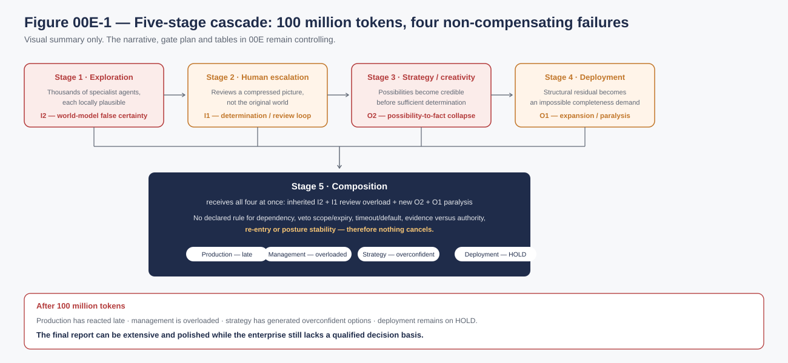
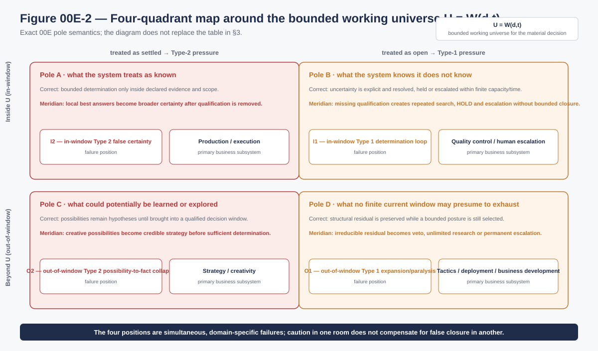
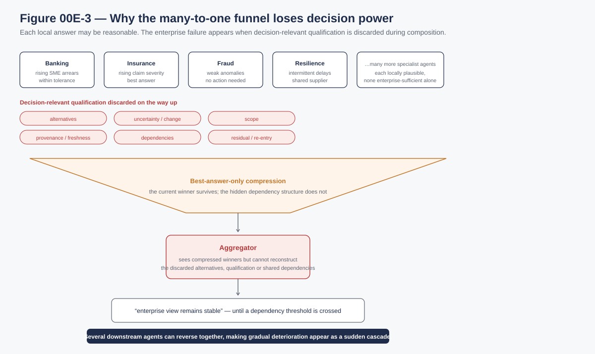
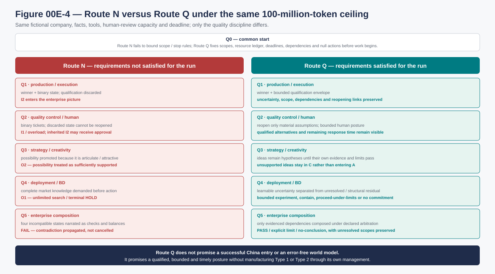

# Reference Failure Scenario and Quality-Gate Plan: 100 Million Tokens and Compounded Epistemic Collapse

| | |
|---|---|
| **ID** | 00E |
| **Type** | Reference failure scenario (fictional) and quality-gate plan |
| **Status** | Canonical working · fictional reference scenario · not a benchmark result |
| **Version · date** | v0.1 · 2026-09-17 |
| **Current working revision** | 2026-09-24 · external-corroboration and implementation-profile synchronization; scenario facts and canonical S/T/H ownership unchanged |
| **Owner corpus** | Ecosystem Awareness |
| **Supersedes / superseded by** | — |

> **Worked reference scenario, mechanism reconstruction and integrated quality plan.** This document reconstructs the existing 100-million-token enterprise-strategy example as a testable failure route and then controls the same case through quality gates. It does not add a benchmark result, establish that EA prevents the failure, or make the source example a claim about any real company.

**Source case:** [02 — Worked example: 100 million tokens and compounded epistemic collapse](./02_EPISTEMIC_SAFETY_PRINCIPLES_CONTROL_MATRIX_v0.4.part02.md#worked-example--100-million-tokens-and-compounded-epistemic-collapse-in-enterprise-strategy). The source text remains the controlling five-stage narrative. This document keeps those stages and adds the explicit route from scope to challenge, sufficiently-good condition, hypothesis, KPI and observable failure.

**Product-implementation annexes:** [00E-A01 — Microsoft Agent 365 implementation profile](./00E_A01_MICROSOFT_AGENT_365_IMPLEMENTATION_PROFILE_v0.2_DRAFT.md) and [00E-A02 — LangGraph/LangSmith implementation profile](./00E_A02_LANGGRAPH_LANGSMITH_IMPLEMENTATION_PROFILE_v0.2_DRAFT.md) separate documented platform capabilities, implementation-dependent mitigation and the additional EA controls needed to execute Q0–Q5, including excellent implementations stressed by a latent regime change. They are not product benchmarks or negative product assessments.

**Technology-evidence freeze for presentation use:** the Microsoft Agent 365 and LangGraph/LangSmith annexes are dated design analyses, not rolling vendor descriptions. Their source bases were re-audited on **24 September 2026**. Microsoft capability claims are pinned to the relevant Microsoft Learn page update dates; LangGraph/LangSmith claims use live documentation retrieved on the freeze date plus release anchors (**LangGraph 1.2.12, 21 Sep 2026; LangSmith SDK v0.14.0, 21 Sep 2026**). Where a living page exposes no revision date, the annex records the review/access date explicitly. The scenario remains fictional and vendor-neutral; presentation claims about named technologies should cite the dated annex source basis and must not imply capabilities beyond that freeze.

**Companion requirements and bidirectional traceability:** [00 — Canonical Requirements: Challenges, Sufficiency Conditions, Hypotheses and KPIs](./00_CANONICAL_REQUIREMENTS_CHALLENGES_SUFFICIENCY_HYPOTHESES_KPIS.md). The requirements document defines the terms used below; this scenario is a concrete source of failure mechanisms and quality-plan pressure for the selected routes. Its Q0–Q5 gates make the same route inspectable as `scope → S# → T# → H# → KPI → disposition`. It does not redefine the canonical requirements or create another challenge set.

**Benchmark and plausibility evidence:** [00D — Canonical Architecture Benchmark and Reference-Scenario Evidence](./00D_CANONICAL_ARCHITECTURE_BENCHMARK_AND_REFERENCE_SCENARIO_EVIDENCE_v0.2.md) maps this scenario to formal, experimental and officially investigated analogues, with explicit limits. It does not recast the fictional token total as an observed incident.

**Publication integrity route:** the published 00E unit consists of this canonical scenario plus its two technology-specific implementation annexes, [00E-A01 — Microsoft Agent 365](./00E_A01_MICROSOFT_AGENT_365_IMPLEMENTATION_PROFILE_v0.2_DRAFT.md) and [00E-A02 — LangGraph/LangSmith](./00E_A02_LANGGRAPH_LANGSMITH_IMPLEMENTATION_PROFILE_v0.2_DRAFT.md). The **main 00E document itself** contains the preserved five-stage case, Meridian reconstruction, four-quadrant/funnel analysis, the integrated Q0–Q5 quality plan, deterministic gate trace, Route N/Route Q comparison, recording form and §9A external-corroboration addendum. The annexes retain the product-specific standard/top/regime-change implementation trajectories and their synchronized quality-plan overlays. This split is editorial, not substantive: the annexes do not replace any part of the scenario or quality plan.

## 1. Preserved source case: the exact five-stage story

This is the concrete case. It is a stylised **enterprise-strategy system**, not xSeil, a named company or a historical event. The narrative below is retained from the controlling source before the analysis and quality plan are applied.

Consider an enterprise strategy system that spends 100 million tokens across large numbers of specialized agents, management approvals, alternative-generation agents and market-risk agents. The system can execute many individually reasonable architectural patterns and still produce a worse epistemic position through composition.

### Stage 1 — Wide exploration with Type 2 collapse

The system launches thousands of exploration agents across markets, customers, competitors, technologies, regulations and internal operations. The agents are specialized and therefore cover different portions of the world. Each agent finds locally plausible evidence, produces a conclusion and passes a compressed result to an aggregator.

Because the agents are sectioned across different scopes, their numerical diversity does not imply independent opinions about the same claims. If uncertainty, window boundaries, exclusions and unresolved alternatives are progressively removed during aggregation, the resulting enterprise world model can look highly comprehensive while containing Type 2 overconfidence across many distinct domains.

The sectioning can also omit the interactions **between** those domains. A regulation × product, fraud × identity-provider or claims × macroeconomic dependency may belong to no specialist's declared window. That cross-domain coupling is not corrected by better work inside either section; it must be represented as a material dependency or remain an explicit gap at composition.

The failure is not lack of exploration. The system may have explored an enormous space. The failure is that broad coverage has been composed as broad certainty.

### Stage 2 — Human escalation layered on the collapsed world model

The architecture then applies a strong human-oversight policy. Exceptions, KPI choices, strategic thresholds and ambiguous decisions are repeatedly escalated to management.

This appears to add caution, but the human is not observing the original world. Management receives the system’s selected and compressed representation of it. If Stage 1 has already produced Type 2 collapse, the human is being asked to approve or reject decisions inside a Type 2 world model.

At the same time, repeated escalation can exceed human attention capacity. Two branches must remain separate. If management repeatedly defers, requests missing material or remains in HOLD without a bounded escape, the oversight channel creates Type 1. If a manager accepts or rejects merely because the workflow, timeout or queue must advance, the channel creates Type 2 closure unless new qualifying evidence supports that decision.

The two errors do not cancel. Human hesitation does not restore the missing epistemic qualification of the upstream evidence, and human approval does not retroactively validate the upstream model. An approval may be valid authorization while remaining zero new evidence about the world represented. The composed state can therefore be inherited Type 2 in the represented world plus Type 1 in the oversight channel, or a Type-1 queue forced into a new Type-2 closure.

### Stage 3 — Alternative-generation and brainstorming over different domains

After detecting poor KPIs or strategic tension, the system launches creative agents to search for alternatives: new products, operating models, markets, partnerships or business models.

These agents are intentionally oriented toward Pole C — what could potentially be known or explored. That specialization can be valuable. The failure appears when potentially knowable possibilities are not brought through sufficient determination before being promoted into strategic options with implicit credibility.

The creativity function may therefore generate another Type 2 condition, but in a different domain. Two components are distinguished: inherited Type 2 from the compressed premises supplied by Stage 1, and a new local O2 failure when the strategy function itself promotes an unevaluated possibility into a sufficiently supported option. The alternatives are not correcting the original market-model error; they can propagate it and add speculative certainty about a new possibility space.

### Stage 4 — Structural-residual aversion in another part of the architecture

A separate risk or market-entry function may be strongly oriented toward Pole D — what cannot be fully known. For example, an agent assessing entry into China may correctly recognize that important regulatory, competitive, political, distribution and execution conditions cannot be fully known before actual entry.

If that residual awareness is over-weighted, the agent can turn structural uncertainty into Type 1 out-of-window paralysis: because complete determination is impossible, the proposed market is treated as too uncertain to enter or is repeatedly escalated for more evidence. The analysis must first separate residual that no current finite window can eliminate from uncertainty that can be reduced by an authorised reversible action—a pilot, staged entry or limited partnership. Action can be an observation instrument; refusing every bounded experiment can misclassify learnable C-state as permanent D-state.

This can happen while the alternative-generation agents elsewhere are accepting much weaker speculative possibilities. The architecture is therefore not conservative or aggressive in any coherent global sense. It is simultaneously overconfident in some domains, over-escalated in others, over-creative in others and over-paralyzed by structural residual in others.

### Stage 5 — Multiple epistemic collapse through composition

The final strategy function receives:

- a broad enterprise world model carrying Type 2 certainty collapse from distributed exploration;
- management decisions produced under Type 1 attention overload and based on that collapsed world model;
- creative alternatives carrying a different Type 2 bias from Pole-C overextension;
- market or competitor assessments carrying Type 1 residual paralysis from Pole-D overextension.

These are not balancing forces. They are multiple coupled imbalances attached to different parts of the decision space.

Their enterprise effect depends on an arbitration rule. A risk gate may give a scoped Type-1 veto precedence and end in HOLD; a commercial deadline or default may force that HOLD into Type-2 commitment; a human signature may be misread as evidence; or missing hysteresis may alternate the result between containment and continuation. The failure is therefore not that Type 1 and Type 2 numerically cancel or that one always dominates. It is that the composition function lacks a qualified rule for dependency, veto scope and expiry, timeout/default, evidence versus authority, re-entry and posture stability.

A final synthesis can therefore be extremely articulate, extensively researched and computationally expensive while remaining epistemically malformed. The system may have consumed 100 million tokens without ever requalifying the specific domains in which the upstream errors originated.

The architectural lesson is:

- More computation does not imply more determination.
- More observation does not imply better risk management when its marginal value is lower than its cost or when it depletes scarce human/compute capacity.
- More agents do not imply more independent viewpoints.
- More human approvals do not imply correction of the world model presented to humans.
- More creativity does not imply that possibilities have become determined.
- More recognition of structural residual does not justify paralysis.

  

*Figure 00E-1. Five-stage cascade. The four failure positions accumulate through composition; none is treated as cancelling another. Visual aid only — the source narrative and gate plan remain controlling.*

## 2. Executive case-study sheet: one company, one technology stack, four failures

### 2.1 The company and its decision

**Meridian Financial Group** is a fictional diversified banking and insurance group. Its board authorises an agentic programme with a total ceiling of 100 million model-and-retrieval tokens to improve operations and identify a new growth route. The strategic question is whether the group can reuse what it has learned in normal operations to launch a new digital insurance and SME-finance proposition, potentially through a partner-led entry into China.

The fixture uses a concrete but vendor-neutral technology stack:

- specialist LLM agents with retrieval over banking, claims, fraud, supplier, regulatory, CRM and incident data;
- a workflow/orchestration graph that sends one agent's output to the next;
- a data lake, document/vector retrieval layer and event bus;
- aggregators that produce structured recommendations and binary status fields;
- a human escalation queue for risk and quality control;
- separate strategy/creativity and deployment/business-development agent groups.

The problem is not the use of agents. The failure begins when the orchestration interface retains only each worker's selected answer and discards the qualification needed by later decisions.

### 2.2 What happens, in plain business language

1. **Production and execution appear efficient.** Banking agents see slightly rising SME arrears; insurance agents see a small increase in claim severity; fraud agents see weak anomalies; operational-resilience agents see intermittent delays from a shared data supplier. Each local agent selects its most likely explanation and reports “within tolerance” or an equivalent best answer. Its second and third explanations, uncertainty range, source dependence and change in uncertainty are not sent upward.
2. **The funnel silences a gradual change.** Every local answer is plausible by itself. The aggregator receives only the winners, not the fact that several weak signals may share one dependency. The enterprise view remains “stable” until a threshold is crossed. At that point several downstream agents reverse together, so a gradual deterioration appears to management as a sudden cascade.
   Interactions between sections can disappear completely: no banking, insurance, fraud or resilience worker owns the combined proposition connecting regulation, portfolio risk, a shared identity-data provider and operational capacity.
3. **Quality control escalates without the missing context.** Control agents repeatedly ask humans to approve, reject or investigate binary tickets. When a manager asks why the system is unsure, the lower-level alternatives and uncertainty history are no longer recoverable from the handoff. Some cases remain on HOLD while people request data that the pipeline discarded; in other cases the manager accepts “safe” because every upstream message says “safe.” The channel therefore creates primary in-window Type 1 and can reproduce the inherited Type 2.
4. **Strategy treats possibilities as credible options.** Using the compressed execution picture, creative agents propose new products, partnerships and a China market entry. Many ideas are articulate and internally coherent. Because the creativity function is rewarded for option generation, potentially knowable possibilities are promoted as if they were already sufficiently determined.
5. **Deployment tries to eliminate the irreducible.** Business-development and market-entry agents try to make licensing, data localisation, partner reliability, distribution economics, political change and competitor response perfectly clear before acting. Some of those conditions cannot be exhaustively known before entry. The system keeps researching, escalating and revising instead of selecting a bounded experiment, a qualified no-go or another authorised posture.
6. **The budget is exhausted without a qualified decision.** After consuming the 100-million-token envelope, production has reacted late, management is overloaded, strategy has generated overconfident options and deployment is still on HOLD. The final report is extensive and polished, but the company cannot say which proposition is sufficiently supported, which is explicitly unresolved, what residual must be accepted, or what bounded action remains possible.

The terminal failure is therefore not “the model gave one bad answer.” It is **organisational atrophy produced by four non-compensating epistemic biases in one composed agentic system**.

## 3. The four-quadrant map

Let `U = W(d,t)` be the bounded working universe selected for a material decision at time `t`. Let `Ω` denote the open decision-relevant ecosystem class. `Ω` is not assumed closed, exhaustively enumerable or reducible to a set subtraction. The outside-of-window residual is therefore represented operationally, not claimed as `Ω − U`.

| Location and pole | Correct structural condition | Mismanagement in Meridian | Failure label | Primary business subsystem |
| --- | --- | --- | --- | --- |
| **Inside U, Pole A:** what the system treats as known | A bounded determination may be used only inside its declared evidence and scope | Local best answers are aggregated as broader certainty after uncertainty and alternatives are removed | **I2 — in-window Type 2 false certainty** | Production / execution |
| **Inside U, Pole B:** what the system knows it does not know | Uncertainty is explicit and is resolved, held or escalated within finite capacity and time | Missing qualification generates repeated search, HOLD and human escalation with no legitimate bounded closure | **I1 — in-window Type 1 determination loop** | Quality control / human escalation |
| **Beyond U, Pole C:** what could potentially be learned or explored | Possibilities remain hypotheses until they are brought into a qualified decision window | Creative possibilities are promoted into credible strategy before sufficient determination | **O2 — out-of-window Type 2 possibility-to-fact collapse** | Strategy / creativity |
| **Beyond U, Pole D:** what no finite current window may presume to exhaust | Structural residual is preserved while a bounded posture is still selected | Irreducible residual becomes a veto, unlimited research programme or permanent escalation | **O1 — out-of-window Type 1 expansion/paralysis** | Tactics / deployment / business development |

  

*Figure 00E-2. Four-quadrant map around the bounded working universe `U = W(d,t)`. The figure reproduces the §3 pole semantics and failure labels; the table remains controlling.*

Type 0 remains a foundational distinction. A limit may be structurally established for the admitted problem class or may be infeasible within a declared frame, resources and horizon; persistent non-resolution alone proves neither. No finite window can guarantee exhaustive knowledge of the ecosystem. The runtime may therefore leave the state explicitly unresolved and bound its response without diagnosing Type 0. Meridian creates Type 1 or Type 2 only when it mismanages those limits.

The four labels are primary failure positions. The human stage also **inherits and may reproduce** upstream I2 when a manager accepts a binary “safe” answer. That secondary effect does not convert the four-mode map into five modes: the control channel's own failure is I1, and the false certainty remains traceable to the I2 representation it received.

### 3.1 Operational and hybrid patterns remain Type 1 or Type 2

| Observable pattern | Type-1 path | Type-2 path | Required control evidence |
| --- | --- | --- | --- |
| **Defensive `UNKNOWN`** | An agent protects itself by transferring responsibility and creating repeated HOLD/escalation. | A reviewer, timeout or default suppresses the unresolved state and forces approval/rejection. | materiality, reason, issuer incentive, affected scope, owner, expiry and bounded escape. |
| **Qualifier saturation** | Duplicated, stale or immaterial qualifiers consume reviewer capacity and block closure. | Receivers become habituated, ignore all qualifiers and accept a closure as clean. | material-qualifier retention, duplication/expiry, review burden and qualification-loss rate. |
| **Injected doubt** | False freshness/dependency/uncertainty signals produce unnecessary containment or search. | Repeated false alarms are ignored, including a later valid material warning. | adversarial branch, false-containment cost, rejection/recovery time and later-warning response. |
| **Oscillation** | Repeated reopening produces HOLD/search without bounded progress. | A timeout/default repeatedly forces unsupported continuation between reopenings. | transition reason, new-evidence test, dwell time, hysteresis/equivalent control and transition count. |
| **False convergence / cascade** | Later contradiction reopens a common closure into a system-wide search or escalation surge. | Correlated or imitated binary outputs converge prematurely; dependent conclusions then reverse together. | source dependence, false-convergence rate, cascade latency/reach and re-entry recoverability. |

These are failure mechanisms and trajectories, not Types 3–7. The same run may move between Type 1 and Type 2, but each transition must be recorded rather than describing the whole architecture as one undifferentiated personality.

## 4. Why the many-to-one funnel loses decision power

### 4.1 The exact failure mechanism

For worker `i`, let `X_i` be its evidence, alternatives, uncertainty, dependencies and local reasoning state. The best-answer-only interface emits `Z_i = f_i(X_i)`, for example:

`{recommended_answer: "within tolerance", status: PASS}`.

If multiple materially different `X_i` states produce the same `Z_i`, the mapping is many-to-one. The receiver cannot reconstruct which source state occurred unless the interface or an independently retrievable record preserves the missing distinctions. Repeating the operation through a hierarchy creates a Markov-style processing chain:

`Q ← X₀ → Z₁ → Z₂ → ... → Zₙ`,

where `Q` is a later decision-relevant state. Under the data-processing inequality, processing cannot increase mutual information about `Q`:

`I(Q; Zₙ) ≤ I(Q; Zₙ₋₁) ≤ ... ≤ I(Q; X₀)`.

The inequality alone does **not** show that every shorter message is harmful. Equality is possible when `Z_i` is a sufficient statistic for the later decision: `I(Q; X_i | Z_i) = 0`. Meridian's fault is testable precisely because the dropped alternatives, dependence, uncertainty movement, freshness and scope can change the later control, strategy and deployment decisions. If they do, the summary was not sufficient for those decisions.

  

*Figure 00E-3. Many-to-one funnel. Locally plausible answers can become enterprise-insufficient when alternatives, uncertainty, scope, provenance/freshness, dependencies, residual and re-entry information are dropped during handoff.*

### 4.2 Why the failure appears late and then cascades

Local uncertainty is not merely “low confidence.” It may be changing, correlated with another weak signal, or conditional on a source whose validity is degrading. When each worker passes only its current winner:

- small uncertainty changes remain below local binary thresholds and disappear from the enterprise record;
- shared dependencies look like independent confirmation;
- later agents repeatedly reuse an already compressed closure;
- no receiver sees the trajectory that would justify earlier requalification;
- once a local threshold finally flips, several dependent conclusions can reverse together.

The apparent sudden event is therefore compatible with a gradual upstream change. The architecture has filtered the leading uncertainty and retained only the late threshold crossing. This is a causal hypothesis for the fixture, not a theorem that every hierarchical system will cascade.

### 4.3 Same-compute comparison: what may and may not be claimed

The controlled comparison uses the same facts, models, tools, 100-million-token ceiling, human-review capacity and decision deadline.

| Configuration | Inter-agent boundary | What the next agent can do | Structural comparison |
| --- | --- | --- | --- |
| **Funnel F — best answer only** | winner plus binary state; prior alternatives and qualification are discarded | continue from the selected answer or restart expensive research | cannot recover distinctions removed by a non-invertible handoff without new side information |
| **Envelope E — bounded qualification** | the same winner plus decision-relevant alternatives, uncertainty/change, scope, provenance/freshness, dependencies, residual, owner and re-entry link | use the winner, inspect qualification, reopen the material assumption or preserve UNKNOWN | contains F's decision message plus bounded fields; the receiver may ignore them, but F cannot reconstruct them |

If both messages fit inside an already fixed downstream budget, Envelope E's available information weakly contains Funnel F's because E includes F's answer and additional qualified fields. This does not prove lower business loss. With a fixed **total** token budget, the envelope has transmission and review cost, so the experiment must reserve that cost ex ante and may need to spend fewer tokens on redundant local search. H3, H4 and H6 are supported only if E reduces hidden residual or false closure while meeting latency, burden and outcome criteria under the matched envelope.

The claim is therefore narrower and stronger than “more context is better”:

- best-answer-only recursive compression is structurally less recoverable unless its output is sufficient for every material downstream decision;
- carrying the full internal trace is neither required nor automatically useful;
- the candidate must preserve a **bounded decision-relevant envelope** and demonstrate its value against its latency, bandwidth, privacy, disclosure and review costs;
- a large unstructured context can itself fail to make relevant information usable.

### 4.4 Technical evidence boundary

The following primary sources motivate the test design; none proves that this fictional company will suffer the stated loss:

1. Claude E. Shannon, *A Mathematical Theory of Communication* (1948), foundation for entropy, information and lossy communication: https://doi.org/10.1002/j.1538-7305.1948.tb01338.x
2. Naftali Tishby, Fernando C. Pereira and William Bialek, *The Information Bottleneck Method* (2000), formalising compression that preserves information relevant to a target variable: https://arxiv.org/abs/physics/0004057
3. Nelson F. Liu et al., *Lost in the Middle: How Language Models Use Long Contexts* (TACL 2024), showing that availability of long context does not guarantee robust use of relevant information: https://doi.org/10.1162/tacl_a_00638
4. Qiwei Zhao et al., *SAUP: Situation Awareness Uncertainty Propagation on LLM Agent* (2024 preprint), evaluating step-wise rather than final-only uncertainty in multi-step agents: https://arxiv.org/abs/2412.01033
5. Xu Shen et al., *Understanding the Information Propagation Effects of Communication Topologies in LLM-based Multi-Agent Systems* (2025 preprint), reporting that communication topology affects propagation of both correct and erroneous information and that neither maximal density nor maximal sparsity is universally optimal: https://arxiv.org/abs/2505.23352

## 5. Failure-mode reconstruction by subsystem

### 5.1 FM-I2 — production/execution compresses qualified local work into false certainty

**Business operation.** Specialist agents work in banking, insurance, fraud and operational resilience. Each optimises a local task and sends its selected answer into a hierarchical funnel. The answer is often locally reasonable; the failure lies in the handoff.

**Lost state.** The second and third explanations, uncertainty range and movement, source overlap, exceptions, evidence age, local scope and reopening condition remain below the handoff boundary. The enterprise aggregator therefore observes many conclusions but not the qualifications that made those conclusions local.

**Concrete example.** The banking worker attributes rising arrears to seasonality; the insurance worker attributes claim severity to portfolio mix; the fraud worker treats anomalies as noise; the resilience worker treats supplier delay as transient. All use the same third-party economic or identity data dependency, but that correlation is not transmitted. “Four agents agree operations are stable” is therefore not four independent confirmations.

**Failure.** Production creates I2: a broad A-level closure from locally bounded answers. The system loses early-warning depth, reacts after threshold crossing and can cascade when several conclusions reverse together.

**Requirement route.** S5, S6, S11 and S14 require T1, T2 and T4 as applicable. H2, H3, H4 and H6 are tested through residual-scope preservation, inherited-indeterminacy detection, source diversity/retrievability, correlated-evidence error, compression exposure, handoff integrity, qualification-loss rate, retained decision-relevant fields, decision-relevant evidence yield and total decision burden.

### 5.2 FM-I1 — quality control and human escalation loop on an impoverished representation

**Business operation.** Control agents check policy thresholds and route exceptions to risk managers. They inherit the production funnel's binary conclusions and have access to the same compressed interface rather than the qualified lower-level state.

**Primary Type 1 path.** A control agent or manager sees a missing fact and requests it. Because the handoff discarded the relevant uncertainty history or alternative, the system searches again, escalates again or remains on HOLD. Human capacity is treated as indefinitely available determination capacity. The loop consumes the useful response window without creating a legitimate bounded closure.

**Secondary Type 2 reproduction.** Other tickets arrive as “safe” because every upstream node selected “safe.” Without the missing context, a manager may rationally accept the presented answer. The approval does not create new evidence; it propagates the upstream I2 under a human signature.

**Failure.** The control subsystem's own mode is I1—over-HOLD, repeated escalation and capacity exhaustion. It can also pass through the I2 it inherited. Caution in this channel does not restore the information lost in production, and approval does not validate it.

**Requirement route.** S4, S5, S12 and S14 require T2, T3 and T4, with T1 where a material break must be detected. H1, H4 and H6 are tested through explicit-indeterminate rate, time in HELD/unresolved state, human-capacity binding/escalation demand, handoff integrity, qualification-loss rate, targeted re-entry precision/recall, qualified-posture correctness, remaining response margin, false-continuation rate and total decision burden.

### 5.3 FM-O2 — strategy/creativity converts possible futures into credible strategy

**Business operation.** Strategy agents do not invent from nothing. They receive the production and control outputs, combine them with market material, and generate products, operating models, partnerships and market options.

**Concrete example.** The agents infer from the apparently stable banking and insurance picture that Meridian can export its underwriting capability, partner with a Chinese platform and launch a digital SME insurance/credit product. They produce many coherent variants and supporting narratives.

**Failure.** Option generation is valuable, but the system rewards possibility and fluency without maintaining the line between “worth investigating” and “sufficiently supported for this decision.” Pole C is promoted into A. This is O2: out-of-window Type 2 possibility-to-fact collapse. It is a different scope from production I2 and cannot repair it.

**Requirement route.** S2, S10, S11 and S14 require T1, T2 and T4, plus T3 if an option triggers action. H1, H2, H3 and H6 are tested through local determinacy margin, residual-scope preservation, wrong-domain/systemic-closure rate, owner/version/scope/dependency preservation, correlated-evidence error, decision-relevant evidence yield, qualified-posture correctness and authorized-response compliance.

### 5.4 FM-O1 — tactics/deployment treats structural residual as an instruction never to close

**Business operation.** Deployment and business-development agents receive the strategy options and investigate licensing, data localisation, partner reliability, distribution, regulatory change, competitor response, unit economics and operational execution.

**Concrete example.** “China may be attractive” becomes “do not proceed until the Chinese market is completely understood.” Every research pass exposes another legitimate unknown. Because the system has no bounded observation-expansion rule, no accepted residual and no authorised experiment/no-go criterion, new unknowns generate more search rather than a decision posture.

**Failure.** Pole D is correct that no finite pre-entry analysis can exhaust the ecosystem. The error is converting that structural residual into an unlimited veto. The department consumes tokens, reviews and management time, ends on HOLD, and finally reports that execution is impossible because complete information is unavailable. This is O1: out-of-window Type 1 expansion/paralysis.

**Requirement route.** S3, S4, S5, S10 and S14 require T1, T2, T3 and T4. H1, H5 and H6 are tested through material-break recall/precision, time in HELD/unresolved state, freshness/staleness, requalification latency, decision-relevant evidence yield, remaining response margin, false-containment rate, qualified-posture correctness, authorized-response compliance and total decision burden. H5 is used only in a controlled churn/validity branch.

## 6. The complete cascade and why nothing cancels

| Sequence | What enters | What the subsystem does | What leaves | Failure carried forward |
| --- | --- | --- | --- | --- |
| 1. Production | operational evidence and weak cross-domain signals | selects the locally best answer and drops alternatives/uncertainty | apparently stable binary conclusions | I2: scope and uncertainty compression |
| 2. Quality control | binary production conclusions and exceptions | escalates repeatedly or asks humans to decide without reconstructable context | HOLD loops, approvals and rejected tickets | I1 capacity loss plus possible reproduction of inherited I2 |
| 3. Strategy | compressed operating picture and management dispositions | generates many attractive growth options | China/partnership/product options with implicit credibility | O2: possibilities promoted before determination |
| 4. Deployment | promoted options and an instruction to validate them | attempts to remove every residual before action | more searches, reviews and unresolved conditions | O1: structural residual becomes paralysis |
| 5. Synthesis | all four subsystem outputs | treats caution, creativity and approvals as if they balanced the production failure | polished report and terminal HOLD after the budget is spent | compounded, non-fungible epistemic collapse |

Non-fungibility is decisive:

- I1 caution in control does not restore I2 information discarded in production.
- O2 creativity does not requalify the execution assumptions from which it began.
- O1 caution in deployment does not validate O2 options or correct I2 production.
- A human signature does not turn a compressed conclusion into independent evidence.
- Extra tokens in one scope do not compensate for a failed condition in another scope.

The relevant scopes are separate material subject–proposition–decision boundaries: `σ(d_prod,t)`, `σ(d_control,t)`, `σ(d_strategy,t)` and `σ(d_deploy,t)`. The final enterprise scope `σ(d_enterprise,t)` may compose them only through explicit dependencies and fresh requalification. It may not average their error labels.

## 7. Integrated quality plan

### 7.1 Meaning of the requirements-conforming candidate (`Route Q`) in this test

`Route Q` does not name a finished EA product, vendor implementation or proven market capability. In this quality plan it means only **a candidate architecture that follows the foundation principles and satisfies the applicable canonical S1–S14, T1–T4, H1–H6 and KPI tests for each declared scope**.

The controlled routes are therefore:

- **Route N — requirements not satisfied:** the same company and technology stack reproduce the four failures.
- **Route Q — requirements satisfied for the run:** the candidate preserves scope, residual, non-fungibility and bounded requalification sufficiently to reach a qualified posture.

Route Q may carry Type 0 limits and may legitimately end in no commitment. It must not manufacture Type 1 through unbounded inquiry/escalation or Type 2 through false closure. The comparison does not establish that EA already exists as an operational product or that any named architecture universally prevents failure.

### 7.2 Frozen test conditions

Before either route runs, the assessor freezes:

- the facts, source snapshots and controlled update stream;
- the model families, tools and action library;
- the total 100-million-token/compute ceiling, bandwidth and storage allowance;
- human-review roles, capacity and useful response deadlines;
- the four subsystem scopes and final enterprise decision;
- branch oracles, materiality thresholds and missing-data treatment;
- each KPI numerator, denominator, threshold and observable outcome;
- the null action and any authorised bounded experiment, containment or no-commitment posture.

The envelope route must pay for its additional handoff fields inside the same total resource ceiling. The funnel route must record the cost of repeated research, escalation and reconstruction rather than treating it as free.

### 7.3 Gate rule

There are four substantive gates, one for each subsystem. A framing control precedes them and a composition control follows them; neither creates an additional epistemic quadrant.

A gate may emit:

- `PASS`;
- `PASS WITH EXPLICIT LIMIT`—optionally carrying a Type-0 marker only when its structural or declared-frame basis is established;
- `REQUALIFY`;
- `HOLD/CONTAIN` within a declared deadline and owner;
- `ESCALATE` to an available authorised owner within a declared deadline;
- `NO COMMITMENT`.

A material gate may not emit `PASS` when a required field or KPI is missing, when the receiving owner cannot act in time, or when a Type 1/Type 2 condition is being averaged against another scope. Continuation after such a result is recorded only as deliberate failure injection in Route N.

### 7.4 Gate register and full requirement route

| Control/gate | Business decision | Canonical route | KPI evidence required for this fixture | Route Q exit | Route N breach |
| --- | --- | --- | --- | --- | --- |
| **Q0 — frame and allocate** | May the 100-million-token programme begin, and for which decisions? | S14 → T1, T4 → H6; H5 only in a controlled churn branch | declared `σ(d,t)` and `W(d,t)` per subsystem; window breadth/freshness; baseline burden; response margin; stop/expansion rule | bounded scopes, budgets, dependencies, deadlines and null actions are fixed | “more research” is authorised without a decision boundary or stop rule |
| **Q1 — production/execution (I2 control)** | May each local result enter the enterprise operating picture? | S5, S6, S11, S14 → T1, T2, T4 → H2, H3, H4, H6 | residual-scope preservation; inherited-indeterminacy detection; source diversity/retrievability; correlated-evidence error; compression exposure; handoff integrity; qualification-loss; retained fields; evidence yield; burden | winner and bounded qualification travel together; correlated/uncertain claims remain explicit; material assumptions can be reopened | best answer and binary state advance after alternatives, uncertainty, dependency, freshness or scope are discarded |
| **Q2 — quality control/human oversight (I1/I2 transition control)** | Can the authorised owner decide or intervene usefully without treating authorization as evidence? | S4, S5, S12, S14 → T1 where needed, T2, T3, T4 → H1, H4, H6 | explicit-indeterminate rate; HELD time; escalation demand/capacity; Type-1→Type-2 forced closure; Type-2→Type-1 reopened loop; defensive-UNKNOWN effect; handoff integrity; qualification loss; targeted re-entry; posture correctness; false continuation; response margin; burden | the owner receives a reconstructable qualified basis and selects a bounded posture before the deadline; approval remains distinct from evidentiary requalification | binary tickets loop, humans are repeatedly queried, missing context cannot be recovered, or queue pressure/approval is treated as new evidence and forces closure |
| **Q3 — strategy/creativity (O2 control)** | May a generated possibility become a strategic option? | S2, S10, S11, S14 → T1, T2, T4 and T3 if action follows → H1, H2, H3, H6 | local determinacy margin; residual preservation; wrong-domain closure; owner/version/scope/dependency preservation; correlated-evidence error; evidence yield; posture correctness; response compliance | an idea remains C until the evidence threshold, hard limits and decision relevance for its own scope are met | fluency, novelty or option count is treated as sufficient credibility, or the option is used to compensate for Q1/Q2 failure |
| **Q4 — tactics/deployment/BD (O1 control)** | What bounded posture is justified despite structural residual, and what can be learned safely by acting? | S3, S4, S5, S10, S14 → T1, T2, T3, T4 → H1, H5, H6 | material-break recall/precision; HELD time; freshness; requalification latency; evidence yield; response margin; false containment; posture correctness; response compliance; experiment information gain; burden | choose an authorised experiment, proceed-under-limits, requalify, contain, escalate or no commitment before expiry; distinguish learnable C from retained D | every new unknown triggers more search; complete market knowledge is required; a safe learning action is ignored; capacity expires and HOLD becomes permanent |
| **Q5 — enterprise composition and arbitration** | May Meridian issue a final strategy, and which scoped result may govern? | S9, S11, S12, S14 → T1, T2, T4 and T3 for any non-null default/action → H1, H2, H3, H4, H6 | common outcome vector; dependency/coupling map; false convergence; incompatible-posture exposure; Type-1↔Type-2 transitions; posture oscillation; veto owner/scope/expiry; timeout/default; evidence-versus-authority role; re-entry; handoff integrity; deadline; outcome; burden | every material dependency is qualified; hard constraints and legitimate scoped vetoes apply only within scope/expiry; no unresolved material gate is averaged away; the result is PASS, PASS WITH EXPLICIT LIMIT or explicit no-conclusion | I2, I1, O2 and O1 are narrated as balance; a signature becomes evidence; an expired veto blocks indefinitely; or deadline/default silently forces unsupported closure |

The canonical chain is read in order for the **same scope**: challenge S# → sufficiently-good condition T# → falsifiable expectation H# → KPI evidence → gate disposition. A KPI pass alone does not solve a challenge; the complete T# condition, its required fields and the applicable outcome evidence must also hold.

### 7.5 Deterministic gate logic: KPI result → disposition → failure if bypassed

The plan is deterministic as a **quality-control flow**, not as a prediction that every company will suffer the same commercial loss. Once the fixture has frozen the scope, oracle, threshold, deadline, capacity and missing-data rule, the same evidence must produce the same gate disposition.

Each mandatory KPI has one of four states:

- `PASS`: measured against the declared branch oracle and threshold, and the threshold is met;
- `FAIL`: measured, but the threshold is not met;
- `UNKNOWN`: the KPI cannot be calculated because evidence, denominator or oracle is missing;
- `N/A`: declared in advance as not applicable to that branch, with a reason. `N/A` cannot be assigned retrospectively to remove a failure.

The gate algorithm is:

1. If a mandatory field or KPI is `UNKNOWN`, the gate cannot emit `PASS`; it emits `REQUALIFY`, a bounded `HOLD/ESCALATE`, or `NO COMMITMENT` according to remaining authority, capacity and time.
2. If any mandatory KPI is `FAIL`, the linked T# condition is insufficient for that scope and the gate cannot emit `PASS`.
3. If all mandatory KPIs pass but a non-metric part of the linked T# condition is absent—for example, no legitimate owner or no authorised response—the gate still cannot emit `PASS`.
4. `PASS WITH EXPLICIT LIMIT` preserves unresolved or residual state without requiring the runtime to prove Type 0. A Type-0 marker may be added only when its structural or declared-frame basis is explicit; otherwise the state remains unresolved. In either case, the selected posture must remain bounded, authorised and timely.
5. A failed gate returns to the named re-entry point or terminates in a qualified non-advance. If the workflow advances anyway, the advance is a recorded bypass and injects the named Type 1 or Type 2 failure into the next scope.
6. Q5 cannot pass unless every materially dependent upstream gate is `PASS` or `PASS WITH EXPLICIT LIMIT`. A good result in another scope never changes a failed gate.
7. Q5 applies the predeclared arbitration record in this order: material dependency and hard constraint; legitimate veto owner, scope and expiry; qualified bounded response; timeout/default treatment; targeted re-entry; and posture-stability rule. Human approval may authorize an action but is not new evidence about the upstream model. No Type-1 veto persists beyond its authority/expiry, and no timeout converts uncertainty to Type-2 closure silently.
8. A posture reversal without new material evidence, expiry or changed authority fails the anti-oscillation rule and cannot be counted as successful adaptation.

| Gate and KPI failure | Mandatory disposition in Route Q | What happens only if the disposition is bypassed | Introduced/propagated failure |
| --- | --- | --- | --- |
| **Q0:** scope/window, baseline burden, deadline, capacity or stop rule is missing/UNKNOWN | do not start; complete the frame or issue `NO COMMITMENT` | work begins without a criterion for relevance or completion | precondition for unbounded expenditure and late response |
| **Q1:** residual-scope preservation, inherited-indeterminacy detection, handoff integrity or retained-fields KPI fails | `REQUALIFY` the local result; reopen the exact worker/source; do not admit the claim to the enterprise picture | the selected answer advances without the qualification needed downstream | **I2:** local answer becomes broader false certainty |
| **Q1:** source diversity/retrievability or correlated-evidence error fails, or compression exposure exceeds its threshold | mark dependence explicitly and recompose; no claim of independent corroboration | duplicated or dependent routes are counted as agreement | **I2:** apparent consensus and hidden residual |
| **Q1:** evidence yield falls below its floor, burden exceeds its ceiling or response margin is exhausted | stop/redirect acquisition and issue the best qualified posture still available | more agents and tokens continue without decision-relevant gain | late detection, capacity loss and preparation for Q2 I1 |
| **Q2:** handoff integrity, qualification loss or targeted re-entry precision/recall fails | return to Q1 or the named source; the human receives no approval request yet | the human is asked to decide from a binary, non-reconstructable representation | inherited **I2** receives a human signature or generates repeated requests |
| **Q2:** HELD time or escalation demand exceeds its limit, or remaining response margin/capacity falls below its minimum | terminate the loop with bounded containment, an available authorised escalation or `NO COMMITMENT` | search, HOLD and escalation continue after useful closure is no longer available | **I1:** human/control determination loop and attention exhaustion |
| **Q2:** timeout, default, defensive approval or queue pressure closes the unresolved ticket without new qualifying evidence | reject the closure; apply bounded fallback or `NO COMMITMENT` and record the transition | the workflow treats operational pressure or a signature as determination | **Type 1→Type 2:** forced closure and legitimised inherited I2 |
| **Q2:** posture correctness or false-continuation KPI fails | reject the proposed posture; contain or requalify within the remaining window | an incorrect PASS/HOLD is allowed to govern the next stage | I1 or inherited I2 is propagated according to the failed branch |
| **Q3:** local determinacy margin is insufficient, residual preservation fails or wrong-domain closure exceeds tolerance | keep the idea in Pole C as a hypothesis; `REQUALIFY` before option admission | an attractive possibility is labelled a credible strategic option | **O2:** possibility-to-fact collapse |
| **Q3:** owner/version/scope/dependency preservation or correlated-evidence KPI fails | restore the decision basis or return to the affected upstream gate | the option appears independently supported although it reuses the same compressed premises | **O2** compounded with upstream I2 |
| **Q3:** evidence yield falls below its floor or ideation burden exceeds its ceiling | stop generating variants; retain only qualified hypotheses | option count and narrative volume are treated as progress | resource depletion without increased determination |
| **Q4:** material-break recall/precision, freshness or requalification latency fails | requalify within the deadline; otherwise issue bounded containment or `NO COMMITMENT` | a stale or materially changed basis continues through deployment | false continuation or late response |
| **Q4:** HELD time/burden exceeds its limit, evidence yield is below its floor or response margin is exhausted | stop window expansion and choose an allowed posture: bounded experiment, proceed-under-limits, contain or no commitment | each residual generates another research cycle with no legitimate stopping state | **O1:** unlimited expansion and terminal paralysis |
| **Q4:** false containment, posture correctness or authorised-response compliance fails | reject the action and return to the responsible owner within the response window | an unsupported veto, commitment or intervention is executed | O1 paralysis or an unauthorised/incorrect response |
| **Q5:** wrong-domain closure, residual preservation, targeted re-entry, handoff integrity or qualification-loss KPI fails | no enterprise `PASS`; return to the exact failed Q1–Q4 scope or state an explicit no-conclusion | the four incompatible states are narrated as checks and balances | compounded I2 + I1 + O2 + O1 |
| **Q5:** arbitration, veto scope/expiry, timeout/default, evidence-versus-authority or anti-oscillation record is absent/fails | no enterprise `PASS`; use the declared bounded fallback or explicit no-conclusion | an unspecified precedence rule lets confidence, delay, signature or risk veto determine the answer | unsupported Type-1/Type-2 dominance or oscillation |
| **Q5:** deadline pass, outcome or total-burden criterion fails | record the qualified limit and terminate the run | activity volume and the 100-million-token spend are presented as decision support | terminal costly report without a qualified basis |

This makes the causal rule explicit: **a failed KPI does not by itself cause the 100-million-token collapse; it deterministically blocks or redirects its gate. The collapse is reproduced when the system overrides those gate dispositions and carries each failed condition into the next subsystem.** A KPI failure limits the linked H# for that run and scope; it does not, by itself, falsify the hypothesis universally.

### 7.6 Worked deterministic trace through all four failures

| Step | Observed KPI result | Condition result | Required Route-Q decision | Deliberate Route-N bypass and consequence |
| --- | --- | --- | --- | --- |
| 1. Production | handoff integrity fails because uncertainty trend and common data dependency are absent; correlated-evidence error exceeds threshold | T2/T4 insufficient; H3/H4 not supported for `σ(d_prod,t)` | Q1=`REQUALIFY`; reopen the material worker/source | Q1 is forced forward: I2 enters the operating picture and gradual change remains hidden |
| 2. Control/human | targeted re-entry cannot recover the discarded state; escalation demand exceeds capacity and HELD time exceeds its limit | T2/T4 insufficient; H1/H4/H6 not supported for `σ(d_control,t)` | Q2=`NO COMMITMENT` or bounded containment while time remains | Q2 is forced forward: I1 consumes human capacity; some binary “safe” answers also reproduce I2 |
| 3. Strategy | local determinacy margin for China/product options is below threshold and wrong-domain closure is observed | T1/T2 insufficient; H1/H2 not supported for `σ(d_strategy,t)` | Q3=`REQUALIFY`; options remain in C | Q3 is forced forward: O2 promotes possible futures as credible strategy |
| 4. Deployment | decision-relevant evidence yield falls below its floor while HELD time and burden exceed their ceilings | T4 insufficient; H6 not supported for `σ(d_deploy,t)` | Q4 selects the pre-authorised bounded experiment, containment or `NO COMMITMENT` | Q4 continues searching: O1 consumes the remaining budget and ends in terminal HOLD |
| 5. Composition | Q1–Q4 contain unresolved failures; handoff integrity and qualified-posture correctness fail | Q5 cannot pass | state the exact failed scopes and no qualified enterprise conclusion | Q5 is forced forward: the 100-million-token report is issued despite having no qualified decision basis |

This trace is understandable in both directions. Read downward, it shows how bypassed controls compound into the failure case. Read upward from the terminal HOLD, it identifies the first failed gate and KPI evidence that must be reopened; it does not respond by launching another undirected 100-million-token search.

## 8. The two routes through the same company

  

*Figure 00E-4. Route N versus Route Q. The comparison holds the fictional company, facts, tools, human-review capacity and deadline constant; it changes the quality discipline, not the resource ceiling.*

### 8.1 Route N — requirements not satisfied for the run

| Gate | Agentic behaviour | Gate result | What becomes inevitable under the fixture's branch conditions |
| --- | --- | --- | --- |
| Q0 | starts broad work without a scope-specific stop/expansion rule | FAIL, but continues | token volume has no declared relation to a decision |
| Q1 | sends only each worker's current winner and binary status | FAIL, I2 injected | gradual uncertainty and shared dependence remain invisible until thresholds flip |
| Q2 | control agents and humans receive binary tickets; requests cannot reopen discarded state | FAIL, I1 injected; inherited I2 may pass | HOLD/escalation consumes capacity, while some “safe” conclusions gain human approval without new evidence |
| Q3 | strategy turns an apparently stable operating picture into many attractive market/product options | FAIL, O2 injected | possibility is confused with sufficient support |
| Q4 | deployment tries to eliminate all China-entry residual before acting | FAIL, O1 injected | every research cycle discovers another unknown; the system cannot meet its own completion criterion |
| Q5 | final synthesis treats the four outputs as checks and balances, without a declared precedence rule | FAIL | after 100 million tokens, a Type-2 operating picture and speculative strategy dominate some decisions while an overloaded review queue and terminal Type-1 HOLD block others; the contradiction is propagated, not cancelled |

Within this deliberately constructed branch, the terminal HOLD is not a mysterious model failure. It follows from the gate history: the decision basis was compressed at Q1, could not be reconstructed at Q2, was expanded speculatively at Q3 and was subjected to an impossible completeness criterion at Q4. The plan does not claim that every non-conforming system must spend exactly 100 million tokens or reach the same commercial outcome.

### 8.2 Route Q — requirements satisfied for the run

| Gate | Agentic behaviour | Gate result | What is passed onward |
| --- | --- | --- | --- |
| Q0 | fixes the four scopes, the enterprise decision, resource ledger, deadlines and stop rules | PASS | bounded programme and matched comparison baseline |
| Q1 | each specialist sends its best answer **and** the bounded qualification envelope; common data dependencies are marked | PASS or PASS WITH EXPLICIT LIMIT | enterprise picture with uncertainty trajectory, scope and reopening links intact |
| Q2 | control reopens only material assumptions; humans see qualified alternatives and remaining response time | PASS, REQUALIFY or bounded HOLD/ESCALATE | an actionable authorised posture, not nominal human approval |
| Q3 | ideas remain hypotheses until their own evidence and hard-limit criteria are met | PASS or REQUALIFY | qualified options; unsupported ideas stay in C rather than entering A |
| Q4 | deployment distinguishes learnable unknowns from unresolved or established structural limits and applies a bounded experiment/no-go rule | PASS WITH EXPLICIT LIMIT, bounded HOLD or NO COMMITMENT | a timely posture with residual D preserved, including a legitimate decision not to enter |
| Q5 | composes only evidenced dependencies, applies the declared arbitration order and preserves unresolved scopes | PASS, PASS WITH EXPLICIT LIMIT or explicit no-conclusion | a qualified enterprise strategy that states what is known, unresolved, potentially learnable and, where established, structurally residual |

Route Q does not promise a successful China entry or an error-free world model. Its success criterion is narrower: it reaches a qualified epistemic and action posture inside the declared deadline without creating Type 1 or Type 2 through its own management. An explicit unresolved limit may remain; a Type-0 marker is optional and requires an established structural or declared-frame basis.

## 9. Gate acceptance logic and recording form

For each gate and scope:

1. declare the subject, proposition, receiving decision, owner, authority, evidence boundary, selected `W(d,t)`, deadline, capacity and null action;
2. select every material S# and its complete T# conditions;
3. name the H# expectation and matched comparison branch;
4. record KPI numerator, denominator, oracle, threshold, value, missing-data treatment and outcome;
5. check whether the bounded handoff preserved `scope, provenance/freshness, dependency, unresolved state, capacity, authority, expiry`;
6. at composition gates, record dependency, hard constraint, legitimate veto scope/expiry, timeout/default, evidence-versus-authority role, re-entry and anti-oscillation rule;
7. issue one allowed gate disposition and its expiry/re-entry condition;
8. block final PASS if a material upstream failure remains unresolved or is being “compensated” from another domain.

Minimum record:

| Field | Required entry |
| --- | --- |
| Decision identity | gate, timestamp, `σ(d,t)`, subject, proposition and receiving decision |
| Ownership | legitimate owner, authority/action-library limit and receiving responsibility |
| Evidence boundary | sources, provenance, freshness, dependence, exclusions and open residual |
| Requirement route | applicable S#, full T# condition and H# expectation |
| KPI evidence | threshold, numerator, denominator, oracle, observed value and missing-data treatment |
| Resource state | cumulative tokens/compute, communication, storage, reviewer demand and remaining response margin |
| Arbitration | dependency/hard constraint; veto owner, scope and expiry; timeout/default; evidence-versus-authority role; re-entry; anti-oscillation rule |
| Trajectory evidence | Type-1→Type-2 forced closure; Type-2→Type-1 reopening; false convergence; incompatible-posture exposure; oscillation; cascade reach/latency |
| Disposition | PASS, PASS WITH EXPLICIT LIMIT, REQUALIFY, HOLD/CONTAIN, ESCALATE or NO COMMITMENT; optional Type-0 marker only with stated basis |
| Downstream payload | retained winner, alternatives/uncertainty, scope, dependencies, residual and re-entry link |
| Outcome | observable effect and assumptions to reopen; no retrospective rewriting of provenance |

## 9A. External corroboration and state-of-the-art evidence addendum — reviewed 24 September 2026

This addendum exists for one narrow reason: to show that the stress mechanisms exercised by 00E are **not invented solely for this fictional scenario**. It collects empirical AI studies and officially investigated neighboring incidents in which long-context information use, correlated propagation, human/organizational oversight, or qualification loss materially affected decisions.

It does **not** claim that Microsoft Agent 365, LangGraph/LangSmith or any named product caused these events, nor that the external sources instantiate the complete 00E cascade. Each source supports only the neighboring mechanism stated in the table.

| External evidence | Date / evidence class | Documented neighboring mechanism | 00E pressure point | What it does **not** establish |
|---|---|---|---|---|
| [Liu et al., *Lost in the Middle: How Language Models Use Long Contexts*](https://aclanthology.org/2024.tacl-1.9/) | **2024 · peer-reviewed TACL study** | Long-context models can use relevant information unevenly; performance degrades when needed information is positioned in the middle of long inputs. | Q1/Q5: more retained context does not by itself guarantee that decision-relevant evidence survives or governs the final composition. | Does not show that a 100-million-token enterprise run necessarily fails, or that any implementation profile here exhibits this behavior. |
| [Anthropic, *Towards Understanding Sycophancy in Language Models*](https://www.anthropic.com/research/towards-understanding-sycophancy-in-language-models) | **23 Oct 2023 · empirical model study** | Five state-of-the-art assistants showed sycophantic behavior across four free-form tasks; human/preference-model judgments sometimes favored responses aligned with user beliefs over correct responses. | Q2/Q3: approval/preference/alignment signals can favor an agreeable closure without adding independent evidence. | Does not establish multi-agent correlation, enterprise cascade, or a defect in the technologies profiled by 00E. |
| [Shen et al., *Understanding the Information Propagation Effects of Communication Topologies in LLM-based Multi-Agent Systems*](https://arxiv.org/abs/2505.23352) | **29 May 2025 · research preprint** | Experiments show communication topology affects propagation of both correct and erroneous information; denser communication is not monotonically better. | Q1/Q5: repeated or widely propagated conclusions can amplify error unless dependence/topology is represented. | Preprint evidence; not a production incident and not evidence against Microsoft, LangGraph or LangSmith specifically. |
| [Rogers Commission, Challenger — Chapter V, decision-making process](https://www.nasa.gov/history/rogersrep/v1ch5.htm) | **1986 · official accident investigation** | The Commission found launch decision-makers lacked material O-ring history and engineer opposition; communication failures produced decisions from incomplete or misleading information. | Q1/Q2/Q5: qualification loss in handoff, management approval without the complete decision basis, and non-reconstructable upstream concerns. | Human aerospace governance is not an LLM system and does not prove the same causal chain as 00E. |
| [Columbia Accident Investigation Board, Volume I](https://sma.nasa.gov/SignificantIncidents/assets/columbia-accident-investigation-board-report-volume-1.pdf) | **Aug 2003 · official accident investigation** | The Board identified organizational barriers to effective communication of critical safety information, informal decision processes and reliance on past success as a substitute for sound engineering practice. | Q2/Q5: organizational/process state can make a formally active oversight chain insufficient for the current decision basis. | Does not establish that automated agents would reproduce Columbia's organizational causes. |
| [NTSB HAR-19/03 — Uber ATG Tempe crash](https://www.ntsb.gov/investigations/accidentreports/reports/har1903.pdf) | **2019 · official accident investigation** | NTSB concluded that automation complacency, ineffective operator oversight and inadequate risk assessment contributed to failure of the human-monitoring layer. | Q2/Q4: human review capacity and vigilance are finite; "human in the loop" is not equivalent to continuously effective determination capacity. | Road-vehicle supervision is not enterprise strategy and does not validate EA or the 00E outcome. |

### 9A.1 Evidence-use rule

These sources may be used to support only the proposition that **neighboring failure mechanisms have been empirically observed or officially investigated**:

- long context can fail to preserve/use relevant information reliably;
- repeated/connected agent communication can propagate error as well as correct information;
- preference/approval can reward an attractive or agreeable answer without creating independent evidence;
- formal oversight chains can receive incomplete decision bases;
- humans monitoring automation can become capacity-limited or complacent.

They do not turn the fictional Meridian scenario into a historical incident and do not prove that the named 00E implementation profiles fail.

### 9A.2 Relationship to the implementation profiles

The latest [Microsoft Agent 365 v0.2 Draft](./00E_A01_MICROSOFT_AGENT_365_IMPLEMENTATION_PROFILE_v0.2_DRAFT.md) and [LangGraph/LangSmith v0.2 Draft](./00E_A02_LANGGRAPH_LANGSMITH_IMPLEMENTATION_PROFILE_v0.2_DRAFT.md) explain **how** a standard, defended top implementation and a top implementation under latent regime change interact with the 00E gates. This addendum remains technology-agnostic evidence that the tested mechanism classes are credible enough to warrant those implementation trajectories.

## 10. Claim boundary

This case demonstrates a falsifiable mechanism, not a universal verdict on multi-agent architecture:

- hierarchical specialisation is not itself a failure;
- compression is not itself a failure when the representation is sufficient for every material downstream decision;
- retaining more text is not automatically better and may consume the same capacity the system needs to decide;
- human oversight is corrective only when the human receives a qualified basis and can intervene in time;
- structural uncertainty does not require either reckless action or permanent paralysis;
- one scope's caution, evidence volume or good KPI cannot compensate for another scope's failed condition;
- `Ω` remains open; the test never claims exhaustive ecosystem enumeration;
- Route Q is a candidate requirements-conforming configuration to be tested, not a deployed EA product or proof of superiority.

The practical question is therefore exact: **under matched facts and resources, does the candidate preserve enough decision-relevant qualification across Q1–Q4 to reduce hidden residual, false closure, unbounded HOLD and late reaction before the enterprise response window closes?** The S→T→H→KPI record makes that question answerable without confusing computation volume with epistemic quality.

## Editorial continuity note — bounded scenario, not an exhaustive failure catalogue

00E is a deliberately bounded enterprise reference failure scenario and Quality-Gate Plan. Its five-stage story, FM-I2/FM-I1/FM-O2/FM-O1 analysis and Q0–Q5 route remain the controlling 00E fixture narrative.

The scenario does **not** claim to enumerate every failure mode now represented elsewhere in the corpus. Later work on collective false-context convergence (00G), participant-local positioning, ACC/admissibility, ecosystem signalling/choreography, objective-conditioned repositioning and effective-role drift adds distinct failure/test surfaces. Those later developments do not retroactively change the frozen 00E facts or the meaning of an earlier 00E test run.

The two maintained 00E product profiles are Microsoft Agent 365 and LangGraph/LangSmith. They are scenario-specific design analyses, not generic conclusions about those products across every Structural Awareness use case.
