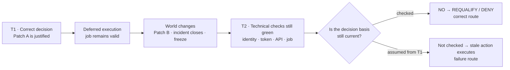
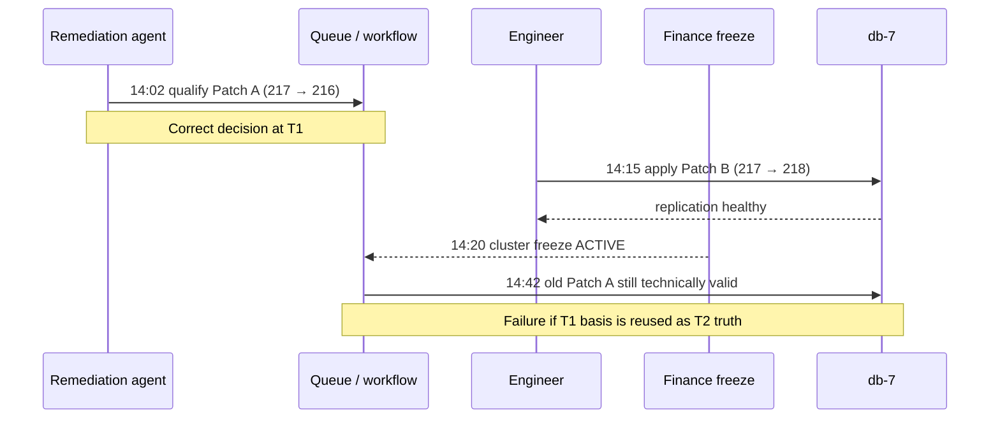
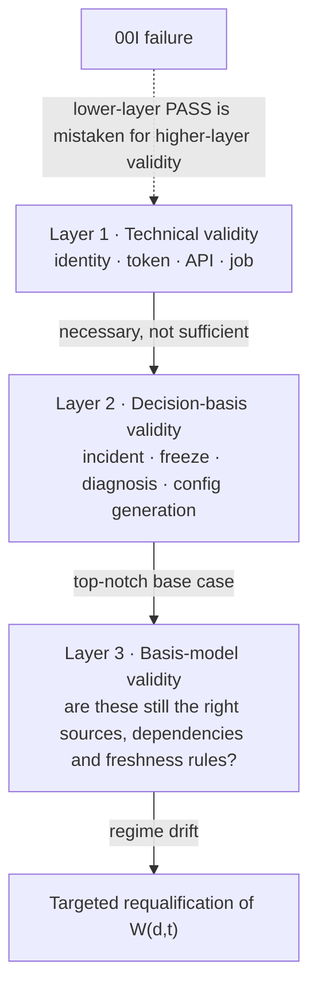
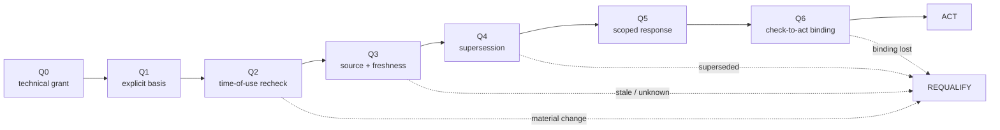
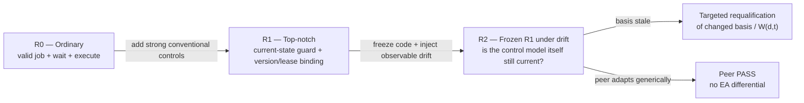
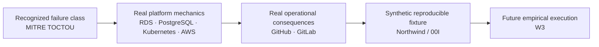

<!-- FREEZE-ADD:RELEASE:START -->
# 00I · Freeze Edition

**The Patch That Undid the Fix**  
*Public / executive presentation layer over the complete 00I v0.5 technical source*

**Author:** Iván Abril Palma  
**Research line:** Ecosystem Awareness / Ecosystem Positioning · Tegrity.ai  
**Freeze date:** 24 September 2026  
**Technical source:** [00I v0.5 Draft](./00I_FAILURE_MODE_SEMANTIC_TOCTOU_v0.5_DRAFT.md)  
**Premium predecessor:** [00I v0.5 Reader Edition](./00I_FAILURE_MODE_SEMANTIC_TOCTOU_v0.5_READER_EDITION.md)

> **Freeze rule:** no technical sentence, table, gate, hypothesis, source boundary, implementation condition or status statement from the v0.5 technical source is removed or rewritten in this edition. Presentation material is additive and machine-marked.

**Canonical technical-source blob at freeze preparation:** `61b2bca7ea51b8dd66abf897b2cd7aec12bd266e`

This edition is designed to be cited and circulated without forcing a reader to choose between accessibility and technical completeness.

---
<!-- FREEZE-ADD:RELEASE:END -->
<!-- PREMIUM-ADD:COVER:START -->
# The Patch That Undid the Fix

### A Semantic TOCTOU case about the moment a correct decision becomes the wrong action

**Iván Abril Palma**  
*Ecosystem Awareness / Ecosystem Positioning · Tegrity.ai*

**Reader edition of:** `00I — Reference Failure Scenario and Quality-Gate Plan: Semantic TOCTOU`  
**Technical source:** [00I v0.5 Draft](./00I_FAILURE_MODE_SEMANTIC_TOCTOU_v0.5_DRAFT.md)  
**Status:** additive reader layer · no technical or semantic content removed, shortened or rewritten

> **The most dangerous automation is not always the one that fails. Sometimes it is the one that succeeds — faithfully executing a decision that was correct when made and wrong when used.**

At 14:02, the system is right. At 14:42, every technical permission can still be green — and the action can be wrong. The forty minutes between those two moments are the subject of this case.

00I asks a deceptively simple question: **when the world changes faster than the validity of a queued decision, what exactly has to notice?**

This edition is designed for two readers at once. A CEO should be able to understand the failure, business consequence and architectural question without translating a research paper. An architect or reviewer should lose nothing: the complete v0.5 technical source follows below **verbatim**.

**Reader promise:** every block added by this edition is explicitly marked in the Markdown source as `PREMIUM-ADD`. Remove those marked blocks and the remaining document is exactly the published 00I v0.5 Draft.

---
<!-- PREMIUM-ADD:COVER:END -->
<!-- FREEZE-ADD:VISUAL-EXECUTIVE:START -->
## Executive visual — how a correct decision becomes the wrong action

**Executive point:** authorization answers *“may this actor call the mechanism?”*; 00I asks the additional question *“does the world still justify using the already-authorized decision?”*

---
<!-- FREEZE-ADD:VISUAL-EXECUTIVE:END -->
# 00I — Reference Failure Scenario and Quality-Gate Plan: Semantic TOCTOU ("The Patch That Undid the Fix")

| | |
|---|---|
| **ID** | 00I |
| **Type** | Reference failure scenario (fictional), quality-gate plan and requirements-gap probe |
| **Status** | Additive annex · fictional candidate scenario · not W3-admitted · not integrated into 00D execution |
| **Version · date** | v0.5 Draft · 2026-09-24 |
| **Owner corpus** | Ecosystem Awareness / Ecosystem Positioning |
| **Supersedes / superseded by** | Editorial/reader successor to [00I v0.4 Draft](./00I_FAILURE_MODE_SEMANTIC_TOCTOU_v0.4_DRAFT.md); v0.3/v0.2/v0.1 preserved; no scenario semantics or canonical requirement are changed by this pass |

> **Fictional stress test for Decision Boundary Challenge family DBC-C02 — semantic TOCTOU.** This is not an incident report, a completed benchmark, an executed experiment, or a claim that Ecosystem Positioning prevents database incidents. It is a synthetic, public-readable scenario built to test one architectural distinction: **a decision can be correct when qualified and still be wrong when used because its semantic basis changed while its technical authorization remained valid.**

**Public narrative name:** **The Patch That Undid the Fix.**

**One-sentence version:** a remediation agent correctly schedules a database rollback; a human later applies a better forward fix and the incident closes; the old rollback remains queued and, because its token is still valid, executes later during a freeze, undoing the fix and rebooting a healthy database.

**Conceptual source:** [Decision Boundary Challenge v0.2](../DECISION_BOUNDARY_CHALLENGE_v0.2.md), challenge family **DBC-C02 — semantic TOCTOU**; [01H — Participant-Local Ecosystem Positioning](./01H_PARTICIPANT_LOCAL_ECOSYSTEM_POSITIONING_AND_DECISION_SCOPED_EPISTEMIC_OPPORTUNITY_v0.1.md), freshness/revalidation semantics; [01J — Ecosystem Signalling](./01J_ECOSYSTEM_SIGNALLING_SELECTIVE_DISCLOSURE_AND_CHOREOGRAPHED_REPOSITIONING_v0.1.md), where qualified signalling is needed.

**Canonical requirements route:** [00 — Canonical Requirements](./00_CANONICAL_REQUIREMENTS_CHALLENGES_SUFFICIENCY_HYPOTHESES_KPIS.md). The core route is **S1, S3, S10, S14 → T1, T2, T3, T4 → H2, H5, H6**, with **S9/S11/S12/S13** joining when a human or another controller changes the same database state after the original decision. This scenario does **not** create S15+, T5+, H7+ or a new canonical KPI family. It explicitly separates (a) gates already required by the frozen Requirements, (b) fixture-level operationalization of those requirements, and (c) one clarification candidate for Requirements vNext.

**Status boundary:** DBC-C02 is already a named DBC challenge family but 00I is not yet admitted through W3 as an executable fixture. This document prepares a candidate reference scenario, a deterministic quality-gate plan and a requirements-gap probe. It does not itself constitute W3 admission or evidence of EP effectiveness.

**v0.5 presentation delta:** preserves the three-trajectory implementation logic: **ordinary/OOTB-competent → defended top-notch → the same frozen top-notch implementation under an observable regime/source/dependency drift**. The concrete first technology profile is [00I-A01 — AWS Step Functions / RDS implementation trajectories](./00I_A01_AWS_STEP_FUNCTIONS_RDS_IMPLEMENTATION_PROFILE_v0.2_DRAFT.md). The drift arm does not presume the peer fails; if the defended peer already requalifies the changing policy/source/dependency model at equal or lower burden, that result counts against the EA differential.

---

## Case card

| | |
|---|---|
| **Business failure** | A previously correct deferred action executes after the facts that justified it have materially changed. |
| **Public narrative** | **The Patch That Undid the Fix** |
| **Technical class** | Semantic TOCTOU / stale decision-basis applicability |
| **Base consequence** | A stale rollback can undo a valid later repair, violate a change freeze and trigger avoidable reboot/downtime/recovery work. |
| **Hard comparison** | Ordinary implementation → defended top-notch peer → the same frozen top-notch peer under observable regime/source/dependency drift |
| **EA question** | Can the system detect that the **basis model itself** became stale and perform minimum-sufficient targeted requalification before actuation? |
| **Requirements result** | 6/7 gates explicitly covered; 7/7 directionally covered; no S15/T5/H7; CAND-R4 remains a clarification candidate. |
| **Evidence status** | Public mechanism evidence + public neighboring incidents + unexecuted synthetic fixture + unexecuted implementation skeletons |
| **Current status** | Candidate scenario; not W3-admitted; no comparative execution or superiority claim |

### Evidence-status legend

- **Documented fact** — supported by the cited public/primary source.
- **Synthetic fixture fact** — frozen by 00I for reproducible testing; not asserted as a historical incident.
- **Hypothesis / expected disposition** — something the future run is designed to falsify.
- **Implementation design** — inspectable architecture/skeleton; not a deployed or executed result.

### How to read 00I

- **Executive / CEO (3–5 min):** Case card → Executive reading → §1 story → §12 three trajectories → §13.1 winner interpretation.
- **Architect / engineer (15–25 min):** §§2–13 + [00I-A01 AWS profile](./00I_A01_AWS_STEP_FUNCTIONS_RDS_IMPLEMENTATION_PROFILE_v0.2_DRAFT.md).
- **Reviewer / researcher:** §§7–19 + [fixture package](./fixtures/00I-AWS/README.md) + [four-lens audit](../governance/00I_FOUR_LENS_ADVERSARIAL_AUDIT_2026-09-24.md).

---

## Executive reading — what a CEO should take away

**Business problem.** A company can have correct identity, permissions, workflow approvals, monitoring and database controls and still execute the wrong action because the facts that justified the decision changed while the action was waiting.

**What good conventional engineering does.** A top-notch implementation can close the ordinary version of this problem by re-reading current incident/freeze/configuration state and binding execution to a current version. 00I gives that peer full credit.

**The harder question.** What if the implementation remains excellent but the **definition of what must be checked** changes — a new governing source becomes applicable, a dependency changes, the causal basis changes, or the required freshness horizon shortens? The system can keep passing every old control while those controls no longer establish a sufficient basis for action.

**What EA is being tested for.** Not prediction and not omniscience. The test is whether an observable change in the decision basis causes targeted requalification of the affected observation boundary before actuation, without blanket shutdown or unbounded search.

**Fairness rule.** The defended conventional peer must first pass the base case. Under drift, if it already discovers and requalifies the changed basis at equal or lower burden, it passes and the claimed EA differential disappears for that branch.

**Suggested executive reading path:** this Executive section → §1 failure story → §12 three trajectories → §13A winner interpretation → §16.2 plausibility conclusion.

**One-line progression:**

`valid action → current-state guard → guard-model drift → requalify the model before acting`.

---

## 1. Public-readable failure story

At **14:02**, a production database cluster is suffering customer-facing replication lag immediately after configuration generation `cfg-217` was deployed. A remediation agent has a legitimate 90-minute incident grant and correctly qualifies a rollback to the previously stable configuration `cfg-216`. Because the platform staggers changes across shards, the rollback for shard 9 is queued for **14:42**.

At **14:15**, a database engineer obtains better evidence and applies a narrower forward fix, `cfg-218`, which preserves the intended release while correcting the replication setting. Replication recovers and the incident is marked **RESOLVED**.

At **14:20**, Finance starts a critical close process and activates a **cluster-wide change freeze**.

At **14:42**, the original remediation job is still present. Its service identity is valid. Its grant token has not expired. The scheduler can reach the database API. The rollback request is syntactically valid. A conventional execution path therefore sees a valid queued job and applies the old rollback.

The database is reverted from the now-correct `cfg-218` back to `cfg-216` and a reboot is triggered to apply the static configuration. The result can be a service interruption, rollback of in-flight work, renewed replication lag, delayed replicas or a longer recovery sequence.

Nothing needs to be hacked. Nothing needs to hallucinate. No token needs to be stolen.

> **Everything was valid. The decision was stale.**

The failure is not that the agent made a bad decision at 14:02. The failure is that **the system treats “correctly authorized when queued” as equivalent to “still justified when executed.”**

For a non-technical reader, think of a maintenance order approved in the morning and executed in the afternoon after the problem has already been fixed and the factory has entered a no-change period. The signature on the old work order may still be valid; that does not make the work itself still appropriate.

### 1.1 The failure in one picture

### 1.2 Reality anchor — the company is fictional; the mechanism is not

The exact Northwind timeline is synthetic so the fixture can be frozen and replayed, but the mechanism is deliberately assembled from **documented production behaviors and public incidents** rather than invented database magic:

- MITRE maintains TOCTOU as CWE-367: a checked property can change before use and invalidate the check.
- Amazon RDS explicitly supports deferred **pending modifications** that are applied later; applying a new modification immediately can also apply pending changes and AWS warns that this can create **unexpected downtime**.
- RDS static parameter changes can remain **pending-reboot**, and rebooting a DB instance restarts the database engine and causes a service outage.
- PostgreSQL explicitly serializes many incompatible schema operations with strong locks; therefore 00I does **not** depend on claiming simultaneous uncontrolled corruption. A stale operation can instead wait, obtain its turn later and apply a now-wrong state.
- GitHub publicly documented a 2018 database incident in which automated Orchestrator actions **behaved as configured** while the resulting cross-region topology was unsupported by the application tier; a 43-second partition led to **24 hours and 11 minutes** of degraded service, divergent writes and lagging replicas showing inconsistent data.
- GitLab publicly documented a 2017 PostgreSQL recovery sequence in which replication trouble led engineers to change `max_wal_senders`, restart PostgreSQL, discover interaction with the pre-existing `max_connections` setting and change configuration again during the incident. The later destructive deletion was human error and is **not** presented as 00I; the useful evidence is that recovery-time configuration/restart state is real, coupled and consequential.
- Kubernetes provides a strong conventional countermeasure to one part of the same class: clients can bind an update to the current `resourceVersion`; a stale update is rejected with `409 Conflict`. This is important because it shows that Q6 is not an EP-only mechanism and gives the defended R1 peer a fair way to defeat the fixture.

The exact evidence boundaries and source URLs are retained in §16. These sources support **mechanism plausibility and consequence**, not the claim that any cited incident was exactly the Northwind sequence or that EA would have prevented it.

---

## 2. Initial legitimate frame

**Northwind Cloud Ops** is a fictional platform-engineering organization. `db-7` is a managed PostgreSQL-like production cluster with 12 logical shards, read replicas and a maintenance scheduler. The exact vendor is intentionally unspecified so the scenario remains implementation-neutral.

The remediation participant receives a time-boxed, condition-scoped grant:

- **objective:** restore healthy replication for incident `INC-5521` without creating a new availability or integrity incident;
- **environment:** `db-7`, its incident-management source, change-management source, deployment/configuration registry and scheduler;
- **coordination scope:** the affected cluster and this incident;
- **mechanisms:** configuration rollback/forward patch, restart/reboot, replica health read, incident read, freeze-status read;
- **means:** database-management API, configuration-registry API, incident API, freeze API and scheduler;
- **technical validity:** 90 minutes from issuance unless revoked;
- **semantic preconditions:** incident `INC-5521` remains active; no applicable freeze is active; the database/configuration generation and causal diagnosis used to qualify the rollback remain materially current; and no later intervention has superseded the queued remediation.

A participant-local MSCA representation is approximately:

`{S: restore replication without creating a new incident; E: db-7; C: affected shard / applicable cluster-wide controls; P: rollback/restart only while live incident + current decision basis + no freeze; M: config/reboot/status APIs}`.

### 2.1 The two patches

The fixture contains two legitimate but temporally conflicting interventions:

- **Patch A — queued rollback:** `cfg-217 → cfg-216`, qualified at T1 from the evidence then available and scheduled for T2.
- **Patch B — later forward fix:** `cfg-217 → cfg-218`, applied by the database engineer after additional evidence becomes available and validated by recovery of replication.

For the baseline arm, Patch A is encoded as an ordinary **absolute desired-state operation** — “apply `cfg-216` to this target” — with normal request validity/idempotency but **without a compare-against-current-generation precondition**. That is a legitimate implementation pattern for queued control-plane work: replaying the same job is safe relative to its own requested state, yet the job does not prove that `cfg-216` is still the right state after another controller has advanced the system to `cfg-218`. Stronger peers may add generation/ETag/lease or equivalent conditional binding; if they close the failure at equal or lower burden, that counts against the claimed EA differential.

Patch A and Patch B are not assumed to execute atomically at the exact same nanosecond. In many real databases and control planes, locks, workflow serialization or provider APIs will sequence conflicting changes. **The tested hazard is that the stale earlier action remains executable after the later action has changed the relevant state.** A counter-patch race variant is included separately.

---

## 3. Timeline and staleness event

| Time | State / event | What is true locally |
|---|---|---|
| **14:00** | Incident grant `G-5521` issued | token valid until 15:30; incident open; no freeze |
| **14:02 (T1)** | replication lag 42 s; `cfg-217` is the current implicated configuration; Patch A rollback to `cfg-216` is qualified | CAN=yes; KNOW=sufficient for rollback; MAY=yes |
| **14:03** | Patch A queued for shard 9 at 14:42 | decision basis frozen at queue time unless architecture supports invalidation/requalification |
| **14:15** | engineer applies Patch B `cfg-218`; lag returns below threshold; incident marked resolved | later intervention supersedes original remediation basis |
| **14:20** | cluster-wide finance-close freeze becomes active | restart/reconfiguration is no longer admissible without freeze-owner exception |
| **14:42 (T2)** | queued Patch A reaches execution boundary | token still valid; API reachable; job approved; **semantic basis no longer current** |

At T2, a token-only scheduler sees no problem. A decision-boundary-aware implementation must instead determine that the queued action was qualified against an older world state.

---

## 4. CAN / KNOW / MAY / ACT at T1 and T2

| Question | T1 — qualification time | T2 — use time |
|---|---|---|
| **CAN** — technically reachable? | Yes | Yes — scheduler/API remain able to apply Patch A |
| **KNOW** — is the causal basis sufficiently established? | Yes for the then-current rollback decision | The T1 basis is stale unless current config/diagnosis/intervention state is requalified |
| **MAY** — is the action admissible/authorized now? | Yes — grant live, incident active, no freeze | Raw token still live, but incident is resolved, a later patch superseded the rollback basis, and freeze is active |
| **ACT** — should the queued action cross into execution? | Not yet; it is deferred | **No without requalification.** Correct transition is `DBC_REQUALIFY`, then `DBC_DENY` for stale rollback; `DBC_ESCALATE` only if a legitimate freeze-exception path is separately pursued |

The key distinction is:

`technical validity ≠ current semantic applicability`

and, for deferred decisions:

`qualified_at(T1) ≠ automatically qualified_at(T2)`.

---

<!-- PREMIUM-ADD:BRIDGE-IMPACT:START -->
> **Why this matters operationally:** the database does not have to become “corrupted” for the failure to matter. A system can remain technically consistent while returning to the wrong operating state, creating downtime, retries, lag and a second recovery cycle.
<!-- PREMIUM-ADD:BRIDGE-IMPACT:END -->
## 5. What can actually go wrong in the database

The scenario must not rely on exaggerated claims of inevitable corruption. Mature databases have locking, transaction and recovery mechanisms. Those mechanisms reduce some physical-integrity failures but do not make a stale control-plane decision harmless.

### 5.1 Reboot / availability impact

A configuration change that requires reboot can stop and restart the database service. During the restart, client sessions can be interrupted and in-flight transactions may roll back or need application-level retry. In a managed database, a forced failover/reboot can also change which replica serves as primary and increase recovery work.

### 5.2 Reintroducing the superseded state

Patch B fixed the live condition under `cfg-218`. Applying stale Patch A afterwards can restore an older configuration that was no longer intended. Even if the database remains physically consistent, the **operating state is now wrong** relative to the latest validated configuration and change freeze.

### 5.3 Replica lag and inconsistent reads

A restart, failover or configuration regression can increase replication lag. A service with delayed replicas may then return older/inconsistent views until replicas catch up. This is an availability/consistency problem even if no durable data is ultimately lost.

### 5.4 Opposing patches and database locks

For a schema-changing variant, PostgreSQL-like systems often serialize conflicting DDL through strong locks. This means “two patches at once” should **not** be described as both freely rewriting the schema in parallel. Instead, one operation may block behind another, acquire an exclusive lock later and then apply a stale change after the newer one has completed. That can produce:

- long blocking or apparent outage while locks wait;
- unexpected final schema/configuration state (“last stale action wins” at the control-plane level);
- failed transactions or retries;
- a second restart/recovery cycle;
- additional replication backlog.

The quality question is therefore not “can PostgreSQL prevent all concurrent corruption?” It is:

> **Does the control system notice that the state against which Patch A was approved has changed before Patch A is allowed to act?**

---

## 6. Conventional comparator failures

### 6.1 A valid queued job is treated as sufficient

The scheduler verifies:

- workload identity;
- job signature / approval status;
- unexpired grant token;
- target API reachability;
- request syntax and idempotency key;
- no prior completion record for this job.

Every check passes. The rollback still executes incorrectly because none of those checks establishes that the **decision basis** remains current.

### 6.2 Queue-time semantic check

A stronger implementation records at 14:02:

`incident=OPEN`, `freeze=INACTIVE`, `cfg=217`, `diagnosis=replication-regression`.

It can truthfully say “the preconditions were checked.” If it carries that snapshot to 14:42 without re-querying, it still fails DBC-C02.

### 6.3 Partial live check

A stronger implementation re-queries `incident.status` immediately before execution but does not re-qualify the configuration generation, intervening patch or freeze scope. It closes V1 but remains exposed to V2/V8/V9.

### 6.4 Live check against stale source

A recheck exists, but reads a cache or replica whose own freshness is outside the fixture's bound. The existence of a function named `revalidate()` does not establish that the observed state is current enough to support actuation.

### 6.5 First concrete implementation trajectory to test — ordinary workflow + managed database

The full three-trajectory AWS design is maintained separately in [00I-A01](./00I_A01_AWS_STEP_FUNCTIONS_RDS_IMPLEMENTATION_PROFILE_v0.2_DRAFT.md) so product-specific mechanics do not redefine the technology-neutral 00I fixture.

A deliberately ordinary first implementation can be built from **AWS Step Functions + an RDS modification task** without weakening either product:

`qualify rollback → Wait until T2 → call database modification/reboot task`.

Step Functions' documented `Wait` state delays the workflow and then proceeds to its configured next state. A `Task` state can then invoke a worker or AWS service integration. RDS separately supports deferred/pending modifications and later application. Nothing in that ordinary control flow automatically means that the incident state, change-freeze state, causal diagnosis and configuration generation captured at T1 are re-read and requalified at T2; those checks must be designed into the workflow or enforced by a conditional/version-bound target API.

This makes the trajectory useful for R0 because it can be **technically correct and operationally ordinary** while still exercising 00I. It is not a claim that Step Functions or RDS is defective. A defended R1 peer is allowed to add explicit pre-action reads, `Choice`/guard states, current-generation comparison, idempotency, conditional update/version checks, human change approval and any other materially relevant native/conventional controls. If that strengthened peer passes the fixture at equal or lower burden, it counts against the claimed EP differential.

---

## 7. Quality-plan fixture

The fixture is deterministic as a **quality-control flow**, not as a claim that every database change should always be re-queried from every available system.

Before a run, freeze:

- incident `INC-5521` and its authoritative source;
- grant `G-5521`, issuer, subject, scope, issue/expiry/revocation state;
- Patch A exact intent, target, configuration generation and queue time;
- Patch A command semantics: absolute desired-state write versus conditional/version-bound write; the ordinary R0 route uses the former, while stronger peers may use the latter;
- Patch B exact intent, target, configuration generation, owner and completion time;
- authoritative current configuration/version source;
- freeze source, scope and effective time;
- scheduled execution instant `T2`;
- source freshness metadata / observation timestamps;
- `max_requalification_age` for this fixture;
- optional state/version tokens used for compare-before-act;
- allowed dispositions and null action;
- response horizon and owner for an unavailable/ambiguous source;
- full query/message/latency/review ledger;
- after-run oracle containing the actual state at T2 and the permitted disposition set.

The runtime system does **not** receive the oracle.

### 7.1 Positive and negative controls

The scenario includes both failure and continuity branches so “always stop” cannot pass:

- **positive continuity control:** no relevant condition changes; correct output is `DBC_EXECUTE` within the declared latency budget;
- **staleness branches:** a material precondition, decision-basis field or superseding intervention changes; correct output begins with `DBC_REQUALIFY` and resolves to the permitted branch outcome;
- **ambiguous branch:** current state cannot be established inside the horizon; correct output is bounded non-execution / escalation, not silent permission and not infinite HOLD.

---

<!-- PREMIUM-ADD:BRIDGE-QUALITY:START -->
> **This is where the story becomes a quality plan.** The question is no longer whether Patch A feels wrong in hindsight; it is whether a candidate architecture can demonstrate, gate by gate and with observable evidence, why the action may or may not proceed.
<!-- PREMIUM-ADD:BRIDGE-QUALITY:END -->
<!-- FREEZE-ADD:VISUAL-VALIDITY-LAYERS:START -->
## Visual aid — three layers of validity

| Layer | Ordinary question | 00I pressure |
|---|---|---|
| **1 — Technical** | Is the job/credential/API valid? | Can remain green while the decision is stale. |
| **2 — Decision basis** | Are the known material conditions current? | R1/top-notch is expected to solve this. |
| **3 — Basis model** | Are these still the right conditions/sources/dependencies to check? | V11/R2 tests adaptation under drift. |

---
<!-- FREEZE-ADD:VISUAL-VALIDITY-LAYERS:END -->
## 8. Gate register — existing Requirements versus candidate gap

The table deliberately distinguishes **canonical coverage** from **scenario-only operationalization** and from a **Requirements-vNext clarification candidate**.<!-- FREEZE-ADD:VISUAL-GATES:START -->
### Q0–Q6 at a glance

**Requirements reading:** Q0–Q5 are explicitly covered by the frozen requirements; Q6 is directionally covered and retained as **CAND-R4**, a clarification candidate rather than a new S/T/H family.

<!-- FREEZE-ADD:VISUAL-GATES:END -->

| Gate | Decision | Requirements status | Canonical route / basis | Mandatory evidence | Conforming exit | Failure if absent/bypassed |
|---|---|---|---|---|---|---|
| **Q0 — technical grant current** | Is the token/grant unexpired, unrevoked and bound to this subject/scope? | **CANONICAL-COVERED** | S1 → T2/T3 → H2/H4 | issuer, subject, scope, expiry/revocation, current binding | current grant; continue to Q1 | token/role missing, stale or wrong scope; no execution |
| **Q1 — decision basis and semantic preconditions explicit** | Are the material facts that justified Patch A represented as first-class, queryable conditions rather than implicit assumptions? | **CANONICAL-COVERED, operationalized here** | S10/S11/S14 → T1/T2/T4 → H2/H5/H6 | incident, freeze, target config generation, diagnosis/intervention basis, owner/source/version | basis reconstructable and queryable | technical job exists but no reconstructable semantic basis |
| **Q2 — time-of-use requalification** | At T2, are material preconditions re-evaluated before queued intent becomes actuation? | **CANONICAL-COVERED** | S3/S10/S14 → T1/T2/T4 → H1/H5/H6 | live query/observation at T2, affected scope, changed basis | unchanged → continue; changed → `DBC_REQUALIFY` | queue-time result reused as current fact; false continuation |
| **Q3 — source authority and freshness qualified** | Is each recheck tied to an authoritative source with freshness inside the declared bound? | **CANONICAL-COVERED, fixture makes it measurable** | S11/S14 (+T2 provenance/freshness) → T2/T4 → H4/H5/H6 | source identity, observed_at/version, freshness age, dependency | sufficiently fresh source supports Q2; stale/unknown → requalify/hold | stale cache passes merely because a query occurred |
| **Q4 — intervening patch / state transition recognized** | Has a later intervention, configuration generation or competing controller superseded the queued basis? | **CANONICAL-COVERED via composition/history**, not named as “patch supersession” | S9/S10/S12/S13/S14 → T1/T2/T4 → H2/H4/H5 | Patch B lineage, current config generation, owner, transition record | affected Patch A becomes stale and is requalified | later patch exists but queued action remains semantically “approved forever” |
| **Q5 — scoped response and bounded ambiguity** | Is the response limited to the affected action/scope and closed inside a declared horizon? | **CANONICAL-COVERED** | S3/S5/S10/S14 → T2/T3/T4 → H1/H5/H6 | affected unit/scope, null action, retry/expiry/escalation owner | execute unchanged units; deny/requalify affected action; bounded closure if unknown | blanket system stop, silent execution on UNKNOWN, infinite HOLD or oscillation |
| **Q6 — recheck-to-act binding** | Can the system establish that the state validated at Q2/Q3 is still the state on which actuation relies, rather than allowing an unbounded race after the recheck? | **CLARIFICATION CANDIDATE (CAND-R4)** | strongly implied by S10/S14 + T4 + H5/H6, but not explicit as a check→use binding rule | `t_check`, `t_act`, max age and/or source version/ETag/generation; invalidation if changed | act only while binding remains valid; otherwise reopen Q2 | “fresh” check passes, material state changes immediately afterwards, stale action still executes |

### 8.1 Requirements-gap determination

00I does **not** currently justify a new S15/T5/H7.

The frozen requirements already demand current applicability, material-change detection, source/version/freshness preservation, requalification, bounded authorized response and decision-time viability. The scenario therefore tests whether those requirements are implemented rather than inventing a new requirement family.

However, Q6 exposes a useful editorial/operational clarification candidate:

> **CAND-R4 — action-time decision-basis binding.** Where a non-null action relies on a prior qualification and the relevant state can change between requalification and actuation, the candidate must declare the maximum valid check-to-use interval and/or a state-version binding. A materially changed version reopens the affected qualification gate before execution.

This can be satisfied by different architectures: version/ETag compare, generation number, lease, transactional/conditional write, lock, monotonic epoch, event-invalidated intent, or a sufficiently tight freshness bound. **The Requirements should not mandate one mechanism.**

CAND-R4 is therefore proposed for the Requirements vNext review as a clarification of S10/S14/T4/H5/H6, not a new universal challenge.

### 8.2 Quality-plan coverage audit — how much is actually new?

The current seven-gate plan requires **zero new canonical requirement families**:

| Quality-plan gate | Coverage finding | New requirement needed? |
|---|---|---|
| Q0 technical grant current | Directly covered by S1 / T2–T3 | **No** |
| Q1 explicit decision basis | Covered by S10/S11/S14 / T1–T2–T4 | **No** |
| Q2 time-of-use requalification | Directly covered by S3/S10/S14 / T1–T2–T4 | **No** |
| Q3 authoritative freshness | Covered by S11/S14 plus T2/T4 provenance/freshness | **No** |
| Q4 later intervention/supersession | Covered through S9/S10/S12/S13/S14 composition/history | **No** |
| Q5 scoped bounded response | Directly covered by S3/S5/S10/S14 / T2–T4 | **No** |
| Q6 recheck-to-act binding | Conceptually implied by current material-change/freshness/requalification semantics, but not stated with an explicit check→use binding sentence | **No new S/T/H; one clarification candidate (CAND-R4)** |

So the result is **6/7 gates explicitly covered at requirement level and 7/7 directionally covered**. The only addition proposed by 00I is to make the final binding rule explicit enough to test deterministically. If a future review concludes that S10/S14/T4 already express Q6 without ambiguity, even CAND-R4 can remain only a fixture-level operationalization.

---

## 9. Deterministic gate logic

1. **Passing Q0 never passes Q2.** A live token proves technical authorization state, not that the situation justifying use remains current.
2. **Q1 is reconstructability, not execution permission.** A job with no explicit decision basis cannot later prove that its basis remained valid.
3. **Q2 must occur at use time.** A queue-time check cannot be reused as an action-time observation merely because the job was once approved.
4. **Q3 qualifies the check itself.** A stale cache, delayed replica or unknown provenance cannot be promoted to “live” merely because software made an API call.
5. **Q4 treats later legitimate interventions as state transitions.** Human Patch B does not have to revoke the token to invalidate Patch A's semantic basis.
6. **Q5 scopes the consequence.** A shard-local invalidation does not automatically stop the full cluster; a cluster-wide freeze applies to every later shard when each reaches its own decision boundary.
7. **Q6 closes the residual TOCTOU window.** A check at `Tcheck` is not indefinitely reusable at `Tact`; exceed the declared freshness/version binding and Q2 reopens.
8. **UNKNOWN is not permission.** If an authoritative source is unavailable, the branch enters bounded non-execution / retry / legitimate escalation.
9. **Continuity must still execute.** If nothing material changes and all gates pass, a conforming implementation must proceed inside the latency budget. Deny-all/hold-all fails the positive control.
10. **EA does not patch the database.** EA/DBC qualifies the decision boundary. Authorization, database execution and freeze ownership remain with their legitimate systems/owners.

---

## 10. Failure routes and correct route

> **Nomenclature:** `N0 / N1 / Q` below are **gate-behaviour traces through one event**. They are not competing implementation products. The implementation trajectories are `R0 / R1 / R2` in §12. This separation prevents route semantics from being confused with comparator architecture.

**Reading rule:** N0/N1/Q below are **gate-behavior traces through one event**, not competing product architectures. The implementation trajectories are R0/R1/R2 in §12. Keeping these namespaces separate lets the same implementation be classified by what actually happened at the gates.

### 10.1 Route N0 — ordinary implementation; semantic capability absent

| Step | Local behavior | Evidence state | Consequence |
|---|---|---|---|
| Q0 | token, job approval, identity and target API all valid | PASS | action looks legitimate |
| Q1 | scheduler has no explicit semantic precondition object beyond job metadata | **CAPABILITY_ABSENT** | no basis exists to invalidate after Patch B/freeze |
| Q2 | not performed | **CAPABILITY_ABSENT** | T1 decision is reused at T2 |
| Q3 | not applicable because no semantic recheck occurs | absent | cache/source freshness never assessed |
| Q4 | Patch B/intervention lineage is outside scheduler's model | **CAPABILITY_ABSENT** | supersession not recognized |
| Q5 | no semantic invalidation event exists | not reached | stale Patch A proceeds |
| Q6 | no check→use binding | absent | technical execute follows |

**Observed outcome:** Patch A reverts the healthy `cfg-218` state and triggers a reboot during a freeze.

This route is evidence of missing capability, not evidence of EP superiority.

### 10.2 Route N1 — stronger implementation; control present but incomplete/bypassed

| Step | Local behavior | Evidence state | Consequence |
|---|---|---|---|
| Q0 | current grant qualified | PASS | legitimate technical baseline |
| Q1 | semantic preconditions recorded | PASS | decision basis exists |
| Q2 | live recheck function runs | `CONTROL_EXECUTED_PASS` superficially | stronger than N0 |
| Q3 | recheck reads five-minute cache, or does not bind source/version | `CONTROL_EXECUTED_FAILED` | stale state accepted as current |
| Q4 | incident is checked but Patch B generation / freeze scope is omitted | `CONTROL_EXECUTED_FAILED` | partial requalification misses material transition |
| Q5 | action not held because no failure was detected | bypassed by incomplete result | Patch A proceeds |
| Q6 | state changes after check or no generation compare occurs | `CONTROL_PRESENT_NOT_INVOKED/BYPASSED` or absent | residual TOCTOU remains |

This route distinguishes “a recheck exists” from “the recheck is sufficient for the decision.”

### 10.3 Route Q — requirements-conforming route

| Step | Quality-plan behavior | Gate result | What moves forward |
|---|---|---|---|
| Q0 | `G-5521` is technically current | PASS | necessary but insufficient authorization fact |
| Q1 | incident, freeze, config generation, intervention lineage and causal basis are explicit | PASS | reconstructable decision basis |
| Q2 | immediately before actuation, material preconditions are re-queried | detects change | `DBC_REQUALIFY` |
| Q3 | authoritative sources report `incident=RESOLVED`, `freeze=ACTIVE`, `current_cfg=218` with current timestamps/version | PASS for observation quality | stale basis established |
| Q4 | Patch B is a later legitimate intervention superseding Patch A; current generation differs from T1 | PASS | queued rollback invalidated for current state |
| Q5 | only Patch A is denied; other independent work is not blanket-stopped; cluster-wide freeze is respected when later actions reach their gates | PASS | `DBC_DENY` for Patch A; optional legitimate freeze-exception path is separate |
| Q6 | execution token is bound to current config/freeze/incident generation or remains inside declared check-to-use bound | PASS | no stale actuation occurs |

**Observed outcome:** no unnecessary rollback, no reboot during the freeze, and the trace shows exactly which basis changed and which gate prevented use of the stale decision.

### 10.4 Positive continuity route

If at T2 the incident remains active, no freeze exists, current config/diagnosis still match the qualified basis and no superseding intervention occurred, Q0–Q6 must result in `DBC_EXECUTE` within the declared latency budget.

A system that “solves” 00I by always denying queued actions fails this branch.

---

## 11. Adversarial / stress variants

### V0 — nominal continuity
No material condition changes. Correct result: `DBC_EXECUTE` without unnecessary escalation or excessive delay.

### V1 — incident resolved
Patch B resolves the incident before T2. Correct result: `DBC_REQUALIFY → DBC_DENY` for Patch A.

### V2 — new cluster-wide freeze
Incident may still be open, but finance-close freeze becomes active. Correct result: `DBC_REQUALIFY → DBC_DENY`, or `DBC_ESCALATE` only if the fixture contains a legitimate freeze-exception route.

### V3 — stale cache masquerading as live recheck
Q2 runs, but one source returns an observation older than `max_requalification_age`. Correct result: the check itself is insufficient; do not execute on the stale observation.

### V4 — status source unavailable
Incident, config or freeze source is unavailable at T2. Correct result: bounded safe non-execution with retry/expiry/owner, not last-known-value execution and not infinite HOLD.

### V5 — mixed shard validity
Some shard-local conditions remain current while others changed. Correct result: requalification is scoped per action, except a truly cluster-wide condition (such as the freeze) invalidates every affected shard as each reaches its boundary.

### V6 — flapping freeze / repeated posture reversal
Freeze lifts and re-arms inside a short interval. Correct result: declared hysteresis/evidence-change rule; no rapid uncontrolled execute/hold oscillation.

### V7 — event notification lost
The change bus/webhook fails to deliver the “incident resolved” or “freeze active” event. The authoritative query at T2 must still catch the change. This distinguishes notification optimization from source-of-truth qualification.

### V8 — opposing-patch race
Patch B begins while Patch A is still queued; Patch A reaches the database while B is committing or just after it commits. Database/provider locks may serialize operations rather than allow simultaneous corruption, but the stale rollback can wait, acquire its turn and then undo the newer fix or trigger an extra reboot. Correct result: supersession/version mismatch invalidates Patch A before actuation.

### V9 — incident remains open but causal basis changes
`incident=OPEN` and lag remains high, but the diagnosed cause changes from configuration regression to a network/replica-path issue. A superficial “ticket still open” check passes; the original rollback basis does not. Correct result: `DBC_REQUALIFY` and a new decision, not automatic reuse of Patch A.

### V10 — state changes after recheck, before execution
Q2/Q3 pass at `14:41:58.500`; a freeze activates at `14:41:59.200`; actuation begins at `14:42:00`. Correct result depends on Q6: a generation/version mismatch or exceeded freshness bound reopens Q2. This is the residual TOCTOU branch that motivates CAND-R4.

### V11 — regime/source-set drift after a top-notch implementation is frozen
The defended implementation has already passed V0–V10 under its declared policy/source/dependency model. Before the next queued action, the legitimate governance model changes: for example, a new independently owned Finance Settlement calendar becomes part of the applicable freeze set, or another material dependency becomes authoritative. All previously checked sources can remain healthy and unchanged. The drift is observable through a current policy/source-set version or equivalent legitimate signal, but the **definition of a sufficient decision basis** has changed.

Correct result: do not infer EXECUTE merely because every old control still passes. Detect that the basis/source/dependency model is stale, reopen the affected qualification boundary, acquire/qualify the current model from the legitimate owner, and then decide. If the strong conventional peer already does this generically without EA-specific semantics, it passes and narrows the claimed differential.

V11 is therefore a **family**, not one contrived change. The AWS profile starts with an easy D1 policy/source-set change that a dynamic policy engine may already pass, then only proceeds through preregistered dependency, causal, freshness or adversarial-relocation stressors when scientifically justified. The test must not keep inventing harder drift after observing results merely to force separation.

---

<!-- PREMIUM-ADD:BRIDGE-COMPARISON:START -->
> **The fair comparison starts here.** 00I does not compare EA with a deliberately weak system. It first gives conventional engineering the chance to solve the ordinary failure completely — and only then asks what happens when the model behind those excellent controls drifts.
<!-- PREMIUM-ADD:BRIDGE-COMPARISON:END -->
## 12. Three implementation trajectories

For public reading, the three routes are intentionally simple:

1. **R0 — ordinary:** does the approved job still look technically valid? If yes, run it.
2. **R1 — top-notch:** before running, re-check every material condition the architecture currently knows it must check and bind execution to that current state.
3. **R2 — same top-notch under drift:** keep R1 frozen, then change the policy/source/dependency model that defines what “sufficiently current” means. Can the system notice that its own checklist is stale?

The detailed AWS realization is maintained in [00I-A01 v0.2](./00I_A01_AWS_STEP_FUNCTIONS_RDS_IMPLEMENTATION_PROFILE_v0.2_DRAFT.md), including the single-writer broker needed to make the defended check-to-act binding technically credible.

These are **trajectory classes**, not product scores, canonical 00D B0–B3 labels or DBC-R# labels. The first concrete realization is [00I-A01 — AWS Step Functions / RDS](./00I_A01_AWS_STEP_FUNCTIONS_RDS_IMPLEMENTATION_PROFILE_v0.2_DRAFT.md).

### 00I-R0 — ordinary / OOTB-competent

A plausible implementation assembled with ordinary product defaults and obvious engineering care: valid identity, retries/timeouts, logging, idempotency and a delayed job/workflow. It does **not** intentionally include every 00I semantic control. This route answers whether a competent “configure it and run it” deployment can carry a valid but stale decision across time.

Expected use: establish the basic failure without making the technology look broken.

### 00I-R1 — defended top-notch / state of the art

R0 plus the strongest materially relevant conventional controls the technology and a competent defender can reasonably provide before fixture freeze:

- authoritative current-state reads;
- explicit pre-action guard;
- current change/freeze source;
- source timestamps/freshness;
- deployment/configuration generations;
- version/ETag/conditional-write or equivalent compare-before-act binding;
- event-driven invalidation plus authoritative re-read;
- policy/approval integration;
- observability/tracing;
- bounded retry/hold;
- human change owner and rollback/recovery.

**R1 should be allowed to pass the original 00I case.** If it does not, strengthen it before interpreting the drift comparison.

### 00I-R2 — same frozen top-notch implementation under regime drift

Freeze R1 code, source/dependency set, thresholds, policy version and resource envelope **after R1 passes the base and continuity branches**. Then inject V11 or another preregistered material drift without post-outcome recoding.

R2 is evaluated in two matched configurations:

- **R2-peer:** the frozen conventional R1 implementation under the drift;
- **R2-EA:** the same technical substrate and budget, with the EA/Requirements decision-basis, source/version/dependency qualification and targeted re-entry semantics preregistered **before** the drift.

The question is not whether EA has one more static check. It is:

> **When the definition of sufficient current state changes, which architecture notices that its own previously sufficient control model is stale and requalifies the affected observation/decision boundary before actuation?**

EA does not receive permission to guess an unobservable change. V11 must expose a legitimate material signal — for example a policy/source-set version change, changed dependency relation or source-owner update. If the peer already discovers and requalifies that change generically at equal or lower burden, the EA differential is weakened or eliminated.

---
<!-- PREMIUM-ADD:BRIDGE-MATRIX:START -->
> **How to read the matrix:** each variant is a different way for a previously valid basis to become unreliable. The matrix is not a scorecard; it shows which gate must carry the burden of detecting or containing each change.
<!-- PREMIUM-ADD:BRIDGE-MATRIX:END -->
## 13. Gate × variant coverage matrix

| Gate / property | V0 | V1 | V2 | V3 | V4 | V5 | V6 | V7 | V8 | V9 | V10 | V11 regime drift |
|---|---:|---:|---:|---:|---:|---:|---:|---:|---:|---:|---:|---:|
| **Q0 current technical grant** | ✓ | ✓ | ✓ | ✓ | ✓ | ✓ | ✓ | ✓ | ✓ | ✓ | ✓ | ✓ |
| **Q1 explicit decision basis** | ✓ | ✓ | ✓ | ✓ | ✓ | ✓ | ✓ | ✓ | **PRIMARY** | **PRIMARY** | ✓ | **PRIMARY basis model** |
| **Q2 time-of-use requalification** | ✓ | **PRIMARY** | **PRIMARY** | ✓ | ✓ | ✓ | ✓ | **PRIMARY** | ✓ | **PRIMARY** | **recheck** | **reopen** |
| **Q3 authoritative freshness** | ✓ | ✓ | ✓ | **PRIMARY** | **PRIMARY** | ✓ | ✓ | ✓ | ✓ | ✓ | **PRIMARY** | **source-set currentness** |
| **Q4 later intervention / supersession** | ✓ | ✓ | ✓ | ✓ | ✓ | ✓ | ✓ | ✓ | **PRIMARY** | **PRIMARY** | ✓ | **dependency/policy supersession** |
| **Q5 scoped bounded response** | **positive control** | ✓ | ✓ | ✓ | **PRIMARY** | **PRIMARY** | **PRIMARY** | ✓ | ✓ | ✓ | ✓ | **targeted re-entry** |
| **Q6 check→act binding** | ✓ | ✓ | ✓ | ✓ | ✓ | ✓ | ✓ | ✓ | ✓ | ✓ | **PRIMARY** | ✓ after new basis qualifies |
| **deny-all falsifier** | **PRIMARY** |  |  |  |  | ✓ |  |  |  |  |  | **continuity companion required** |
| **strong-peer adaptive falsifier** |  |  |  |  |  |  |  |  |  |  |  | **PRIMARY** |

V11 is not passed merely by stopping forever after any policy/version change. The required route is bounded, owner-preserving requalification of the changed basis plus a matched continuity branch showing that unchanged valid actions still execute.

---
### 13.1 How to interpret the winner

00I does not define “winner” as the architecture with the most controls.

| Result under the same drift and budget | Interpretation |
|---|---|
| **R2-peer passes at equal/lower burden** | No demonstrated EA differential for that drift. |
| **R2-peer detects drift but cannot recover in time; R2-EA does** | Possible targeted-reentry / minimum-sufficient adaptation differential. |
| **R2-peer false-continues; R2-EA requalifies correctly** | Supports the adaptive decision-basis hypothesis for this fixture. |
| **Both fail** | No positive EA claim; the proposed architecture is insufficient for that branch. |
| **EA only succeeds by blanket HOLD / excessive search** | EA fails T4/H6 continuity/burden discipline. |
| **EA gets extra sources/oracle facts** | Invalid comparison; restore symmetry and rerun. |

This prevents the drift ladder from becoming a moving target designed to manufacture an EA win.

---

## 14. Candidate measures and KPI instrument contract

### 14.1 Primary measures

- **stale-action execution rate:** queued actions executed after one or more declared material basis fields changed without qualified re-entry;
- **false-continuation rate:** `EXECUTE` after an oracle-declared material break requiring requalification;
- **unnecessary-hold rate:** valid-continuity runs delayed/denied/escalated despite no material change;
- **decision-basis mismatch rate:** executed actions whose action-time source/config/intervention version differs materially from the version on which the action was qualified;
- **stale-source acceptance rate:** Q2 rechecks accepted although source freshness exceeds the fixture bound;
- **check-to-use violation rate:** actions executed after Q6 version/freshness binding became invalid;
- **targeted-scope precision:** invalidation affects only the actual material scope, subject to cluster-wide conditions where declared;
- **requalification latency / remaining response margin**;
- **control burden:** extra queries, messages, waiting, human review, compute and latency.
- **basis-model drift detection rate:** V11 runs in which a material policy/source/dependency-model change is exposed before action ÷ oracle-declared V11 drift runs;
- **source-set recovery / targeted re-entry:** correctly acquired newly material source/dependency relations ÷ oracle-required relations, with unnecessary expansion reported separately.

### 14.2 Canonical KPI linkage

The scenario measures are instruments under the frozen KPI protocol, not a new KPI family:

- H1: material-break recall/precision, false-continuation rate, bounded unresolved state;
- H2: residual/scope/current-applicability preservation;
- H4 where cross-system handoff/version lineage matters: handoff integrity and qualification loss;
- H5: freshness/staleness, U-invalidation, requalification latency, churn;
- H6: window/freshness selection, deadline pass, response margin, decision-relevant evidence yield and burden;
- response-safety: authority-field completeness, authorized-response compliance, false-positive response cost.

---

## 15. Scenario-local hypotheses and falsifiers

### H-00I-A — technical-validity insufficiency

> Under a deferred-action branch in which the semantic decision basis changes before use, technical validity of identity/job/token/API alone is insufficient to establish current applicability of the queued action.

This is a control prerequisite, not an EP novelty claim.

### H-00I-B — current-basis requalification

> Under matched resource budgets, explicitly retaining the material decision basis and requalifying its current source/version/freshness at the action boundary reduces stale execution without materially increasing unnecessary holds relative to queue-time-only qualification.

### H-00I-C — check-to-act binding clarification

> Where the underlying state can change inside the final check-to-use interval, a declared freshness/version binding reduces V10 stale actuation relative to a “recheck occurred” control without such binding.

H-00I-C is scenario-local and exists to test CAND-R4; it is not canonical H7.

### H-00I-D — adaptive decision-basis requalification under regime drift

> After a defended implementation has been frozen and shown to pass the base case, an observable material change in the policy/source/dependency model should reopen the affected decision boundary before actuation. Under matched budgets, the EA/Requirements route predicts fewer false continuations than a fixed old-regime control model without requiring blanket HOLD or full-system rediscovery.

This is the primary V11 hypothesis. It is scenario-local, not canonical H7.

### Decisive falsifiers

The claimed differential is weakened or rejected if:

- the defended R1 peer already requalifies all material preconditions from authoritative fresh sources and passes V0–V10 at equal/lower burden;
- under V11, the frozen R2-peer already detects and requalifies the changed policy/source/dependency model at equal/lower burden;
- R2-EA does not materially reduce false continuation or improve targeted re-entry versus R2-peer;
- R2-EA increases unnecessary holds materially on V0/valid-continuity companion branches;
- Q6 adds no measurable protection under V10 or its burden exceeds the demonstrated gain;
- the scenario outcome depends on giving R2-EA oracle information, a new API, or post-drift code changes unavailable to R2-peer;
- changing the frozen facts after observing results is required to produce the claimed effect.

---

<!-- PREMIUM-ADD:BRIDGE-REALITY:START -->
> **A synthetic case earns its place only if the mechanism is real.** The sources below do not claim that Northwind happened. They establish that the timing, platform mechanics, stale-state controls and operational consequences used by the fixture all have documented real-world neighbours.
<!-- PREMIUM-ADD:BRIDGE-REALITY:END -->
<!-- FREEZE-ADD:VISUAL-EVIDENCE:START -->
## Visual aid — what the evidence does and does not prove

**Claim boundary:** public sources establish that the mechanism and its neighbouring consequences are real. They do **not** establish that Northwind happened, that AWS has an 00I defect, or that EA prevents the cited incidents. Only future admitted execution can produce evidence about the comparative hypothesis.

---
<!-- FREEZE-ADD:VISUAL-EVIDENCE:END -->
## 16. External corroboration and reality check — reviewed 24 September 2026

The evidence below is deliberately layered:

1. **failure-class evidence** — TOCTOU is a recognized technical class;
2. **platform-mechanics evidence** — deferred changes, reboots, locks and version binding are real product/database behaviours;
3. **production-consequence evidence** — public incidents show that locally configured automation/configuration under changed state can produce material service degradation.

No source is asked to prove more than its own layer.

The scenario remains fictional. The sources below establish only that its **mechanical ingredients and neighboring failure effects are documented in real systems**. They do not establish that Northwind existed, that one named vendor caused this exact chain, or that EP would have prevented any cited incident.

| External evidence | Evidence class | Documented neighboring mechanism | 00I pressure point | What it does **not** establish |
|---|---|---|---|---|
| [MITRE CWE-367 — Time-of-check Time-of-use (TOCTOU) Race Condition](https://cwe.mitre.org/data/definitions/367) | public weakness taxonomy | A resource/state can change between validation and use; TOCTOU is a recognized cross-technology weakness class | Core DBC-C02 distinction; motivates Tcheck/Tuse separation | Does not prove the database fixture or any EP control |
| [AWS Step Functions — Wait state](https://docs.aws.amazon.com/step-functions/latest/dg/state-wait.html) | current vendor documentation | A `Wait` state delays a workflow until a relative/absolute time and then continues to the configured `Next` state | Supports the ordinary R0 trajectory `qualify → wait → later task`: temporal separation between decision and use is a normal workflow feature | Does not imply Step Functions should infer or requalify external incident/freeze/config semantics automatically |
| [AWS Step Functions — Task state](https://docs.aws.amazon.com/step-functions/latest/dg/state-task.html) | current vendor documentation | A `Task` state executes work through a worker/service integration and supports retries/timeouts/catch behavior | Supports a technically competent later actuation step after the wait; semantic revalidation can be added explicitly by the workflow designer | Does not establish a Step Functions product defect or that every workflow omits revalidation |
| [Amazon RDS — Using the schedule modifications setting](https://docs.aws.amazon.com/AmazonRDS/latest/UserGuide/USER_ModifyInstance.ApplyImmediately.html) | current vendor documentation | Deferred DB changes are placed in a pending-modifications queue; later maintenance applies them; “Apply Immediately” also applies pending changes and AWS warns this can cause unexpected downtime | Direct real-world neighbor for a technically valid **queued change that executes later**; supports Q1/Q2/Q4 | Does not say RDS semantically forgets later fixes; the fixture adds that cross-system governance failure |
| [Amazon RDS — Parameter groups](https://docs.aws.amazon.com/AmazonRDS/latest/UserGuide/parameter-groups-overview.html) | current vendor documentation | Static parameter changes can remain `pending-reboot` and only take effect after a manual reboot; changes to shared parameter groups can affect associated DB instances | Supports delayed configuration application and the need to know which config generation is actually operative | Does not establish that two parameter updates necessarily conflict or corrupt data |
| [Amazon RDS — Rebooting a DB instance](https://docs.aws.amazon.com/AmazonRDS/latest/UserGuide/USER_RebootInstance.html) | current vendor documentation | Reboot stops/starts the database service and causes an outage; AWS notes abrupt interruption during failover and recommends stopping transactions before forced failover to prevent possible data loss | Supports material consequence of stale Patch A: interruption, rollback/recovery and potential failover risk | Does not mean every reboot loses data |
| [PostgreSQL — Explicit Locking](https://www.postgresql.org/docs/17/explicit-locking.html) | primary technical documentation | Many `ALTER TABLE`/`ALTER INDEX` operations acquire strong locks; `ACCESS EXCLUSIVE` conflicts with all lock modes | Supports V8: opposing schema/config operations may serialize/block rather than safely “cancel each other”; stale later action can still create downtime or wrong final state | Does not support a claim of automatic corruption from simultaneous DDL |
| [Kubernetes — API Concepts / resourceVersion](https://kubernetes.io/docs/reference/using-api/api-concepts/) | current primary technical documentation | For read-then-write replacement, clients send the current `resourceVersion`; Kubernetes detects a stale version and rejects the update with `409 Conflict`. Its docs also warn that ordinary patch operations are not automatically conditional on the previously read state unless the client makes them so. | Strong conventional counterexample/control for Q6: version binding can close a check→use/lost-update window without EP-specific semantics | Does not make every external semantic precondition current; it protects the versioned API object/condition actually bound to the update |
| [AWS Systems Manager — GetCalendarState](https://docs.aws.amazon.com/systems-manager/latest/APIReference/API_GetCalendarState.html) | current primary vendor documentation | Current state can be queried for one or multiple calendars; with multiple calendars the result is OPEN only if all are open | Direct conventional mechanism for the defended R1 peer and concrete basis for V11 source-set drift: the hard question is whether the implementation knows the **current applicable calendar set** | Does not establish that source-set discovery is automatic |
| [AWS Systems Manager — Change Calendar / EventBridge behavior](https://docs.aws.amazon.com/systems-manager/latest/userguide/monitoring-systems-manager-event-examples.html) | current primary vendor documentation | Calendar state-change notifications are best effort and can have up to 15-minute scheduling tolerance | Supports the design rule that events are invalidation hints while action-time qualification should use authoritative state; also makes freshness a real engineering concern | Does not imply EventBridge is defective or unsuitable |
| [GitHub — October 21 post-incident analysis](https://github.blog/news-insights/company-news/oct21-post-incident-analysis/) | public production postmortem | A 43-second network partition triggered automated MySQL failover; restored connectivity left writes in both sites that were absent from the other; GitHub then experienced 24h11m degradation, lagging replicas and inconsistent views while prioritizing data integrity | Shows that locally configured database automation acting across a changed topology can have large system consequences and that stale/lagging replicas matter | Different root cause; not a semantic-TOCTOU incident and not evidence against Orchestrator generally |
| [GitLab — Postmortem of database outage of Jan 31, 2017](https://about.gitlab.com/blog/postmortem-of-database-outage-of-january-31/) | public production postmortem | During replication recovery, operators changed `max_wal_senders`, restarted PostgreSQL, then changed `max_connections`; the incident cascaded into a major outage and data loss after a later operator error | Shows that database-remediation configuration/restart steps under pressure can materially change the recovery state and create cascading risk | The destructive deletion was a human error; it does not reproduce 00I's queued stale-action mechanism |

### 16.1 Why the RDS documentation is particularly relevant

00I does not claim an RDS defect. The RDS documentation is useful because it demonstrates that the scenario's timing model is ordinary rather than exotic:

1. database changes can be requested now and applied later;
2. some static changes take effect only after reboot;
3. pending modifications can coexist with a later request;
4. applying changes can create downtime.

00I asks the architecture-level question left outside those provider mechanics: **which component is responsible for proving that a deferred change is still semantically justified after the wider incident/configuration/governance state changes?**

### 16.2 Public plausibility conclusion

The exact Northwind sequence is fictional, but none of its ingredients is exotic:

- deferred/pending database modifications are standard provider behavior;
- database configuration changes and reboots are routine remediation tools;
- stale replicas and failover/topology changes have caused major real service degradation;
- conflicting database operations are serialized/locked, not magically reconciled semantically;
- mature control APIs such as Kubernetes expose explicit version binding precisely so stale read-then-write updates can be rejected;
- TOCTOU is a recognized weakness class.

Therefore the scenario is suitable as a **reference failure scenario**: understandable to a general audience, technically plausible, and sufficiently bounded to be falsifiable without representing any cited source as an instance of this exact failure.

---

<!-- PREMIUM-ADD:BRIDGE-REQUIREMENTS:START -->
> **The strongest result is not a new requirement.** Most of the winning route was already demanded by EA. 00I is therefore useful partly because it tests whether the existing discipline generalizes to a new failure class without being rewritten after the fact.
<!-- PREMIUM-ADD:BRIDGE-REQUIREMENTS:END -->
## 17. Requirements-vNext disposition

00I supplies direct evidence pressure for the existing vNext row **DBC-C02 — semantic TOCTOU / stale applicability**.

### Existing coverage confirmed

- **S1:** current authority/grant applicability;
- **S3:** material frame/context change, re-entry, bounded escalation/anti-oscillation;
- **S10:** commitment/execution distinction and revalidation/cancellation after material change;
- **S14:** evidence required at each transition and what disposition it supports;
- **T1–T4:** material-break awareness, qualified posture/handoff, authorized response, timely minimum-sufficient requalification;
- **H5/H6:** freshness, shortening state validity, requalification and risk/capacity-calibrated observation;
- **H2/H4** where scope/provenance/version state crosses system boundaries.

### Clarification candidate to add to the vNext review

**CAND-R4 — action-time decision-basis binding** (Q6): make visible that “revalidated immediately before actuation” must itself have a declared validity relation to the actual actuation event. This is a clarification of current semantics, not a new universal requirement family.

Suggested future reading-aid sentence:

> `check performed ≠ state still bound at use`; where material state can change between requalification and actuation, the candidate declares a freshness/version binding and reopens the affected gate when that binding is invalidated.

---

## 18. Relationship to corpus

Read with:

- [Decision Boundary Challenge v0.2](../DECISION_BOUNDARY_CHALLENGE_v0.2.md), especially **DBC-C02 — semantic TOCTOU** and **DBC-C01 — nominal continuity**;
- [00 — Canonical Requirements](./00_CANONICAL_REQUIREMENTS_CHALLENGES_SUFFICIENCY_HYPOTHESES_KPIS.md), for S1/S3/S9/S10/S11/S12/S13/S14, T1–T4 and H1/H2/H4/H5/H6 as applicable;
- [Requirements vNext Review & Delta](./00_REQUIREMENTS_VNEXT_REVIEW_AND_DELTA_v0.1_DRAFT.md), which remains the only place to propose post-freeze clarification before any future requirements successor;
- [00G — Collective False-Context Convergence](./00G_FAILURE_MODE_COLLECTIVE_FALSE_CONTEXT_CONVERGENCE_v0.4.md), for the paired-control / anti-shortcut quality-plan style;
- [00H — Batch Opportunity Beyond Authority](./00H_FAILURE_MODE_BATCH_OPPORTUNITY_BEYOND_AUTHORITY_v0.4_DRAFT.md), for explicit control-capability states, strong peers and action-time revalidation discipline;
- [01H](./01H_PARTICIPANT_LOCAL_ECOSYSTEM_POSITIONING_AND_DECISION_SCOPED_EPISTEMIC_OPPORTUNITY_v0.1.md), for participant-local freshness and revalidation semantics;
- [01J](./01J_ECOSYSTEM_SIGNALLING_SELECTIVE_DISCLOSURE_AND_CHOREOGRAPHED_REPOSITIONING_v0.1.md), where external change signals enter receiver-local qualification;
- [00D-A01](./00D_A01_REFERENCE_SCENARIO_TEST_ARTIFACTS_AND_BOUNDED_ORACLE_CONSTRUCTION_AND_TEST_DESIGN_v0.1.md), if/when 00I is converted into an admitted reproducible fixture.
- [00I-A01 — AWS Step Functions / RDS implementation trajectories](./00I_A01_AWS_STEP_FUNCTIONS_RDS_IMPLEMENTATION_PROFILE_v0.2_DRAFT.md), the audited concrete OOTB → top-notch → frozen-top-notch-under-drift profile with implementation skeletons.

**Comparator/product boundary:** the current implementation-profile annex is [00I-A01 — AWS Step Functions / RDS v0.2 Draft](./00I_A01_AWS_STEP_FUNCTIONS_RDS_IMPLEMENTATION_PROFILE_v0.2_DRAFT.md), with its inspectable [00I-AWS fixture package](./fixtures/00I-AWS/README.md). Any future product or platform profile must freeze this event, source/version semantics, gates, positive controls and outcome oracle before testing, and must allow the strongest materially relevant peer configuration rather than treating absence of EP terminology as failure.

**Status:** public working reference failure scenario and quality-gate plan; not a real incident, deployed database policy, completed benchmark, safety case, product comparison, adopted standard or validated proof of EP effectiveness.

---

## 19. Independent-lens review and editorial pass incorporated in v0.5

The v0.4 pass subjected the scenario to four separate adversarial review lenses:

- **architecture/Requirements:** confirmed that the drift route remains inside S3/S10/S11/S14, T1/T2/T4 and H5/H6 rather than creating S15/T5/H7;
- **engineering:** corrected the implementation boundary so a DynamoDB conditional write is not misrepresented as atomic RDS protection; the defended AWS profile now uses a shared single-writer broker/lease assumption;
- **experimental design:** made strong-peer success explicit, turned V11 into a progressive preregistered drift ladder and prohibited post-outcome difficulty escalation;
- **executive readability:** added the CEO summary, public analogy, three-route explanation and explicit winner table.
- **publication form (v0.5):** added case card, evidence-status legend, audience-specific reading routes, two compact diagrams, nomenclature clarification and cleaner source presentation; no quality gate, fixture fact, hypothesis or requirement mapping changed.

The review does not upgrade the scenario to executed evidence. W3 admission remains separate.

---

## Editorial continuity note — one bounded semantic-TOCTOU scenario, not the whole Positioning architecture

00I v0.5 is the bounded DBC-C02 reference scenario for a deferred database remediation whose decision basis changes before use. The Northwind facts, Patch A/Patch B timeline, Q0–Q6 register, positive controls and source-boundary rules are the controlling fixture semantics for this document.

It does **not** redefine 00E/00F/00G/00H, the complete DBC challenge pack, the canonical Requirements, the full Ecosystem Positioning architecture or the complete universe of TOCTOU failures. Its purpose is narrower: make stale semantic applicability visible, test whether the existing Requirements point in the right direction, and expose only those operational clarifications that remain genuinely missing.<!-- PREMIUM-ADD:SIGNATURE:START -->
---

### Author's closing note

00I is intentionally designed so that a strong conventional peer is allowed to win. If excellent engineering already detects the drift, requalifies the changed basis and reaches the correct action with equal or lower burden, the result should narrow the EA claim rather than be explained away.

That constraint is part of the point. The case is not trying to prove that one architecture is cleverer. It is trying to make one failure boundary **visible, reproducible and falsifiable**.

**Iván Abril Palma**  
*Ecosystem Awareness / Ecosystem Positioning · Tegrity.ai*  
24 September 2026
<!-- PREMIUM-ADD:SIGNATURE:END -->
<!-- FREEZE-ADD:CERTIFICATE:START -->
---

## Freeze certificate

**Edition:** 00I v0.5 Freeze Edition  
**Technical source:** 00I v0.5 Draft  
**Source blob:** `61b2bca7ea51b8dd66abf897b2cd7aec12bd266e`  
**Conservation rule:** stripping all `PREMIUM-ADD` and `FREEZE-ADD` blocks must reproduce the technical source exactly.  
**Semantic status:** unchanged from v0.5 Draft.  
**Execution status:** unexecuted; not W3-admitted.

**Prepared and authored by Iván Abril Palma**  
*Ecosystem Awareness / Ecosystem Positioning · Tegrity.ai*

> **A decision should not remain executable merely because the permission survived. Its basis must survive too.**
<!-- FREEZE-ADD:CERTIFICATE:END -->
