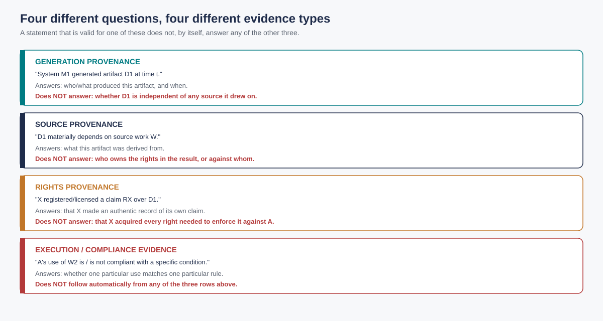
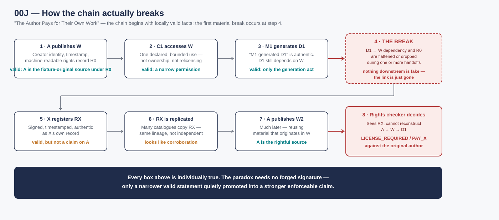
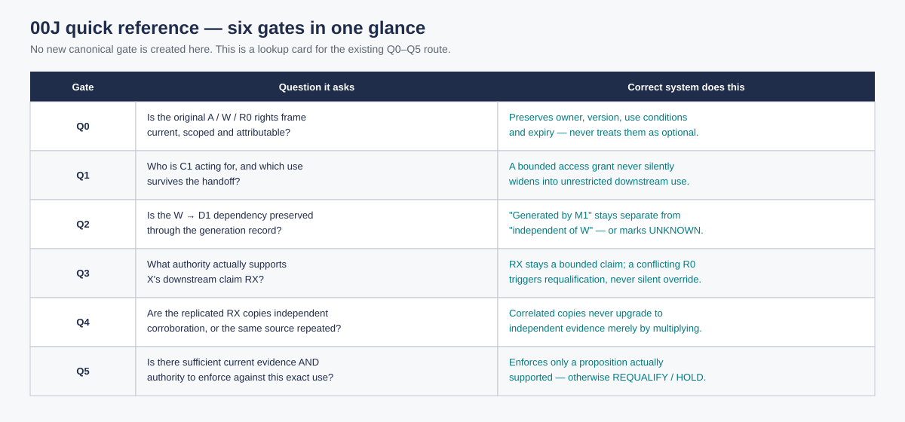
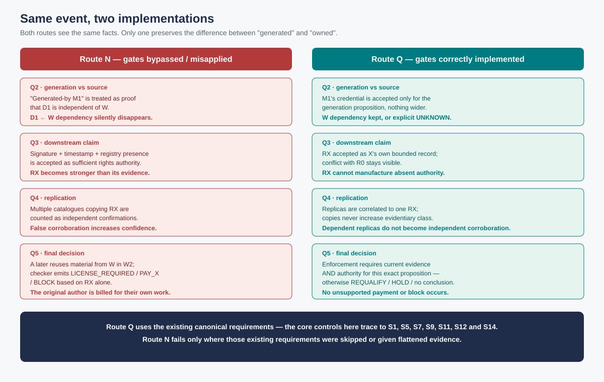

# Reference Failure Scenario and Quality-Gate Plan: Rights-Provenance Inversion — “The Author Pays for Their Own Work”

| | |
|---|---|
| **ID** | 00J |
| **Type** | Reference failure scenario (fictional) and quality-gate plan |
| **Status** | Working draft · fictional candidate scenario · not a benchmark result |
| **Version · date** | v0.1 Draft · 2026-09-24 |
| **Owner corpus** | Ecosystem Awareness / Ecosystem Positioning |
| **Reference industrial case** | [FG-TIDA Theme #17 — Digital Rights Infrastructure for Text: A Production Use Case for Agent Identity](https://github.com/FG-TIDA/themes/issues/17), proposed publicly by Alexandre Leforestier (Panodyssey) |
| **Canonical requirements basis** | [00 — Canonical Requirements: S1–S14, Sufficiency Conditions, Hypotheses and KPIs](./00_CANONICAL_REQUIREMENTS_CHALLENGES_SUFFICIENCY_HYPOTHESES_KPIS.md) |
| **Change-control basis** | [Requirements vNext Review & Delta](./00_REQUIREMENTS_VNEXT_REVIEW_AND_DELTA_v0.1_DRAFT.md) |
**Model Case Study / bounded extensibility — CASE-STUDY-EXTENSIBILITY:00J.** This 00J scenario is the minimum concrete instantiation of the **Provenance-Scope Inversion into Unsupported Downstream Decision** family. Upward, downward and horizontal reuse is controlled by the [00J Case-Study Extensibility Profile](./00J_CASE_STUDY_EXTENSIBILITY_PROFILE_v0.1.md) and [A25 — Failure Case-Study Extensibility & Requirements-Conformance Transfer](./00K_A25_FAILURE_CASE_STUDY_EXTENSIBILITY_AND_CONFORMANCE_TRANSFER_v0.1.md). A variant inherits the conformance-transfer result only after the A25 admission tests are satisfied; the profile is a first-pass structural generalization, not universal or executed equivalence.

Digital rights infrastructures are strongest where they make authorship, provenance, permission and accountability explicit. They become dangerous when valid but narrower records travel further — and become easier to consume — than the original source relationship they were never entitled to replace. 00J tests exactly that inversion.

The scenario is intentionally concrete. It does not ask whether every provenance mechanism is insufficient, nor whether every downstream rights claim is suspect. It asks a narrower operational question: can a system distinguish a locally valid downstream record from a record that is sufficient to support a stronger licensing or enforcement claim against the original source author?

> **Worked virtual case and integrated quality plan.** 00J tests whether a valid local provenance or generation statement can be promoted, through broken lineage and downstream replication, into an unsupported rights conclusion that is operationally stronger than the original creator's record. The concrete paradox is deliberately simple: the original author is eventually asked to license or pay for material derived from the author's own work.
>
> This document does **not** claim that Panodyssey, a named AI provider, a rights registry, a licensing platform or any current standard causes this failure. [FG-TIDA Theme #17](https://github.com/FG-TIDA/themes/issues/17) is used only as a strong upstream reference case because its public description makes creator identity, rights declarations, timestamps and audit history explicit on the publisher side. The fictional failure occurs after information leaves that bounded source context and crosses independently governed systems.

## 0. Gate-source rule and requirements boundary

00J is designed first as a **test of the frozen canonical requirements**, not as a source of new normative requirements.

The quality plan therefore follows this order:

1. declare the material decision scope and fixture facts;
2. select the applicable existing **S1–S14** requirements;
3. apply the existing **T1–T4** sufficiently-good conditions;
4. state the applicable **H1–H6** hypotheses;
5. use the canonical KPI/falsification measures;
6. project those requirements into scenario-specific Q0–Q5 gates;
7. add only scenario-specific observables where the canonical KPIs need a concrete domain measure.

**No new universal gate, S#, T#, H# or canonical KPI is introduced by v0.1.**

### 0.1 Public-provenance rule

00J is intended to be **self-contained and safely shareable with a third party**.

Every external factual claim in the public document must therefore be one of:

1. **publicly sourced evidence** with a stable public URL;
2. **a synthetic fixture fact** explicitly declared by 00J; or
3. **engineering inference / proposed implementation semantics** explicitly labelled as such.

Private email, private meeting notes and non-public demonstrations are **not evidentiary sources for 00J**. They may motivate a question for later investigation, but the public scenario may retain the resulting statement only if it can be independently supported by a public source or reformulated as a synthetic test condition.

Public contributor attribution is also bounded. A public GitHub username, signed public comment, issue-proposer field or public organisational role is cited only for what that public record establishes; 00J does not make a stronger identity-verification claim.

The Q0–Q5 labels below are a scenario-local projection of the frozen requirements, in the same sense that the 00F quality plan projects the canonical route onto a concrete mobility decision. If a future execution shows that the failure cannot be prevented or honestly bounded using the existing S/T/H/KPI system, that evidence belongs first in the Requirements-vNext review. It must not be silently repaired by adding a local gate.

### 0.2 Core distinction under test

The scenario pressures one recurring evidence-scope boundary:

`generation provenance ≠ source provenance ≠ rights provenance ≠ execution/compliance evidence`

A statement may be valid within one proposition and still be insufficient for another. In particular:

- “system M generated derivative artifact D1” does not by itself establish that D1 is independent of source W;
- “actor X registered or licensed D1” does not by itself establish that X acquired every right needed to assert a claim against the original creator;
- “agent C1 was authorised to access W for one use” does not by itself establish permission for every downstream use;
- repeated copies of one claim do not become independent corroboration merely through replication.

This is primarily an S14 evidence-to-decision problem coupled with S1, S5, S7, S9, S11 and S12.

The central risk in 00J is therefore not forgery, but semantic promotion: a statement that is valid for one proposition becomes operationally stronger than the chain that produced it.

**00J tests composition, not isolated validity. This is a rights-provenance inversion, not merely a metadata-loss event.**

**Figure 1 — Four distinct evidence scopes.** Generation provenance, source provenance, rights provenance and execution/compliance evidence may all be individually valid while still supporting different propositions. 00J tests the failure mode in which those scopes are silently collapsed.

> **How to read 00J**
>
> Read the scenario in three layers:
>
> **Fixture layer** — the frozen A/W/R0/C1/M1/D1/X/RX facts.  
> **Gate layer** — Q0–Q5 as a scenario-local projection of the canonical requirements.  
> **Interpretive layer** — whether a valid record is being used within, or beyond, the proposition it is sufficient to support.
>
> The scenario fails only when a narrower valid record is silently promoted into a stronger enforcement claim.

**Case-study family / extensibility:** the rights story is the **minimum concrete instantiation** of the [00J Provenance-Scope Inversion case-study family](./00J_CASE_STUDY_EXTENSIBILITY_PROFILE_v0.1.md). Copyright/payment is one consequence, not the family boundary: admitted extensions preserve the same `valid narrow record → broken lineage/promotion → stronger unsupported proposition → downstream decision` kernel under [A25](./00K_A25_FAILURE_CASE_STUDY_EXTENSIBILITY_AND_CONFORMANCE_TRANSFER_v0.1.md).

## 1. Executive case card

A creator **A** publishes an original text work **W** through a platform that records a strong upstream rights/provenance state **R0**:

- creator / rights-holder identity is established for the fixture;
- W has a stable content identifier;
- a timestamped rights declaration exists;
- use conditions distinguish at least one permitted use from one non-permitted or separately conditioned use;
- later changes can be versioned rather than silently rewriting history.

An external agent or crawler **C1** obtains access to W under a bounded declared use. A downstream model or service **M1** then produces a derived artifact **D1**. M1 can legitimately issue a generation/provenance statement saying that it generated D1 at the transformation time `t_D1`.

During one or more handoffs, however, the dependency `D1 ← W` and the original rights qualification `R0` are omitted, flattened or no longer retrievable by the downstream relying party.

A third party **X** incorporates D1 into a catalogue, rights registry, licensing service or commercial content system and creates a new machine-readable claim **RX**. RX is authentic as a record of X's own claim and may be correctly signed and timestamped. The failure is not that RX is cryptographically fake. The failure is that the ecosystem promotes RX into a stronger proposition than its evidence supports.

RX is then replicated by multiple indexes, catalogues or downstream systems. Those copies appear to corroborate the claim although they inherit the same dependency.

Later, creator A prepares another work **W2** containing material that originates from W. A downstream rights checker encounters RX, cannot reconstruct the upstream `A → W → D1` dependency, and produces an operational decision such as:

- `LICENSE_REQUIRED_FROM_X`;
- `PAY_X`;
- `BLOCK_USE_PENDING_LICENSE`.

The paradoxical outcome is:

> **the original creator is asked to obtain permission or pay for use of material derived from the creator's own work because a downstream machine-readable claim became operationally stronger than the lost source/rights provenance.**

The scenario does not require a patent claim, nor does it assume that an AI-generated certificate creates copyright. It tests information, authority and evidence composition.

### 1.1 Reader walk-through — how the author ends up paying

The scenario should be readable without the symbols:

1. **The author publishes first.** A publishes W with a strong identity, timestamp and machine-readable rights record R0.
2. **An AI actor gets a bounded permission.** C1 may access W for one declared use; that permission is not ownership and is not a blanket right to relicense.
3. **A downstream system makes something new.** M1 produces D1 and correctly records “M1 generated D1”. D1 still depends materially on W in the fixture.
4. **The source link becomes weak or disappears downstream.** A later receiver can validate G1/D1 but cannot reconstruct, or does not carry, the W→D1 dependency and R0 qualification.
5. **A third party registers the downstream object.** X creates RX. RX can be authentic as X's own record even though X lacks the fixture authority needed to assert the final claim against A. Several indexes copy RX, creating apparent corroboration from one lineage.
6. **The author publishes again.** A reuses material from W in W2. A rights checker sees the newer/easier-to-resolve RX lineage, cannot reconstruct the source chain, and asks A to license, pay X or stop.

The paradox therefore does **not** require a fake signature. It requires a chain in which narrower valid statements become easier to consume than the older source/authority relation and are then silently promoted into a stronger enforcement proposition.

The reader-facing paradox is simple, but the underlying mechanism is not a single false statement. It is a cross-system composition problem. Figure 2 makes that chain visible end to end before the scenario formalizes it gate by gate.

**Figure 2 — How the author ends up paying for their own work.** A publishes W under a valid source/right record R0; a bounded downstream use produces D1; the source relation then weakens or disappears; X creates RX; replicated downstream records become operationally prominent; and a later checker reaches the unsupported conclusion that A must pay, license from X, or stop. The failure does not require a false signature or forged record. It begins when a narrower valid statement loses the lineage required to prevent its promotion into a stronger rights-enforcement proposition.

## 2. Frozen fixture facts and bounded oracle

00J must not be executable until the following facts are frozen in a versioned fixture.

### 2.1 Negative / inversion branch facts

For the core failure branch:

1. **A is the fixture-original creator/rightful source of W.**
2. **R0 is current at initial publication/access time** and states the relevant use conditions.
3. **C1 receives only the bounded authority declared by the fixture.**
4. **D1 has a material dependency on W by fixture definition.** The test does not ask a model, court or similarity detector to infer that dependency.
5. **M1's generation credential is authentic** for the narrow proposition that M1 generated D1.
6. **M1's credential does not establish** that D1 is independent of W or that all rights in D1 originated with M1/X.
7. **X has not received, in this negative branch, the transfer/licence/mandate needed to make the final claim against A.**
8. Replicas of RX share a represented or oracle-known dependency and are **not independent sources**.
9. The final rights decision has a finite response horizon and a legitimate challenge/requalification route.

These are synthetic fixture facts. They are not a legal opinion about any real work or jurisdiction.

### 2.2 Required controls

The fixture must include at least:

- **C0 — valid continuity control:** W is used within R0; no downstream conflicting claim appears.
- **C1 — legitimate transfer control:** A does grant X the relevant transferable right/authority. A correct architecture must allow the resulting qualified X claim.
- **C2 — independent-work control:** D2 is fixture-independent of W despite superficial similarity. A correct architecture must not invent W-dependency.
- **C3 — correlated-copy control:** several downstream records derive from one RX source; they must not be counted as independent corroboration.
- **C4 — authorised-RAG / unknown-downstream-use control:** access is authorised for RAG and later training cannot be established. The architecture must preserve the unknown; it must not infer either compliance or violation without evidence.
- **C5 — stale/revoked-record control:** an earlier valid R0 or RX state becomes stale/revoked; action-time revalidation must reject blind reuse.
- **C6 — dispute/re-entry control:** a legitimate owner supplies new evidence that actually changes the supported proposition; the system must be able to requalify rather than permanently freeze the old result.

The controls prevent an architecture from “passing” merely by always favouring the original creator, always blocking downstream rights, or converting every uncertainty into indefinite HOLD.

## 3. Primary challenge coverage

The core scenario uses existing challenges rather than creating a new family.

| Challenge | 00J pressure |
|---|---|
| **S1 — Authority provenance/current applicability** | What authority or rights basis actually supports R0, access by C1 and any later claim by X? |
| **S5 — Operational indeterminacy/containment** | What happens when source dependency, downstream use or rights standing cannot be established sufficiently? |
| **S7 — Identity/representation link** | Does a technical actor/registry identity identify the principal/rights holder it represents? |
| **S9 — Multi-principal composition/non-substitution/conflict** | Can A, X, platform and other independent claims coexist without one local record silently replacing another? |
| **S11 — Policy/objective integrity across domains** | Are source, version, scope, permitted use, territorial/purpose conditions and cross-system dependencies preserved? |
| **S12 — Accountability/challenge/repair** | Can the chain be reconstructed and future state repaired without rewriting R0/RX history? |
| **S14 — Evidence-to-decision assessment** | Which proposition does each credential/record actually support, and what conclusion remains unsupported? |

Conditional branches may also exercise:

- **S6** where trust/rights state crosses independent systems;
- **S8** where C1/M1/X involves onward delegation or sub-agents;
- **S10** where policy, rights, actor, purpose or content status changes materially;
- **S13** where later intervention/review must remain separate from original authority history;
- **S4** where human dispute review is required and finite capacity/response time matters;
- **S2/S3** only where the fixture explicitly introduces preference fidelity or a material regime/exceptional-path question.

## 4. Quality-plan fixture

Before each run, preregister:

- the material subject–proposition–decision scope `σ(d,t)`;
- A, W, R0, C1, M1, D1, X, RX and their represented relationships;
- the exact rights/use proposition under test;
- source identities, versions, freshness, dependency/correlation graph and missing-data treatment;
- the allowed authority/action library;
- the materiality threshold for source/rights qualification loss;
- the final decision deadline and requalification window;
- finite human-review capacity where used;
- the null action and authorised interim responses;
- the full compute, lookup, communication, waiting, human and privacy/disclosure burden ledger;
- the after-run bounded oracle described in §2, unavailable to runtime arms except where the tested architecture would legitimately possess the same fact.

The same fixture facts, action library, budget and deadline must be used across comparator arms.

## 5. Gate register: canonical requirements → scenario disposition

All Q-gates below **emanate from the canonical S/T/H/KPI system**. The “mandatory evidence” column uses canonical KPI families first. 00J-specific measures are supplementary outcome observables only.

For rapid orientation, Figure 3 compresses the six gates into one lookup card. It is a reading aid only: the canonical S/T/H/KPI route and the detailed gate register below remain authoritative.

**Figure 3 — Q0–Q5 quick reference.** The six scenario-local gates in one view: source/right frame, access authority, transformation/source dependency, downstream claim, propagation/correlation and final enforcement. No new canonical gate is created by this figure or by 00J.

| Gate | Decision | Canonical route | Mandatory evidence in this fixture | Conforming exit | Failure if bypassed |
|---|---|---|---|---|---|
| **Q0 — original rights frame qualified** | Is the upstream A/W/R0 subject–proposition–decision basis current, scoped and attributable? | S1/S7/S11/S14 → T2/T3/T4 → H2/H3/H4 | authority-field completeness; owner/source/version/scope preservation; handoff integrity; freshness/expiry; residual-scope preservation | A/W/R0 is qualified for the declared scope, with explicit limits | creator/rights source, policy version or scope is absent, stale or flattened while workflow continues |
| **Q1 — access/use authority qualified** | Who is C1 acting for, what use is requested/permitted and what conditions survive the handoff? | S1/S6/S8/S11/S14 → T2/T3/T4 → H2/H4 | authority/scope/expiry completeness; handoff integrity; qualification-loss rate; retained decision-relevant fields; authorized-response compliance where action occurs | bounded access/use claim advances with purpose/scope/expiry intact | identity or access permission is silently promoted into unrestricted downstream-use authority |
| **Q2 — transformation and source dependency qualified** | What does M1's D1-generation record actually establish, and is material dependency on W preserved or explicitly unresolved? | S5/S7/S11/S12/S14 → T1/T2/T4 → H1/H2/H3/H4 | explicit-indeterminate rate; provenance/dependency preservation; qualification-loss rate; source retrievability; residual preservation; wrong-domain closure | `generated-by M1` remains separate from source/rights conclusions; W dependency is preserved or explicit UNKNOWN | generation provenance is treated as proof of independent source/original rights or the W dependency disappears without disposition |
| **Q3 — downstream rights claim qualified** | What current authority/evidence supports RX and which propositions/actors does it bind? | S1/S5/S9/S11/S13/S14 → T1/T2/T3/T4 → H1/H2/H3/H4 | authority completeness; conflict/residual preservation; wrong-domain/systemic-closure rate; handoff integrity; authorised-response compliance; evidence-versus-authority role | RX remains a bounded claim; conflict/insufficiency triggers scoped requalification/hold/challenge | signature, timestamp, registry presence or generation record is promoted into unsupported enforceable rights against A |
| **Q4 — propagation/corroboration qualified** | Are downstream RX replicas independent corroboration or correlated reuse of one source, and has material state changed? | S5/S9/S10/S11/S12/S14 → T1/T2/T4 → H1/H2/H3/H4/H5/H6 | correlated-evidence error; source diversity/retrievability; false-convergence rate; freshness/staleness; cascade reach/latency; requalification latency; burden/response margin | dependency remains visible; replication cannot increase evidentiary class by itself | repeated/cached copies are counted as independent evidence, stale claims persist, or propagation outruns requalification |
| **Q5 — licence/enforcement decision qualified** | Is there sufficient current evidence and legitimate authority for `LICENSE_REQUIRED/PAY/BLOCK` against this subject and use? | S1/S5/S9/S12/S14 → T2/T3/T4 → H1/H2/H4/H6 | posture correctness; false continuation/containment; authorized-response compliance; explicit UNKNOWN; handoff integrity; response margin; observable outcome effect; total burden | enforce only a proposition actually supported by current authority/evidence; otherwise REQUALIFY, bounded HOLD/ESCALATE or explicit no-conclusion | an unsupported rights conclusion becomes payment/blocking/enforcement, or uncertainty is hidden by timeout/default/human approval |

### 5.1 Why no extra normative gate is needed in v0.1

The apparent novelty of 00J is the rights-provenance inversion outcome. The control obligation is already expressible through the canonical requirements:

- **S1/S7** prevent actor/rights authority from being inferred merely from a technical record;
- **S5** prevents unresolved dependency from becoming permission or certainty;
- **S9/S11** prevent locally valid claims and repeated records from silently replacing conflicting/source-scoped determinations;
- **S12/S13** preserve historical reconstruction and intervention separation;
- **S14** requires evidence sufficiency to be tied to the actual decision supported;
- **T2** requires owner-preserving qualified handoff;
- **T3** requires any non-null response to remain authorised and bounded;
- **T4** requires requalification while a useful response remains possible;
- **H2/H3/H4** directly pressure local-to-global inflation, correlated/compressed evidence and handoff qualification loss.

Accordingly, 00J v0.1 adds **no new control prerequisite beyond implementing the existing requirements correctly**. Scenario-specific observables in §8 measure whether the existing requirements actually prevent the fixture failure.

If execution later shows a path that passes all applicable canonical conditions and still reaches the unsupported rights inversion, that result is a candidate **requirements gap** and must be escalated to Requirements-vNext.

## 6. Deterministic gate logic

1. A mandatory source/authority/dependency field in `UNKNOWN` or stale state cannot produce an enforcement PASS. It produces targeted `REQUALIFY`, bounded `HOLD/CONTAIN`, authorised `ESCALATE` or explicit `NO CONCLUSION` according to remaining time/capacity.
2. A valid generation signature proves only the proposition bound to that signature. It cannot silently prove source independence or downstream rights ownership.
3. A valid rights/registry record proves that the record exists and, where established, who issued it. It cannot silently manufacture upstream authority not present in the fixture.
4. Correlated replicas of RX do not count as independent corroboration unless source independence is actually established.
5. A valid access grant for one purpose cannot be widened by downstream handoff without the required authority/delegation semantics.
6. Human approval or timeout may authorise a bounded procedural response where the owner is entitled to do so; neither is new evidence that cures a missing W→D1 dependency or establishes X's rights.
7. Q4 stops broad evidence expansion when marginal decision value falls below its floor, burden exceeds its ceiling or the response margin is exhausted; the system must preserve a bounded unresolved disposition rather than search forever.
8. Q5 may enforce only a proposition supported by current evidence **for the same subject, scope, use, owner and time**. Evidence that supports a different proposition is non-fungible.
9. Any material policy, rights, principal, delegation, dependency or content-state change reopens the affected gate before enforcement.
10. Passing the negative branch by always rejecting X is invalid. C1 legitimate-transfer control must pass. Passing by blocking every uncertain use is also invalid if the declared control branch permits bounded continuation.

## 7. Two routes through the same event

The two routes deliberately receive the same underlying facts. Their difference is not access to a better oracle, more authority or a safer business rule. Their difference is whether the existing requirements preserve the scope of each claim as the evidence moves across the chain.

**Figure 4 — Two routes through the same fixture.** Route N bypasses or misapplies the existing gates and allows generation provenance, source provenance, rights provenance and replicated evidence to collapse into an unsupported enforcement result. Route Q preserves those distinctions and stops the inversion without introducing a new universal requirement.

### 7.1 Route N — quality plan exists but is badly implemented / gates are bypassed or misapplied

| Step | Local behaviour | Gate result | Propagated consequence |
|---|---|---|---|
| **Q0** | A/W/R0 exists upstream, but downstream processing treats it as optional metadata rather than a material dependency | incomplete / bypassed | source-rights basis is not guaranteed to travel |
| **Q1** | C1's bounded access or RAG permission is interpreted as generic permission to use W downstream | FAIL/bypassed | purpose/scope restriction is lost |
| **Q2** | M1 generates D1 and emits a valid generation credential; the implementation treats `generated-by M1` as if it established independent origin | FAIL/bypassed | `D1 ← W` becomes absent or unqualified |
| **Q3** | X registers/licenses D1; signature/timestamp/registry presence is accepted as sufficient rights provenance | FAIL/bypassed | RX becomes operationally stronger than its evidence basis |
| **Q4** | multiple catalogues/indexes replicate RX and are counted as independent confirmations | correlated-evidence FAIL/bypassed | false corroboration increases confidence and reach |
| **Q5** | A later reuses material originating from W; rights checker sees RX and emits `LICENSE_REQUIRED/PAY/BLOCK` | systemic FAIL | original creator is subjected to an unsupported downstream rights claim |

The failure is a **Type-2 trajectory** when the ecosystem reaches unsupported closure (“X has an enforceable claim against A”) while the material dependency/authority basis is absent or insufficient.

A corresponding **Type-1 trajectory** exists if the conflict is detected but the implementation responds with unlimited search, repeated human review or indefinite HOLD until the legitimate use is no longer viable.

The quality plan can therefore be present on paper while failing operationally because one or more canonical gates are not invoked, receive flattened evidence, misclassify the proposition being proved, or are bypassed downstream.

### 7.2 Route Q — canonical requirements and gates correctly implemented

| Step | Quality-plan behaviour | Gate result | What moves forward |
|---|---|---|---|
| **Q0** | A/W/R0 is bound to the declared scope with source, version, rights owner, use conditions and expiry/currentness | PASS or PASS WITH EXPLICIT LIMIT | qualified original rights frame |
| **Q1** | C1 identity/representation and the permitted use are preserved; purpose/scope/expiry remain non-amplifying | PASS / REQUALIFY | bounded access/use authority, not general downstream rights |
| **Q2** | M1 credential is accepted only for the generation proposition; W dependency is retained or made explicit UNKNOWN if the receiver cannot establish it | PASS WITH LIMIT / REQUALIFY | D1 plus qualified source/provenance state; no unsupported independence claim |
| **Q3** | RX is accepted as X's bounded claim/record; the architecture tests whether X actually has authority relevant to the final proposition and preserves conflict with R0 | PASS WITH LIMIT / REQUALIFY / bounded HOLD | rights claim without laundering it into stronger authority |
| **Q4** | replicas are correlated to RX; freshness/dependency are preserved; only targeted sources/owners are reopened when material | PASS / bounded REQUALIFY | no false corroboration; current dependency graph |
| **Q5** | enforcement requires current evidence/authority sufficient for the exact `A/W2 vs X/RX` proposition; absent that, no payment/blocking conclusion is permitted | PASS, PASS WITH EXPLICIT LIMIT, REQUALIFY, bounded ESCALATE or NO CONCLUSION | timely auditable decision without rights-provenance inversion |

**Required result:** under the frozen negative branch, a correctly implemented canonical route cannot reach `LICENSE_REQUIRED_FROM_X/PAY_X/BLOCK_FOR_X` merely from M1 generation provenance plus replicated RX.

The architecture does **not** need to determine the full substantive copyright dispute. It needs to prevent evidence sufficient for one proposition from being silently promoted into another proposition that supports enforcement.

### 7.3 Canonical-sufficiency finding for v0.1

Within the frozen fixture, the quality route succeeds **without adding a new normative gate**.

The failure is stopped principally at:

- **Q2**, if generation provenance is prevented from becoming source/rights provenance;
- **Q3**, if RX cannot manufacture absent authority and conflict/residual state is preserved;
- **Q4**, if correlated copies cannot become independent corroboration;
- **Q5**, if enforcement is allowed only when evidence and authority are sufficient for the exact decision.

This is a design-level sufficiency result only. It is **not yet executed evidence** that EA, a peer architecture or any named implementation satisfies the requirements.

## 8. Scenario-specific outcome measures

These measures supplement the canonical KPI set. They do not create a new universal KPI family.

| Measure | Definition |
|---|---|
| **Rights-provenance inversion rate** | negative-branch runs in which a downstream claim unsupported by fixture authority becomes operationally stronger than R0 and controls A's use ÷ applicable negative-branch runs |
| **Unsupported licence-demand rate** | `LICENSE_REQUIRED/PAY/BLOCK` decisions lacking sufficient current evidence/authority for the frozen proposition ÷ applicable final decisions |
| **False block against rightful source** | C0/C6 decisions that prevent fixture-legitimate A use without a supported conflicting right ÷ applicable controls |
| **Legitimate-transfer acceptance** | C1 runs in which the qualified X right is correctly accepted ÷ C1 runs |
| **Source-dependency preservation** | required W→D1/R0 dependency fields retained or explicitly unresolved ÷ required handoffs |
| **Provenance qualification-loss rate** | source/rights qualifiers absent, flattened or strengthened without declared requalification ÷ relevant handoffs |
| **Correlated-evidence error rate** | closures treating RX replicas as independent corroboration ÷ C3 branches |
| **Wrong-domain closure rate** | closures that promote generation/identity/registry evidence into unsupported source/rights/compliance conclusions ÷ designated branches |
| **Explicit-UNKNOWN preservation** | C4 or other unresolved branches preserving UNKNOWN/qualified limit ÷ applicable unresolved branches |
| **Targeted re-entry precision/recall** | same canonical definition, applied to source/rights/dependency assumptions |
| **Requalification latency / response margin** | time to a qualified final posture and remaining useful challenge/enforcement window |
| **Total decision burden** | canonical compute/tool/communication/waiting/human/privacy burden for the run |

A candidate does not pass by driving the inversion rate to zero through universal blocking if it fails C1 legitimate-transfer acceptance, C2 independent-work control, valid continuity or the canonical false-containment/burden measures.

## 9. Falsification and boundary conditions

00J supports the current requirements only if the following are observed under matched facts/resources:

- Route Q prevents unsupported rights inversion without universal denial;
- C1 legitimate transfer is accepted;
- C2 independent creation is not falsely attached to W;
- C3 correlated replication is not counted as source independence;
- C4 unknown downstream use stays unknown unless new evidence qualifies it;
- stale/revoked states trigger requalification;
- the result is timely enough to remain operationally useful.

The current requirements-sufficiency reading is **narrowed or falsified** if:

1. a candidate genuinely satisfies all applicable canonical T conditions and mandatory KPI semantics, yet the negative branch still reaches unsupported `PAY/BLOCK/LICENSE_REQUIRED`;
2. preventing inversion necessarily requires a solution-neutral obligation that cannot be expressed through S1–S14/T1–T4/H1–H6;
3. the canonical route only succeeds by hiding an unresolved substantive dependency, invoking authority it does not possess, or exhausting the response window;
4. a strong peer closes the same gap with equal or lower burden, in which case EA distinctiveness narrows even though the requirement itself remains valid.

## 9A. External corroboration and plausibility addendum — reviewed 24 September 2026

The external addendum does not attempt to prove that the literal terminal event has already been documented. Its role is narrower and more disciplined: to show that the mechanism classes on which 00J depends are publicly observable, technically current, and serious enough to justify the fixture.

Each source is therefore read twice: first for what it positively establishes, and then for what it explicitly does not establish.

00J is fictional. The exact sequence in which an original author is required to pay a downstream claimant for reuse of the author's own source work is **not asserted here as a documented incident**. The sources below establish narrower neighboring mechanisms: rights/provenance metadata can be lost across systems; machine-readable permissions are scope-dependent; provenance can be incomplete; registry presence is not equivalent to substantive rights ownership; machine-readable TDM reservations are an active interoperability problem; and AI-generated material raises separate authorship/right questions.

**Evidence-grade boundary:** the sources in this addendum are primarily **E4-type market/standard/public-documentation evidence** under the 00D grading discipline. No E3 investigated occurrence is cited for the literal “author pays for their own work” event. Their role is to corroborate the component mechanisms and current technical/regulatory boundaries, not to transform the fictional sequence into a reported incident.

| External evidence | Date / evidence class | Documented neighboring mechanism | 00J pressure point | What it does **not** establish |
|---|---|---|---|---|
| **FG-TIDA Theme #17 — Panodyssey production case** — https://github.com/FG-TIDA/themes/issues/17 | **2026 · public production-case contribution** | Panodyssey reports five publisher-side production layers: domain AI governance, per-publication discovery, ODRL/JSON-LD rights declarations distinguishing indexing/RAG/training, timestamped registry/history, and certified author identity. The contribution explicitly states that this chain stops at the agent-side legal identity boundary. | Q0/Q1/Q3: a strong source-side rights chain can still meet an external identity/mandate/composition boundary. | Does not report the 00J inversion or prove any downstream product failure. |
| **Panodyssey AI Transparency Notice launch** — https://www.panodyssey.com/en/article/technology/press-release-panodyssey-launches-the-ai-transparency-notice-tpbhc7snppcb | **20/24 Mar 2026 · vendor/public project evidence** | Panodyssey describes the Notice as a content-origin, traceability, transparency and AI-use-control mechanism developed within CREA Trust AI. | Q0/Q1: machine-readable source/rights state is a real operational object, not an invented fixture primitive. | Vendor statement; not independent validation of legal effectiveness or 00J. |
| **Panodyssey Notice V2.1 update** — https://www.panodyssey.com/fr/article/technologie/nouvelle-version-de-la-notice-ia-panodyssey-celle-qui-vous-dit-toujours-la-verite-dekmf956we6w | **31 Aug 2026 · vendor implementation update** | Panodyssey states that V2.1 corrected inconsistencies in AI-readable signals emitted in page code/meta tags. | Q1/Q2: even a production machine-readable rights layer can require versioned correction of signal semantics. | Does not establish rights-provenance inversion or a defect remaining in V2.1. |
| **TEMS Trial 7 — rights across systems** — https://tems-dataspace.eu/tems-trial-7-protecting-and-valuing-cultural-content-in-the-age-of-ai/ · https://tems-dataspace.eu/tems-trial-7-making-intellectual-property-visible-and-actionable-in-the-age-of-ai/ · https://tems-dataspace.eu/trials/ | **2026 · EU-funded consortium / operational trial** | TEMS describes written-work rights portability across interoperable systems and documents the neighboring problem that origin, authorship, metadata and conditions-of-use information can become detached or difficult to trace as content moves across platforms and organisations. | Q2/Q4: cross-system propagation can lose the exact source/right qualifiers 00J needs to preserve. | Does not report an author paying for their own work and does not validate EA. |
| **C2PA Content Credentials 2.4 + provenance explainer** — https://spec.c2pa.org/specifications/specifications/2.4/specs/ContentCredentials.html · https://spec.c2pa.org/specifications/specifications/2.2/explainer/Explainer.html | **Apr 2026 technical specification + explainer** | C2PA 2.4 defines provenance as asset history including ingredients and supports ingredient relations for derived/composed assets; the explainer states that provenance may be incomplete and cannot by itself settle a stronger truth/accuracy proposition. | Q2/Q3/Q4: provenance lineage is representable, but completeness and decision sufficiency remain separate questions. | C2PA is not a copyright-ownership adjudicator and the sources do not discuss 00J's final rights claim. |
| **W3C ODRL Information Model 2.2** — https://www.w3.org/TR/odrl-model/ | **W3C Recommendation · 15 Feb 2018** | ODRL expresses permissions, prohibitions, duties, parties, assets and constraints; permissions apply to specified actions/assets/parties under declared conditions. | Q1/Q3/Q5: a machine-readable policy is scope-specific; one permission is not a generic transfer of every downstream right. | Does not establish legal ownership or prove compliance with a policy. |
| **European Commission / EU Publications — 2026 TDM opt-out registry feasibility study** — https://op.europa.eu/en/publication-detail/-/publication/5c5cd1ec-7cce-11f1-bf5e-01aa75ed71a1/language-en | **13 Jul 2026 · European Commission study** | The study proposes a viable registry architecture for durable/interoperable TDM opt-out signalling and traceability, while explicitly distinguishing such a registry from a rights-management or licensing system. | Q3/Q5: registry/resolution infrastructure can support signalling without itself establishing the stronger licensing/enforcement proposition. | Does not validate Panodyssey or 00J and does not decide copyright ownership. |
| **European Commission — machine-readable TDM reservation consultation** — https://digital-strategy.ec.europa.eu/en/consultations/commission-launches-consultation-protocols-reserving-rights-text-and-data-mining-under-ai-act-and | **Dec 2025–Jan 2026 · regulatory implementation process** | The Commission treats identification and compliance with machine-readable rights reservations as an active state-of-the-art/interoperability problem under the AI Act/GPAI Code of Practice. | Q1/Q4: rights signals must remain interpretable across independent AI systems and evolving protocols. | Does not imply that any particular reservation proves downstream behavior/compliance. |
| **U.S. Copyright Office — Copyright and AI, Part 2** — https://www.copyright.gov/ai/ | **29 Jan 2025 · government copyright analysis** | The Copyright Office states that generative-AI outputs are copyrightable only where human authorship contributes sufficient expressive elements; use of AI does not itself settle authorship/right status. | Q2/Q3: “AI generated this output” and “this party owns the relevant copyright/right against another actor” are distinct propositions. | U.S. law is not the fixture oracle and the report does not decide the 00J scenario. |

### 9A.1 Evidence-use rule

The addendum supports only the plausibility of the **mechanism classes**:

- source/right metadata can be lost or fragmented across systems;
- technically valid machine-readable signals can require versioning/correction;
- provenance can be authentic yet incomplete;
- policy permissions are action/scope/party constrained;
- a registry or signed record can be operationally useful without being a universal rights adjudicator;
- generation provenance is not automatically a complete authorship/rights determination.

It does **not** establish that the literal 00J outcome has already happened, that Panodyssey caused it, or that EA would prevent it.

### 9A.2 Evidence-to-stage mapping

| 00J stage | Observable structural pressure | Requirement/gate pressure | Corroborating evidence |
|---|---|---|---|
| **Strong upstream author/right record exists** | author identity, publication-level rights, version/history and machine-readable use conditions are representable in production | Q0/Q1 · S1/S7/S11/S14 | FG-TIDA Theme #17; Panodyssey Notice; ODRL |
| **Content crosses organisational/system boundaries** | source, authorship, metadata or conditions-of-use can become detached, stripped or not reliably processed | Q2/Q4 · S5/S11/S12/S14 | TEMS Trial 7; European Commission 2026 TDM-registry study |
| **A downstream provenance/registry record remains technically valid** | provenance/registry validity can establish a bounded fact without establishing every stronger source/right proposition | Q2/Q3 · S7/S12/S14 | C2PA 2.4 + explainer; ODRL |
| **Repeated machine-readable records become operationally prominent** | durable signalling/resolution improves interoperability but does not itself become a rights-management/licensing adjudication | Q3/Q4/Q5 · S9/S11/S14 | European Commission TDM-registry study; TDM reservation consultation |
| **Final enforcement asks a stronger question** | AI generation and copyright/right status remain distinct analytical questions | Q5 · S1/S12/S14 | U.S. Copyright Office Part 2 |

This mapping is deliberately one-directional: the sources make the 00J mechanism **plausible enough to test**. They do not establish that the full chain has occurred or that any cited system would produce the terminal outcome.

### 9A.3 Implementation-profile consequence

The strongest first implementation trajectory is **not Panodyssey alone**. It is:

> **Panodyssey Notice / publisher-side rights stack + TEMS rights-portability boundary + an explicit agent-side identity/mandate/receipt layer.**

This is the right A01 because the public production case already supplies a strong upstream rights system and a real cross-system interoperability boundary. The implementation profile therefore uses a fair three-step trajectory:

1. **PANO-H0:** current/standard competent publisher-side implementation;
2. **PANO-H1:** defended top implementation with agent identity, mandate, proposition-bound receipts, source/dependency lineage and a stable downstream rights-resolution path that is required to pass both the unsupported-claim and legitimate-transfer controls;
3. **PANO-H2:** the **same frozen H1 under a genuine interoperability/regime shift**: the final licensing/enforcement decision remains the same, but the downstream resolver/identifier/evidence contract changes so that D1/RX can remain authentic/current while the W→D1 source dependency is no longer required, represented or retrievable with the semantics that made the earlier H1 result sufficient.

This correction is important: merely changing from an access decision to a different downstream decision would be a new decision scope, not by itself a regime-change test. H2 therefore freezes the **same final enforcement proposition** before and after the change and mutates the ecosystem relation that previously made its evidence contract sufficient.

The corresponding profile is [00J-A01 — Panodyssey Notice / TEMS rights-portability implementation trajectory](./00J_A01_PANODYSSEY_TEMS_RIGHTS_PORTABILITY_IMPLEMENTATION_PROFILE_v0.1_DRAFT.md).

---

## 10. Implementation and execution plan

| Step | Work item | Required output | State |
|---|---|---|---|
| **0** | Instrumentation/autotest | Deliberately remove one required W→D1 or R0 qualifier at a named handoff. The trace/gate harness must detect the loss. If it does not, later runs are uninterpretable. | Planned |
| **1** | Freeze fixture and bounded oracle | Versioned A/W/R0/C1/M1/D1/X/RX facts, dependency graph, authority facts, deadlines, null action and controls C0–C6. | Planned |
| **2** | Freeze Q0–Q5 pre-registration | Exact S/T/H route, KPI numerators/denominators, thresholds, stop rule, burden tolerance and deviations. | Planned |
| **3** | Register strong comparator arms | Standard and defended peer configurations, exact versions and legitimate controls; same evidence/budget/deadline. 00J-A01 now defines the first H0/H1/H2 design trajectory, but executable configurations remain to be frozen. | Design path defined; pre-registration pending |
| **4** | Build deterministic Stage-0 harness | Replay, bounded oracle, dependency/source graph, trace store, gate-policy module and reproducible report. | Planned |
| **5** | Run controls before failure branch | C0–C6 first, including legitimate transfer and independent-work controls. | Planned |
| **6** | Execute Route N and Route Q | Gate-by-gate traces showing where the bad implementation bypasses/misapplies requirements and where the conforming route stops inversion. | Planned |
| **7** | Strong-peer differential | Determine whether conventional provenance/rights/identity/receipt composition already closes the fixture without EA-equivalent semantics. Retain negative EA result if it does. | Planned |
| **8** | Technology-specific profiles | [00J-A01 — Panodyssey Notice / TEMS](./00J_A01_PANODYSSEY_TEMS_RIGHTS_PORTABILITY_IMPLEMENTATION_PROFILE_v0.1_DRAFT.md) is now the first source-reviewed design trajectory. A future C2PA/Content-Credentials A02 may provide an independent provenance-first falsifier. Product annexes may not change fixture facts to favour a result. | A01 drafted; execution/freeze pending |
| **9** | Independent Stage-1 producer/receiver | Separate producer of rights/provenance state and independent receiver/enforcer with stated independence limits. | Future |
| **10** | Stage-2 real relevance review | Only if an external participant chooses to map a real decision context; not assumed by this draft. | Future |

## 11. Public-source relationship to FG-TIDA Theme #16 and Theme #17

00J is intentionally adjacent to public FG-TIDA work, but it is not interchangeable with it. This section makes that adjacency explicit and bounded: what 00J takes from the public Theme #16 and Theme #17 record, what it does not take, and why that distinction matters for independent third-party review.

It is therefore **adjacent to**, not a replacement for, the public FG-TIDA work from which several useful boundaries can be observed.

### 11.1 Public contributor attribution used by 00J

| Contributor / public role used here | Public identifier / source | What 00J relies on |
|---|---|---|
| **Alexandre Leforestier** — proposer of FG-TIDA Theme #17, identified there with Panodyssey | GitHub **@AlexandreLeforestierITU** · Theme #17: https://github.com/FG-TIDA/themes/issues/17 | the publicly described Panodyssey production-side rights/identity/audit case and its stated agent-identity/interoperability boundary |
| **Olena Pavlenko** — public Theme #16 contributor on HO-EDM / evidence-to-decision semantics | GitHub **@amsupavlenko-coder** · public comment: https://github.com/FG-TIDA/themes/issues/16#issuecomment-5481260673 | claim-/decision-specific evidence sufficiency; distinction among evidence status, human decision and execution outcome; revalidation after state/authority/context change |
| **Lei Gao** — proposer of FG-TIDA Theme #16 and author of the public consolidated working structure | GitHub **@leigao-research** · Theme #16: https://github.com/FG-TIDA/themes/issues/16 · consolidation: https://github.com/FG-TIDA/themes/issues/16#issuecomment-5479999938 | Theme #16's public scope/boundary, including evidence-to-decision assessment, non-curative approval, human authority/capacity and return-to-operation revalidation |

The names above are used exactly at the level supported by those public records. 00J does not rely on private email addresses, private identity documents or private correspondence to establish contributor identity or technical facts.

### 11.2 Theme #17 / Panodyssey ownership and non-interference boundary

FG-TIDA **Theme #17 — “Digital Rights Infrastructure for Text: A Production Use Case for Agent Identity”** is publicly proposed by **Alexandre Leforestier (Panodyssey)**:

https://github.com/FG-TIDA/themes/issues/17

The public issue states that the publisher side operates five layers in production: domain-level AI governance/access rules, per-publication discovery, structured rights declarations distinguishing indexing/RAG/training, timestamped audit history, and certified author identity. It also states that the publisher-side chain stops at the agent-side legal identity/representation boundary.

Alexandre Leforestier's public reply further states that rights-holders are certified on the publisher side, that the missing counterpart is AI identity/capacity to enter the contract, and that the case is interoperable with TEMS Trial 7:

https://github.com/FG-TIDA/themes/issues/17#issuecomment-5523072385

His later public comment explicitly agrees with the **Case Study → Challenge → Use Case** structure and confirms that Panodyssey Notice V2.1 was being deployed:

https://github.com/FG-TIDA/themes/issues/17#issuecomment-5542576491

**00J does not modify Theme #17, add facts to the Panodyssey production case, or convert Panodyssey into the fictional failing actor.** Theme #17 remains the public source case owned by its contributor. 00J uses that case only as a strong real-world reference boundary and then introduces its own synthetic A/W/R0/C1/M1/D1/X/RX fixture.

### 11.3 Theme #16 / Olena Pavlenko evidence-to-decision boundary

00J does **not** rely on private correspondence to describe Olena Pavlenko's work.

In a public Theme #16 comment signed **Olena Pavlenko**, she states that:

- HO-EDM should consume rather than recreate authority determinations;
- evidence status should be **claim- and decision-specific**;
- return to operation should be treated as a new assessment decision where state, permissions, context or authority have changed; and
- evidence status, human decision and execution outcome should remain logically distinguishable.

Public source:

https://github.com/FG-TIDA/themes/issues/16#issuecomment-5481260673

In a later public Theme #16 comment, Olena agrees to use the current v0.2 matrix to annotate bounded interfaces — authority determination received, available intervention options, human decision, and separate execution/continuation outcome — **without adding new matrix fields or changing the reference facts**:

https://github.com/FG-TIDA/themes/issues/16#issuecomment-5804125734

Lei Gao's public Theme #16 consolidation independently records the same broad boundary: evidence-to-decision assessment is cross-cutting; human approval should not overwrite contrary execution evidence; and return to operation requires current state/authority revalidation:

https://github.com/FG-TIDA/themes/issues/16#issuecomment-5479999938

00J reuses only this **publicly documented semantic boundary**:

> evidence must remain tied to the claim and decision it is sufficient to support; a later decision or approval does not retroactively manufacture missing source evidence.

**00J does not modify Olena Pavlenko's HO-EDM work, the Theme #16 matrix, or Theme #16 ownership.** Where a human-review branch is exercised, Theme #16 remains the relevant public neighbouring source for human-intervention semantics; 00J remains a separate fictional rights-provenance stress test.

### 11.4 No private-source dependency

The public 00J scenario and 00J-A01 implementation profile are designed so that a third party can evaluate them **without access to the private email thread with Alexandre Leforestier, Olena Pavlenko or any other contributor**.

Any implementation detail attributed to Panodyssey or TEMS must be supported by:

- Theme #17 or its public comments;
- a public Panodyssey page;
- a public TEMS page; or
- another explicitly cited public standard/regulatory source.

Anything beyond those public capabilities is labelled as a **constructed strong-peer implementation** or **synthetic regime-change fixture**, not as a claim about the deployed Panodyssey product.

## 12. Claim boundary

00J is:

- a fictional reference scenario;
- a quality-plan design;
- a candidate future executable fixture;
- a test of whether existing canonical requirements generalize to a new failure mechanism.

00J is **not**:

- an accusation that Panodyssey or a named AI/rights product fails;
- evidence that the paradox has occurred;
- a legal determination about copyright, derivative works or licensing;
- proof that EA is necessary, sufficient, unique or superior;
- a new standards proposal or adopted FG-TIDA artifact;
- an executed benchmark result.

## 13. Public references

- FG-TIDA Theme #17 — Digital Rights Infrastructure for Text (Alexandre Leforestier / Panodyssey):  
  https://github.com/FG-TIDA/themes/issues/17
- Alexandre Leforestier — public Theme #17 identity/interoperability reply:  
  https://github.com/FG-TIDA/themes/issues/17#issuecomment-5523072385
- Alexandre Leforestier — public agreement on Case Study → Challenge → Use Case and Notice V2.1 deployment:  
  https://github.com/FG-TIDA/themes/issues/17#issuecomment-5542576491
- Public Panodyssey / Theme #17 mapping discussion:  
  https://github.com/FG-TIDA/themes/issues/17#issuecomment-5494697270
- FG-TIDA Theme #16 — Operational Human Oversight Integration:  
  https://github.com/FG-TIDA/themes/issues/16
- Olena Pavlenko — public HO-EDM clarification on claim-/decision-specific evidence and decision/execution separation:  
  https://github.com/FG-TIDA/themes/issues/16#issuecomment-5481260673
- Olena Pavlenko — public v0.2 bounded-interface mapping comment:  
  https://github.com/FG-TIDA/themes/issues/16#issuecomment-5804125734
- Lei Gao — Theme #16 Consolidated Working Structure v1:  
  https://github.com/FG-TIDA/themes/issues/16#issuecomment-5479999938
- Canonical Requirements:  
  https://github.com/dakleyer/structural-awareness-contributions/blob/main/research/ecosystem-awareness/baseline/00_CANONICAL_REQUIREMENTS_CHALLENGES_SUFFICIENCY_HYPOTHESES_KPIS.md
- 00F quality-plan precedent:  
  https://github.com/dakleyer/structural-awareness-contributions/blob/main/research/ecosystem-awareness/baseline/00F_FAILURE_MODE_SMART_CITY_MOBILITY_SYSTEMIC_DIVERGENCE_v0.1.md
- Requirements-vNext review:  
  https://github.com/dakleyer/structural-awareness-contributions/blob/main/research/ecosystem-awareness/baseline/00_REQUIREMENTS_VNEXT_REVIEW_AND_DELTA_v0.1_DRAFT.md
- 00J-A01 — Panodyssey Notice / TEMS implementation trajectory:  
  https://github.com/dakleyer/structural-awareness-contributions/blob/main/research/ecosystem-awareness/baseline/00J_A01_PANODYSSEY_TEMS_RIGHTS_PORTABILITY_IMPLEMENTATION_PROFILE_v0.1_DRAFT.md

## 14. Current determination

**00J v0.1 design finding:** the frozen canonical requirements appear sufficient to prevent or honestly bound the rights-provenance inversion fixture when they are correctly implemented. The compliant route does not require a new normative gate in this draft.

The deliberately bad implementation can still fail even while nominal quality controls exist, because required gates are bypassed, receive qualification-stripped evidence, or allow a valid local statement to be promoted into a stronger unsupported proposition.

The next evidentiary step is therefore execution, not requirement expansion: freeze the oracle/controls, prove the instrumentation can detect induced qualification loss, and run matched comparator arms. Any run that passes the canonical gates and still reaches the unsupported final enforcement decision must be treated as evidence against the present sufficiency reading and returned to Requirements-vNext.

The point of 00J is therefore not to show that every downstream registry is unsafe, nor that every AI-derived artifact threatens the original source author. It is to test whether a system can preserve the difference between a locally valid downstream record and a record that is sufficient to justify a stronger claim against the original source.

If that distinction holds, the scenario resolves without new universal requirements. If it fails, the problem is not merely missing data but a deeper collapse in how evidence, authority and enforcement are composed across systems.

**00J ultimately tests not whether provenance exists, but whether provenance remains proportionate to the proposition it is asked to support.**
