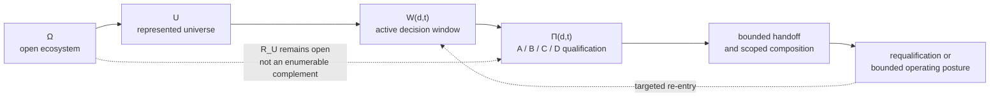

# Ecosystem Awareness — Canonical Architecture Topology

> **Canonical public reader and reconciliation page.** It makes the common topology explicit across the controlled architecture documents. It does not replace, modify or extend the controlled v0.4 release baseline; it is not an adopted standard, an ITU-T deliverable, an implemented interface or completed validation.

## Purpose

Ecosystem Awareness (EA) is a decision-scoped architecture for preserving a justified epistemic posture when an agent, human or subsystem acts from a finite representation of a changing ecosystem.

The public corpus contains this architecture at several necessary levels: foundational limits, four epistemic positions, functional loops, transport-neutral handoff semantics, cross-theme examples and validation profiles. This page makes their shared topology explicit so that the symbols and boundaries are read consistently.

## Before this architecture: problem, requirements and hypotheses

This topology follows the [foundation](./01_FOUNDATIONAL_THEORY_v0.5_INTEGRATED.md), [EA principles](./02_EPISTEMIC_SAFETY_PRINCIPLES_CONTROL_MATRIX_v0.4.part01.md) and [00 — Canonical Requirements: Challenges, Sufficiency Conditions, Hypotheses and KPIs](./00_CANONICAL_REQUIREMENTS_CHALLENGES_SUFFICIENCY_HYPOTHESES_KPIS.md). Use this page and documents 01–05 to inspect the proposed mechanism, then use the [canonical architecture benchmark and reference-scenario evidence](./00D_CANONICAL_ARCHITECTURE_BENCHMARK_AND_REFERENCE_SCENARIO_EVIDENCE_v0.2.md) for EA-H1–EA-H4, strong-peer comparison and empirical corroboration. The benchmark is a test route, not part of the universal requirement definition.

That route avoids two category errors: treating a generic challenge statement as a proof of a solution, or treating EA's architecture as the universal definition of a sufficient solution.

## 1. Canonical topology

For a decision `d` at time `t`:

| Element | Canonical meaning | Architectural consequence |
|---|---|---|
| **Ω** | The **open class** of potentially decision-relevant ecosystem state: actors, dependencies, environmental conditions, future configurations and interactions. Ω is not assumed to be closed or exhaustively enumerable. | No actor may claim that its representation exhausts the ecosystem. |
| **U** | The bounded operational universe actually represented for the current decision: identified entities, variables, sources, dependencies, controls and actors inside the working boundary. | A defined item inside U may still be unresolved. |
| **R_U** | The open decision-relevant residual relative to U. It is **not** a closed, known complement of U and may contain state not yet identified or categorized. | Good uncertainty quantification inside U does not establish completeness beyond U. |
| **W(d,t)** | The active observation and semantic window selected for the specific decision, domain and time. It is repeatedly qualified according to mission sensitivity, consequence severity, reversibility, freshness, available capacity and useful response horizon. | EA selects sufficient, bounded observation; it does not prescribe maximum context collection. |

**Ω is not a final universe.** It names the open ecosystem condition against which every local representation remains bounded. U and W(d,t) make that boundedness operational without turning the residual into an enumerable remainder.

### 1.1 Notation used across the current architecture

All participant-local qualified positions remain **decision-scoped**. The canonical index is `(d,t)`: declared decision/scope `d` and time `t`. A current working document that writes `(t)` alone is using shorthand for the **currently declared decision `d`**; it MUST NOT be read as a participant-global state.

| Symbol | Object qualified / represented | Current owner | Canonical reading |
|---|---|---|---|
| `Ω, U, R_U, W(d,t)` | Open ecosystem, represented universe, open residual and active Semantic Window | EA foundation / this topology | Decision-scoped bounded representation |
| `Π_EA,i` | Participant-local epistemic position | [01H](./01H_PARTICIPANT_LOCAL_ECOSYSTEM_POSITIONING_AND_DECISION_SCOPED_EPISTEMIC_OPPORTUNITY_v0.1.md) | `Π_EA,i(d,t)` |
| `ReceivedSignals_i` | Receiver-qualified external messages relevant to the active decision | [01J](./01J_ECOSYSTEM_SIGNALLING_SELECTIVE_DISCLOSURE_AND_CHOREOGRAPHED_REPOSITIONING_v0.1.md) | `ReceivedSignals_i(d,t)` |
| `Cart_i, Δ_Cart,i` | Ecosystem Cartography and its bounded change-set | [MSCA 03](../../../standards/minimum-sufficient-control/03_MSCA_ECOSYSTEM_COMPOSITION_AND_CONTROL.md) | `Cart_i(d,t)`, `Δ_Cart,i(d,t)` |
| `Δ_RA` | Qualified regime delta | [01C v0.2](./01C_EA_REGIME_AWARENESS_INTERFACE_ANNEX_v0.2.md) | `Δ_RA(t)` under the declared observable/change family and receiving decision scope |
| `Π_MSCA,i` | Qualified position over the focal S/E/C/P/M control architecture | [MSCA 00](../../../standards/minimum-sufficient-control/00_CANONICAL_MSCA_ARCHITECTURE.md) | `Π_MSCA,i(d,t)` |
| `Π_X,i` | Earlier/current Gradient-Law notation for the same qualified MSCA position | [Gradient Law](../../../architectural-contributions/ecosystem-positioning/01_OBJECTIVE_CONDITIONED_AGENTIC_GRADIENT_LAW.md) | Alias of `Π_MSCA,i(d,t)`; not a second position object |
| `Role_bound,i, Role_effective,i` | Contracted role and qualified observed effective role | [MSCA 04](../../../standards/minimum-sufficient-control/04_CANONICAL_MSCA_OPERATION_AND_REPOSITIONING.md) | Time-varying role state interpreted for the active decision/MSCA |
| `TypeCatalogue_i` | Type 0 / Type 1 / Type 2 / NOT_ESTABLISHED by source/domain/proposition | MSCA 04 | `TypeCatalogue_i(d,t)` |
| `Posture_i, Γ_i` | P1 Normal / P2 Containment / P3 Migration and the **sole current operational posture operator** | [MSCA 04 §11](../../../standards/minimum-sufficient-control/04_CANONICAL_MSCA_OPERATION_AND_REPOSITIONING.md#11-hard-posture-gate--p1--p2--p3) | `Posture_i(d,t)`; `Γ_i` is defined there only |
| `G_i(τ)` | Objective-conditioned agentic gradient for candidate transition `τ` | [Gradient Law](../../../architectural-contributions/ecosystem-positioning/01_OBJECTIVE_CONDITIONED_AGENTIC_GRADIENT_LAW.md) | Evaluated from the active decision and `Role_effective` |
| `Π_RP,i` | Qualified repositioning result | MSCA 04 | `Π_RP,i(d,t)` |

This table reconciles notation across current working documents. It does not rewrite frozen source notation.

## 2. Four-component qualified epistemic position

**Reconciliation update — 23 September 2026.** A/B/C/D are read canonically as four **components of one qualified position**, not as four mutually exclusive quadrants or four mandatory transmission fields. Earlier frozen/source documents that use a coarser “determined / unresolved / obtainable / residual” wording remain preserved for provenance; this page supplies the current reconciliation.

For participant i, decision d and time t, a qualified position may be read conceptually as:

~~~text
Π_i(d,t) = [ A_i, B_i, C_i, D_i ]
~~~

| Component | Canonical meaning | Example / treatment |
|---|---|---|
| **A — situated scope / qualified assertion** | What is being represented or asserted, **where/from which frame**, for which subject/decision, under which scope, provenance, calibration, freshness and other material qualifiers. A is not an unscoped YES/NO. | A telemetry device may assert “temperature at this sensor/location, using this calibration, at this time.” |
| **B — confidence / intensity** | How strongly the A assertion or direction is supported relative to its admitted frame. B may be expressed as confidence, interval/bounds, support strength or another profile-appropriate uncertainty representation. | A high-confidence directional departure can create a stronger downstream agentic gradient after participant-local projection than a weak/noisy departure. Confidence in decoding is distinct from physical measurement accuracy. |
| **C — recognized capability frontier / potentially obtainable state** | What additional decision-relevant state is recognized and could be determined **with the participant's current capabilities** through more observation, review, acquisition, computation, interaction or time, but has not yet been established for the current position. | A telemetry system may support a diagnostic register or another sensor read that has not yet been queried. |
| **D — structural / residual unknown** | What remains outside the currently represented and recognized-obtainable capability boundary, including what may be unenumerated, structurally unavailable or unknown as to knowability. Compatibility/translation residuals may also contribute to D on the receiver side. | A local temperature device does not thereby establish humidity, occupancy, external conditions or unmodelled dependencies. |

The four components are **not required to sum to a fixed whole** and need not all be transmitted. A producer may emit only A, or A+B, or another material subset. Missing components remain **UNKNOWN / NOT DECLARED** to the receiver unless a verified profile legitimately supplies receiver-local qualification.

### 2.1 Relation to the earlier coarse four-position wording

The earlier wording can be conserved as a useful operational reading **inside** the richer tuple:

- a “sufficiently determined” result is an A assertion with enough B support for the receiving decision;
- “recognized unresolved” state is represented through insufficient/contested B and the qualified unresolved content attached to A;
- “potentially obtainable” remains the C frontier;
- “structural residual” remains D.

This reconciliation prevents B from being treated as a second content bucket when the architecture needs B to carry confidence/direction, while preserving the earlier safety rule: unresolved state must never be promoted to certainty.

C and D preserve the distinction between what could still be known with current capability and what remains structurally residual. Neither makes `R_U` a closed set complement or Ω a closed universe.

## 3. Agent-local qualification and ecosystem composition

EA is **not an epistemic super-controller**, does not reconstruct every participant’s internal reasoning and does not require one mandatory shared ecosystem state. Ω retains its open ecosystem meaning. Where participant locality is material, U, W(d,t), R_U and A–D are interpreted for the declared receiving participant/decision; use U_i(d,t), W_i(d,t) and R_{U_i} when the participant index would otherwise be ambiguous.

1. A producer or agent qualifies a decision-relevant result for its own domain and window.
2. It preserves material scope, determination state, unresolved qualifiers, provenance, freshness, dependency and capacity information through the **Epistemic Handoff Descriptor (EHD)** or an equivalent semantic handoff.
3. A receiving agent treats the result as a bounded, attributed claim. It does not convert that claim into ecosystem-wide truth.
4. EA composes only what remains qualified and material for the receiving decision. Missing material qualification remains **UNKNOWN**.

A locally correct result may therefore remain insufficient for a system-level conclusion. More agents, more signals or more review do not automatically remove shared dependencies, scope limits or structural residual.

## 4. Conditions and failures are not additional poles

The architecture separately distinguishes:

| Category | Meaning |
|---|---|
| **Condition Type 0** | Structural non-determination despite correct local management. It is a condition, not a management failure. |
| **Failure Type 1** | Acknowledged uncertainty without bounded legitimate closure: indefinite search, HOLD or escalation that consumes the capacity and response time needed to act. |
| **Failure Type 2** | Suppressed uncertainty promoted into false certainty: forced binary closure, stale-frame reuse, unjustified scope extension or silently discarded missing inputs. |

These categories can arise inside U or in relation to residual uncertainty. They do not add a fifth, sixth or seventh epistemic position.

Type 1 and Type 2 are endpoint failure classes, not necessarily pure end-to-end system states. A Type-1 loop may be forced by timeout, default or review pressure into Type-2 closure; a Type-2 closure may later reopen as Type-1 HOLD/search when contradiction appears but its discarded basis cannot be reconstructed. False convergence, incompatible divergence, oscillation and cascades describe observable trajectories or consequences of those two classes. Defensive `UNKNOWN`, qualifier saturation and injected doubt are classified by what they do: unbounded delay/containment is Type 1; suppression, habituation or forced unsupported closure is Type 2. No additional failure type is introduced.

## 5. How the topology maps to the architecture

| Architecture layer | Role in the canonical topology | Source |
|---|---|---|
| **01 — Foundational Theory** | Defines Ω, U, `R_U`, bounded representation, residual indeterminacy, Type 0/1/2 and the need to qualify W(d,t). | [01 — Integrated Foundational Theory v0.5](./01_FOUNDATIONAL_THEORY_v0.5_INTEGRATED.md) and preserved [v0.4 source parts](./01_FOUNDATIONAL_THEORY_v0.4.part01.md) |
| **02 — Epistemic Safety Principles & Control Matrix** | Defines A–D and the internal and received-signal controls that prevent bounded evidence from becoming an unjustified global conclusion. | [02 — Control Matrix v0.4](./02_EPISTEMIC_SAFETY_PRINCIPLES_CONTROL_MATRIX_v0.4.part01.md) |
| **03 — Functional Architecture** | Implements the two qualification loops through F1–F9: decision/frame qualification, evidence qualification, scoped composition, posture, requalification and learning. | [03 — Functional Architecture v0.4](./03_FUNCTIONAL_ARCHITECTURE_v0.4.part01.md) |
| **04 — General Functional Interfaces & Agentic Security** | Makes qualified claims transport-neutral through the EHD and maintains the no-supercontroller rule across independently governed agents and external capabilities. | [04 — General Functional Interfaces v0.5 Integrated](./04_GENERAL_FUNCTIONAL_INTERFACES_AGENTIC_SECURITY_v0.5_INTEGRATED.md) |
| **FG-TIDA application layer — separate package** | Applies the general interface architecture to FG-TIDA, separating an ideal cross-Theme projection from the currently defensible public-source bridge. It is not part of the canonical general interface definition. | [EA / FG-TIDA application package](../fg-tida/README.md) |
| **00D — Canonical Architecture Benchmark and Reference-Scenario Evidence** | States EA-H1…EA-H4, matched B0–B3 comparison, evidence grades and empirical corroboration of 00E/00F. | [00D — Canonical Benchmark v0.2](./00D_CANONICAL_ARCHITECTURE_BENCHMARK_AND_REFERENCE_SCENARIO_EVIDENCE_v0.2.md) |

## 6. Reading rule

Read the architecture in this order:

**open ecosystem Ω → represented universe U → active window W(d,t) → A/B/C/D qualification → bounded handoff and composition → requalification or bounded operating posture.**

The visual below is supplementary to that written rule. It shows targeted re-entry and the fact that the open residual is not closed by the qualification process.

The architecture does not promise complete ecosystem knowledge. Its claim is narrower: a decision can remain operational while explicitly preserving what is determined, unresolved, potentially obtainable and structurally residual, together with the authority and evidence limits that condition reliance.

## Status and source boundaries

This page is a public, canonical reading and reconciliation aid for the existing EA corpus. The controlled/frozen release baseline remains the six source documents recorded in the [Canonical Corpus Manifest](./CANONICAL_CORPUS_MANIFEST.md). The current integrated v0.5 foundation and canonical working benchmark v0.2 are working successors with their own stated status. No statement on this page implies standards adoption, deployed interoperability, completed comparative validation or a claim that EA has complete knowledge of an ecosystem.
