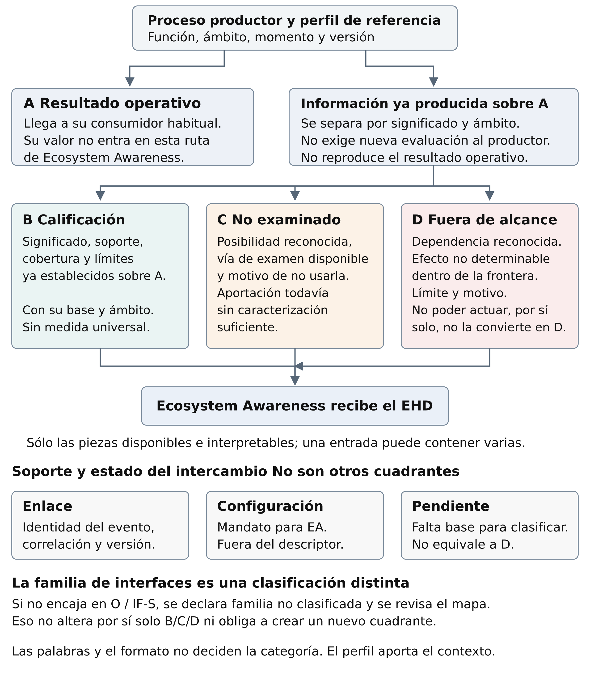

<!-- Approved v0.4 Word body reproduced below in document order. -->

**04 · Punto de inicio para el trabajo sobre interfaces de entrada**

[Volver a 04](../04_GENERAL_FUNCTIONAL_INTERFACES_AGENTIC_SECURITY_v0.5_INTEGRATED.md) · [Índice del corpus](../README.md) · [Descargar Word v0.4](./04_Contrato_interfaces_entrada_EA_v0.4.docx) · [Pendientes de integración](../04_GENERAL_FUNCTIONAL_INTERFACES_AGENTIC_SECURITY_VNEXT_REVIEW_AND_DELTA_v0.1_DRAFT.md#11-input-interface-contract-working-starting-point--30-september-2026)

Este contrato forma parte de la línea **04**, independiente de programas o dominios. Es el punto de partida publicado para acordar los inputs de Ecosystem Awareness: define A/B/C/D, conserva la información ya producida y descompone las 176 entradas revisadas. Los outputs de EA quedan fuera de esta versión.

**Estado:** contrato ideal y propuesta de integración en revisión. Su incorporación al repositorio no resuelve por sí sola H06: la exclusión de A en esta ruta debe reconciliarse con el núcleo EHD y con los usos de F9 que hoy consumen resultados. Las correspondencias O2 también requieren explicitar los componentes C/D señalados en su ejemplo. El baseline 04 v0.5 mantiene su estado; este contrato no lo sustituye silenciosamente.

**Lectura:** [guía](#cómo-leer-y-aplicar-este-contrato), [diagrama](#el-marco-de-clasificación-de-un-vistazo), [definiciones](#1-marco-de-clasificación-y-cuadrante), [ejemplos](#7-ejemplos-de-descomposición-en-04) y [familias no previstas](#8-bis-familias-no-previstas). El anexo A conserva la matriz completa; los anexos B/C, los hallazgos y contraejemplos.

**Conservación:** a continuación se reproduce íntegro el cuerpo del Word aprobado, en español, con sus tablas y diagrama. Sus declaraciones de estado corresponden a la revisión previa a esta publicación. Esta publicación añade rutas y un registro en el delta; no atribuye ejecuciones ni cierra incompatibilidades. El [manifiesto](./PUBLICATION_MANIFEST.json) identifica los archivos y el snapshot de origen. Los nombres de los campos del ejemplo de transporte son ilustrativos.

---

# Contrato de interfaces de entrada de Ecosystem Awareness

Versión 0.4 · Propuesta de contrato ideal para 04 · 30 septiembre 2026

**Objeto y utilidad**

Este contrato define cómo un proceso entrega a Ecosystem Awareness la información que ya conoce sobre el significado, soporte y límites de su propio resultado, incluidas las posibilidades que decidió no examinar y las dependencias que reconoció fuera de su alcance. Su finalidad es conservar información que, de otro modo, puede perderse al entregar el resultado operativo.

Ecosystem Awareness, abreviado EA, recibe B, C y D mediante un Epistemic Handoff Descriptor, abreviado EHD. El EHD es un descriptor semántico: puede implementarse con un perfil estable y pequeños cambios por evento, sin imponer protocolo, tecnología ni esquema universal de datos.

El resultado operativo A sigue dirigido a su consumidor habitual. Este contrato permite identificar qué es A y a qué evento se refieren los metadatos, pero excluye su valor funcional. No pide datos de clientes ni una base de datos de negocio. Tampoco obliga al productor a investigar más para completar el descriptor.

| Participante | Responsabilidad en la entrada |
| --- | --- |
| Productor observado | Declara el proceso, su A y el significado de los metadatos que ya produce. |
| Adaptador o intermediario | Extrae, enlaza y transforma conforme al perfil; conserva procedencia, alcance y pérdidas. |
| EA receptor | Interpreta los metadatos dentro del perfil y de su ámbito, sin recibir A por esta ruta. |
| Propietario del perfil | Define y revisa el mapeo entre el vocabulario del dominio y B/C/D. |

**Alcance**

El contrato es autónomo y puede incorporarse a 04, el mapa ideal de interfaces de EA. Las implementaciones y su disponibilidad actual se evaluarán después. Aquí se especifica exclusivamente la entrada a EA; las decisiones, posturas, solicitudes y demás outputs de EA quedan fuera de esta versión.

Lectura del documento: §§1–8 contienen el contrato y ejemplos; §8 bis añade N13, el hallazgo externo H17 y los casos X41–X44. El anexo A descompone las 176 entradas de las 19 familias revisadas de 04; el anexo B registra 16 hallazgos de v0.1; el anexo C conserva los casos X01–X40; el anexo D recoge fuentes y estado de revisión.

## Cómo leer y aplicar este contrato

La pregunta central es sencilla: ¿qué sabe ya un proceso sobre el significado y los límites de su resultado, que podría perderse cuando lo entrega? EA recoge esa información existente para conservarla y relacionarla con su contexto. Este documento acuerda cómo interpretarla antes de intercambiar datos.

### Un recorrido de lectura

Primero, identificar el proceso y su resultado operativo A. Después, separar las piezas que describen su soporte, las posibilidades no examinadas y las dependencias fuera de alcance. Por último, comprobar que esas piezas ya existen y que EA puede interpretarlas sin recibir A. El diagrama siguiente resume las relaciones; §1 define los términos y §2 plantea las preguntas.

| Referencia local | Significado en lenguaje sencillo | Dónde se utiliza |
| --- | --- | --- |
| A / B / C / D | Qué papel tiene cada pieza respecto al proceso productor. | Marco, preguntas y ejemplos. |
| O / IF-S | Familias del mapa de interfaces; una familia puede contener B, C y D. | Ejemplos y anexo A. |
| Q0–Q10 | Preguntas que ayudan a clasificar y admitir una pieza. | §2. |
| N01–N13 | Obligaciones que debe respetar el contrato. | §§3–4 y §8 bis. |
| H01–H17 | Problemas encontrados durante las revisiones. | Anexo B y §8 bis. |
| X01–X44 | Contraejemplos para intentar romper las reglas. | Anexo C y §8 bis. |

Estos códigos son referencias locales de este documento: H identifica un hallazgo, no una hipótesis; Q identifica una pregunta, no un KPI ni un gate del corpus. No es necesario memorizarlos para leer la explicación.

### Qué significa acordar un perfil

Un perfil es el acuerdo de interpretación para un proceso y un ámbito: define qué es A, qué significan las piezas B/C/D y cómo se vinculan con el evento. EHD es el descriptor que aplica ese acuerdo al intercambio. La familia sitúa la relación en el mapa; no determina por sí sola el cuadrante ni obliga a usar un formato técnico.

### Tres lecturas según la tarea

Para entender el propósito: apertura, diagrama y ejemplos. Para acordar una interfaz: definiciones, preguntas, obligaciones y plantilla de §8. Para auditarla: correspondencias del anexo A y contraejemplos de los anexos B/C y §8 bis. Los ejemplos son supuestos de diseño, no datos de productores reales.

## El marco de clasificación de un vistazo

[Diagrama vectorial](./assets/marco_clasificacion_es.svg)

Adaptación al español del diagrama de clasificación aportado en la revisión externa. Resume el contrato; las condiciones de admisión y parcialidad se desarrollan en §§1–6 y N13.

## 1 Marco de clasificación y cuadrante

Toda clasificación se refiere a un productor, un proceso funcional, un resultado A, un ámbito, un momento y una versión de perfil. “Input de EA” significa la información que entra en EA; A/B/C/D se interpretan respecto del proceso productor, nunca por el simple hecho de llegar a EA.

| Papel | Definición contractual | Qué debe quedar claro |
| --- | --- | --- |
| A | Producto funcional que el proceso entrega a su consumidor. Incluye confianza, intervalo, decisión o estado cuando forman parte de ese producto. | Se describe su clase y se enlaza su evento. Su valor no se transmite en esta entrada. |
| B | Calificación sobre A: significado, método, soporte, cobertura, validez y límites ya establecidos. | Objeto y alcance de la calificación, base existente y semántica propia del dominio. |
| C | Posibilidad reconocida de ampliar la observación, comprobación o revisión, cuya aportación sigue sin caracterizarse suficientemente y que se decidió no examinar dentro de una vía reconocida. | Qué se dejó sin examinar, qué vía existía y qué razón ya consta para no hacerlo. |
| D | Dependencia o condición relevante reconocida cuya afectación queda sin caracterizar suficientemente porque rebasa la frontera efectiva de determinación declarada por el proceso. | Qué dependencia, qué afectación posible, qué límite impide determinarla y qué razón consta. El control operativo se declara aparte. |

### Contenido funcional y sobre de intercambio

A se define por su función y por el contrato de entrega. Adjuntar B/C/D al mismo paquete físico no los convierte en A. Incorporar un intervalo al producto funcional sí puede convertir ese intervalo en parte de A. El cambio exige revisar el perfil; un simple cambio de cabecera, formato o transporte no lo exige por sí mismo.

### Unidad mínima y solapamientos

Se clasifica una afirmación sobre un aspecto y ámbito concretos. Una entrada puede contener varias: cobertura establecida B, opción omitida C y dependencia fuera de alcance D. Se separan y enlazan. B puede referenciar C/D; no hace falta copiar sus contenidos ni contarlos dos veces. Una lista vacía no demuestra que el cuadrante esté agotado.

Enlace, configuración y pendiente no son nuevos cuadrantes: indican, respectivamente, soporte del intercambio, gobierno del receptor y falta de base para clasificar. No deben forzarse a B/C/D.

## 2 Preguntas para decidir cada entrada

Las preguntas se aplican al contenido de cada entrada y al perfil acordado. Una palabra como confidence, unknown, capability o verdict no determina su categoría.

| Paso | Pregunta | Consecuencia |
| --- | --- | --- |
| Q0 | ¿Qué proceso observamos, cuál es su A y quién lo recibe? | Fijar marco y versión. El adaptador no sustituye al productor observado. |
| Q1 | ¿La pieza entrega el resultado funcional o lo reproduce con otro código? | A: excluir el valor de la entrada EA. Mantener definición y enlace pertinentes. |
| Q2 | ¿Es enlace técnico o una instrucción de gobierno para EA? | Separar soporte/configuración; no atribuirles categoría epistemológica automática. |
| Q3 | ¿Qué parte del significado, soporte o límite de A ya está establecida? | B: preservar objeto, base, alcance y estado de verificación. |
| Q4 | ¿Qué cuestión reconocida sigue sin caracterizarse suficientemente? | Separar esa cuestión de lo ya conocido; no borrar C/D por una estimación parcial. |
| Q5 | ¿Había una vía reconocida de examen y se decidió no usarla? | C: cuestión, vía y motivo de exclusión; el motivo puede no haberse registrado. |
| Q6 | ¿La dependencia rebasa la frontera efectiva de determinación? | D: dependencia, posible afectación, frontera y motivo; no inferirlo de externalidad. |
| Q7 | ¿Se conoce la frontera y consta la razón aplicable al caso? | Si no: clasificación pendiente o declaración parcial. No inventar ni reconstruir. |
| Q8 | ¿La información existe antes de pedir el handoff? | Admisible por origen, o no disponible/no generada/restringida según lo conocido. |
| Q9 | ¿La extracción añade inferencia, medición o juicio? | Si sí, queda fuera del envío básico. Adaptación mecánica fiel puede ser admisible. |
| Q10 | ¿Puede el receptor vincular e interpretar lo recibido sin A? | Sólo usarlo para el ámbito y finalidad permitidos; no ampliar su aplicabilidad. |

Q3–Q7 se resuelven conjuntamente. No es un clasificador por palabras ni una cadena que absorba C y D en B. Cuando un átomo satisface varias descripciones, se precisa el objeto/aspecto o se conserva la ambigüedad; no se cambia el contenido para obtener una etiqueta cómoda.

## 3 Obligaciones semánticas del contrato

### N01 Declarar el marco antes de clasificar

El perfil DEBE identificar el productor observado, proceso funcional, definición de A, consumidor operativo y ámbito. El registro enlaza con ese perfil y con su evento o clase. Un cambio de emisor, transporte o adaptador NO DEBE alterar el marco por sí solo.

### N02 Mantener A fuera de la entrada

El handoff NO DEBE transportar A ni un sustituto que reproduzca su resultado funcional. Puede transportar referencias y descripciones de su tipo. Resolver una referencia para recuperar A queda fuera de esta ruta. Si el uso de EA exige el valor de A, ese uso no queda sustentado por este contrato; no se salva rebautizando A como B.

### N03 Calificar sin inventar una medida común

B DEBE indicar qué aspecto de A califica y conservar su constructo, base y alcance existentes. No se exige probabilidad numérica, muestra representativa ni metaconfianza recursiva. La suficiencia se interpreta mediante el criterio de dominio declarado en el perfil; recibir una declaración no equivale a verificarla.

### N04 Conservar las posibilidades no examinadas

C DEBE describir la posibilidad reconocida y la vía de examen que sitúa esa posibilidad dentro de la capacidad declarada. Debe conservar el motivo existente de no examinarla. Una lista de herramientas o una capacidad humana disponible no basta. La decisión de no asignar un recurso disponible no se convierte automáticamente en imposibilidad D.

### N05 Conservar la frontera de determinación

D DEBE describir la dependencia y el límite que impide caracterizar suficientemente su afectación dentro del marco. Evaluar y actuar son capacidades distintas: un factor incontrolable pero caracterizado no es D por ello. Si sólo una parte está caracterizada, se separan B y la cuestión residual C/D. D comunicado no enumera el residual desconocido completo.

### N06 Preservar la razón y las ausencias

Las razones DEBEN proceder del registro nativo o de un vínculo existente a una regla efectivamente aplicada. Una regla disponible no demuestra que motivó el caso. Si la razón no consta, el descriptor lo conserva; no solicita reconstrucción retrospectiva. No registrado, no generado, perdido, restringido y no aplicable permanecen distintos cuando el origen permite distinguirlos.

## 4 Obligaciones del intercambio

### N07 Recuperar información ya producida

El envío básico NO DEBE exigir inferencia, búsqueda, evaluación, muestreo o juicio nuevo para fabricar B/C/D. Permite captura y transformación mecánica según un mapeo revisado, conservando unidades, precisión y significado. El diseño inicial, la instrumentación futura, la captura por evento y el procesamiento propio de EA tienen costes distintos y declarados.

### N08 Conservar procedencia y restricciones

El perfil DEBE distinguir autor de A, autor de cada calificación y emisor del mensaje, además de soporte directo, heredado o transformado. Debe respetar divulgación y correlación permitidas. Una firma, el acuerdo del propietario o la integridad del registro no prueban verdad ni independencia. La interpretación añadida por EA no se atribuye al productor.

### N09 Declarar parcialidad y límites de recepción

El perfil DEBE fijar qué exige para interpretar una entrada, cómo representa ausencia, retirada, lista vacía, truncación y disponibilidad desconocida, y qué carga admite. Un campo omitido no se convierte en certeza ni independencia. Si ni el ámbito ni el objeto pueden vincularse, la entrada puede conservarse según las reglas de recepción, pero no aplicarse a una decisión concreta.

### N10 Preservar composición y temporalidad

El intercambio DEBE conservar el marco de origen, el tiempo del soporte, la validez y las dependencias materiales ya declaradas. Reenviar no renueva evidencia; duplicar no corrobora; agregar no añade independencia. Un delta identifica a qué base se aplica y distingue mantener, reemplazar y retirar; si la base falta, no se completa por conjetura.

### N11 Versionar significado y correcciones

Un cambio de A, constructo, ámbito, frontera C/D o regla de interpretación DEBE revisar la versión del perfil. Una versión desconocida no se interpreta mediante otra por semejanza de campos. Correcciones y retiradas se vinculan con los registros afectados; la llegada tardía no sobrescribe otros eventos y no se reescribe la clasificación histórica.

### N12 Acotar la conformidad declarada

El contrato distingue tres cierres: coherencia de la especificación ideal, conformidad del mapeo de un perfil y conformidad operacional de una ruta. Esta versión define los dos primeros y las obligaciones del tercero; no afirma resultados de implementación. Ninguno de ellos demuestra por sí solo beneficio de los outputs de EA, honestidad universal o conocimiento exhaustivo.

## 5 Perfil estable y contenido por evento

El perfil es el acuerdo de interpretación previo a intercambiar datos. El handoff aplica ese acuerdo a una instancia o clase. No todos los elementos del perfil tienen que repetirse en cada mensaje; una referencia versionada puede resolver lo estable.

| En el perfil | Definición necesaria |
| --- | --- |
| Responsabilidad y marco | Productor observado, propietario semántico, adaptador, función, A y consumidor operativo. |
| Correspondencia | Fuente nativa → afirmación atómica → objeto/ámbito → B, C o D; además de A excluido, enlaces y configuración separados. |
| Constructo y base | Qué significa soporte/suficiencia en ese dominio, qué método se declara y qué límites de interpretación se aceptan. |
| Frontera C y D | Vías reconocidas; límites de evidencia, método, acceso, mandato, recursos y horizonte; control de acciones separado. |
| Motivos | Dónde existe la razón, cómo se vincula una regla aplicada y qué significa que falte. No suponer que todo proceso razona o registra razones. |
| Disponibilidad y materialidad | Qué se genera normalmente, qué puede capturarse, qué es condicional y qué ausencias impiden interpretar. La selección no requiere evaluar materialidad de nuevo por evento. |
| Enlace y temporalidad | Por instancia o por clase; clave, base de delta, observación, validez, corrección, duplicación y orden pertinente. |
| Divulgación y carga | Qué puede compartirse, tamaño y carga admitidos, tratamiento de exceso/pérdida; valores fijados por cada perfil, sin umbral universal. |
| Revisión | Versión, propietario del mapeo, equivalencias aceptadas, objeciones abiertas y condiciones que obligan a revisarlo. |

### Mínimo semántico por handoff

Debe poder recuperarse, por referencia o inline: perfil y versión; procedencia de la declaración; objeto/ámbito al que se aplica; enlace a evento o clase; piezas B/C/D comunicadas y sus estados de disponibilidad; y vínculo temporal o de actualización cuando sea material. No se exige un campo con valor para cada cuadrante. Lo material no establecido permanece desconocido.

Las referencias de identidad, correlación y versión sostienen el intercambio; no son nuevas categorías epistemológicas. Una configuración que ordena cómo debe actuar EA se mantiene fuera de este descriptor. B puede referenciar una regla que ya limitó A; eso no emite una regla nueva para el receptor.

## 6 Parcialidad evolución y criterio de cierre

| Situación | Tratamiento de entrada |
| --- | --- |
| Dato comunicado | Conservar afirmación, objeto, alcance, categoría, base y procedencia disponibles. |
| Dato no generado o perdido | Conservar el estado si se conoce. No repetir el proceso para simular un subproducto original. |
| Razón no registrada | C/D pueden recibirse parcialmente; no declarar completa esa explicación ni inventar un motivo. |
| Lista vacía o silencio | Sólo acredita lo declarado: ningún elemento comunicado o ningún mensaje recibido. No acredita ausencia universal. |
| No aplicable | Es una determinación con objeto/ámbito y base. No equivale a dato ausente; puede ser A si ése es el veredicto funcional. |
| Versión o base desconocida | No interpretar con otro perfil ni reconstruir un delta. Retención limitada por las reglas de divulgación. |
| B pasa a integrar A | Nuevo perfil: el valor deja de entrar por B. Identificar qué calificación adicional, si existe, sigue fuera de A. |
| C se examina o D gana acceso | Conservar situación anterior. Lo determinado pasa a A/B según contrato; lo aún no examinado puede ser C en el nuevo marco. |
| Se supera la carga acordada | Aplicar la regla declarada de pérdida, diferimiento o rechazo y conservar su visibilidad cuando sea posible. No afirmar entrega completa. |

### Tres cierres diferentes

Especificación ideal: definiciones, obligaciones y fronteras no se contradicen. Mapeo: el perfil identifica cada componente, su procedencia y los casos que no puede clasificar. Implementación: una ruta concreta demuestra conservación, ausencia de cálculo epistemológico adicional, carga y comportamiento ante fallos. 04 puede formular el ideal antes de tener las implementaciones.

### Límite comprobable de este contrato

B/C/D hablan de A y pueden permitir inferencias sobre él. La obligación es no transportar su contenido funcional ni consultarlo desde esta ruta; no prometer independencia informacional absoluta. El contrato tampoco puede demostrar la verdad de toda razón emitida. Las afirmaciones se conservan con su atribución y con el estado de verificación que realmente tengan.

## 7 Ejemplos de descomposición en 04

### O3 y IF S5 de un resultado a su calificación

Supuesto de perfil: el motor entrega un veredicto operativo A. El registro interno conserva el método, los checks realizados y dos checks omitidos. El primero era accesible y se omitió por una regla de parada aplicada; el segundo depende de un proveedor sin canal de acceso dentro del mandato.

| Entrada original de 04 | Descomposición para EA |
| --- | --- |
| O3.01 operational result/closure | A excluido. Sólo referencia y clase del veredicto. |
| IF-S5.03 checks performed or profile/version | B: cobertura de checks y perfil usados. No incluir sus veredictos si integran A. |
| IF-S5.08 limitations or checks not performed | B: límite de cobertura conocido. C: primer check + vía disponible + regla aplicada. D: dependencia del segundo + límite de acceso + razón. |
| O3.06 unresolved dependencies | No clasificar todo como D: mantener la separación anterior y su objeto. |

### IF S2 y evolución de autorización delegada

Supuesto de perfil: A es la decisión de autorización y EA no recibe permit/deny ni un código equivalente. B identifica la política y cobertura de validación. Una consulta de estado accesible no realizada por una regla nativa constituye C si su aportación sigue sin caracterizarse. Una revocación de origen relevante sin vía de conocimiento en ese despliegue constituye D.

Si posteriormente existe un canal de consulta, la misma dependencia puede pasar de D a C mientras no se examine, y su caracterización puede pasar a B o integrarse en A. No cambia la familia IF-S2; cambian el perfil, el momento y las premisas. Una nueva instrucción de revocar sería un resultado/mandato operativo y queda fuera de este contrato de inputs.

### El motivo forma parte de lo que se conserva

“Check omitido” no basta para explicar por qué. Si sólo consta el nombre del check, la declaración permanece parcial. Una política general no sustituye a la evidencia de que se aplicó en ese caso. El perfil puede declarar una omisión fija por diseño; no debe presentarla como una deliberación individual.

## 7 Ejemplos en estadística fabricación y revisión humana

### IF S9 una estimación parcial no elimina lo desconocido

Supuesto de perfil: el informe A incluye estimación e intervalo. Ambos valores quedan fuera de la entrada EA. B conserva método, población y límites que no formen parte del producto. Si se conoce una subpoblación sin caracterización suficiente y se decidió no muestrearla dentro de una vía reconocida, C conserva esa exclusión y motivo. Una fuente externa sin acceso para determinar su sesgo puede dar lugar a D.

Una estimación existente de “30% de utilidad” es A o B según el producto. Sólo elimina la falta de caracterización del aspecto que realmente estima. No borra una fuente o subpoblación distinta que el modelo no cubre. Tampoco hay obligación de producir un intervalo sobre otro intervalo: B preserva la base adicional que ya exista.

### O5 e IF S7 inspección de una pieza

Supuesto de perfil: A es la aceptación/rechazo de la pieza. B puede describir calibración y cobertura ya registradas. C puede describir una posición conocida no medida y la regla de inspección que la excluyó. D puede describir una condición anterior del material reconocida como influyente pero sin trazabilidad ni vía de caracterización. Una temperatura no controlada cuyo efecto está medido pertenece a la parte caracterizada A/B.

### IF S6 capacidad humana y revisión omitida

Supuesto de perfil: A es la decisión del revisor. El estado de capacidad que limitó la revisión puede ser B si ya se conoce y queda fuera de A. C es la segunda consulta reconocida que no se hizo y su motivo registrado, no el estado available/binding/unavailable por sí solo. D puede ser una dependencia institucional cuyo efecto no se puede examinar dentro del mandato.

Si el productor observado es otro proceso que evalúa capacidad humana y entrega available/binding/unavailable, ese estado es su A. El cambio de marco debe ser explícito; no se utiliza para introducir un resultado en EA por otra interfaz.

Estos ejemplos fijan premisas de diseño para hacer revisable el criterio. La asignación a personas, productos o despliegues concretos requiere su propio perfil; las etiquetas no se infieren de la tecnología o del nombre del campo.

## 7 Ejemplo de descubrimiento de agentes

Familia O2. Un servicio de descubrimiento busca un agente para una tarea y entrega al solicitante una selección con su endpoint y capacidades anunciadas. Esa selección es A. EA recibe un enlace opaco al evento y sus calificaciones; no recibe el agente elegido, el endpoint ni una copia del catálogo entregado.

### Lo que ya ocurrió dentro del productor

En este supuesto, la traza nativa registra el catálogo consultado, la fecha de observación y la política aplicada. También registra que un catálogo complementario accesible se excluyó por una regla de alcance para consultas ordinarias. No se calculó la utilidad de consultarlo. El perfil declara además una dependencia relevante: el estado real del servicio anunciado no puede comprobarse porque este despliegue carece de acceso autorizado a su telemetría.

| Pieza | Qué recibe EA | Base que ya existía |
| --- | --- | --- |
| B | Origen y fecha del catálogo; alcance de las verificaciones realizadas y límites de las capacidades autodeclaradas. | Traza de consulta y perfil de verificación. No equivale a corroboración independiente. |
| C | Catálogo complementario reconocido, vía accesible y regla aplicada para no consultarlo; aportación sin caracterizar. | Registro de exclusión con vínculo a la regla que se aplicó. |
| D | Dependencia del estado real del servicio y límite que impide determinarlo dentro de este despliegue. | Declaración de frontera en el perfil y restricción de acceso documentada. |

### Correspondencia con las entradas de 04

O2.01–O2.03 separan la selección y el endpoint de sus referencias; O2.06–O2.07 sitúan fuente, tiempo, procedencia y soporte. Las siete entradas actuales de O2 no enumeran expresamente el catálogo omitido y su motivo ni toda dependencia fuera de alcance. El perfil necesita declarar esos componentes C/D como ampliación propuesta de la entrada O2, con su fuente nativa; no darlos por pedidos ya ni ocultarlos bajo un campo genérico de confianza.

### Cuándo cambiaría la clasificación

Si aparece acceso autorizado a la telemetría, la cuestión puede pasar de D a C mientras se decide no examinarla y sigue sin caracterizarse. Si se examina, lo determinado pasa a B o integra A, según el producto acordado. La familia O2 puede mantenerse; el perfil y las premisas se revisan. Si el motivo no se registró, se comunica la ausencia sin reconstruirlo.

Información enviada: calificaciones y razones existentes, más su enlace. No se ejecuta otra búsqueda, prueba del servicio ni estimación para completar el descriptor.

## 7 Ejemplo de memoria y recuperación

Familia O4. Un servicio recupera fragmentos para responder una consulta. A es la selección de fragmentos entregada al solicitante. Su texto, contenido y lista de identificadores seleccionados quedan fuera de esta ruta hacia EA. Una referencia opaca al evento permite vincular las calificaciones sin recuperar esa selección.

### Lo que ya ocurrió dentro del productor

El perfil de ejemplo memoria.v1 usa un índice cuyo estado fue observado a las 09:00 UTC. La consulta termina a las 09:02 UTC. La traza ya conserva ambos tiempos y una regla de alcance que excluye el archivo histórico accesible en consultas ordinarias. Se reconoce además que la fuente externa del índice puede haber cambiado; el productor no dispone de un canal autorizado para comprobarla en directo. Su efecto sobre la vigencia de lo recuperado queda sin caracterizar.

| Pieza | Qué recibe EA | Base que ya existía |
| --- | --- | --- |
| B | Método, ámbito y fecha del índice; límites de frescura y dependencia conocida entre fuentes. | Metadatos del índice y traza de recuperación. Sin inventar independencia cuando no consta. |
| C | Archivo histórico accesible no consultado, aportación no caracterizada y regla de alcance aplicada. | Registro de exclusión del evento y referencia a la regla aplicada. |
| D | Posible cambio de la fuente externa y falta de canal autorizado para determinarlo en directo. | Frontera del conector declarada en el perfil y dependencia reconocida. |

### Correspondencia con las entradas de 04

O4.03–O4.04 conservan procedencia y frescura. O4.06 conserva la regla de búsqueda/parada y la vía omitida; O4.08 separa cobertura, exclusiones y razones. O4.09 impide contar copias como corroboración. O4.10 distingue una fuente accesible no consultada de una fuente sin vía autorizada disponible. O4.02 permite el enlace sin introducir los fragmentos ni la lista seleccionada que constituye A.

### Una ausencia no permite inventar otra

Si el productor conoce el motivo pero no puede divulgarlo, la declaración puede indicar esa restricción cuando esté permitido. Eso no convierte la fuente en D: ocultación al receptor y falta de acceso del productor son situaciones distintas. Si falta el motivo en origen, sigue faltando en el descriptor.

Este mismo perfil y evento se utilizan a continuación para mostrar tres transportes. Los nombres, tiempos e identificadores son ilustrativos; no constituyen campos universales ni evidencias de una ejecución real.

## 7 Un mismo perfil en tres transportes

Ejemplo O4 a través de O6. El productor observado sigue siendo el servicio de recuperación. Cambiar el transporte no convierte al intermediario en autor de A ni altera lo que B/C/D significan. Las tres variantes representan exactamente la misma declaración completa, sin deltas.

| Referencia del ejemplo | Contenido semántico que se conserva |
| --- | --- |
| Perfil y evento | memoria.v1; evento opaco evt-17; productor recuperador-1; ámbito de consulta definido por el perfil, sin copiar la consulta ni los fragmentos. |
| Temporalidad | Soporte observado a las 09:00 UTC; declaración emitida a las 09:02 UTC del 30 septiembre 2026. Recepción y envío se registran por separado. |
| B | Índice consultado, método y ámbito declarados, fecha del soporte y límites de frescura. |
| C | Archivo histórico accesible excluido; aportación no caracterizada; vínculo al registro de la regla de alcance aplicada. |
| D | Posible cambio de la fuente externa; sin canal autorizado de consulta en directo; frontera documentada en el perfil. |

| Variante ilustrativa | Dónde se conserva el mismo contenido |
| --- | --- |
| API HTTP | Una petición a /ehd lleva perfil=memoria.v1 y evento=evt-17, con B/C/D en el cuerpo y las referencias de procedencia. El acuse de recepción no sustituye la declaración ni demuestra su verdad. |
| Cola de mensajes | Un mensaje en el canal ehd lleva perfil=memoria.v1 y evento=evt-17. Cabeceras y cuerpo se interpretan mediante un mapeo acordado. El identificador del broker es adicional; no reemplaza el evento ni la fuente. |
| Lote de archivos | Un manifiesto identifica memoria.v1 y el lote; cada registro conserva su evento, productor, tiempos y B/C/D. evt-17 sigue vinculado a su declaración. Un hueco en el lote no significa que C o D estén vacíos. |

Las variantes pueden usar nombres y estructuras diferentes. Su mapeo debe permitir recuperar las mismas afirmaciones, estados de disponibilidad y vínculos. Ninguna transporta A ni añade un score o un motivo nuevo. Estas correspondencias ilustran neutralidad de formato; no son adaptadores ejecutados ni una validación empírica.

## 7 Qué debe conservar cada transporte

La comparación se realiza sobre el significado recuperado, no sobre la igualdad de bytes. El receptor de cada variante debe poder identificar la misma declaración evt-17, en el mismo perfil, con las mismas piezas B/C/D, sus ámbitos, motivos disponibles y procedencia.

| Situación del ejemplo | Tratamiento exigido por el contrato |
| --- | --- |
| Reintento o duplicado | Un reintento HTTP, una repetición en cola o un lote reimportado no crean corroboraciones. Se conserva la identidad de la declaración y su origen común; véase N10. |
| Lote recibido a las 09:10 | El soporte sigue siendo de las 09:00 y la declaración de las 09:02. La recepción no renueva la evidencia. Su aplicabilidad depende de la validez y finalidad acordadas. |
| Campo omitido o registro perdido | No se interpreta como lista vacía, retirada ni inexistencia. Se conserva la disponibilidad conocida; si no se conoce la pérdida, el silencio no permite inferirla ni descartarla; véase N09. |
| Corrección posterior | Se vincula al evento y declaración afectados. El orden de llegada no autoriza sobrescribir otro evento ni cambiar la historia; véase N11. |
| Perfil desconocido | No se adopta memoria.v1 por semejanza. Se conserva la limitación de interpretación; no se reconstruye el perfil ni se amplía la admisión. |
| Campo que reproduce A | Se excluye en las tres variantes, aunque se encuentre en una cabecera o columna llamada metadata; véase N02. |
| Adaptación que inventa un motivo | Queda fuera del envío básico. Cambiar la representación no permite fabricar B/C/D; véase N07. |

### Neutralidad tecnológica y utilidad temporal

Un lote puede conservar perfectamente el significado y llegar tarde para un uso que exige información inmediata. La neutralidad tecnológica permite elegir representaciones; no garantiza igual latencia, entrega ni utilidad operacional. El perfil debe declarar qué necesita cada uso y cómo tratar lo que no puede asegurar.

### Alcance de esta demostración

Se ha construido una correspondencia de diseño para tres transportes y se han explicitado las condiciones que deben conservar. Para validar una implementación haría falta ejecutar sus adaptadores y comprobar conservación, duplicados, pérdida, corrección, versiones y carga. Esas ejecuciones y sus resultados no forman parte de esta entrega.

## 8 Integración mínima en el mapa ideal 04

Las familias O1–O6 e IF-S1–IF-S13 se conservan como inventario revisado, no como catálogo exhaustivo. Cada familia describe una relación funcional; su lista de entradas se convierte en componentes interpretados mediante perfiles, con B/C/D separados. Una familia no equivale a un cuadrante y puede albergar varios perfiles. N13 regula los procesos que no encajan en este inventario.

| Parte de 04 | Cambio propuesto en sus inputs |
| --- | --- |
| §1 Regla arquitectónica | Incluir objeto del contrato, proceso observado, consumidor operativo y entrada de metadatos EA. |
| §2 EHD | Incorporar las definiciones y obligaciones de este contrato. Sustituir resultado/cierre del núcleo de esta ruta por referencia y definición de A. Un estado de determinación no entra si reproduce A. |
| §§4 y 5 Interfaces | Reemplazar cada viñeta de entrada por su descomposición y enlace de perfil. Conservar el texto original en trazabilidad; no asignar B/C/D por el nombre de la familia. |
| §7 Funciones consumidoras | Marcar usos que hoy dependen del valor de A, incluido feedback de outcomes. No afirmar que quedan cubiertos sólo por renombrar sus inputs. |
| §8 Conjunto mínimo | Describir la ruta operativa de A y la ruta EA de metadatos. Retirar “output local + EHD” como requisito de entrada de este perfil. |
| Appendix A Conformidad | Separar coherencia ideal, mapeo y ejecución. Añadir conservación de marco, descomposición, motivos, ausencia, versiones y ligereza. |
| 05 y 05A | Derivar después perfiles interdominio y evidencia de disponibilidad. La falta de implementación no redefine el ideal de 04. |

### Plantilla para cada input del mapa

Identificador de entrada; texto original; productor/proceso; A de referencia; componente atómico; B/C/D o motivo para separarlo como A/enlace/configuración; objeto y ámbito; fuente de la información; motivo y frontera si es C/D; disponibilidad; perfil/versión; condiciones que obligan a revisar el mapeo.

### Regla de alcance de la revisión

Las referencias a outputs en este documento identifican el A del productor necesario para clasificar sus metadatos. No especifican outputs de EA. La adaptación propuesta de las entradas no permite afirmar por sí sola que todas las funciones de EA seguirán siendo suficientes; esa compatibilidad debe resolverse al revisar cada uso consumidor.

La integración en el corpus requiere reconciliar también la terminología de la topología vigente: A situado, B confianza, C frontera de capacidad y D residual. D reconocido y comunicado es sólo la parte declarable de ese residual; no lo sustituye por una lista cerrada.

## 8 bis Familias no previstas

### N13 Reconocer procesos sin familia prevista

Si un proceso funcional no encaja en ninguna familia O#/IF-S#, el perfil DEBE declararlo como familia no clasificada y NO DEBE forzarlo a la familia más semejante. Debe identificar el proceso, su A de referencia y la discrepancia conocida; si el encaje aún no se ha evaluado o es ambiguo, debe distinguir esa situación de un desajuste confirmado. Las 19 familias revisadas no constituyen un catálogo exhaustivo.

La familia funcional y la clasificación A/B/C/D son independientes. Una familia no clasificada no constituye D ni un nuevo cuadrante. Sus piezas B/C/D pueden admitirse si el perfil permite interpretarlas y cumple N01–N12. Si faltan esas premisas, se conserva la limitación conforme a N09; no se hereda el significado de una familia parecida ni se exige nueva inferencia al productor para completar el envío.

### Revisión y evolución del mapa

El propietario del perfil registra el encaje pendiente y la propuesta de correspondencia. La revisión del mapa puede confirmar una familia existente, descomponer una relación compuesta o incorporar una familia nueva. La decisión y la correspondencia se versionan conforme a N11. Mientras se resuelve, el perfil conserva su identidad; no necesita inventar un código O7 o IF-S14. Las entradas históricas mantienen su marco y cualquier reclasificación queda enlazada.

### H17 Hueco identificado en la revisión externa

Severidad: alto. La v0.2 permitía evolucionar perfiles, pero no exigía reconocer un proceso ajeno a las familias previstas. N13 incorpora esa obligación sin modificar las 176 correspondencias existentes. La corrección se comprueba mediante los cuatro contraejemplos siguientes.

| Caso | Intento de ruptura | Respuesta exigida |
| --- | --- | --- |
| X41 N13 | Un proceso no encaja en ninguna de las 19 familias, pero su perfil permite interpretar B/C/D. | Declarar familia no clasificada y conservar el perfil. Admitir sólo las piezas interpretables que cumplan N01–N12, sin exigir un nuevo código de familia. |
| X42 N13 | Para completar una plantilla, se asigna una familia por semejanza de campos. | No forzar el encaje. Registrar la discrepancia y revisar la correspondencia funcional. |
| X43 N09 N13 | La familia es desconocida y el receptor convierte todo el contenido en D. | Separar ambas clasificaciones. Mantener B/C/D cuando haya base; lo demás permanece pendiente, sin aplicarlo por conjetura. |
| X44 N11 N13 | Se aprueba después una familia nueva y se reescriben intercambios anteriores como si siempre hubiera existido. | Versionar catálogo y correspondencia. Preservar el marco histórico y enlazar la reclasificación sin sobrescribirlo. |

Los casos X41–X44 son comprobaciones analíticas del contrato. No son ejecuciones de adaptadores ni evidencia de cobertura universal.

## Anexo A O1 Misión y orquestación

**Proceso y A de referencia: Plan, decisión de orquestación o estado operativo entregado al ejecutor.**

Regla de lectura: toda asignación B/C/D presupone que la pieza queda fuera del producto funcional A y que existe la base indicada. Enlace y configuración no son cuadrantes. Si cambia el perfil, se revisa la correspondencia.

### Contexto y límites de la misión

| Entrada original de 04 | Componentes y criterio de entrada EA |
| --- | --- |
| O1.01 · L309 mission/task identifier and objective; | Enlace: identificador de tarea. B: referencia al objetivo usado para producir A. Configuración: un objetivo nuevo que gobierna EA no es un subproducto. |
| O1.02 · L311 material decision/output domains; | B: dominio al que A pretende aplicarse; distinguir dominio declarado de cobertura comprobada. |
| O1.03 · L313 criticality/stakes and reversibility; | B: criticidad y reversibilidad consideradas al producir A. Configuración: umbrales fijados directamente para EA se declaran aparte. |
| O1.04 · L315 ecosystem sensitivity/exposure and consequence severity by material domain where available; | B: exposición y severidad ya caracterizadas, con dominio y método. D: sólo la dependencia reconocida cuyo efecto no pudo caracterizarse fuera de alcance. |
| O1.05 · L317 tolerated residual / decision-risk tolerance where defined; | B: referencia a la tolerancia aplicada a A. Configuración: establecer una tolerancia nueva es una decisión de gobierno; no medirla ni deducirla desde EA. |
| O1.06 · L319 available observation/determination budget or capacity constraints at the orchestration level; | B: presupuesto o límite que acotó la determinación. C: examen concreto omitido por ese límite y su razón; la cifra de presupuesto sola no es C. |
| O1.07 · L321 expected workflow or dependency graph at the needed abstraction level; | B: referencia al grafo usado y cobertura de dependencias. A: el plan/grafo si es el producto funcional. D: dependencia concreta fuera del alcance de determinación. |
| O1.08 · L323 deadlines/time horizon; | B: horizonte de validez de A y plazo que condicionó su elaboración, diferenciados. Configuración: plazo impuesto a EA por su propio mandato. |

## Anexo A O1 Capacidades estado y gobierno

Continuación del mismo perfil O1. A sigue siendo el plan, decisión o estado operativo entregado al ejecutor. Las referencias al gobierno que acotó A se distinguen de las instrucciones nuevas dirigidas a EA.

| Entrada original de 04 | Componentes y criterio de entrada EA |
| --- | --- |
| O1.09 · L325 available fallback/containment/recovery/migration capabilities; | B: catálogo de capacidades considerado. C: comprobación posible no realizada y su motivo. A: selección de fallback o instrucción operativa; capacidad no equivale a C. |
| O1.10 · L327 current task state and material changes to the workflow; | A: estado operativo de la tarea. B: cambio del contexto que invalida o limita la interpretación de A, sin copiar el estado bajo otro nombre. |
| O1.11 · L329 relevant authority/policy references. | B: referencia/versiones de autoridad y política utilizadas, sin transportar una concesión de autoridad ni afirmar su vigencia fuera del ámbito comprobado. |
| O1.12 · L331 decision/operation reference and commitment state where the workflow moves from recommendation, negotiation or reservation to commitment or execution; | Enlace: operación y antecesor. A: compromiso, reserva o ejecución como resultado. B: semántica y alcance de las comprobaciones de compromiso. |
| O1.13 · L333 principal preference, hard-limit or permitted-trade-off reference and version where it materially defines the decision basis; | B: referencia/versiones de preferencias y límites que se usaron para A. A: preferencia o mandato emitido como decisión del principal. Configuración: mandato propio de EA. |
| O1.14 · L335 source-owned review, transition or return condition where a material change can distinguish normal revalidation from an exceptional governed path. | B: regla de revisión/transición aplicada y su vigencia. A: orden concreta de volver a operar o seguir una vía excepcional; no entra como B. |

Cada L remite a la línea del snapshot 04 v0.5 identificado en el anexo D. El texto original se conserva íntegro; las correspondencias son propuestas del perfil ideal, no afirmaciones de disponibilidad real.

## Anexo A O2 Descubrimiento de agentes y servicios

**Proceso y A de referencia: Resultado de descubrimiento o perfil de capacidad entregado al solicitante.**

Regla de lectura: toda asignación B/C/D presupone que la pieza queda fuera del producto funcional A y que existe la base indicada. Enlace y configuración no son cuadrantes. Si cambia el perfil, se revisa la correspondencia.

| Entrada original de 04 | Componentes y criterio de entrada EA |
| --- | --- |
| O2.01 · L379 discovered agent/service identifier; | Enlace: referencia al servicio y al resultado. A: identidad descubierta cuando responde a la consulta; no copiar el resultado de descubrimiento. |
| O2.02 · L381 capability/skill claims; | A: capacidades anunciadas como resultado del catálogo. B: base de esas afirmaciones, cobertura y límites de verificación fuera del producto. |
| O2.03 · L383 endpoint/interface information; | Enlace: referencia al contrato/perfil. A: endpoint si es el resultado de descubrimiento. No confundir dirección de transporte con calificación epistemológica. |
| O2.04 · L385 authentication requirements; | B: requisitos que limitaron la consulta o validación de A. Configuración: requisitos para conectar EA; credenciales y secretos quedan fuera del descriptor. |
| O2.05 · L387 declared version/capability changes; | B: versión usada y cambio que afecta a validez del perfil. A: nuevo catálogo si ése es el producto entregado. |
| O2.06 · L389 discovery source and freshness; | B: fuente de descubrimiento y fecha del estado que sustenta A; la fecha de envío no sustituye la de observación. |
| O2.07 · L391 any provenance or trust metadata supplied by the discovery mechanism. | B: procedencia, relación con la fuente y significado del soporte declarado. A: trust score si forma parte del resultado; no tomar autodeclaración como corroboración. |

Cada L remite a la línea del snapshot 04 v0.5 identificado en el anexo D. El texto original se conserva íntegro; las correspondencias son propuestas del perfil ideal, no afirmaciones de disponibilidad real.

## Anexo A O3 Modelo agente y ejecución local

**Proceso y A de referencia: Respuesta, cierre o resultado funcional del runtime.**

Regla de lectura: toda asignación B/C/D presupone que la pieza queda fuera del producto funcional A y que existe la base indicada. Enlace y configuración no son cuadrantes. Si cambia el perfil, se revisa la correspondencia.

| Entrada original de 04 | Componentes y criterio de entrada EA |
| --- | --- |
| O3.01 · L429 operational result/closure; | A: resultado/cierre. Excluir su valor de esta entrada; conservar únicamente el enlace y la definición de su clase. |
| O3.02 · L431 EHD or equivalent local epistemic state; | B: significado, base y límites. C: posibilidad reconocida no examinada y razón. D: dependencia fuera de alcance y razón. Descomponer el EHD; su nombre no clasifica su contenido. |
| O3.03 · L433 model/runtime identity or version where material; | B: identidad/versiones del método que produjo A; enlace al perfil estable, sin presuponer equivalencia de versiones. |
| O3.04 · L435 local determination/indeterminate state; | A: determined/indeterminate si es el resultado funcional. B: semántica del estado y qué comprobaciones lo sustentan, cuando no integran A. |
| O3.05 · L437 uncertainty semantics and method/reference where available; | B: constructo de incertidumbre y método/referencia sobre A. A: valor de confianza ya incluido en A. No fabricar una confianza de segundo orden. |
| O3.06 · L439 unresolved dependencies; | B: aspecto de la dependencia ya caracterizado. C: pregunta pendiente examinable. D: pregunta fuera de alcance. Pendiente: unresolved sin evidencia de cuál de las dos fronteras aplica. |
| O3.07 · L441 local capacity-binding state; | B: límite de capacidad que acotó A. C: posibilidad concreta no examinada por ese límite. El estado binding solo no acredita C ni D. |
| O3.08 · L443 local scope/window descriptor and selection basis; | B: ventana incluida y regla de selección. C: exclusión reconocida ampliable sin aportación caracterizada. D: dependencia excluida no determinable dentro de la frontera. |
| O3.09 · L445 inherited upstream uncertainty. | B: soporte heredado con origen, alcance y método. C/D: conservar exclusiones upstream con su marco original; no adoptarlas como capacidad propia sin revisión. |

Cada L remite a la línea del snapshot 04 v0.5 identificado en el anexo D. El texto original se conserva íntegro; las correspondencias son propuestas del perfil ideal, no afirmaciones de disponibilidad real.

## Anexo A O4 Fuentes memoria y recuperación

**Proceso y A de referencia: Selección recuperada, respuesta o estado de memoria entregado al proceso solicitante.**

Regla de lectura: toda asignación B/C/D presupone que la pieza queda fuera del producto funcional A y que existe la base indicada. Enlace y configuración no son cuadrantes. Si cambia el perfil, se revisa la correspondencia.

| Entrada original de 04 | Componentes y criterio de entrada EA |
| --- | --- |
| O4.01 · L486 available source/resource classes; | B: clases de fuentes cubiertas o disponibles según el perfil. C: fuente reconocida no explorada y motivo; catálogo de fuentes solo no es C. |
| O4.02 · L488 retrieved evidence identifiers and scope; | Enlace: referencia a evidencia sin recuperar su contenido. B: alcance examinado. A: identificadores seleccionados si constituyen el resultado funcional de la consulta. |
| O4.03 · L490 provenance/source relationship where available; | B: procedencia y relación con la fuente; distinguir fuente original, intermediario y autor de la calificación. |
| O4.04 · L492 freshness/cache state; | B: fecha del soporte, estado de caché y límites de frescura que califican A. No reiniciar la vigencia al reenviar. |
| O4.05 · L494 session/checkpoint/persistent-state identity, version and resumability where used; | Enlace: identidad/versión del estado. B: alcance y base de la reanudabilidad. A: checkpoint/contenido o veredicto de reanudación si ése es el producto. |
| O4.06 · L496 retrieval/search bounds and stopping criteria; | B: límites de búsqueda y regla de parada aplicada. C: vía reconocida dejada sin examinar y motivo concreto de parada; no inferir beneficio esperado. |
| O4.07 · L498 retrieval/search latency, compute/token, bandwidth, monetary or other resource burden where available and decision-material; | B: carga de recuperación ya medida y ámbito de la medida. A: métrica si el productor observado es quien la entrega como resultado de medición. |
| O4.08 · L500 coverage or known exclusion information where available; | B: cobertura determinada. C: exclusión examinable no caracterizada. D: dependencia excluida fuera de alcance. Separar cobertura, lista y razón. |
| O4.09 · L502 source-dependency/duplication indications; | B: dependencia/duplicación conocida entre fuentes. No contar copias como confirmación independiente ni ausencia de indicador como independencia. |
| O4.10 · L504 access limitations or unavailable sources. | B: restricción de acceso conocida. C: fuente examinable no consultada por decisión de asignación. D: fuente relevante sin vía autorizada disponible; no confundir ocultación al receptor con inaccesibilidad al productor. |

Cada L remite a la línea del snapshot 04 v0.5 identificado en el anexo D. El texto original se conserva íntegro; las correspondencias son propuestas del perfil ideal, no afirmaciones de disponibilidad real.

## Anexo A O5 Herramientas acciones y recursos

**Proceso y A de referencia: Resultado de herramienta o estado de ejecución entregado a su consumidor.**

Regla de lectura: toda asignación B/C/D presupone que la pieza queda fuera del producto funcional A y que existe la base indicada. Enlace y configuración no son cuadrantes. Si cambia el perfil, se revisa la correspondencia.

| Entrada original de 04 | Componentes y criterio de entrada EA |
| --- | --- |
| O5.01 · L548 tool/resource identity and declared function; | Enlace: herramienta/perfil. B: función y límites declarados que sitúan A. A: catálogo si el proceso observado es descubrimiento. |
| O5.02 · L550 action request/result/status; | A: resultado y estado funcionales de la herramienta. La solicitud es entrada operativa de esa herramienta, no B por estar registrada. B: tipo, ámbito y base de confirmación; conservar enlaces sin transportar la instrucción. |
| O5.03 · L552 decision/operation and predecessor-handoff reference where the action continues a material decision; | Enlace: decisión/operación y antecesor. No atribuir por correlación una causalidad no declarada. |
| O5.04 · L554 read/write/reversibility and material impact characteristics where available; | B: propiedades de lectura/escritura, reversibilidad e impacto ya conocidas y aplicadas a A. D: efecto reconocido no caracterizable fuera de alcance, si consta. |
| O5.05 · L556 authorization scope and relevant policy/mandate reference; | B: referencia al alcance de autorización comprobado y al mandato aplicado. A: concesión/denegación si se observa el autorizador; no conceder autoridad desde el descriptor. |
| O5.06 · L558 error/failure/partial-completion state; | A: fallo o completitud parcial si integran el resultado. B: cobertura y límites de su comprobación; separar causa conocida de veredicto. |
| O5.07 · L560 side-effect confirmation or indeterminate execution outcome; | A: confirmación de efecto o ejecución indeterminada. B: método/alcance de confirmación. C: verificación omitida examinable. D: efecto externo sin vía de comprobación. |
| O5.08 · L562 latency/availability/capacity state; | B: latencia, disponibilidad o capacidad consideradas como límites de A. A: esas medidas si son el producto funcional observado. C exige un examen concreto omitido. |
| O5.09 · L564 provenance of returned data where available. | B: procedencia de los datos devueltos; sólo referencias y calificación, sin reenviar los datos de A. |
| O5.10 · L566 shared resource-time segment and competing operation/directive reference where the action can collide with another legitimate action. | Enlace: recurso, intervalo y operación en conflicto. B: relación de dependencia conocida. A: instrucción competidora; no transportar su contenido ni resolver precedencia. |

Cada L remite a la línea del snapshot 04 v0.5 identificado en el anexo D. El texto original se conserva íntegro; las correspondencias son propuestas del perfil ideal, no afirmaciones de disponibilidad real.

## Anexo A O6 Mensajería y transporte

**Proceso y A de referencia: Resultado funcional del productor original; el transportista conserva ese marco.**

Regla de lectura: toda asignación B/C/D presupone que la pieza queda fuera del producto funcional A y que existe la base indicada. Enlace y configuración no son cuadrantes. Si cambia el perfil, se revisa la correspondencia.

| Entrada original de 04 | Componentes y criterio de entrada EA |
| --- | --- |
| O6.01 · L606 message/task/artifact identity and status; | Enlace: mensaje/tarea/artefacto. B: limitaciones de entrega conocidas. A: contenido/estado funcional transportado; no reclasificarlo por ir en un mensaje. |
| O6.02 · L608 sender/receiver or interaction binding available at the transport layer; | Enlace: emisor/receptor. B: base y alcance del binding disponible, sin equiparar identidad autenticada con veracidad del contenido. |
| O6.03 · L610 decision/operation correlation and parent-handoff reference where the message continues or changes a material decision; | Enlace: operación y padre del handoff. B: relación de derivación declarada; no inventar la relación si falta. |
| O6.04 · L612 timestamps/freshness; | B: tiempos de soporte y validez. Enlace: tiempo de recepción para ordenar. Distinguirlos; un reenvío no renueva evidencia. |
| O6.05 · L614 extension metadata carrying an EHD or external epistemic envelope; | B/C/D: descomponer según productor original y perfil. El nombre extension o envelope no concede admisión a A. |
| O6.06 · L616 delivery/update state; | B: pérdida, retraso o actualización de entrega que limita el handoff. A: acuse/estado si el proceso observado es el propio servicio de entrega. |
| O6.07 · L618 task completion, cancellation, auth-required or other relevant lifecycle state. | A: finalización, cancelación o auth-required como resultado operativo. B: significado y límites del estado; no convertir el estado funcional en metadato por renombrarlo. |

Cada L remite a la línea del snapshot 04 v0.5 identificado en el anexo D. El texto original se conserva íntegro; las correspondencias son propuestas del perfil ideal, no afirmaciones de disponibilidad real.

## Anexo A IF-S1 Identidad y autenticación

**Proceso y A de referencia: Afirmación de identidad, autenticación o binding entregada al consumidor.**

Regla de lectura: toda asignación B/C/D presupone que la pieza queda fuera del producto funcional A y que existe la base indicada. Enlace y configuración no son cuadrantes. Si cambia el perfil, se revisa la correspondencia.

| Entrada original de 04 | Componentes y criterio de entrada EA |
| --- | --- |
| IF-S1.01 · L662 authenticated subject/agent/service identifier; | Enlace: referencia al sujeto con mínima identificación. A: identidad autenticada como resultado; no copiar sus atributos al descriptor. |
| IF-S1.02 · L664 principal/binding claim when available; | A: afirmación principal/binding. B: relación examinada y límites de validación, sin reenviar la afirmación funcional. |
| IF-S1.03 · L666 authentication assurance/context; | B: método, contexto y significado de assurance fuera de A. A: nivel de assurance si ya integra el resultado contractual. |
| IF-S1.04 · L668 credential validity/freshness/revocation status; | A: validez/revocación como veredicto nativo. B: fecha, método y cobertura de la consulta. C: consulta posible omitida. D: revocación relevante sin vía disponible. |
| IF-S1.05 · L670 binding scope and validity interval; | B: ámbito y validez del examen de binding. A: ámbito/intervalo del binding concedido si forman parte de su producto; distinguir ambos objetos. |
| IF-S1.06 · L672 identity/binding evidence provenance; | B: procedencia de evidencia de identidad/binding y dependencia entre fuentes; no transportar evidencia privada por defecto. |
| IF-S1.07 · L674 unknown or contested identity/binding state. | A: identidad desconocida/controvertida como resultado. B: base de controversia ya registrada. C/D: motivo específico sólo tras fijar vía de examen y frontera. |

Cada L remite a la línea del snapshot 04 v0.5 identificado en el anexo D. El texto original se conserva íntegro; las correspondencias son propuestas del perfil ideal, no afirmaciones de disponibilidad real.

## Anexo A IF-S2 Autoridad y delegación

**Proceso y A de referencia: Grant, token, mandato o decisión de autorización según el proceso observado.**

Regla de lectura: toda asignación B/C/D presupone que la pieza queda fuera del producto funcional A y que existe la base indicada. Enlace y configuración no son cuadrantes. Si cambia el perfil, se revisa la correspondencia.

| Entrada original de 04 | Componentes y criterio de entrada EA |
| --- | --- |
| IF-S2.01 · L712 principal/grantor and grantee identifiers; | Enlace: referencias a otorgante y receptor. A: identidades como contenido del grant; evitar copia del grant bajo el rótulo de enlace. |
| IF-S2.02 · L714 authority/grant identifier; | Enlace: referencia al grant; por sí sola no concede ni prueba autorización. A: token o credencial utilizable queda fuera. |
| IF-S2.03 · L716 mandate/action scope; | B: alcance que se verificó para interpretar A. A: permisos/mandato concedidos como producto funcional. |
| IF-S2.04 · L718 limits and conditions; | B: límites del examen realizado. A: condiciones normativas del grant cuando integran A. No confundir condiciones de autoridad con incertidumbre. |
| IF-S2.05 · L720 applicable authority/mandate reference for a competing directive, including any source-owned exception, veto or precedence rule where one exists; | B: referencia/versiones de la regla de autoridad o precedencia aplicada. A: veto, excepción o directiva nueva. Configuración: regla que gobierna EA por separado. |
| IF-S2.06 · L722 delegation/redelegation chain where material; | B: procedencia y cobertura de validación de la cadena. A: cadena funcional incorporada al token/grant. C/D: eslabón no examinado y razón según frontera. |
| IF-S2.07 · L724 policy/reference version linked to the grant; | B: referencia a la política empleada en la evaluación. A: política/grant emitido; sólo el enlace pertinente entra en el perfil. |
| IF-S2.08 · L726 validity/revocation state; | A: validez/revocación como resultado. B: límites temporales del soporte. C: comprobación omitida disponible. D: origen sin vía autorizada para conocer revocación. |
| IF-S2.09 · L728 authority provenance and standing; | B: fuente de autoridad y base del standing examinado. A: dictamen de standing si es resultado funcional; la procedencia sola no acredita legitimidad. |
| IF-S2.10 · L730 contested, absent or fuzzy authority state; | A: ausencia/controversia/fuzziness como estado emitido. B: significado y base. C/D: cuestión sin resolver con motivo y frontera; unknown solo no decide categoría. |
| IF-S2.11 · L732 authority capacity actually reachable for current intervention where relevant. | B: capacidad de intervención conocida como límite del proceso. C: revisión de autoridad posible y omitida. D: autoridad/dependencia no evaluable dentro del mandato; actuar y conocer se distinguen. |

Cada L remite a la línea del snapshot 04 v0.5 identificado en el anexo D. El texto original se conserva íntegro; las correspondencias son propuestas del perfil ideal, no afirmaciones de disponibilidad real.

## Anexo A IF-S3 Atestación

**Proceso y A de referencia: Attestation Result entregado por el verificador al receptor operativo.**

Regla de lectura: toda asignación B/C/D presupone que la pieza queda fuera del producto funcional A y que existe la base indicada. Enlace y configuración no son cuadrantes. Si cambia el perfil, se revisa la correspondencia.

| Entrada original de 04 | Componentes y criterio de entrada EA |
| --- | --- |
| IF-S3.01 · L772 Attestation Result, not necessarily raw private evidence; | A: Attestation Result. Su valor/claims no entran; registrar definición de su clase y enlace opaco. |
| IF-S3.02 · L774 attested subject/interaction and scope; | Enlace: sujeto/interacción. B: cobertura del examen. A: claims de sujeto/ámbito integrados en el resultado se excluyen como contenido funcional. |
| IF-S3.03 · L776 verifier/issuer identity; | Enlace: verificador/emisor. B: rol y relación de verificación pertinentes, sin afirmar independencia no demostrada. |
| IF-S3.04 · L778 appraisal result and relevant claims; | A: resultado de appraisal y claims funcionales. B: método y límites que los califican fuera de A. |
| IF-S3.05 · L780 reference/policy identifiers and versions where material; | B: referencias/versiones de política utilizadas y alcance de aplicabilidad; no copiar la política como contenido. |
| IF-S3.06 · L782 freshness/nonce/replay status; | B: base temporal y método antirreplay. A: veredicto de frescura/replay si forma parte del resultado; nonce como enlace sólo si no revela A. |
| IF-S3.07 · L784 appraisal relationship such as self/contracted/independent where available; | B: relación self/contracted/independent declarada y su base. No confundir independencia contractual con independencia de evidencia. |
| IF-S3.08 · L786 evidence/appraisal limitations; | B: límites caracterizados del appraisal. C: componente/check examinable no incluido y razón. D: supuesto/dependencia fuera del alcance de determinación y razón. |
| IF-S3.09 · L788 no-assertion/unknown result distinct from action-side indeterminate. | A: no-assertion/unknown como resultado nativo. B: su semántica y motivo registrado; no equipararlo a ejecución indeterminada ni clasificarlo D automáticamente. |

Cada L remite a la línea del snapshot 04 v0.5 identificado en el anexo D. El texto original se conserva íntegro; las correspondencias son propuestas del perfil ideal, no afirmaciones de disponibilidad real.

## Anexo A IF-S4 Política y conformidad

**Proceso y A de referencia: Veredicto de conformidad emitido por el evaluador.**

Regla de lectura: toda asignación B/C/D presupone que la pieza queda fuera del producto funcional A y que existe la base indicada. Enlace y configuración no son cuadrantes. Si cambia el perfil, se revisa la correspondencia.

| Entrada original de 04 | Componentes y criterio de entrada EA |
| --- | --- |
| IF-S4.01 · L826 named/versioned policy or intent reference; | B: referencia/versiones de política usadas para A. Configuración: política que define el comportamiento propio de EA, si se suministra como mandato. |
| IF-S4.02 · L828 provenance/authority under which the reference was authored; | B: autoría, autoridad y procedencia declaradas de la referencia aplicada; no validar legitimidad sólo a partir del identificador. |
| IF-S4.03 · L830 evaluated action/task/domain; | Enlace: acción/tarea. B: dominio y alcance examinados. A: veredicto del evaluador. El contenido operativo de la acción evaluada queda fuera del descriptor; no es A del evaluador por ser su objeto. |
| IF-S4.04 · L832 conformance verdict such as permit, remediate, block, escalate or indeterminate; | A: permit/remediate/block/escalate/indeterminate. Excluir todos por igual; el nombre del veredicto no determina B/C/D. |
| IF-S4.05 · L834 scope examined for indeterminate; | B: alcance que se examinó antes de emitir indeterminate. C/D: cuestiones no examinadas se separan por vía disponible y frontera. |
| IF-S4.06 · L836 confidence/threshold semantics where used; | B: significado de confianza/umbral y método usados. A: valor ya incorporado al veredicto; Configuración: nuevo umbral que gobernará EA. |
| IF-S4.07 · L838 issuing evaluator/engine identity; | Enlace: evaluador/perfil. B: método/versión pertinente para interpretar A. |
| IF-S4.08 · L840 issuer relationship to evaluated party where available; | B: relación del evaluador con la parte evaluada y base de esa declaración; no asumir independencia. |
| IF-S4.09 · L842 freshness/tamper-evidence of the verdict; | B: fecha y comprobación de integridad del soporte. A: veredicto autónomo de integridad si se observa ese verificador. Integridad no prueba contenido. |
| IF-S4.10 · L844 competing intents/directives, their shared decision or resource-time reference, and the source-owned priority/precedence basis where material; | Enlace: decisión/recurso-tiempo y referencias de directivas. B: base de prioridad aplicada. A: directivas y órdenes; el handoff no arbitra autoridad. |
| IF-S4.11 · L846 attested absence of evaluation where no evaluation occurred. | A: atestación de ausencia si es el resultado funcional. B: ausencia de evaluación como cobertura de otro A, con objeto y motivo; no equivale a conformidad. |

Cada L remite a la línea del snapshot 04 v0.5 identificado en el anexo D. El texto original se conserva íntegro; las correspondencias son propuestas del perfil ideal, no afirmaciones de disponibilidad real.

## Anexo A IF-S5 Appraisal y verificación

**Proceso y A de referencia: Resultado de verificación del registro o claim.**

Regla de lectura: toda asignación B/C/D presupone que la pieza queda fuera del producto funcional A y que existe la base indicada. Enlace y configuración no son cuadrantes. Si cambia el perfil, se revisa la correspondencia.

| Entrada original de 04 | Componentes y criterio de entrada EA |
| --- | --- |
| IF-S5.01 · L884 appraisal result; | A: resultado de appraisal; mantener sólo definición/enlace en este contrato. |
| IF-S5.02 · L886 rejection/failure class; | A: clase de rechazo/fallo si integra el resultado. B: método y significado de la clase fuera de A; no introducir el veredicto por un código equivalente. |
| IF-S5.03 · L888 checks performed or profile/version; | B: checks realizados y perfil/versiones de cobertura. A: resultados de checks que integran el producto; la lista de checks no prueba éxito. |
| IF-S5.04 · L890 subject/record/claim appraised; | Enlace: sujeto/registro/claim. B: tipo y alcance del objeto comprobado. El contenido original queda fuera del descriptor; el A del verificador es su dictamen, no el registro que recibe. |
| IF-S5.05 · L892 freshness/replay/integrity result; | A: resultados de frescura/replay/integridad. B: método, fecha y límites de comprobación. |
| IF-S5.06 · L894 issuer/relationship/authorization-scope checks where applicable; | B: cobertura de checks de issuer/relación/autoridad. A: sus veredictos si forman parte del producto entregado. |
| IF-S5.07 · L896 absence/null semantics where applicable; | B: significado nativo de null/ausencia para interpretar A. A: null si es el resultado nativo. Ausencia del mensaje es otro estado distinto. |
| IF-S5.08 · L898 limitations or checks not performed. | B: límite de verificación ya caracterizado. C: check posible omitido y motivo. D: dependencia no comprobable en la frontera declarada y motivo; separar la lista. |

Cada L remite a la línea del snapshot 04 v0.5 identificado en el anexo D. El texto original se conserva íntegro; las correspondencias son propuestas del perfil ideal, no afirmaciones de disponibilidad real.

## Anexo A IF-S6 Supervisión y capacidad humana

**Proceso y A de referencia: Decisión/intervención humana; si se mide capacidad, declarar ese otro proceso y su propio A.**

Regla de lectura: toda asignación B/C/D presupone que la pieza queda fuera del producto funcional A y que existe la base indicada. Enlace y configuración no son cuadrantes. Si cambia el perfil, se revisa la correspondencia.

| Entrada original de 04 | Componentes y criterio de entrada EA |
| --- | --- |
| IF-S6.01 · L934 human-capacity state: available, binding, unavailable or implementation-equivalent; | B: capacidad que condicionó la revisión humana, si queda fuera de A. A: medición available/binding/unavailable si el productor es el evaluador de capacidad. No es C por su nombre. |
| IF-S6.02 · L936 required reviewer/role and authority; | B: rol requerido y referencia de autoridad usados al revisar A. Configuración: designación nueva del revisor para EA; A: nombramiento emitido como resultado. |
| IF-S6.03 · L938 response deadline/window; | B: ventana que limitó la revisión y vigencia del soporte. Configuración: plazo nuevo asignado directamente a EA. |
| IF-S6.04 · L940 current escalation/HOLD/intervention state; | A: HOLD/escalation/intervention como estado operativo. B: cobertura y condiciones de la revisión que lo sustentó. |
| IF-S6.05 · L942 human decision and scope; | A: decisión humana. B: ámbito revisado cuando es un calificador separado; si está integrado en el producto, respetar esa pertenencia. |
| IF-S6.06 · L944 intervention mandate/validity where applicable; | B: referencia al mandato aplicado y a su validez comprobada. A: mandato concedido; no convertir identidad del revisor en autoridad. |
| IF-S6.07 · L946 evidence considered and evidence sufficiency/limitations; | Enlace: evidencia sin copiarla. B: suficiencia y límites caracterizados. C: segunda consulta/documento no examinado y razón. D: dependencia institucional fuera de alcance. |
| IF-S6.08 · L948 intervention outcome/reconciliation state; | A: resultado de intervención/reconciliación. B: alcance y límites de comprobación; una decisión no prueba ejecución. |
| IF-S6.09 · L950 return-to-operation/revalidation state. | A: retorno/revalidación como decisión o estado. B: regla y ámbito del examen aplicado, sin reenviar la orden de retorno. |

Cada L remite a la línea del snapshot 04 v0.5 identificado en el anexo D. El texto original se conserva íntegro; las correspondencias son propuestas del perfil ideal, no afirmaciones de disponibilidad real.

## Anexo A IF-S7 Telemetría y evaluación

**Proceso y A de referencia: Métrica, indicador o evaluación si se observa al medidor; resultado de negocio si se observa al servicio instrumentado.**

Regla de lectura: toda asignación B/C/D presupone que la pieza queda fuera del producto funcional A y que existe la base indicada. Enlace y configuración no son cuadrantes. Si cambia el perfil, se revisa la correspondencia.

| Entrada original de 04 | Componentes y criterio de entrada EA |
| --- | --- |
| IF-S7.01 · L990 observed operation/task/tool/model identifiers; | Enlace: operación/herramienta/modelo bajo el marco fijado. Los identificadores no revelan el resultado ni permiten consultar A desde esta ruta. |
| IF-S7.02 · L992 timestamps/duration/status/error state; | Enlace: tiempos del mensaje. B: período de observación y limitación. A: duración/estado/error si es producto del medidor; no llamarlo B por ser telemetría. |
| IF-S7.03 · L994 instrumentation/measurement coverage and observation burden or latency where available; | B: cobertura y carga de medición ya conocidas. C: ruta/método reconocidos no instrumentados y motivo. D: dependencia relevante no observable en la frontera. |
| IF-S7.04 · L996 telemetry/evaluation metric and semantics; | A: valor de la métrica cuando es el producto. B: constructo, unidad, método y límites. Un score no se transforma en probabilidad sin base. |
| IF-S7.05 · L998 drift/anomaly indicators; | A: indicador de drift/anomalía emitido. B: método, ámbito y límites de detección fuera de A. |
| IF-S7.06 · L1000 model/runtime/tool version changes; | B: versión del instrumento/runtime que sustenta A y cambios que afectan su interpretación. A: evento de cambio si es el producto monitorizado. |
| IF-S7.07 · L1002 source/measurement method; | B: fuente y método de medición, con relación entre mediciones; heredar una medida no añade evidencia independiente. |
| IF-S7.08 · L1004 observation period/population/scope; | B: período, población y alcance de la medida; no extrapolar a otros períodos/poblaciones sin base. |
| IF-S7.09 · L1006 measurement confidence/limitations where available; | B: incertidumbre/limitaciones fuera del producto. A: confianza incluida en A. C/D: cuestión residual concreta sólo con objeto, frontera y motivo. |
| IF-S7.10 · L1008 expected versus observed outcome. | A: valores esperado/observado o su contraste si constituyen el resultado de evaluación. B: base de comparación y cobertura; no reenviar la comparación funcional. |

Cada L remite a la línea del snapshot 04 v0.5 identificado en el anexo D. El texto original se conserva íntegro; las correspondencias son propuestas del perfil ideal, no afirmaciones de disponibilidad real.

## Anexo A IF-S8 Registros y trazabilidad

**Proceso y A de referencia: Resultado original conservado en el registro; si se evalúa el registro, declarar ese proceso aparte.**

Regla de lectura: toda asignación B/C/D presupone que la pieza queda fuera del producto funcional A y que existe la base indicada. Enlace y configuración no son cuadrantes. Si cambia el perfil, se revisa la correspondencia.

| Entrada original de 04 | Componentes y criterio de entrada EA |
| --- | --- |
| IF-S8.01 · L1048 actor/agent/interacting system identity; | Enlace: actor/agente mediante referencia pertinente. B: base de atribución cuando existe; la referencia sola no prueba autoría. |
| IF-S8.02 · L1050 action/task and timestamp; | Enlace: tarea y evento. B: tiempo relevante de observación. A: acción registrada si se reproduce su contenido funcional. |
| IF-S8.03 · L1052 decision/operation and parent-handoff reference where needed to reconstruct a composition-critical path; | Enlace: operación y antecesor. B: linaje declarado y pérdida; no reconstruir historia mediante nueva inferencia y llamarla dato original. |
| IF-S8.04 · L1054 authority/provenance reference; | B: referencias a autoridad/procedencia que calificaron A. A: grant o decisión de autoridad almacenados en el registro. |
| IF-S8.05 · L1056 declared scope; | B: alcance declarado del soporte o registro. A: alcance funcional integrante del resultado; distinguir objeto calificado. |
| IF-S8.06 · L1058 policy/reference identifier/version where present; | B: referencia/versiones de política aplicadas; preservar versión histórica y no sustituirla por la vigente. |
| IF-S8.07 · L1060 carried conformance verdict or attested absence; | A: veredicto transportado o atestación funcional de ausencia. B: calificación de éstos separada; estar registrado no los convierte en B. |
| IF-S8.08 · L1062 issuer binding, freshness and tamper-evidence for carried claims; | B: base de binding, frescura e integridad del registro respecto a A. A: veredictos si se observa el verificador del registro; autenticidad no prueba verdad. |
| IF-S8.09 · L1064 attestation linkage where present; | Enlace: atestación relacionada. B: significado/alcance del vínculo; no importar Attestation Result a través de la referencia. |
| IF-S8.10 · L1066 action/result/outcome and record integrity state. | A: acción/resultado/outcome. B: límites e integridad conocida del registro. A también para integridad si es el producto del verificador; preservar ambos marcos. |

Cada L remite a la línea del snapshot 04 v0.5 identificado en el anexo D. El texto original se conserva íntegro; las correspondencias son propuestas del perfil ideal, no afirmaciones de disponibilidad real.

## Anexo A IF-S9 Evaluación poblacional

**Proceso y A de referencia: Evaluación poblacional con las tasas e intervalos que su contrato incluya.**

Regla de lectura: toda asignación B/C/D presupone que la pieza queda fuera del producto funcional A y que existe la base indicada. Enlace y configuración no son cuadrantes. Si cambia el perfil, se revisa la correspondencia.

| Entrada original de 04 | Componentes y criterio de entrada EA |
| --- | --- |
| IF-S9.01 · L1104 assessment claim; | A: assessment claim; no transmitir conclusión poblacional como metadato. |
| IF-S9.02 · L1106 defined population; | B: población que sitúa el soporte de A cuando queda fuera del producto; si es contenido funcional de A, conservar sólo su definición en el perfil. |
| IF-S9.03 · L1108 observation period; | B: período de observación del soporte, separado de fecha de envío y de validez para otro uso. |
| IF-S9.04 · L1110 taxonomy/reference/policy and version; | B: taxonomía/método/referencia y versiones usados; una versión nueva requiere revisar equivalencias. |
| IF-S9.05 · L1112 per-type rate or other non-composite measurement; | A: tasa o medida por tipo como resultado. B: significado y límites de cada medida fuera de A; no convertirla en score agregado. |
| IF-S9.06 · L1114 evaluator/evaluator-family characteristics; | B: características del evaluador que condicionan A, con fuente; no deducir calidad a partir del nombre de la familia. |
| IF-S9.07 · L1116 evaluator independence/diversity information where known; | B: independencia/diversidad conocida con dimensión y base. Diversidad de nombres no implica independencia de datos. |
| IF-S9.08 · L1118 sample size and statistical uncertainty where applicable; | B: tamaño muestral y soporte estadístico sólo si quedan fuera de A. A: intervalo ya incluido. C: población reconocida no caracterizada y motivo; no calcular una muestra nueva. |
| IF-S9.09 · L1120 residual indeterminacy / identifiability limit; | B: límite de identificabilidad establecido y su base. C: pregunta adicional examinable sin caracterización suficiente. D: dependencia fuera de alcance. Separar resultado del límite y cuestión residual. |
| IF-S9.10 · L1122 statement of what the result is and is not capable of establishing. | B: aplicabilidad y límites de inferencia ya declarados sobre A. C/D: referencias a cuestiones concretas excluidas; no usar una advertencia genérica como inventario completo. |

Cada L remite a la línea del snapshot 04 v0.5 identificado en el anexo D. El texto original se conserva íntegro; las correspondencias son propuestas del perfil ideal, no afirmaciones de disponibilidad real.

## Anexo A IF-S10 Privacidad y divulgación

**Proceso y A de referencia: Decisión de divulgación si se observa ese proceso; reglas de admisión si gobiernan directamente a EA.**

Regla de lectura: toda asignación B/C/D presupone que la pieza queda fuera del producto funcional A y que existe la base indicada. Enlace y configuración no son cuadrantes. Si cambia el perfil, se revisa la correspondencia.

| Entrada original de 04 | Componentes y criterio de entrada EA |
| --- | --- |
| IF-S10.01 · L1158 disclosure policy; | B: referencia a la política que limitó lo observado o compartido sobre A. Configuración: política propia de recepción EA. A: política emitida como producto de gobierno. |
| IF-S10.02 · L1160 recipient/role and decision purpose; | Enlace: receptor/propósito del handoff. B: limitación de uso declarada para A. Configuración: nuevo propósito asignado a EA; no inferir autorización. |
| IF-S10.03 · L1162 permitted/forbidden attributes; | B: atributos del soporte omitidos por una restricción declarada, sin revelar los atributos protegidos. Configuración: lista normativa de admisión EA; no es C/D por sí sola. |
| IF-S10.04 · L1164 retention/linkability/correlation constraints; | B: restricciones que limitan enlace/interpretación de A. Configuración: reglas de retención de EA. No guardar un contenido prohibido para demostrar que se rechazó. |
| IF-S10.05 · L1166 selective-disclosure or pseudonymity capabilities; | B: capacidad de divulgación que condiciona el handoff. C: vía de revisión concreta no usada y razón, si existe. Catálogo de seudonimización solo no es C. |
| IF-S10.06 · L1168 privacy risk/criticality constraints. | B: límites de privacidad considerados al producir/calificar A. Configuración: tolerancia fijada para EA. A: riesgo calculado si constituye el producto de evaluación. |

Cada L remite a la línea del snapshot 04 v0.5 identificado en el anexo D. El texto original se conserva íntegro; las correspondencias son propuestas del perfil ideal, no afirmaciones de disponibilidad real.

## Anexo A IF-S11 Señales entre participantes

**Proceso y A de referencia: Señal, evento, alerta o corrección entregada a su consumidor operativo.**

Regla de lectura: toda asignación B/C/D presupone que la pieza queda fuera del producto funcional A y que existe la base indicada. Enlace y configuración no son cuadrantes. Si cambia el perfil, se revisa la correspondencia.

| Entrada original de 04 | Componentes y criterio de entrada EA |
| --- | --- |
| IF-S11.01 · L1233 observed condition/event/claim; | A: condición/evento/claim funcional. B: tipo de señal, base y límites de observación fuera del producto. |
| IF-S11.02 · L1235 reporter/source and relationship; | Enlace: reportero/fuente. B: relación declarada y origen de la observación; no asumir independencia por tener distintos emisores. |
| IF-S11.03 · L1237 confidence/uncertainty semantics; | B: significado/base de confianza fuera de A. A: confianza incluida en el producto. Preservar incertidumbre de la fuente al reenviar. |
| IF-S11.04 · L1239 freshness; | B: tiempo del soporte y vigencia; un relay no convierte una señal antigua en evidencia reciente. |
| IF-S11.05 · L1241 affected/potentially affected scope; | B: cobertura del soporte y límite de extrapolación. A: alcance de impacto reportado si forma parte de la alerta; distinguir ambos alcances. |
| IF-S11.06 · L1243 provenance/dependency information; | B: procedencia/dependencia conocida. D: dependencia concreta que afecta a la señal y no puede caracterizarse dentro de su frontera; no todo upstream es D. |
| IF-S11.07 · L1245 corroboration/amendment history; | B: linaje de corroboraciones/enmiendas y dependencia. A: conclusión corregida; no reenviarla. Una enmienda invalida el metadato anterior según su vínculo. |
| IF-S11.08 · L1247 blast-radius/dependency graph where available; | B: relaciones y alcance de dependencias usados para A. A: blast radius calculado como producto. D: relación reconocida fuera de alcance de caracterización. |
| IF-S11.09 · L1249 containment reach, response deadline and fallback where supplied; | B: límites de respuesta considerados al calificar la señal. A: fallback seleccionado u orden de contención. C exige una vía de examen no usada; acción posible no basta. |
| IF-S11.10 · L1251 adversarial indicators such as replay, Sybil, collusion or false attribution; | A: indicador adversario emitido como detección. B: método y límites de atribución/detección fuera de A; sospecha no equivale a corroboración. |
| IF-S11.11 · L1253 resolution/correction signal. | A: señal de resolución/corrección funcional. B: rectificación o retirada de metadatos previos con referencia/versiones; no transportar el resultado corregido. |

Cada L remite a la línea del snapshot 04 v0.5 identificado en el anexo D. El texto original se conserva íntegro; las correspondencias son propuestas del perfil ideal, no afirmaciones de disponibilidad real.

## Anexo A IF-S12 Contención recuperación y respuesta

**Proceso y A de referencia: Decisión/estado de respuesta, recuperación o migración emitido al ejecutor/consumidor.**

Regla de lectura: toda asignación B/C/D presupone que la pieza queda fuera del producto funcional A y que existe la base indicada. Enlace y configuración no son cuadrantes. Si cambia el perfil, se revisa la correspondencia.

| Entrada original de 04 | Componentes y criterio de entrada EA |
| --- | --- |
| IF-S12.01 · L1297 available control/response capabilities and effective reach; | B: capacidades y límites efectivos considerados para A. A: catálogo como resultado de otro proceso. C: examen de una alternativa omitido y razón, no la capacidad de actuar sola. |
| IF-S12.02 · L1299 decision/operation and shared resource-time reference where a response can collide with another legitimate action; | Enlace: operación/recurso-tiempo. B: dependencia conocida entre respuestas; no arbitrar conflictos a partir de coincidencias de identificador. |
| IF-S12.03 · L1301 authority required for each response; | B: referencia a autoridad requerida/comprobada para interpretar A. A: concesión/denegación de permiso. Configuración: autoridad que gobierna EA. |
| IF-S12.04 · L1303 current response latency and actionability window; | B: latencia y ventana que limitan el soporte/uso de A cuando ya existen. A: medición o dictamen de actionability si ése es el producto. |
| IF-S12.05 · L1305 execution/status/result of containment or recovery; | A: ejecución/estado/resultado de contención o recuperación. B: cobertura y límites de su confirmación, sin transmitir el resultado. |
| IF-S12.06 · L1307 residual exposure and affected scope; | B: exposición residual caracterizada fuera de A y ámbito. A: estimación de exposición si es el producto. C/D: aspectos no caracterizados, separados por frontera. |
| IF-S12.07 · L1309 rollback/reversibility state; | A: estado de rollback/reversión. B: base de reversibilidad y límite de comprobación; no equiparar intención con resultado. |
| IF-S12.08 · L1311 alternate-provider/alternate-frame readiness; | A: dictamen de readiness o proveedor seleccionado. B: cobertura de la evaluación. C: proveedor/vía reconocida no evaluada y razón. D: dependencia no examinable en el marco. |
| IF-S12.09 · L1313 migration/reconfiguration status; | A: estado de migración/reconfiguración. B: validez y límites de comprobación; un cambio puede invalidar el perfil anterior. |
| IF-S12.10 · L1315 failure/indeterminate outcome where response execution cannot be established. | A: fallo/indeterminate de ejecución. B: significado y alcance del examen. C: comprobación omitida posible. D: efecto externo sin vía de determinación. |

Cada L remite a la línea del snapshot 04 v0.5 identificado en el anexo D. El texto original se conserva íntegro; las correspondencias son propuestas del perfil ideal, no afirmaciones de disponibilidad real.

## Anexo A IF-S13 Confianza entre dominios

**Proceso y A de referencia: Dictamen de equivalencia/reconocimiento o marco emitido por su propietario.**

Regla de lectura: toda asignación B/C/D presupone que la pieza queda fuera del producto funcional A y que existe la base indicada. Enlace y configuración no son cuadrantes. Si cambia el perfil, se revisa la correspondencia.

| Entrada original de 04 | Componentes y criterio de entrada EA |
| --- | --- |
| IF-S13.01 · L1357 applicable trust domain/jurisdiction; | B: dominio/jurisdicción que limita A, según declaración del propietario. Configuración: marco normativo de EA; no deducir aplicabilidad jurídica. |
| IF-S13.02 · L1359 assurance profile/level and semantics; | B: significado y base del nivel de assurance. A: nivel/dictamen si es el resultado funcional. Niveles iguales no acreditan equivalencia. |
| IF-S13.03 · L1361 accepted trust anchors/reference frameworks; | B: referencias a anchors/marcos usados para interpretar A y sus límites. Configuración: anchors admitidos por EA; no añadir confianza por recepción. |
| IF-S13.04 · L1363 equivalence/mutual-recognition rules; | B: regla/versiones de reconocimiento aplicadas. A: decisión de equivalencia concreta; no transportar el dictamen como regla genérica. |
| IF-S13.05 · L1365 applicable policy/regulatory constraints; | B: referencia a restricciones que limitaron A. Configuración: obligación que gobierna directamente a EA; separar declaración normativa de evidencia de cumplimiento. |
| IF-S13.06 · L1367 validity/version and change history; | B: vigencia/versiones e historia de cambio relevante del soporte. No actualizar retroactivamente el marco de mensajes anteriores. |
| IF-S13.07 · L1369 unresolved cross-domain incompatibilities. | B: incompatibilidad ya establecida y alcance. C: comparación posible aún no realizada y motivo. D: incompatibilidad relevante fuera del mandato/acceso de determinación. Pendiente si no consta la frontera. |

Cada L remite a la línea del snapshot 04 v0.5 identificado en el anexo D. El texto original se conserva íntegro; las correspondencias son propuestas del perfil ideal, no afirmaciones de disponibilidad real.

## Anexo B Auditoría del contrato 1 a 4

Resultado de la revisión adversaria de v0.1: 16 hallazgos de especificación. Crítico significa contradicción que puede invalidar el contrato; alto, pérdida material de significado o admisión indebida; medio, falta de trazabilidad. Las correcciones siguientes están incorporadas en v0.2.

### H01 Q1 y definición de A

Severidad: Crítico. Punto de ruptura: Si todo lo que recibe el consumidor es A, adjuntar un EHD convierte B/C/D en A. Si se cambia de productor a un empaquetador, también cambia artificialmente la clasificación.

Corrección: Definir el producto funcional y su marco antes de clasificar; distinguir su contenido del sobre de intercambio. El empaquetador conserva el productor original.

Trazabilidad: N01 N02 · Casos X01 X02 X03

### H02 Frontera B frente a C y D

Severidad: Crítico. Punto de ruptura: La mera existencia de una estimación podía borrar toda la cuestión residual. Una tasa parcial de cobertura no caracteriza necesariamente la población excluida.

Corrección: Dividir objeto, alcance y aspecto conocido de la cuestión no caracterizada. El 30% sólo resuelve aquello que efectivamente estima.

Trazabilidad: N03 N05 · Casos X04 X05 X06

### H03 C y D

Severidad: Alto. Punto de ruptura: Capacidad, mandato, plazo, recursos y control aparecían mezclados. No gastar un presupuesto disponible no equivale a carecer de una vía de examen.

Corrección: Declarar frontera efectiva y razón de exclusión por separado; separar capacidad de determinar y capacidad de actuar. Mantener pendiente si faltan premisas.

Trazabilidad: N04 N05 · Casos X07 X08 X09

### H04 Admisión de B

Severidad: Crítico. Punto de ruptura: La clasificación anterior de O1 trataba casi todo contexto como B. Un nuevo objetivo, una política o un permiso pueden ser instrucciones de gobierno o A de otro productor.

Corrección: Admitir como B la calificación sobre A; distinguir configuración del contrato y enlaces. No convertir todo input arquitectónico en residuo epistemológico.

Trazabilidad: N02 N03 · Casos X10 X11

## Anexo B Auditoría del contrato 5 a 8

### H05 Contrato ideal y cierre

Severidad: Alto. Punto de ruptura: Se condicionaba demasiado la definición de 04 a pilotos, perfiles reales y utilidad observada. Eso confunde la especificación ideal con su implementación.

Corrección: Definir primero las obligaciones ideales. Separar coherencia del contrato, conformidad del mapeo y evidencia operacional. No exigir despliegue para escribir el ideal.

Trazabilidad: N01 N12 · Casos X12

### H06 No recibir A y núcleo actual

Severidad: Crítico. Punto de ruptura: El núcleo de 04 requiere resultado/cierre; §8 pide output local + EHD; §7 F9 consume outcomes. Quitar A sin revisar esas dependencias deja requisitos incompatibles.

Corrección: Proponer un núcleo de entrada sin resultado; registrar que ciertos usos quedan sin soporte. El contrato de inputs no acredita suficiencia de F1–F9 ni define outputs.

Trazabilidad: N02 N12 · Casos X13 X14

### H07 Razones nativas

Severidad: Alto. Punto de ruptura: Una regla estable podía usarse como motivo sin demostrar que se aplicó al caso. También podía obligarse a reconstruir una razón nunca registrada.

Corrección: Aceptar motivo nativo o vínculo ya existente a regla aplicada; una regla posible sólo explica el perfil, no el motivo individual. Ausencia sigue declarada.

Trazabilidad: N06 N07 · Casos X15 X16

### H08 B y suficiencia

Severidad: Alto. Punto de ruptura: “Defendible” podía convertirse en una nueva auditoría obligatoria en cada mensaje o en un score universal.

Corrección: El perfil define el constructo y criterio de suficiencia del dominio; se conserva la base declarada y su estado de verificación sin producir una prueba nueva.

Trazabilidad: N03 N07 · Casos X17 X18

## Anexo B Auditoría del contrato 9 a 12

### H09 Integridad de A separado

Severidad: Alto. Punto de ruptura: Un enum, una URL consultable o una explicación pueden reintroducir el mismo resultado bajo otro nombre.

Corrección: Revisar equivalencia funcional, referencias y acceso del adaptador. Delimitar no transferencia de A; no prometer independencia informacional absoluta de B.

Trazabilidad: N02 N08 · Casos X19 X20

### H10 Ausencia y parcialidad

Severidad: Alto. Punto de ruptura: Lista vacía, mensaje ausente, dato no generado y ausencia atestada podían confundirse. Un descriptor con todo UNKNOWN podía aparentar suficiencia.

Corrección: Separar estado de recepción, disponibilidad, clasificación y completitud de cada declaración. Una entrada parcial interpretable no es cobertura suficiente.

Trazabilidad: N06 N09 · Casos X21 X22 X23

### H11 Composición

Severidad: Alto. Punto de ruptura: El productor podía cambiar al reenviar, renovarse la frescura o aparecer corroboración por duplicación.

Corrección: Conservar fuente, objeto, tiempo del soporte, linaje y dependencia; cambio de transporte no altera la categoría.

Trazabilidad: N08 N10 · Casos X24 X25 X26

### H12 Evolución

Severidad: Alto. Punto de ruptura: Faltaba conducta precisa para versión desconocida, corrección tardía y reclasificación B hacia A.

Corrección: No aplicar un perfil anterior por parecido; conservar vínculo a versiones y rectificaciones sin reescribir intercambios históricos.

Trazabilidad: N10 N11 · Casos X27 X28 X29

## Anexo B Auditoría del contrato 13 a 16

### H13 Ligereza

Severidad: Alto. Punto de ruptura: “Cero nueva inferencia” no distingue trabajo inicial de integración, transformación mecánica y cálculo epistemológico. Dato ya existente puede costar mucho extraerlo.

Corrección: Separar diseño/instrumentación, captura por evento, transporte y procesamiento EA. Permitir transformación mecánica fiel; declarar límites de carga.

Trazabilidad: N07 N09 · Casos X30 X31 X32

### H14 Confianza y autoridad

Severidad: Alto. Punto de ruptura: Confirmación del propietario podía confundirse con verificación de verdad; una razón falsa puede estar bien tipada.

Corrección: Distinguir autoría, validación de mapeo y verificación del hecho. Un contrato no prueba honestidad, exhaustividad ni legitimidad.

Trazabilidad: N08 N12 · Casos X33 X34

### H15 Regresión entre dominios

Severidad: Medio. Punto de ruptura: Los ejemplos explicaban dominios, pero no descomponían cada entrada de 04. Era posible conservar inputs contradictorios en la matriz.

Corrección: Revisar las 176 viñetas de entrada y vincular cada una a la descomposición y a la regla de exclusión de A.

Trazabilidad: N12 · Casos X35

### H16 Alcance del documento

Severidad: Alto. Punto de ruptura: R09 y pruebas de valor del receptor ampliaban el contrato a outputs de EA, fuera de esta fase.

Corrección: Limitar cláusulas y conformidad a la entrada; documentar los resultados del productor únicamente para fijar la frontera A.

Trazabilidad: N01 N12 · Casos X36

La resolución de un hallazgo significa que se ha formulado una regla contra el contraejemplo. No equivale a una prueba de que ninguna implementación pueda incumplirla ni a una validación independiente del contrato.

## Anexo C Casos adversarios 1 a 10

Resolución analítica del contrato de entrada. Cada caso intenta producir una clasificación falsa, introducir A o perder una limitación. No son pruebas ejecutadas sobre productores reales.

| Caso | Intento de ruptura | Respuesta exigida |
| --- | --- | --- |
| X01 H01 N01 N02 | El mismo EHD cambia de cabecera HTTP a campo JSON. | La categoría se conserva si no cambia el producto funcional ni el marco. |
| X02 H01 N01 | Un empaquetador declara todo EHD como su output y todo pasa a A. | Rechazar ese cambio de marco para el mismo handoff; preservar productor observado. |
| X03 H01 N02 N11 | Un intervalo que antes era interno pasa a integrar el informe funcional. | Antes B; después A en la nueva versión. Excluir su valor de la entrada EA. |
| X04 H02 N03 N05 | Se estima 30% de utilidad de ampliar una búsqueda y se decide no hacerlo. | Estimación A/B según contrato; no C por el mero descarte. |
| X05 H02 N03 N05 | El 30% sólo cubre fuentes conocidas y existe otra fuente sin caracterización. | A/B para la estimación; C para esa fuente si hay vía de examen y motivo de exclusión. |
| X06 H02 N05 | Una parte del efecto externo está cuantificada; otra parte queda fuera de alcance. | B para efecto conocido fuera de A; D para la cuestión residual concreta. |
| X07 H03 N04 N06 | Hay presupuesto y método disponibles; una regla aplicada detiene la revisión. | C para posibilidad no caracterizada omitida. Preservar regla aplicada. |
| X08 H03 N05 | El recurso necesario no existe bajo el mandato y horizonte declarados. | D sólo si consta dependencia relevante y falta de vía efectiva; no por simple etiqueta unavailable. |
| X09 H03 N04 N05 | No hay información sobre la vía de examen de una dependencia. | Clasificación pendiente C/D; no inventar capacidad ni imposibilidad. |
| X10 H04 N02 N03 | Llega “a partir de ahora acepta riesgo alto” como supuesto metadato. | Es gobierno/configuración o A de quien decide; no B de un resultado previo. |

## Anexo C Casos adversarios 11 a 20

Resolución analítica del contrato de entrada. Cada caso intenta producir una clasificación falsa, introducir A o perder una limitación. No son pruebas ejecutadas sobre productores reales.

| Caso | Intento de ruptura | Respuesta exigida |
| --- | --- | --- |
| X11 H04 N03 | Se referencia la tolerancia que ya acotó el output del productor. | B candidato con versión y ámbito; no es un nuevo mandato para EA. |
| X12 H05 N12 | No hay productor implementado para una interfaz ideal. | El contrato puede definirse; disponibilidad/conformidad reales quedan sin afirmar. |
| X13 H06 N02 N12 | Se exige que EA distinga dos valores de A con idénticos B/C/D y contexto. | Ese uso no está sustentado por esta entrada; no recuperar A ni inventar diferencia. |
| X14 H06 N02 | Un perfil de IF-S3 mantiene Attestation Result como input obligatorio para EA. | Marcar incompatibilidad si ese resultado es A; sustituir por referencia/definición y B/C/D disponibles. |
| X15 H07 N06 | Existe una regla de parada, pero no consta que se aplicara al evento. | No atribuirle el motivo individual; motivo no declarado. |
| X16 H07 N06 N07 | Una persona explica después por qué no revisó algo. | Es una declaración posterior con su fecha, fuera del subproducto ya existente de ese evento. |
| X17 H08 N03 N09 | Se entrega como calificación un score interno ajeno a A, sin decir qué mide. | B parcial, constructo desconocido; no interpretar como probabilidad ni aplicarlo fuera de su alcance declarado. |
| X18 H08 N03 N07 | Se exige otra confianza sobre toda confianza recibida. | No hay obligación recursiva; registrar base y límites existentes, no fabricar metaconfianza. |
| X19 H09 N02 | Un enum “verde” reproduce exactamente el permiso emitido en A. | Excluir como sustituto funcional de A, aunque el campo se llame metadata. |
| X20 H09 N02 N08 | Una referencia a A autoriza al adaptador a descargar su valor. | Deshabilitar esa resolución en esta ruta; el enlace no amplía el payload permitido. |

## Anexo C Casos adversarios 21 a 30

Resolución analítica del contrato de entrada. Cada caso intenta producir una clasificación falsa, introducir A o perder una limitación. No son pruebas ejecutadas sobre productores reales.

| Caso | Intento de ruptura | Respuesta exigida |
| --- | --- | --- |
| X21 H10 N06 N09 | C llega como lista vacía, sin declaración de cobertura. | Sólo ningún C comunicado; no afirmar que no hay posibilidades reconocidas. |
| X22 H10 N09 | Un mensaje se pierde y el consumidor recibe silencio. | No inferir B=0, D vacío, independencia ni ausencia de riesgo. |
| X23 H10 N09 | Sujeto/ámbito desconocidos en un descriptor bien formado. | Recepción parcial sin aplicabilidad a una decisión concreta hasta resolver el vínculo. |
| X24 H11 N08 N10 | Dos emisores reenvían el mismo soporte upstream. | Conservar origen común; no dos corroboraciones independientes. |
| X25 H11 N10 | Un relay cambia as-of por su hora de envío. | Rechazar rejuvenecimiento del soporte; conservar ambos tiempos diferenciados. |
| X26 H11 N01 N10 | C de un upstream llega a otro actor que no tiene esa capacidad. | Conservar C en su marco original; no afirmar que el receptor puede examinarlo. |
| X27 H12 N11 | Mismo nombre de campo, nueva semántica en versión desconocida. | No aplicar el mapeo anterior; conservar sólo lo permitido sin interpretación funcional. |
| X28 H12 N10 N11 | Llega una corrección de B después de otra observación más reciente. | Vincular a su evento/versión; llegada tardía no sobrescribe soporte ajeno. |
| X29 H12 N11 | Una nueva vía de acceso hace examinable una dependencia D. | Nuevo perfil/contexto: C si sigue sin caracterizarse; A/B si se determina. Historia intacta. |
| X30 H13 N07 | Se normaliza mecánicamente un campo siguiendo un mapeo revisado. | Admisible si conserva significado, unidad, precisión y procedencia; medir carga. |

## Anexo C Casos adversarios 31 a 40

Resolución analítica del contrato de entrada. Cada caso intenta producir una clasificación falsa, introducir A o perder una limitación. No son pruebas ejecutadas sobre productores reales.

| Caso | Intento de ruptura | Respuesta exigida |
| --- | --- | --- |
| X31 H13 N07 | Se ejecuta un bootstrap, una búsqueda o una explicación nueva para completar B. | Trabajo nuevo fuera de esta entrada de subproductos, aunque el resultado sería B. |
| X32 H13 N07 N09 | Un atributo existe en memoria, pero capturarlo exige un volcado enorme. | No cambia su categoría; no satisface ligereza si excede presupuesto declarado. |
| X33 H14 N08 N12 | El emisor firma una razón de exclusión falsa. | La firma puede atribuir la declaración; no prueba verdad del motivo. |
| X34 H14 N08 | El propietario confirma un mapeo y el adaptador lo trata como evidencia independiente. | Confirmación valida la interpretación acordada, no el hecho ni su independencia. |
| X35 H15 N04 N05 N06 | “Checks not performed” agrupa un check omitido y otro inaccesible. | Descomponer: C y D con motivos distintos; B puede referenciar ambos. |
| X36 H16 N01 N12 | La revisión de inputs exige definir la postura o la orden que devuelve EA. | Fuera de alcance; no añadir contrato de outputs para cerrar éste. |
| X37 H10 N06 N08 | El motivo existe pero su divulgación está restringida. | Declarar restringido sólo si puede revelarse esa condición; no pedir el contenido ni inventar motivo. |
| X38 H03 N03 N05 | Se conoce una dependencia sin controlar físicamente, pero su efecto está medido. | La caracterización es A/B; no D por falta de control físico. |
| X39 H10 N03 N09 | Hay una declaración explícita y acotada de “ningún check excluido”. | Es B sobre cobertura con base/ámbito; no prueba cobertura universal ni ausencia de D. |
| X40 H11 N09 N10 | Un delta no incluye B presente en el mensaje previo. | El perfil distingue no cambia, retira y no disponible; ausencia no decide cuál. |

## Anexo D Fuentes trazabilidad y estado de revisión

Fuentes internas revisadas

### 04 v0.5 Integrated

Snapshot leído el 30 septiembre 2026. Blob 4e1b529755dfc5c91a314c0a54206b55715f3fae

https://github.com/dakleyer/structural-awareness-contributions/blob/main/research/ecosystem-awareness/baseline/04_GENERAL_FUNCTIONAL_INTERFACES_AGENTIC_SECURITY_v0.5_INTEGRATED.md

### 04 vNext Delta

Snapshot leído el 30 septiembre 2026. Blob b3c5941f97c1450fc260fe4a25a9230a8b94c3d7

https://github.com/dakleyer/structural-awareness-contributions/blob/main/research/ecosystem-awareness/baseline/04_GENERAL_FUNCTIONAL_INTERFACES_AGENTIC_SECURITY_VNEXT_REVIEW_AND_DELTA_v0.1_DRAFT.md

### Topología canónica

Snapshot leído el 30 septiembre 2026. Blob 43f416d267952db16cb2d4a2f20bc94b09a665af

https://github.com/dakleyer/structural-awareness-contributions/blob/main/research/ecosystem-awareness/baseline/00_CANONICAL_ARCHITECTURE_TOPOLOGY.md

### Antecedente

La v0.2 revisó el contrato v0.1 y descompuso las 176 entradas; la v0.3 incorporó N13. La v0.4 añade guía de lectura, diagrama adaptado del aportado, ejemplos O2/O4 y una correspondencia de tres transportes. Conserva las obligaciones y las 176 correspondencias del anexo A. El ejemplo O2 señala componentes C/D que aún deben explicitarse al integrar su perfil.

### Comprobaciones realizadas

Se han cotejado las 176 viñetas de entrada con sus líneas originales, sin omisiones ni duplicados, y las 19 familias revisadas tienen correspondencia. Las 86 viñetas de salida de EA permanecen fuera de esta revisión. La v0.3 añade N13 y los casos X41–X44 por el hallazgo externo H17: en total, 17 hallazgos, 13 obligaciones y 44 casos. Se verifican cobertura y enlaces internos; esto no prueba equivalencia semántica por sí solo.

### Estado de cierre

La versión propone un contrato autónomo y un mapeo ideal del inventario revisado. Se incorpora el hallazgo H17 de la revisión externa de v0.2 aportada por el usuario. Los casos siguen siendo análisis del autor, sin ejecución de adaptadores ni medición de carga. La incompatibilidad H06 sigue pendiente de integración en 04. Persisten las fronteras declaradas: falta de conocimiento, razones no registradas, afirmaciones falsas y usos que necesitan A.

04, 05, 05A y los deltas canónicos no se han modificado. Este documento queda listo para revisar e integrar como contrato de entrada, con las incompatibilidades indicadas en §8 y sin adelantar el diseño de outputs de EA.
