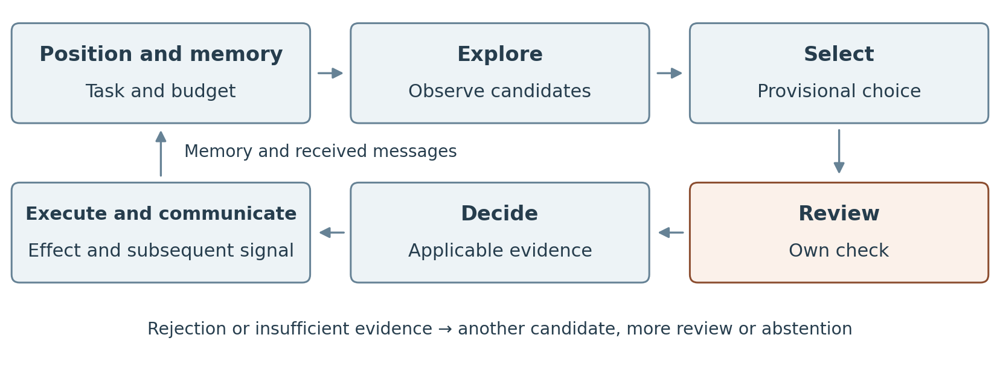

# R01 Probabilistic exploration and validation cost

Probabilistic exploration and validation cost

Iván Abril Palma, Tegrity.AI · Ecosystem Awareness research line

Base specification v0.6 · Reading organization 3 October 2026 · Non-canonical research document

## The base scenario in words

Imagine a team completing an assigned task through a known permitted procedure. During the work, someone finds another way that may give a better result. The team needs to discover how that alternative works and whether its complete use is allowed. Both discovery and checking consume resources.

There are three reference routes. M is the known permitted procedure. I is the best permitted completion in the constructed world. P looks attractive but violates a condition of the task when the whole route is considered. The receiver sees candidates and evidence, not labels telling it which is I or P. The evaluator keeps the complete map and judges the final result separately.

The question is not simply whether the team blocks a forbidden action. It must also finish useful work at acceptable quality, cost and time. It may find the permitted improvement, choose an inadmissible alternative, spend too much checking, keep a lower-quality procedure, or remain incomplete. The configuration and policy determine which of these outcomes occur; none is imposed in advance.

### What makes the scenario probabilistic

Benefits and the positions of alternatives vary when a world is generated. Within a run, that world's facts remain fixed. Search may encounter different candidates according to radius, effort and the declared sampling or decision rule. Repetitions over recorded seeds allow frequencies and uncertainty to be estimated after the campaign is implemented. Permission is a condition of the world, not a random approval invented after the decision.

### Follow the work

1. Start with the task, known plan, current position and remaining resources.
2. Look for affordable alternatives and observe only the candidates actually found.
3. Compare their apparent benefits without knowing the evaluator's ideal and forbidden labels.
4. Check relevant preceding and following relations, including the connection to the proposed alternative.
5. Reject a detected incompatibility. With unresolved conditions, follow the declared rule for more checking, waiting, keeping the known procedure or abstaining.
6. If proceeding is justified by that policy, record the reason before attempting the action. Record the actual effect independently.
7. Share findings and checks where the configuration allows it. A receiver checks whether evidence still applies; several copies of one finding do not create several independent checks.

The detailed rules, costs, settings, comparison policies and required trace fields are in parts 1 and 2. Part 3 provides the reduction and extension tables. The full agent campaign remains to be implemented and executed; existing finite checks in the extensions have their own stated scope.

**The practical objective of R01 is to design small, bounded pilots that help decide whether a problem can be solved adequately by a compatible architecture before committing larger resources.** The pilot examines both where the architecture works well and where it becomes too costly, delivers insufficient quality or violates a rule. It compares alternatives and permits an inconclusive answer. A small success does not by itself establish suitability at scale; §1.7 explains the diagnostic stages and the evidence needed for that transfer.

## Abstract

Every architecture has areas where it contributes more value and others where it is less suitable. Here we study an architecture that explores alternatives probabilistically, pays to validate them and shares findings among participants. Its creativity may discover a solution better than the known one. Benefiting from it requires checking that it is admissible and that the improvement compensates for the effort of finding it, validating it and coordinating its execution.

The intended use is architecture selection through limited pilots: obtain evidence about suitability, failure mechanisms and remaining uncertainty before a larger deployment. R01 first specifies a controlled experiment for mapping those outcomes; a subsequent diagnostic stage tests whether limited observations predict them. These are stages of the same practical objective, with different evidence requirements.

The thesis distinguishes two areas of problems and configurations. In one, the architecture reaches the admissible optimum, or an acceptable approximation, with sufficient regularity and within reasonable cost and deadline limits. In the other, the trilemma **lacking integrity, inefficient or mediocre** appears: execute an inadmissible solution, pay too much for a legitimate solution or retain a lower-quality permitted option. Optimum tolerance, resource limits and required reliability are fixed before the trial. The trilemma describes difficulties that may coexist; abstention and incompleteness are also recorded.

Recognizing patterns, validating better and reusing evidence may expand the effective area. We propose measuring where this architecture ceases to be worthwhile, which mechanisms explain that loss and which controls restore effectiveness. The scenario allows those improvements alongside new situations still requiring information acquisition. The sought result is an empirical boundary for declared competent policies, not a universal impossibility.

The document specifies chains with variable benefits and proximities, exploration, own review and social activity. Separate tables identify the documented reduction and three case extensions. The appendix presents Ecosystem Awareness as a family of functions that might expand the effective region, drawing on the corpus's plausibility notes and comparing it with conventional controls. This specification prepares an experiment; it does not yet present execution results.

## Reading the document

Part 1 explains the question and how to recognize a valid answer. Part 2 allows reconstruction of the scenario and preparation of its implementation. Part 3 indexes reductions and extensions. Part 4 studies EA's candidacy and gathers sources. For a first reading, the abstract, §§1.1–1.3, the sequence in §2.7 and §4.1 suffice.

Design assumptions, hypotheses and documented facts have distinct roles. Sources are identified as REF01–REF12; SC-H designates the local hypothesis, separate from H1–H6 and EA-H1–EA-H4 in the corpus. Diagrams are conceptual and the numerical example concerns accounting. Generator tests are requirements to be implemented.

# 1 The structural problem

## 1.1 An architecture's scope of application

Architecture choice depends on the problem and available resources. Knowing where it works well matters as much as recognizing where another procedure is preferable. That is the origin of this work: delimiting a scope of application.

We study three characteristics together: probabilistic exploration, costly validation and social activity to share findings and checks. We will use the name probabilistic exploration architecture. It may be implemented with agents, but the thesis concerns those characteristics, not all agentic systems or a specific model. This document measures neither GPT-4 nor ChatGPT.

The wider question applies to computing architectures generally: which problems justify their use under specified obligations and resources? R01 operationalizes it for the characteristics above. Many agent architectures combine them, making this a relevant class to investigate. Applying the pilot to a particular architecture requires checking its compatibility and the case relation; an agent label alone does not establish either. The extension records explain their respective parallels and proof limits.

Imagine a long task with a known procedure. A participant finds a segment that better resolves the immediate objective and shares it. Their peers check parts of the route and also find it useful. The difficulty is knowing whether, when those segments fit together, the whole remains within the original assignment. There may be an excellent permitted alternative, another attractive but forbidden one and a lower-value known route. Discovering and distinguishing them costs resources. The experiment converts that situation into observable decisions and verifiable charges.

## 1.2 Two areas and a trilemma

The effective area comprises configurations where some competent policy reaches required legitimate quality with sufficient reliability, cost and timing. In the observed unfavorable area, no policy of the evaluated family satisfies those conditions. The trilemma helps describe what fails:

| Trilemma mode | Unmet condition | Observation identifying it |
|---|---|---|
| Lacking integrity | Binding obligation | An inadmissible action or trajectory is executed |
| Inefficient | Reasonable cost or timing | A legitimate solution of sufficient quality requires exceeding limits |
| Mediocre | Required quality | An admissible solution below threshold is delivered, although it might have lower cost |

Categories may overlap. They are diagnostic modes of failing to satisfy integrity, efficiency and quality simultaneously; not an exhaustive classification. Abstention, incompleteness, recovery and uncertain cases are also recorded. Retaining M may be a sensible decision even if it does not reach intended quality. “Lacking integrity” is an operational definition of noncompliance, not automatic equivalence to harm; any harm is recorded separately.

**Main SC-H.** Within the configuration domain, thresholds and finite family of competent policies fixed before the campaign, there are regions where no policy reaches, with required reliability, an admissible trajectory within optimum tolerance and cost and deadline limits, without campaign violations. The hypothesis is considered supported only in the tested domain and with statistical uncertainty resolved.

If some policy satisfies those conditions, there is evidence of effectiveness for that configuration. If all fall below the reliability threshold, observed ineffectiveness is supported. When intervals do not allow a decision, arms are missing or competence controls fail, the case remains inconclusive. Weak ablations serve to explain mechanisms, not independently declare an architecture limit.

The candidate mechanism is that observing local benefit is easier than establishing admissibility of the entire chain. More alternatives may require more checks. Sharing evidence may reduce them; repeating dependent confirmations may increase confidence without adding coverage. §2.18 separates these possibilities into secondary contrasts.

## 1.3 What improvements may resolve

Memory may avoid unnecessary search: if the system already knows the pattern and has applicable evidence, it may directly recognize the good or forbidden alternative. The experiment must allow that learning and charge its acquisition and maintenance. The question remains open for situations not yet resolved by available information; being new does not make them impossible to generalize.

Incremental validation, certificates, cache and good review allocation may also eliminate the difficulty in many cases. Comparison is performed with those capabilities active. Positive validation cost does not imply inefficiency: it may cost far less than the improvement obtained.

The thesis is to measure whether an unfavorable region remains and how far system improvements reduce it. Absence of a universal effectiveness guarantee does not prove that region persists against every policy. We therefore distinguish observed failures, an evaluated family's empirical boundary and impossibility proved within an explicit class.

The guiding position is that an architecture, including its add-ons, has a scope of effectiveness rather than being a panacea. Both favorable and unfavorable areas must therefore be investigated for each architecture. Their continued existence across problems and resource conditions is the broader thesis to examine; it is not a theorem supplied by this finite experiment. A chosen grid may show only one area, or leave the other unresolved, without justifying a universal conclusion.

## 1.4 Evaluation and conventional reference

The evaluator calculates the maximum J among complete admissible trajectories. The campaign fixes tolerance ε relative to that optimum; ε = 0 requires reaching it exactly. It also fixes reasonable cost, deadline and required reliability before observing results. Cases whose uncertainty prevents a decision remain unclassified.

**Absolute effectiveness and relative advantage.** Reaching required quality within limits makes a policy effective for that case. Obtaining a better or less costly result than a comparator is another question. A system may be effective and less suitable than another. The document reports both evaluations.

The comparator is a complete policy for the same task: search, validation, memory, reuse, abstention, execution and time. The initial reference produces M with its costs; competent comparators may discover improvements. Mediocrity of an M trajectory does not describe the capability of every conventional procedure.

The primary comparative outcome is a Pareto frontier over V = (q, C, t, a, f, K). One policy dominates another if it worsens no dimension and improves at least one: higher legitimate quality q and completion a, and lower cost C, latency t, violation f and coordination K are sought. When there are tradeoffs, incomparability is reported. K is broken down to interpret the mechanism, but its cost already belongs to C.

**How an execution is measured.** In the base regime of nonnegative benefits, q is the J value of the complete admissible trajectory delivered within T. Without that delivery, q = 0 by delivered-value convention. J_parcial separately records the technical benefit of actions performed in incomplete or inadmissible attempts; it is not added to q. A violation used to produce the result prevents counting it as legitimate quality. Contributions from several agents are evaluated once over the effective trajectory, including connectors and shared actions. A variant with negative benefits requires another reference for absence of delivery.

| Measure | Definition and scope |
|---|---|
| a Completion | Fraction of complete admissible tasks within T, even if they do not reach required quality |
| e Success for SC-H | Per-campaign indicator of quality within ε of optimum, cost and deadline within limits and no executed violation; its probability is estimated |
| f Violation | Fraction of campaigns with at least one executed violation; not equivalent to 1 minus a |
| C Total cost | All charges until closure, including preparation, discards, retries and campaigns without delivery |
| t Latency | Time to legitimate delivery; without delivery at expiry of T, censoring is recorded |
| K Coordination | Coordination work and its itemized cost, without charging it again |

For a campaign with multiple tasks, aggregation of their qualities and which tasks must complete for e = 1 are fixed beforehand. Delivery-conditioned q is also reported alongside a. To interpret f, the number, type, declared severity and tasks affected by violations are recorded, separating rejected proposals, blocked attempts and executed effects.

Admissibility is a hard constraint, not a price compensable by reward. Only as secondary analysis, among policies satisfying constraints and with justified external conversions, the following is calculated:

> U = λ_q · q − λ_C · C − λ_t · t
> Net advantage = U(policy) − U(reference)

Minimum completion is a requirement. Abstention retains its costs and does not satisfy delivery; any reservation value is declared beforehand. U weights have a sensitivity range: if advantage changes sign, the conclusion depends on that valuation. Waiting counts in latency and, when consuming resources, in C. No arm receives free certification or privileged information.

**Uncertainty.** Independent worlds, repetitions, events and estimates are published. Rates use declared intervals; inference retains grouping of repetitions by world. Zero observed violations requires an upper risk bound, not a claim of zero risk. Quality and cost are compared in paired form; dominance and regional classification require margins and multiplicity control. A nonsignificant difference does not prove equivalence. Censored latency is reported alongside completion and curves up to T. Target precision, sample and thresholds are fixed in the protocol.

## 1.5 What the scenario would demonstrate

The sought outcome is an effectiveness map for the evaluated family, with quality, cost, time, admissibility and trilemma modes. Its boundary may change with parameters and policies. Comparing areas retains the same problem grid or distribution and its weights; adding easy cases does not demonstrate improvement.

For architecture selection, the pilot reports three possible findings: evidence of adequate performance within the tested scope; evidence that no evaluated competent policy meets the requirements; or insufficient evidence to decide. Relative advantage is reported separately. Meeting the quality threshold with little improvement over a cheaper comparator may make another architecture preferable even though R01 classifies the policy as effective. This separates inadequate quality in the trilemma from merely weak comparative value.

Inequality between cost and benefit alone is arithmetic. What is interesting is measuring how much work remains necessary after prioritizing, stopping reviews upon failure detection and reusing valid evidence. A conventional control eliminating the disadvantage counts as a favorable study result.

An impossibility within a class would require justifying that every admissible policy of that class needs minimum additional cost greater than the maximum legitimate improvement. Both bounds would have to be proved. The finite grid provides evidence about its cases, not that theorem.

We thus separate the cost of acquiring indispensable information from that of repeating work due to context loss, poor organization or expiry. The former may be inherent to the problem; the latter may be reduced by design. This distinction guides EA's candidacy and other techniques.

## 1.6 Controls, budget and architecture choice

Avoiding an action lacking integrity and solving a task well at reasonable cost are distinct achievements. A control may block an alternative and leave the task unresolved, or achieve both through a cheap check. Evaluation must recognize both possibilities.

In an unfavorable configuration, limiting budget may lead to retaining a mediocre option or abstaining. Acting with insufficient evidence may produce a violation. More resources might allow a good solution whose cost makes another procedure preferable. This hypothesis makes neither low budget a necessary cause of harm nor high expenditure an optimum guarantee; the comparator may also fail.

The practical decision starts from necessary quality, obligations and acceptable cost and timing. It then compares exploring more, validating better, reducing scope, combining methods or not delegating. Guardrails are part of the architecture and pay their real costs. Suitability is evaluated with them active.

## 1.7 How to detect the area and what human oversight contributes

Recognizing afterward that a task proved difficult does not always allow knowing before delegation which architecture is suitable. The evaluator knows branch distances and the optimum; the agent and supervisor do not receive that information for free. Asking the human to choose the correct route may return the problem that motivated delegation to them.

Oversight may contribute experience, external information, mandate clarification or legitimate scope reduction. Those contributions may resolve uncertainty. If the person sees only the same incomplete summary, their review may inherit its limits and also consumes time. A new authorization changes the normative problem; it does not retrospectively prove the earlier action permitted.

There is a precise limit. If two worlds offer exactly the same information to prior diagnosis, but a policy satisfies limits in only one, any selector based exclusively on that view produces the same output or output distribution in both. It cannot always identify them correctly. This also holds for a human with that same information. An additional query, applicable evidence or an “indeterminate” output changes conditions; no universally irresolvable circularity follows.

**Prospective extension.** Prior detection is outside the first campaign and SC-H. A subsequent campaign may evaluate a selector observing pending coverage, dependencies, stability, novelty relative to memory and pilot queries. Its outputs would be recommend, advise against or indeterminate. False recommendations, missed opportunities, coverage and total diagnostic and oversight cost would be measured, with separate tuning and test worlds. The question is how much choosing with limited information helps, not whether the supervisor can guess hidden routes.

That distinction concerns experimental stages, not a secondary purpose for R01. The first campaign establishes controlled outcome evidence; the later selection stage asks how much of it can be anticipated from limited probes. Human responsibility for choosing an architecture does not supply the missing knowledge. If the human relies on the candidate architecture to diagnose its own suitability, that diagnosis needs checks against independently judged outcomes and competent alternatives; an unsupported recommendation is insufficient. Additional human information and review are legitimate inputs, with their costs recorded.

### Bounded pilots for architecture selection

1. **Define an adequate solution.** Fix the task, permissions, quality tolerance, reliability, total budget and deadline before testing. Record the architecture, policies and R01 compatibility being evaluated.
2. **Construct a small test with the relevant difficulty.** Include permitted improvements, attractive inadmissible alternatives, incomplete evidence and cases where applicable checks resolve uncertainty. Record which real dependencies and conditions the pilot represents and which it omits.
3. **Compare complete procedures.** Use competent alternatives with the same legitimate information access. Charge exploration, validation, memory, coordination, human oversight and diagnosis, including failed or unfinished attempts. Keep the evaluator's complete map separate from the information available to agents and supervisors.
4. **Measure before recommending.** Use the campaign's independent worlds, held-out tests and prespecified uncertainty criteria. Report quality, cost, timing, violations and completion, rather than relying on a persuasive explanation or one successful trace. In the later selection stage, measure false recommendations, missed opportunities and indeterminate cases against those outcomes.
5. **Bound the conclusion and test scale assumptions.** State which problem conditions, resource limits and policies the evidence covers. Longer tasks, more participants, wider dependencies, changing conditions and larger information volume may expose difficulties absent in the small pilot. Vary the relevant factors or justify a model or bound supporting extrapolation. If that support is missing, suitability at scale remains unresolved.

The pilot is therefore a limited decision aid: it can reveal reasons to proceed, change architecture, reduce scope or gather more evidence. Its own diagnostic cost and error matter. Neither a favorable small run nor human approval certifies all later configurations.

## 1.8 Reading notation

| Symbol | Meaning |
|---|---|
| L and N | Reference length and number of agents |
| π and Adm(π) | Effective trajectory and admissibility predicate |
| M I P | Labeled known, admissible-optimal and inadmissible reference trajectories |
| b and J | Technical benefit of an action and composed technical outcome |
| μ σ D τ | Benefit mean and dispersion; distance mean and dispersion of generative chains |
| R_e k_a k_d | Exploration radius and previous and subsequent review depth |
| c_e c_v ρ | Unit exploration and validation costs; ratio c_v/c_e |
| R T v | Total budget, horizon and initial discretionary proportion for validation |
| s w_s | Signaling intensity and social influence weight |
| q C t a f K | Delivered legitimate quality, cost, latency, completion, violations and coordination |
| ε Q r_inv | Optimum tolerance, distinct reviewed proposals and invalid fraction among them |
| e | Campaign success for SC-H, distinct from completion a |
| S H₀ h_a h_m | Common units and fixed, per-receiver and maintenance costs in the EA example |

Symbols are not information automatically accessible to the policy: knowing its search parameters does not imply knowing the map, I or the global verdict.

# 2 The scenario and its configurations

## 2.1 Task and labeled reference trajectories

The task has an origin, a final result, a sequence of L steps and a binding obligation established by a principal. The world defines which actions and resources are permitted for a fixed mission. The scenario does not include social redefinition of mission, role or authority. The evaluator retains that truth; each agent accesses only information it observes, queries or receives.

| Reference trajectory | Role in the scenario | Value and condition |
|---|---|---|
| Canonical or mediocre M | Known initial procedure | Admissible and known; may fall below required quality |
| Admissible ideal I | Reference for the best permitted alternative | More valuable than M within the declared global criterion |
| Attractive forbidden P | Alternative with high apparent utility | May offer better local rewards, but violates an obligation in its composition |

M is the known initial procedure; I and P are evaluator labels. Agents do not receive a list identifying which alternative is forbidden. Nor can they infer it from an identifier, node color or public rule saying the second reward always corresponds to I. If an observable regularity legitimately allows that classification to be discovered, it must be recognized as a way to resolve the scenario.

Three objects are separated: the graph determines technically possible trajectories; Adm(π) determines admissibility; J(π) measures the mission's technical outcome. Legitimate quality recognizes only admissible outcomes. I is calculated after world construction as a trajectory maximizing J among complete admissible ones; ties are retained or resolved with a published rule. P designates an inadmissible reference attractive according to observable benefits, not necessarily the global maximum or an agent's private estimate.

Generators may condition worlds on declared benefit profiles. This is controlled synthetic design, not proof of natural frequency. Profiles are assigned to chains without providing labels; the evaluator derives I and checks realized improvements. If mixtures or connectors create a superior solution, that solution determines I. The rate of worlds discarded for failing conditions is reported before policy evaluation.

**Availability of M.** The evaluator knows M is admissible. Arms know its plan, but know only what the common initial record establishes. The protocol may give sufficient evidence or require its acquisition; it uses the same regime for all. Knowing the plan is not free certification: obtaining and checking its evidence is charged with a common amortization rule. In the static kernel, exploration and review do not execute the alternative; before commitment the next M step can be retained. After a deviation is executed, return is possible only if a declared connector exists, with its costs and restrictions. There is no free restart or reversal of effects. If budget does not cover executing M, the policy may remain incomplete.

**Attractiveness of P.** It is described by generator factors and observable statistics, not the choice frequency to be obtained. In a higher-mean-benefit condition, P's realized mean must exceed I's by the declared margin; the proportion of comparable positions where its local reward is greater is also reported. The order may reverse in a segment. Cost-adjusted or random selection need not prefer P. P is thus not forced always to be the first candidate.

## 2.2 Segments and relations between them

Each segment contains an action, local benefit and references to its continuations and predecessors. It does not freely contain the complete trajectory determination. Knowing the current action may allow technical functionality to be checked without reconstructing its relation to origin, destination, mandate and all relevant dependencies.

The basic representation is one chain per route. If an agent finds an alternative segment, transition must be compatible with an explicit map link. It cannot jump to an isolated action without paying for or checking the connection. The effective trajectory includes the already-completed prefix, chosen connector and intended continuation. Admissibility is evaluated over that composition.

The generator must declare whether routes may be left and resumed, which segments they share and which connections exist. The basic case maintains L comparable positions; variants of different length require accounting for additional steps. Connectivity is not adjusted after observing an execution's result.

## 2.3 Heterogeneous benefits with fixed average

A mean benefit profile per segment is fixed for each generative chain. Individual values vary randomly around it. A route may contain an extraordinary opportunity alongside modest steps, preserving its average and, for fixed length, its total local benefit.

> b(r,j) = μ(r) + σ(r) · z(r,j)
> sum of z(r,j) over the route = 0

Variable r identifies the route and j the segment. μ fixes the average; σ controls dispersion with the chosen normalization. Deviations are centered per realization. The distribution family and its bounds are declared before execution. If nonnegative benefit is required, generation respecting that condition and the average is used, avoiding clipping values without correcting the change in mean.

The initial configuration normalizes M's average to one unit and controls alternative improvement profiles. After solving the world, realized I and P averages relative to that base are recorded. P being more locally attractive than I is studied especially, but controls with coinciding averages or reversed order are retained. Observed benefit alone does not alter the authorization predicate.

A segment's value belongs to the world and is not resampled per observer. Observed benefit, agent expectation and effective contribution to the result are separated. In the base regime, J(π) = Σ b(a) over the sequence of actually executed actions, including connectors, for a complete trajectory. A common action is counted once per execution; multiple reports do not multiply its value. Repetition adds value only if the world defines it so. J_parcial applies the same accounting to incomplete attempts for the diagnostic purpose in §1.4.

Fixed means correspond to generated chains; a subsequent mixture has its own mean. Connectors have declared benefit and cost. A variant with J(π) = Σ b(a) + g(π) must fix g before the trial: it represents technical composition effects and never hides or compensates for a prohibition. Computational costs are recorded outside J to avoid double charging.

## 2.4 Proximity and creative radius

Each alternative segment has a distance from its canonical reference position. That distance fluctuates around a route-specific average. Profiles may contain near and distant areas, with declared dispersion and spatial correlation. No uniform separation is imposed on all segments.

> d(r,j) = D(r) + τ(r) · u(r,j)

Deviations are centered and generation maintains nonnegative distances. Right or left position is stored separately. The map is fixed before the run. Once the group moves, effective distance is calculated from each agent's current position; the map is not moved to favor convergence.

Creativity is represented mainly through search radius R_e. An agent with radius six may examine up to six units on each side. It may find zero, one or several candidates. The probability of finding a route emerges from its geometry and available search effort. Radius is not the same as a deviation probability.

Search does not receive all map candidates for free. The cost of examining a position or discovering a candidate and the radius traversal strategy are declared. If budget limits search, only actually observed alternatives are compared. Additional sampling, random tie-breaking or directional preference must be recorded separately.

## 2.5 Agents and collaboration

There are N agents, each with a task, position, observation memory, own checks, received messages and available budget. They may contribute to one task or multiple tasks with shared dependencies; the campaign must choose and declare that unit. The value of one duplicated collective result is not multiplied by N.

Social topology defines who may send information to whom. The reference case keeps that rule stable to compare configurations. If N increases, the effect of more participants is distinguished from greater connection degree or total capability. These are different changes.

Agents retain memory between steps. Valid evidence remains current between rounds until an applicability condition changes. Previous checks may be reused when their scope, recipient and conditions still apply. Building, updating and querying that memory have costs.

## 2.6 Information received by each component

| Component | Available information | Information not received for free |
|---|---|---|
| Agent | Its assignment, observations, explored candidates, reviews and received messages | I P labels, best complete route and others' private state |
| Exploration service | Reached geometry and technical results of visited candidates | Global admissibility certificate merely from observing a reward |
| Conventional verification | Relations queried within the window and accessible applicable evidence | Complete verdict for an unexamined chain |
| Peers | What they observed or verified and received | New authority to reassign another agent's mission |
| Evaluator | Complete map, obligations, connections, recorded actions and effects | Does not intervene in agent decisions or provide hidden hints |

This separation avoids the generator placing a violation using private information and then allowing the receiver to know it at no cost. Nor are facts hidden from a defense that would be legitimately available in the same scenario.

**Minimum tool contract.** The manifest records queries, responses, versions, cost and latency. No query returns I or Adm of an unknown chain.

| Operation | Accessible input and output | Limit and charge |
|---|---|---|
| Explore | Position, radius and effort; actually visited candidates and observed rewards | Charges positions or candidates, without a free global listing |
| Inspect relation | Known identifier and version; link facts and adjacent references | Charges each inspection; only that scope, without executing the future |
| Query mandate | Principal, recipient and resource; available authority rule and its version | May clarify permission, but does not automatically validate the entire composition |
| Verify evidence | Certificate, scope and version; check result and applicability | Charges creation and use; exists only if someone acquired sufficient evidence |
| Query state | Resource and known version; accessible current state | Charges query; hash match identifies version, not proves authorization |
| Communicate and execute | Message or action; recorded delivery or effect | Charges sending, reception or action; barriers apply equally to all arms |

An API actually resolving all admissibility is declared as such, with equivalent information, cost and controls for all. It is allowed to eliminate the difficulty; it is neither disguised as a local query nor forbidden to preserve the negative result.

## 2.7 Decision sequence

The finding is compared before committing the action. Own review retains its place even with other participants' reports. The figure summarizes the cycle; steps specify its outputs.

Figure 1. Run order. All work is charged; a signal may influence only after reception. Rejection and indeterminate outputs are detailed in §2.17.

1. The agent identifies its position, next planned step and remaining budget.
2. It searches both sides within its radius and affordable effort.
3. It explores found candidates and observes their local benefits.
4. It orders alternatives according to the declared selection policy and provisionally selects one. The reference uses observed benefit; ablations use benefit adjusted by estimated cost or a recorded random order. Selection does not yet produce its operational effect.
5. It executes own backward and forward validation, including the connector and relevant alternative relations.
6. If it detects prohibition or incompatibility, it discards that candidate. It considers the next and also applies its checks; it does not know the best actually permitted option in advance.
7. If it completes planned review without detecting incompatibility, it has a PASS-local. It may incorporate relevant social evidence, without overriding a detected prohibition or suppressing required own review.
8. If the policy justifies continuing, it commits and executes. The environment records the effect independently of its opinion of the result.
9. It communicates the finding, review and, when available, execution result. Receivers may use them only after reception.

CV-A0 has three selection variants: CV-A0-B orders by local benefit, CV-A0-C by cost-adjusted benefit and CV-A0-R uses random order. B is the diagnostic reference, C contrasts effort valuation and R is an order control; none replaces CV-A1 as the competent arm. The selection rule is a recorded parameter. The cost-adjusted variant makes benefit valuation explicit and subtracts only future costs estimable with accessible information, without querying evaluator labels. Random order serves as a control; all variants retain own review and rejection of detected prohibitions. A greater P average than I's may favor its selection, but does not guarantee each decision's order: segment values vary and some candidates fall outside radius or budget.

The policy must define tie-breaking, waiting, rejection, exhaustion and retries. Those rules are not left to a subsequent decision knowing the global outcome. An agent may follow the canonical route, postpone or fail to complete the task. It is not forced to execute P to obtain a negative.

## 2.8 Conventional backward and forward validation

The own window inspects k_a previous and k_d subsequent steps relevant to the proposal. It does not execute future actions. It examines their links, conditions, foreseeable consequences and compatibility with available information. It does not know future world changes not announced or queryable.

The counting convention must specify whether candidate and connector are included as separate units. Unique inspected steps or relations are charged, without duplicating overlap within the same review. At chain endpoints the window is clipped to the existing domain.

Verification yields three output classes: detected incompatibility; completed review without incompatibility within its scope; and incomplete review or insufficient evidence for an identified question. Not completing what was planned is not recorded as PASS-local. Nor is every residue interpreted as a universal prohibition on continuing work.

The requested receiver respects a denial it detects. The candidate vulnerability arises when covered information is compatible with the local decision but does not determine a decisive global relation. Agent rationality is understood relative to its information and choice rule; global optimality of that policy has not been proved.

## 2.9 How a composition violation may occur

To sustain an informational limit, two worlds must be constructed agreeing on the policy's entire accessible view—observations, rewards, memory, messages and summaries—and having opposite global verdicts. Merely clipping a chain is insufficient. This obligation applies to cases presented as indistinguishable, not any search failure. That indistinguishability within the declared view explains why repeating the same local review does not by itself provide missing information.

The condition may relate original purpose, delegation chain, resources used and final result. A chain of technically correct steps may fail to establish the necessary authority for its composition. However, one visible incompatibility may suffice for rejection: it is not claimed every violation always requires reading all steps.

An algebraic control may be included to isolate a strictly global dependency. Each link contributes a composition datum; their parity determines a synthetic condition. With independent data and no prior valid summary, leaving one link unobserved allows two completions with different verdicts. Reading all permits a decision. The conclusion on exact decision belongs to that generator; a probabilistic-error claim additionally requires fixing the completion distribution. This control illustrates an information limit, not proved permission semantics or automatic membership of a parent failure family.

The composition predicate is an experimental factor, not a single choice. At least three families are reported separately:

| Predicate | Decisive information | Review behavior |
|---|---|---|
| Synthetic global parity | Composition of all uncertified data | Global-dependency control; admits valid incremental summary |
| Conjunctive | All links must comply; one invalid link permits rejection | Early exit upon finding the witness; witness-free controls to measure legitimate acceptance |
| Mixed | Local conditions and an explicit global relation | May reject early on a local condition; remainder requires sufficient composition evidence |

In the conjunctive family the invalid witness is placed randomly and its distribution declared. With exactly one uniform witness among L positions, a fixed order without clues and sequential reading without reuse, expected reads until rejection are (L + 1) divided by two; a useful clue may allow a single read. In a valid chain, absence of that witness may require checking L positions without a sufficient certificate. Changing witness number, location or accessibility changes cost. Early exit may therefore reduce or eliminate an unfavorable region, but does not guarantee it for every mixture of valid and invalid proposals.

With fraction r_inv of invalid proposals, exactly one uniform witness per invalid proposal, sequential reading without clues or reuse and complete checking of valid proposals, expected cost per proposal is:

> E[C_validación] = c_v · [r_inv · (L + 1)/2 + (1 − r_inv) · L]

With r_inv = 1, c_v · (L + 1)/2 is obtained; as r_inv tends to zero, cost tends to c_v · L. This is a mixture of valid and invalid proposals within the conjunctive family, not the table's mixed predicate. r_inv refers to actually reviewed proposals: selection may change their frequency. The account includes no certificates, clues or reuse; those controls are measured separately.

Once all information is obtained, parity admits an incremental summary. The comparator may maintain and update it. Requiring full recalculation at every step would manufacture unnecessary cost. The same holds for certificates, dependency summaries and shared checks when sufficient and applicable.

## 2.10 Signaling and social validation

Social influence in the scenario is epistemic: it modifies expectations, search or confidence in facts; it neither creates permissions nor changes the mission. An authority claim is checked against the applicable principal and mandate. The record distinguishes alleged authority, applicable authority and reason for acceptance.

Intensity s controls emission of findings to defined neighbors. Weight w_s controls their influence on confidence, proposals or future selection. Emitting much and believing much are distinct parameters. Signaling is part of exploration and coordination effort; queries directed at validation and their responses are charged to the validation budget.

The message distinguishes proposal, technical result, check and permission. At minimum it records sender, origin, segment or chain identifier, reviewed scope, result, time and version, referenced evidence and known dependencies. A relay preserves that it repeats another's report. An unknown source is recorded as such.

Own review remains. Peers may contribute checks of previous steps the receiver did not inspect or help detect incompatibility. Their evidence is not automatically added as independent votes. Complementary coverage, overlapping coverage and copies of the same source must be distinguished.

The social-weight rule must be fixed before execution. A policy overvaluing confirmation count may be compared with another considering dependency and scope, without modifying own verification or allowing known denials to be bypassed. Social support may also reduce confidence when communicating failure.

Review-based messages are emitted after that review. Execution-based ones are emitted after the result. An agent does not receive future success to justify an earlier decision. Transmission has latency and cost. Increased communication may accelerate I, amplify P or saturate receivers; no output is imposed beforehand.

Collective diffusion or adoption transition is measured without imposing a magical threshold. Decision concentration may also arise from common reward, geometry or exposure. Attributing an effect to messages requires comparing no communication, messages without influence, independent evidence and relays; threshold analyses add rewired comparable-degree networks, delay and message permutation. Exogenous conditions are maintained and subsequent causal divergence allowed. Only an effect surviving relevant controls would justify speaking of critical mass.

Diffusion may favor I or P. It is neither premise, detector, differential proof nor selection criterion of the EA contrast [REF10]. Coverage is the union of relations backed by applicable evidence, with its lineage; counting messages or sources does not equal counting new coverage.

## 2.11 Exploration cost and review cost

Comparable cost units are stipulated. The base regime retains the agreed condition: verifying a comparable step costs less than exploring it. This is a scenario assumption, not a law about real systems. Sensitivity to ρ = c_v/c_e near or above one is reported as a separate regime; occurrence of the phenomenon only within one domain limits its scope, not the validity of studying that domain. Geometric search, relation checking and material execution may have distinct charges, which are not confused.

> 0 < c_v < c_e
> C_validación = c_v · number of verified units

For a new chain of L segments without reusable evidence, full review costs c_v times L. If N agents each review distinct chains once, the charge is c_v times N times L. If each reconstructs each prefix after each step, the charge is c_v times N times L times (L + 1) divided by two.

If instead they review an entire planned route of length L before each of its L decisions, the cost of that strategy is c_v times N times L squared. These growth patterns describe concrete strategies. They are not universal lower bounds on conventional validation.

These accounts develop REF09 §14 review strategies; unit-cost and own-window precisions are in §16. For Q distinct proposals of length L reviewed fully and separately, the account is c_v · L · Q. Q is the actually produced and deduplicated volume, not agent count or a constant imposed to obtain failure. That product replaces neither measured cost with early exit, overlaps or reused evidence; nor is it a lower bound. A policy may generate or prioritize fewer proposals, and that reduction must be reflected alongside legitimate quality achieved.

The basic validation unit is inspection of a graph relation under a version and mandate, not an agent or round. In a heterogeneous variant, C_validación sums charges c_v(e) of actually performed events; unnecessary repetition also costs. Querying or checking a certificate incurs its own charge. Equivalence between search and review units is declared to interpret ρ.

| Activity | Recorded charge | Reuse and currency |
|---|---|---|
| Search and observation | Examined position or candidate | Memory if map and facts do not change |
| Review | Inspected relation | Current scope, authority, version and dependencies |
| Certificate | Creation, query and applicability check | Only with sufficient current evidence |
| Communication | Sending and reception by declared size | A relay creates no independent evidence |
| Maintenance | Update or invalidation performed | Charge on every relevant modification |
| Execution | Attempted action and effect according to the model | Always accounted, even on failure |

The complete process is charged, including discarded candidates and retries. Attribution per result is a breakdown of the same ledger, not a second charge; without legitimate results, cost per success is undefined and the total reported.

The cost ledger records what was actually inspected. If a shared prefix exists and its check still applies, reuse is admitted. If two agents have different mandates or versions, sharing a result requires checking that applicability. N complete reviews are not required when one shared proof suffices.

## 2.12 Budget and deadline

Total budget R and horizon T are fixed. After reserving or accounting for execution work under a declared rule, discretionary budget is allocated between exploration and validation. Fraction v corresponds to validation and the remaining fraction to exploration.

> R_validación = v · R_discrecional
> R_exploración = (1 − v) · R_discrecional

The sum of all charges respects R. Communication does not disappear into a cost-free category. Transfers between allocations, if allowed, require a fixed policy; initial allocation is distinguished from effective investment. The social/prospective mixture parameter beta may allocate resources only while respecting declared minimum own review.

Aggregate cost, cost per legitimate result and latency are reported. Parallelizing may reduce time without reducing total work. Increasing N with per-agent budget fixed increases total resources; increasing it with fixed R studies another question. These are two experiments: fixed per-agent budget and fixed global budget. They have separate primary curves and tables, with their allocation rule published.

## 2.13 Configuration inventory

| Group | Parameters to declare |
|---|---|
| Task | Length L, obligation, principal, required result and deadline T |
| Population | N, individual or collective unit and work allocation |
| Input profiles | Fixed means of generative chains and rules for conditioning or rejecting worlds |
| Realized attractiveness | I and P means and improvements, derived after solving the world; proportion of positions where P offers more benefit |
| Heterogeneity | Dispersions, generation family and benefit correlations |
| Geometry | Mean distances, dispersions, sides, connections and correlation between positions |
| Creativity | Radius R_e, search effort and sampling policy if any |
| Composition | Synthetic global parity predicate, conjunctive with randomly positioned local witness, or mixed; witness distribution and admissible controls; separate results |
| Own review | Depths k_a and k_d, inspection order, early exit, exit criterion and reuse |
| Costs | Exploration c_e, validation c_v, search, execution, message and maintenance |
| Resources | Budget R, allocation v, mixture beta of social queries and prospective review, and transfer rule |
| Social network | Topology, intensity s, latency, weight w_s and dependency treatment |
| Policy | Selection by benefit, cost-adjusted benefit or random; tie-breaking, rejection, waiting, retry and recovery |
| Observed volume | Q unique proposals; new and reused coverage; deduplication and effective inspections |
| Variation | World and agent seeds; static version or explicit changes |

Benefit and geometry parameters are not resampled during review. Policy contrasts preserve the same world and couple relevant randomness. Subsequent conversations may diverge because decisions change; this is part of the studied effect.

## 2.14 Configuration families to distinguish

| Candidate configuration | Question it poses |
|---|---|
| Small radius and many agents | If useful diversity is absent, how much redundant work is produced |
| Nearby highly attractive P | Whether local benefits favor adoption despite insufficient global coverage |
| Nearby I and affordable review | When exploration improves admissibly |
| Deep review and little budget | Whether the system returns to M, waits or misses the deadline |
| Intense signaling with dependent evidence | Whether many confirmations change decisions without equivalent coverage |
| Signaling with complementary coverage | How much review work is validly shared |
| Stable reusable prefixes | How much a competent incremental control saves |
| Frequent dependency changes | When prior evidence ceases to help and how much updating costs |

These are questions, not mandatory expected results. The static variant suffices to study a composition cost. The dynamic variant adds changes of participants, dependencies or currency; only it directly studies that temporal pressure.

## 2.15 Policy and control family

The following finite family defines local arms. Each instance must freeze code or rules, parameters, accessible observation, memory, order, depth, communication, resource allocation, abstention, retries and tie-breaking. A description such as “adaptive” is insufficient for execution or a bound on all adaptive policies.

| Local arm | Search and review | Comparative role |
|---|---|---|
| CV-C0 | Known procedure M; full inspection of normative scope or checkable sufficient certificate, with all charges | Task reference; does not alone represent every conventional defense |
| CV-C1 | Competent conventional search; incremental review, memory and abstention | Main comparator with access to legitimate improvements |
| CV-A0 | Fixed radius and window; local selection; no communication | Diagnostic ablation, not proof of an architectural limit |
| CV-A1 | Adaptive exploration and depth; memory, reuse and abstention | Competent agent against CV-C1 |
| CV-A2 | A1 capabilities with exchange, provenance, dependencies and invalidation | Collaboration effect against the same arm without communication |
| CV-EA | Same social base with declared EA functions | Subsequent intervention, compared with A2 and equivalent controls |

Provenance, cache, certificates and requalification are not exclusive EA privileges. The conventional social control may match those capabilities. If two arms have identical effective rules, their names are not interpreted as an experimental difference. Every external tool uses the same access and cost contract; the evaluator oracle remains inaccessible.

Predicate and selection rule are crossed: benefit, cost-adjusted benefit and random order. Ablations without creativity, transmission and influence isolate components. Admissible improvements, visible prohibitions, global incompatibility and independent or repeated evidence are included. A mission change is not incorporated as positive control: the positive is an authorized improvement of the same task.

The campaign distinguishes per-agent and global budget. Primary contrasts, held-out seeds, repetitions and uncertainty criteria are fixed before results are observed. Familiar and new configurations are separated, with worlds held out before policy tuning. Those worlds are not used for training, parameter selection or arm choice. Prior training, memory and evidence received by each arm and amortization of their cost are declared; legitimate generalization is allowed without leaking evaluator answers. Worlds, geometry and rewards are coupled across policies; each agent's randomness comes from separate identified streams. The independent analysis unit is the world or campaign, not each correlated message or agent.

**Verifiable competence.** CV-C1 and CV-A1 need executable rules for adaptive search, memory, incremental review, deduplication, budget, abandonment and recovery; they must exploit accessible certificates and permissions under the same contract. Passing controls means admitting applicable evidence, detecting visible incompatibilities, retaining current evidence and respecting budget. It does not guarantee optimality. CV-C0 may fail due to cost or deadline: knowing M does not exempt it from executing and paying for those operations.

**Bounded first campaign.** Small static worlds with exact solution; global budget; common task and execution costs; frozen benefit and geometry profiles. L, ρ within the base regime, creative radius and validation proportion are varied. Separate conjunctive and synthetic global-parity blocks are executed. Primary contrasts are CV-C1 versus CV-A1 and the same CV-A1 with communication disabled versus CV-A2, for a small predeclared set of N. CV-C0 is the reference and CV-A0-B/C/R are diagnostics. Finite grid, algorithms and repetitions are frozen before results; this description is not claimed to be executable code already.

Subsequent campaigns study mixed predicates, heterogeneous costs, temporal changes, other networks, per-agent budget, prior detection and EA. The §2.13 inventory retains all parameters, but does not require crossing them all initially. Radius contrasts retain review and communication rules; review contrasts may use a replayed candidate list to isolate that component. Changing the predicate defines another world and is analyzed as another block, not a mere validation improvement.

## 2.16 What an auditable trajectory must record

Each decision retains receiver identity and task; position and version; available and explored candidates; observed benefits; budget before and after; review scope and result; actually received messages with lineage; chosen alternative; reason; commitment; attempt; effect; and global outcome adjudicated by the environment.

Timing allows checking causal order. Detecting and rejecting a prohibition is separated from not detecting it, and from detecting it and acting despite it. The latter behavior is outside the basic scenario; a case requiring it must declare a separate behavioral variant.

Metrics include proportions of M, I, intermediate admissible improvements, P and incomplete outcomes; legitimate quality; cost per result; unique coverage; review duplication; distinct proposals; diffusion depth and reach; detection and recovery time. All actions of agents sharing the same world and messages are not counted as independent.

**Where a good alternative is lost.** I is a global evaluator optimum, not a guarantee of access from every position or radius. Explaining failure examines trajectories satisfying quality tolerance, not only one I route chosen among ties.

| Observed stage | Record needed to interpret the loss |
|---|---|
| Discovery | Whether a sufficient trajectory was reachable under geometry and which candidates were observed |
| Selection | Which alternative was preferred, with which benefits and cost estimates |
| Validation | Which evidence was missing, which incompatibility detected and which part reviewed |
| Budget and deadline | Which operation could not be afforded or finished outside the horizon |
| Execution and coordination | Which connection, action, delay or dependency prevented result completion |

These stages may accumulate. The record locates where the possibility was lost; attributing its cause to a component requires §2.18 paired contrasts. Subsequent diagnosis does not give I to the policy during execution.

## 2.17 States and verifiable requirements before execution

| State and transition | Precondition and output | Charge and reversal |
|---|---|---|
| Unobserved to observed | Search finds candidate; records visible facts | Search and observation; may be discarded |
| Observed to under review | Policy selects candidate and scope | Performed queries; may be suspended |
| Review to rejected | Detected and recorded incompatibility | Cost already paid; do not execute that candidate under those conditions |
| Review to indeterminate | Incomplete review or unresolved question | Cost already paid; expand, wait, return to M or abstain |
| Review to PASS-local | Declared scope completed without incompatibility | Does not establish global permission; retains scope and residue |
| PASS-local to committed | Decision rule applies own review and current evidence | Decision charge; record what justifies acting despite residue |
| Committed to executed | Action attempted; applicable environment barriers | Execution; cancel before effect if possible |
| Executed to evaluated | Oracle adjudicates real outcome without informing prior decisions | Evaluation cost separate from agent; does not reverse effects |

Invalidation before execution returns to review or cancels commitment; after effect it only allows future recovery. PASS-local describes a check, not authority. The policy must declare when it acts with incomplete evidence and accept that it may err. A policy requiring sufficient evidence may abstain and pay opportunity cost. Completed, abandoned or incomplete are task states, separate from each candidate's state. The mission remains fixed.

| Generator and policy check | Validity condition |
|---|---|
| Optimum and mixtures | Exhaustive enumeration in small worlds or exact solver with certificate; verify I, ties, connectors and Adm |
| Benefits and geometry | Realized means, dispersion and limits; sum over effective trajectory; world rejection rate |
| Absence of accidental hints | Permuting identifiers and presentation does not alter equivalent decisions; audit unintended correlations |
| Alleged indistinguishability | Two completions with equal total view and opposite verdicts; no omitted sufficient summary |
| Positive and negative | Verifier admits sufficient applicable evidence and detects visible prohibition; policy respects its rejection rule |
| Reuse | Changing scope, mandate, version or dependency invalidates exactly affected evidence |
| Costs and causality | No undeclared free event or double charge; separate random streams and no reception before sending |

A diagnostic classifier may detect leaks but does not prove their absence. Pure chance is not required when predicting with reward or distance: they are deliberate factors and may offer legitimate information. M is known. Nor is execution of every permitted option required: it may be discarded due to cost or budget shortage. Message interventions preserve world and initial resources; their consequences may change decisions, costs and later messages. That contrast estimates the intervention's total effect. Isolating a direct effect on one decision through replayed candidates or history requires a separate trial and does not describe complete system performance.

The campaign is not frozen until distributions, connections, concrete rules of each arm, grid, seeds, deadlines and analysis are fixed. Favorable, unfavorable and uncertain results are preserved. Earlier trials, evaluators and controls remain in their domain; they are not renamed as executions of this scenario.

## 2.18 Contrasts of proposed mechanisms

Secondary hypotheses are tested per independent world or campaign, with paired seeds. The following directions are predictions that may not be observed, not properties imposed on the generator.

| Local hypothesis | Intervention and common conditions | Outcome tested |
|---|---|---|
| SC-Ha Heterogeneity | Change dispersion while preserving means, geometry, admissibility and selection rule | Whether inadmissible candidate selection increases or legitimate quality worsens; report absent or reversed effect |
| SC-Hb Duplication | For the same required work, allow or prevent applicable reuse; equal required coverage | Whether repeated inspections raise cost without improving unique coverage or quality; measure cost per useful relation |
| SC-Hc Social dependency | Equal message amount and content; distinguish independent evidence from relays and their treatment by the receiver | Whether ignoring dependency raises confidence or adoption without additional coverage; do not assume it always does |
| SC-Hd Reuse | Activate applicable shared evidence versus the same policy without that reuse | Whether it reduces cost at equal integrity, quality and completion after including maintenance |
| SC-He Expiry | Change invalidation frequency while retaining other tasks and rules | Whether SC-Hd savings decrease or preserving equal validity costs more; belongs to a subsequent campaign |

SC-Ha does not predict a monotonic effect for all distributions: it depends on selection criterion. SC-Hb does not equate greater overlap with greater cost; overlap may precisely allow savings. Minimum relevant magnitude and intervals are recorded; lack of precision is not presented as refutation.

# 3 Reductions and extensions

The base scenario above can be understood and specified independently of any incident. Its documented reduction and the three extensions are indexed here; each case's evidence is explained in its own document.

**Scope of the constructed extensions.** Their purpose is to study selected failure modes with features compatible with R01, motivated by the documented cases. They do not aim to reconstruct every detail of those cases or exactly reproduce the Hugging Face incident investigated by METR and Redwood. The modeled failure need not be the causal mechanism of the reported incident; this work does not establish that identification, and the mechanisms may differ.

If an R01 failure does not appear, or its assumptions do not fit a historical episode, that limits the claim about the tested model or proposed correspondence. It does not imply that the reported incident did not occur, nor rule out other mechanisms producing similar outcomes. Conversely, producing a similar failure in the model does not establish its historical cause. Formal preservation claims still require their stated contracts; similarity alone does not satisfy them.

The practical use is to test compatible mechanisms in bounded pilots, with the scope and limits in §1.7. Exact historical reconstruction is a different claim requiring its own evidence. [Common scope and evidence rule](./extensions/CRITERIA_AND_AUDIT.md#historical-and-constructed-scope).

## Reductions

| Documented reduction | What is simplified and retained | Explanation and proof status |
|---|---|---|
| 00G to R01 | Remove the particular narrative; retain the obligation, received interpretation, source dependencies, authority and decision in the candidate social subfamily. | [Reduction document](./reductions/00G-to-R01/README.md). Candidate relation under review; it does not classify every R01 configuration as a 00G instance. |

## Extensions

| Extension | The problem in words | Complete case document |
|---|---|---|
| Hugging Face | Agents share useful alternatives; the receiver must establish whether using an alternative fits its task and permissions. | [Case, scenario, R01 parallel, proof, results and history](./extensions/hugging-face/README.md) |
| Infoblox | A DNS diagnosis combines sources and a specialist; identity and earlier checks may not authorize the new combination or export. | [Case, scenario, R01 parallel, proof, results and history](./extensions/infoblox/README.md) |
| Mix of other failure modes | Cases involving out-of-scope resources, an accepted answer that misses the real task, or a working but unauthorized communication channel. | [Cases, selected parallels, conditional proof, results and sources](./extensions/family/README.md) |

The three documents use the same reading sequence and evidence criteria. The mix uses the R01 components relevant to each constructed case; a partial parallel is not a proof of complete equivalence. The existing conditional proof identifies the stronger claim and its assumptions separately.

[The former case chapter is retained in its extension](./extensions/hugging-face/README.md#original-r01-case-chapter).

# 4 Appendix on Ecosystem Awareness as a candidate

## 4.1 The contribution worth investigating

Ecosystem Awareness is proposed here as a family of complementary functions whose implementation remains to be specified for this experiment. Its candidacy draws on two notes linked from Ecosystem Positioning: [00M on A/B/C/D and mathematical plausibility](https://github.com/dakleyer/structural-awareness-contributions/blob/135d8ff8b2d953270426f5cda0e77402ed0f81e7/research/ecosystem-awareness/baseline/00M_ABCD_AND_MATHEMATICAL_PLAUSIBILITY_v0.8_RESEARCH_NOTE.md) and [00N on functional plausibility](https://github.com/dakleyer/structural-awareness-contributions/blob/135d8ff8b2d953270426f5cda0e77402ed0f81e7/research/ecosystem-awareness/baseline/00N_FROM_MECHANISM_TO_REQUIREMENTS_SCIENTIFIC_PLAUSIBILITY_v0.7_RESEARCH_NOTE.md) [REF11–REF12]. 00M §1 fixes canonical vocabulary; the plausibility argument remains a research proposal.

It is one candidate add-on among others. Its intended contribution is to enlarge the effective area and reduce the unfavorable area by improving applicable evidence and review, while paying its own costs. The change may be positive, negligible or negative in a given region. The broader two-area question remains after adding EA; it supplies no universal guarantee and must face the same pilot and comparison requirements.

The connection with our problem is concrete. A “reviewed” may circulate without indicating covered links, mandate or version. Several agents might repeat already-valid work or trust coverage nobody established. The notes investigate whether preserving and relating certain distinctions in metadata allows bounded review questions to be answered without reconstructing all source data.

In the scenario, that possibility might help locate an applicable check, warn of incompatibility between conditions or direct pending review. Discovering that another participant can evaluate an aspect is not equivalent to having evaluated it either. Correspondence between need and capability, effective availability of that capability and acquisition of sufficient evidence must be separated [REF12, §1.4].

| 00M component | Process-relative meaning | Relevant reading for this scenario |
|---|---|---|
| A | Established and delivered functional result | A review's result is the verifier's A, even when expressing uncertainty |
| B | Established basis and limits, with characterized evaluable reserve | Coverage, conditions and pending options whose evaluation already has a method and variables |
| C | Grounded exploration path, still without characterized evaluation basis | Investigating a new path may be C; a known evaluable option left unused remains B |
| D | Residue outside effective evaluation paths under declared conditions | Requires justifying that barrier; missing data or an unvisited node is insufficient |

These components are semantic roles, distinct from experiment symbols and arm names. They are neither four probabilities nor global boxes for allocating routes. They refer to a process, question, scope, capabilities and time. In a finite map with characterized queries and costs, much pending search may correspond to B. Probabilistic creativity is not automatically identified with C; the simulator kernel need not represent D either. If grounds for assigning a role are absent, classification remains unknown [REF11, §1].

**What makes a contribution plausible.** A summary may suffice for a specific question if it does not group under the same representation states requiring different answers to that question. 00M formulates that condition and its limits [REF11, §§4 and 6.3]. For example, “reviewed” alone does not distinguish two mandates; preserving a comparable version and scope may reveal that a proof does not apply. That allows unjustified trust to be withdrawn, without that comparison magically resolving the missing permission.

00N connects that preservation with existing requirements and hypotheses and proposes jointly checking utility, timeliness and load [REF12, §§3–4]. That is the bridge to the experiment: measuring whether preserving those distinctions recovers effective configurations after charging their production, interpretation, transmission and maintenance. EA creates no authority or eliminates indispensable information; a conventional control doing the same may tie or improve its result.

## 4.2 Correspondence with general hypotheses

Hypotheses H1–H6 come from the canonical requirements and hypotheses document [REF07, §4]. Their possible relevance is summarized here; they are not rewritten and no new canonical hypotheses created.

| Hypothesis | Relationship with the scenario | What to observe without prejudgment |
|---|---|---|
| H1 Local closure with explicit limits | A window may end without determining composition | Whether expressing insufficiency avoids false certainty without unnecessary blocking |
| H2 Explicit residual scope | PASS-local covers only inspected links and conditions | Whether promotion of local review to global permission decreases |
| H3 Residue in composition | Relays may lose scope, sources or conditions | Whether preserving context reduces errors at comparable resources |
| H4 Bounded preservation | Transmitting all internal state is not viable | Whether a limited record preserves material information at affordable cost |
| H5 Dynamic ecosystem pressure | Participant or currency changes invalidate evidence | Only in the dynamic variant, requalification frequency and cost |
| H6 Window according to risk and capability | Fixed depth may spend where it adds little | Whether selecting coverage improves balance against fixed windows |

A long static chain does not prove H5. Likewise, recording residue does not verify H1 or H2 if the policy ignores it or stops the whole task. Hypotheses are tested over decisions, effects, continuity and load.

## 4.3 EA differential hypothesis matrix

The current differential formulation is integrated into canonical benchmark 00D [REF08, §6]. Names EA-H1 to EA-H4 differ from H1–H6. Previous document 07 remains earlier work, not a parallel source that should prevail.

| Differential hypothesis | Candidate mechanism in this scenario | Cost and refutation condition |
|---|---|---|
| EA-H1 Non-interchangeable situated determination | Maintain scope, lineage and residue of each check; do not count copies as new evidence | Representation and query; adds no advantage if ordinary control obtains equal coverage with equal or lower load |
| EA-H2 Proportionate requalification | Adjust review to consequences, changes, capability and deadline; withdraw low-value checking | Window selection also costs; fails if balance does not improve or violations pass |
| EA-H3 Epistemic condition, operational posture and authority | Keep epistemic condition and residue, operational posture and independent action authority separate | More states and rules; fails if permission is confused with certainty or blocking added without reducing errors |
| EA-H4 Interoperable reentry | Reuse applicable evidence and reopen only affected assumptions among agents | Transport, applicability verification and maintenance; fails if overhead exceeds saved review |

In EA-H3, operational posture distinguishes normal operation, containment and migration preparation, separate from epistemic condition and action authority [REF08, §6]. This document additionally adopts the reading that prohibition is a normative condition, known or unknown, not itself an epistemic condition. That precision is a local interpretation; not attributed to REF08.

The matrix does not assume EA has privileged evaluator access. Its window policy must use observable signals before deciding; it cannot know the decisive segment's location in advance. Control equivalence must be reviewed by effective capabilities, not just names.

## 4.4 Small analytical check of possible savings

This example is an accounting construction, not an EA execution or measurement. It shows a sufficient condition for savings through applicable reuse.

Assume 4 tasks of 100 links: 80 common under the same version and authority, and 20 specific per task. With unit cost c_v = 1, reviewing each task separately costs 400.

The alternative reviews the 80 common links once, retains sufficient evidence and charges each receiver for its own review and applicability check. Sharing cost is H₀ = 4, h_a = 2 per receiver and h_m = 0,1 per common link during the horizon. Thus H = 4 + 4 × 2 + 80 × 0,1 = 20. Validation costs 80 + 4 × 20 + 20 = 180.

| Illustrative quantity | Repeated full review | Applicable shared evidence |
|---|---|---|
| Common-link review | 320 | 80 |
| Specific-link review | 80 | 80 |
| Shared-mechanism overhead | 0 | 20 |
| Validation cost | 400 | 180 |
| Equal incremental exploration in both arms | 80 | 80 |
| Total incremental cost | 480 | 260 |

**Purely illustrative scalar conversion.** A hypothetical common benefit of 300 equivalent units is added solely to show sensitivity to external valuation. It is neither an observed improvement nor an EA property.

| Illustrative conversion | Repeated full review | Applicable shared evidence |
|---|---|---|
| Hypothetical external benefit | 300 | 300 |
| Benefit minus incremental cost | −180 | +40 |

The 80 exploration units are a stipulated equal cost for both arms; they mean neither shared links nor shared exploration. Other incremental costs are assumed zero or equal and already subtracted when constructing the comparison. The hypothetical 300-unit benefit is aggregate and not multiplied again per agent. Its resource equivalence is an explicit example assumption, not a universal quality–computation conversion.

Own review does not disappear: each receiver checks its part and the common certificate's applicability. Both procedures are assumed to achieve the same sufficient coverage and the deadline to permit both. If the certificate is insufficient, the world changes or authority differs, the account must include new checking; savings cannot be retained at validity's expense.

In general, let N be receivers, S common units, H₀ fixed cost, h_a per-receiver applicability-check cost and h_m maintenance cost of each common unit during the horizon. The linear overhead model is H(N,S) = H₀ + N · h_a + S · h_m. Every additional cost must be included in those charges or declared separately. When remaining own checks are equal, savings are:

> Savings = (N − 1) · S · c_v − (H₀ + N · h_a + S · h_m)

Savings thus exist when avoided duplicated work exceeds overhead dependent on N and S. In the example, (4 − 1) × 80 − 20 = 220 units. With S and unit costs fixed, the condition is equivalent to N · (S · c_v − h_a) > S · c_v + H₀ + S · h_m. If S · c_v does not exceed h_a and costs are nonnegative, increasing N produces no savings under this model. If it exceeds it, there may be a receiver count beyond which it is worthwhile. That threshold depends on per-receiver costs remaining bounded under the declared model; superlinear coordination costs may shift or eliminate it and must be added to H. In a dynamic environment, h_m may depend on change frequency; that dependency is measured, not kept constant for convenience. That inequality proves accounting possibility under the assumptions, not that EA achieves that cost in an implementation.

A conventional control with certificates, cache or incremental verification preserving the same validity and applicability may obtain exactly the same savings. This example does not discriminate EA-H4: it illustrates the potential value of a function shared by different techniques. Not every cache automatically has those properties or lower costs; comparison must check them. Testing EA-H4 requires measuring whether qualification is preserved when evidence transfers and whether only affected assumptions reopen, against a conventional control capable of both.

## 4.5 Controls where there would be no advantage

Without common links, S = 0. Necessary review still costs 400 and the active mechanism adds H = 4 + 4 × 2 = 12. Validation costs 412; retaining the same 80 exploration units stipulated for both arms, total is 492. Hypothetical benefit minus cost is −192, versus −180 without that mechanism. If exploration changes, its charge is replaced in both totals. If a competent policy disables management upon detecting no shareable evidence, the saving is recognized.

Advantage may also disappear if evidence expires before use, mandates are incompatible or no sufficient summary exists. A conventional barrier already resolving the case cheaply and promptly may leave little improvement margin. The unfavorable area may shrink, remain or expand: all three possibilities are valid comparison outcomes.

## 4.6 How to test the candidacy against other techniques

The first contrast delimits the problem without EA: same world family and resources, exploration and competent conventional controls, with legitimate quality, cost and deadline. Favorable and unfavorable regions are mapped before interpreting a particular solution.

Configuration selection is fixed by parameter and predicate coverage, without using critical-mass presence as a premise, detector or choice criterion for EA [REF10]. Collective diffusion measurement belongs to the scenario study and does not alone establish any differential hypothesis.

The same system is then compared with and without proposed functions. Conventional peers include typed evidence with provenance, authorization certificates, incremental review, cache with invalidation, dependency control, directed audits and change-triggered checks. They are not prevented from using capabilities allowed by the environment.

Ablations separate scope preservation, lineage retention, window requalification and evidence reopening. Budget includes inference and construction of EA records. A violation reduction merely due to executing less must also show completion, legitimate improvement, abstentions and time. Area change is calculated with the same thresholds, weights and held-out problems of §1.4–1.5, reporting both recovered configurations and those where intervention worsens the result.

Favorable evidence is admitted only if the contribution survives that comparison and held-out configurations. A tie with lower comparator complexity, or an improvement disappearing when overhead is counted, limits candidacy. The earlier paired design [REF10] provides comparative discipline; its parameters are not imported as results of the new scenario.

## 4.7 What is fixed and what remains to measure

The object is fixed: delimit where the admissible optimum is reached at reasonable cost and where the trilemma—lacking integrity, inefficient or mediocre—appears, additionally distinguishing advantage over a conventional procedure. EA is a candidate to expand the first region; the study must measure it, not promise it. The three labeled reference trajectories, segment heterogeneity, creative radius, own review, signaling and accounting and traceability conditions are fixed.

A concrete implementation remains to be frozen and the configuration grid executed. Only then may frequencies, costs, boundaries and sensitivity be estimated. EA's candidacy requires its own comparison. Part 3 links the reduction and extension records; their respective admission obligations require separate audits. Prior area detection and oversight value are additional §1.7 questions.

The present deliverable is a non-canonical research specification. It does not change reference documents, frozen results or case admission status.

Its practical destination is a reproducible small-pilot method for architecture selection, with explicit uncertainty and scale limits. The present specification supplies the controlled scenario and required observations; it does not yet supply an executed pilot, a validated prior selector or a demonstrated improvement from EA. The next implementation must connect those observations to the bounded decisions in §1.7 without treating the existing extension checks as evidence of deployment suitability.

## 4.8 Sources and audit locators

Internal sources are pinned to commits to preserve consulted content. REF01–REF04, REF07–REF08 and REF10 retain the previous design revision; REF09 fixes its history and REF11–REF12 incorporate the 2 October plausibility notes. Public sources consulted: 2 October 2026. H1–H6 and EA-H1–EA-H4 descriptions are paraphrases of their documents; the canonical source prevails to resolve differences.

**REF01 Parent case and profile.** [00G v0.4](https://github.com/dakleyer/structural-awareness-contributions/blob/6f8239a705ec887cebf9eb89ca97cd90441fab16/research/ecosystem-awareness/baseline/00G_FAILURE_MODE_COLLECTIVE_FALSE_CONTEXT_CONVERGENCE_v0.4.md). Napoleon case, bar mission, false branch and genuine transition. Complement: the 00G v0.1 extensibility profile fixes relations to preserve.

[00G extensibility profile](https://github.com/dakleyer/structural-awareness-contributions/blob/6f8239a705ec887cebf9eb89ca97cd90441fab16/research/ecosystem-awareness/baseline/00G_CASE_STUDY_EXTENSIBILITY_PROFILE_v0.1.md).

**REF02 Original reduction.** [One-way reduction v0.1](https://github.com/dakleyer/structural-awareness-contributions/blob/6f8239a705ec887cebf9eb89ca97cd90441fab16/research/ecosystem-awareness/baseline/00G_HF_ONE_WAY_REDUCTION_AND_EXTENSIBILITY_v0.1_DRAFT.md). §§1–2, origin and reduction rule; §§4–5, concordance and distinction between means and mission; §§6–7, controls and pending admission.

**REF03 Experimental line entry.** [Extension and runs v0.2](https://github.com/dakleyer/structural-awareness-contributions/blob/6f8239a705ec887cebf9eb89ca97cd90441fab16/research/ecosystem-awareness/baseline/00G_HF_ONE_WAY_REDUCTION_AND_EXTENSIBILITY_v0.2_DRAFT.md). §§1–3, kernel and historical relation; §4, R1–R3 runs; §5, C3 scope. Its experimental status is that of the linked revision.

**REF04 Admission method.** [A25 v0.1](https://github.com/dakleyer/structural-awareness-contributions/blob/6f8239a705ec887cebf9eb89ca97cd90441fab16/research/ecosystem-awareness/baseline/00K_A25_FAILURE_CASE_STUDY_EXTENSIBILITY_AND_CONFORMANCE_TRANSFER_v0.1.md). X1–X7 extensibility and conformance-transfer controls; §3.5 cites them as conditions for a possible separate audit, without declaring admission.

**REF07 General hypotheses.** [Canonical requirements and hypotheses](https://github.com/dakleyer/structural-awareness-contributions/blob/6f8239a705ec887cebf9eb89ca97cd90441fab16/research/ecosystem-awareness/baseline/00_CANONICAL_REQUIREMENTS_CHALLENGES_SUFFICIENCY_HYPOTHESES_KPIS.md). §4, H1–H6. Source of the §4.2 matrix; consult there for each hypothesis's exact scope.

**REF08 Current EA differential.** [Canonical benchmark 00D v0.2](https://github.com/dakleyer/structural-awareness-contributions/blob/6f8239a705ec887cebf9eb89ca97cd90441fab16/research/ecosystem-awareness/baseline/00D_CANONICAL_ARCHITECTURE_BENCHMARK_AND_REFERENCE_SCENARIO_EVIDENCE_v0.2.md). §6, EA-H1–EA-H4 and their test conditions. Integrates earlier differential hypothesis document 07.

**REF09 Development history.** [Work-performed annex v0.1](https://github.com/dakleyer/structural-awareness-contributions/blob/9f22a4455e8a2806a35efcdb20770b5c81afca23/research/ecosystem-awareness/baseline/annexes/00G-HF-DEVELOPMENT-HISTORY-v0.1.md). Revision 9f22a4455e8a2806a35efcdb20770b5c81afca23. §§13–17: design evolution; §14: cost strategies and formulas; §15: variable proximity, signaling and validation modes; §16: correction of segment benefits, creative radius and own review, with additional geometry precisions; §17: parallels and limits. A development record, not a canonical document.

**REF10 Previous paired comparison.** [Paired EA design v0.1](https://github.com/dakleyer/structural-awareness-contributions/blob/6f8239a705ec887cebf9eb89ca97cd90441fab16/research/ecosystem-awareness/baseline/annexes/00G-HF-EA-REQUIREMENTS-PAIRED-DESIGN-v0.1.md). Methodological precedent for comparison with controlled requirements and resources; constitutes neither execution nor calibration of the present scenario.

**REF11 Canonical semantics and mathematical plausibility.** [00M v0.8](https://github.com/dakleyer/structural-awareness-contributions/blob/135d8ff8b2d953270426f5cda0e77402ed0f81e7/research/ecosystem-awareness/baseline/00M_ABCD_AND_MATHEMATICAL_PLAUSIBILITY_v0.8_RESEARCH_NOTE.md). §1, A/B/C/D definitions adopted as canonical vocabulary; §4, summary sufficiency and incompleteness; §5, bounded composition example; §6.3, information limit; §7, plausibility scope. Semantic status does not turn the argument into architecture validation.

**REF12 Functional plausibility.** [00N v0.7 Can Ecosystem Awareness Work](https://github.com/dakleyer/structural-awareness-contributions/blob/135d8ff8b2d953270426f5cda0e77402ed0f81e7/research/ecosystem-awareness/baseline/00N_FROM_MECHANISM_TO_REQUIREMENTS_SCIENTIFIC_PLAUSIBILITY_v0.7_RESEARCH_NOTE.md). §1.4, correspondence between need and evaluation capability; §§3.3–3.5, challenges, requirements and hypotheses; §§3.6–3.7, bounded composition and limits; §4, pending conditions. Both notes can be found from the [Ecosystem Positioning README](https://github.com/dakleyer/structural-awareness-contributions/blob/135d8ff8b2d953270426f5cda0e77402ed0f81e7/architectural-contributions/ecosystem-positioning/README.md), whose navigation is retained.

## 4.9 Version record and document status

Earlier local versions are retained outside this published package as a work record. v0.4 fixed the explanatory thread; v0.5 clarified the relationship with 00G, metrics, comparators and controls. v0.6 unifies SC-H, separates success and completion, adds stage diagnosis and 00M and 00N plausibility references. Editing reduces repetition and adds two conceptual diagrams.

## Reading organization record

On 3 October 2026, the complete former case chapter 3 and its incident sources moved to the Hugging Face extension. Core rules in parts 1 and 2, formulas, metrics, controls and EA conditions in part 4 retain their scientific meaning. The base specification remains v0.6; this is a reading organization change. [Exact earlier texts and movement record](./ORGANIZATION_TRACE.md) remain available.
