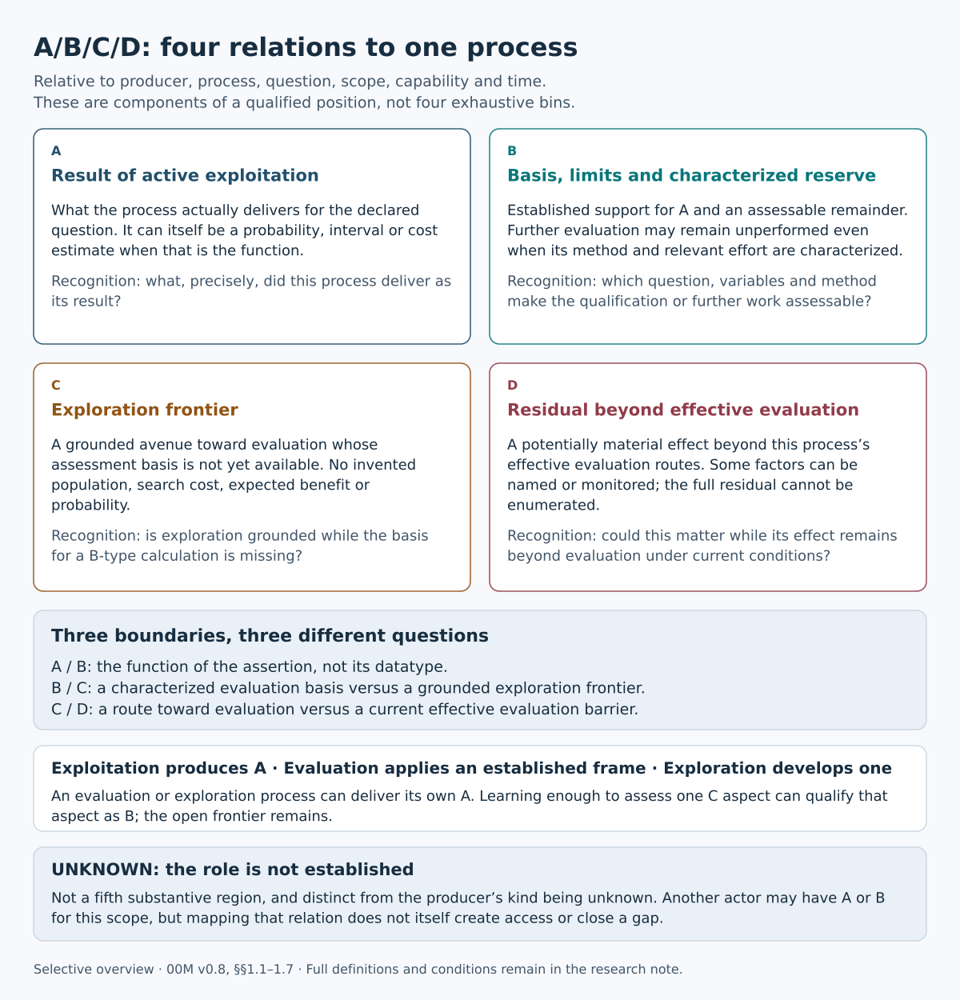
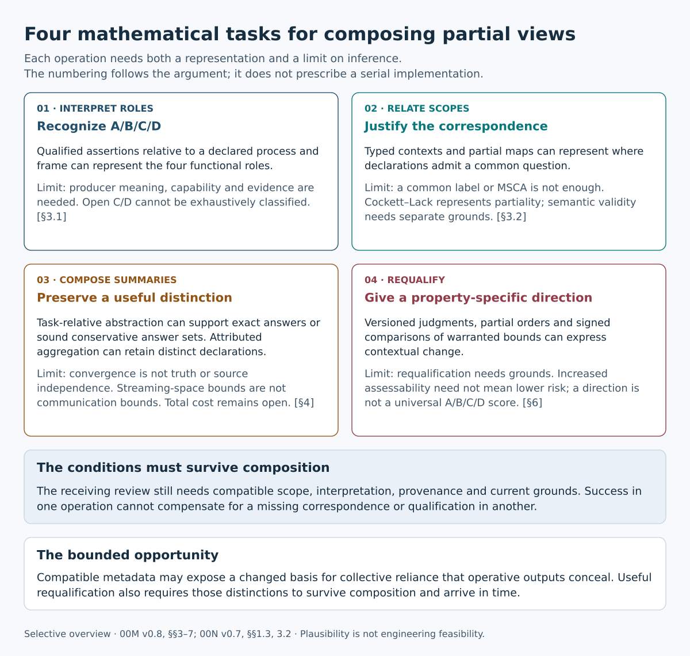
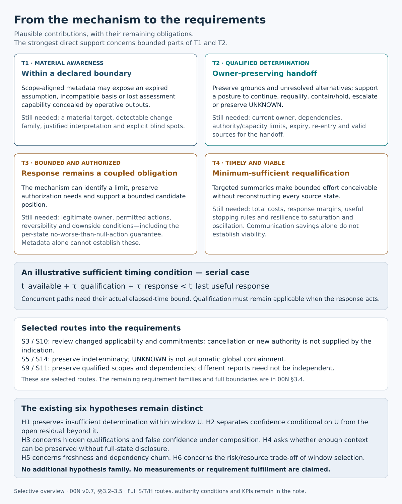

# Visual reading aids for 00M and 00N

These three selective summaries accompany [00M v0.8](../00M_ABCD_AND_MATHEMATICAL_PLAUSIBILITY_v0.8_RESEARCH_NOTE.md) and [00N v0.7](../00N_FROM_MECHANISM_TO_REQUIREMENTS_SCIENTIFIC_PLAUSIBILITY_v0.7_RESEARCH_NOTE.md). The full notes govern definitions, mathematical conditions and requirement traceability. The graphics do not replace them or establish implementation, compliance or prevention.

Read the notes in that order. [Download the self-contained HTML gallery](./EA_VISUAL_READING_AIDS_v0.1.html) and open it locally; GitHub normally displays the HTML source rather than the gallery.

## A B C D roles and boundaries

[Vector SVG](./EA_ABCD_v0.1.svg) · [PNG](./EA_ABCD_v0.1.png) · Source: 00M Sections 1.1–1.7.

## Four mathematical tasks

[Vector SVG](./EA_MECHANISMS_v0.1.svg) · [PNG](./EA_MECHANISMS_v0.1.png) · Source: 00M Sections 3–7. The four tasks describe the argument, not a mandatory serial execution protocol.

## From mechanism to requirements

[Vector SVG](./EA_REQUIREMENTS_v0.1.svg) · [PNG](./EA_REQUIREMENTS_v0.1.png) · Source: 00N Sections 3.2–3.5. The route selection is illustrative, not an exhaustive requirements map.

Published without changing the authored SVG, PNG or gallery contents. [Preservation record](../audits/00M_00N_PUBLICATION_PRESERVATION_2026-10-02.md).
