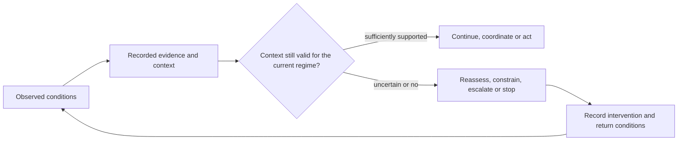

# Regime Awareness: the problem I am working on

> **Public working note — research direction, not a validated method or an adopted standards position**

Most AI assurance approaches ask whether a model, agent or decision complies with a rule, satisfies a metric or behaves acceptably under stated conditions.

My work starts one step earlier:

> **Is the context that made those rules, metrics and decisions meaningful still valid now?**

Adaptive systems operate while actors, data, objectives, constraints, capabilities and available interventions change. A system may continue to produce technically correct outputs while the operating situation has moved outside the conditions under which those outputs should be trusted. This is the problem I refer to as **regime awareness**.

I am exploring how an adaptive system can recognize that its current evidence or historical context no longer belongs to the same operating regime, and what it should do before continuing to infer, coordinate or act.

## Position within the Structural Awareness Programme

**Structural Awareness is the unifying capability.** Cost of Clarity, Regime Awareness and Minimum Sufficient Control describe an upstream-to-downstream pathway rather than three interchangeable or merely parallel labels:

```text
Cost of Clarity — pre-commitment structural conditions
Are required information, distinctions and authority available?
                         ↓
If important conditions remain missing, tacit, contradictory or undeclared,
the system begins with an incomplete representation of what it must manage.
                         ↓
Regime Awareness — operational validity
Does that representation still describe the situation as conditions change?
  └─ Regime Change Detection: is observable behaviour departing from the regime?
                         ↓
Minimum Sufficient Control — bounded response capacity
What minimum observation, coordination and intervention can maintain
or recover the declared objective without unnecessary complexity?
                         ↺
Outcomes and interventions update the structural understanding.
```

This is **one important causal and operational path**, not a claim that every regime change is caused by poor initial clarity. External shocks and endogenous dynamics can invalidate even a well-specified starting model. [The Cost of Clarity](../../applied-research/cost-of-clarity-rup/) addresses the upstream information-and-authority conditions; this document develops **Regime Awareness** during operation; [Regime Change Detection](./regime-change-qava-uv.md) develops its quantitative signal problem; and **Minimum Sufficient Control** addresses the adequacy of the resulting response architecture.

## The direction in one picture



This is not a proposed universal architecture. It is a way to expose a question that many architectures currently leave implicit.

## The central research questions

The programme currently concentrates on six connected questions:

1. **Context validity** — What evidence is required to say that observations, models or historical data remain relevant to the present operating condition?
2. **Regime departure** — Which changes are ordinary variation, and which changes invalidate the assumptions supporting the current decision process?
3. **Semantic windows** — Can the usable portion of history be defined as a context-dependent scientific object rather than as a fixed time window or an unrestricted memory?
4. **Minimum sufficient awareness** — What is the least observation, coordination and intervention capacity needed to maintain a declared objective within acceptable ranges?
5. **Effective oversight** — When does a human escalation path actually remain capable of understanding the situation and changing the outcome in time?
6. **Intervention sufficiency** — How do we distinguish a system that can detect a problem from one that can still reach, authorize and execute an effective response?

The working claim is deliberately modest: making these conditions explicit may allow different systems to compare architectures, identify missing capabilities and recognize when apparently valid decisions have crossed an unstated boundary. The specific hypotheses and mechanisms still require independent empirical and formal evaluation.

## Two connected layers

### 1. Structural awareness

Organizations and technical systems never operate on the world directly. They operate on records, models, categories, interfaces and formal representations of it. Those mappings necessarily omit distinctions.

The structural question is therefore:

> Which distinctions were lost when the operating world was converted into the representation on which the system now acts, and when do those losses become decision-relevant?

This layer connects regime awareness with work on formalization loss, attribution gaps, informational friction and human-intelligence debt.

### 2. Regime-aware assessment

The mathematical and engineering layer asks whether changing conditions can be detected and qualified without requiring complete observation or a fully disclosed world model.

The intended sequence is:

`context → qualification → regime compatibility → reassessment trigger → authorized response → evidence of outcome`

This is where semantic windows, minimal early-warning structures and bounded coordination become testable research objects rather than only conceptual language.

## Related research and applied-research lines

The pre-commitment side of this problem is being developed through [The Cost of Clarity / EIS Estonia RUP: concrete work and stakeholder architecture](../../applied-research/cost-of-clarity-rup/).

The Cost of Clarity asks whether the information and organizational conditions needed for a defensible commitment exist **before execution**. Regime Awareness asks whether the context supporting a decision remains valid **as conditions change during operation**. They share a structural-awareness bridge, but remain distinct scientific objects with separate evidence, products, institutional routes and validation burdens. Neither validates the other by association.

The narrower quantitative subline is described in [Regime Change Detection: preliminary quantitative review line with QAVA — Universitat de València](./regime-change-qava-uv.md). It identifies the candidate mathematical objects, evaluation design and falsification conditions being placed into preliminary methodological review. That review route does not imply QAVA or University of Valencia validation, endorsement or a formal research agreement.

## Relevance to agentic-AI trust discussions

This direction appears especially relevant to the current work of the [ITU-T Focus Group on Trustworthy and Intelligent Digital Agents](https://www.itu.int/en/ITU-T/focusgroups/tida/Pages/default.aspx), including:

- [Issue #16 — Operational Human Oversight Integration](https://github.com/FG-TIDA/themes/issues/16): an oversight route should be assessed not only by whether a human appears in the workflow, but also by evidence quality, operating condition, reachable scope, available intervention and response time.
- [Issue #13 — Ecosystem-level Agent Defense](https://github.com/FG-TIDA/themes/issues/13): ecosystem defense should distinguish **detection sufficiency** from **intervention sufficiency**.
- [Issue #10 — Network-Native Governance and Trust Enforcement](https://github.com/FG-TIDA/themes/issues/10) and [Issue #12 — Agent Trust Mechanics](https://github.com/FG-TIDA/themes/issues/12): these discussions help locate the boundary between mechanisms inside an agent and monitoring, coordination or enforcement supplied by its environment.

The connection is functional, not terminological. I am not proposing that FG-TIDA adopt “regime awareness” as a separate general framework. The immediate contribution is narrower: identify the operating conditions under which trust signals, human review and ecosystem interventions remain sufficient to change an outcome.

This also appears to fit the Focus Group's [Terms of Reference](https://www.itu.int/en/ITU-T/focusgroups/tida/Pages/ToR.aspx), particularly the work on human oversight integration, trust-control mechanisms and behavioural trust signals.

## What I hope to contribute

I am interested in contributions that can be tested or turned into requirements, including:

- definitions of operating condition, regime compatibility and context validity;
- requirement matrices linking evidence, condition, authority, intervention and return-to-operation criteria;
- failure cases in which detection succeeds but effective intervention is no longer reachable;
- methods for expressing confidence, freshness, scope and response deadlines in shared trust signals;
- evaluation of the minimum information and coordination needed across heterogeneous systems;
- historical and contemporary case studies that expose where static assumptions fail.

## Evidence boundaries

Several historical orchestration and mission-critical systems motivate this work. They provide engineering provenance and useful problem classes, but they do **not** prove the present theory. Likewise, interest from a researcher, participation in a standards discussion or publication of a conceptual object does not validate a detector, architecture or performance claim.

The public research direction is intentionally separated from implementation details. This page describes the problem, interfaces and falsifiable questions; it does not disclose a protected construction, parameterisation, threshold set or engine.

## Current public corpus

- [Structural Awareness Programme](https://tegrity.ai/structural-awareness-program/)
- [Regime Awareness in Adaptive Systems — series](https://tegrity.ai/series/regime-awareness-in-adaptive-systems/)
- [Minimalistic Regime-Aware Early Warning Systems](https://tegrity.ai/minimalistic-regime-aware-early-warning-systems/)
- [Evolution of Regime-Awareness Capability](https://tegrity.ai/evolution-of-regime-awareness-capability/)
- [The Cost of Clarity](https://tegrity.ai/series/cost_of_clarity/)
- [The Attribution Gap](https://tegrity.ai/series/attribution_gap/)
- [Human Intelligence Debt](https://tegrity.ai/series/human-intelligence-gap/)
- [Informational Friction](https://tegrity.ai/series/informational_friction/)
- [xSeil technical series](https://jubap.net/series/xseil_technical/) — historical engineering provenance
- [Phylons papers](https://jubap.net/series/phylons_papers/) — historical engineering provenance

## Open questions

I would especially welcome critique on these points:

- What is the smallest useful representation of an operating regime?
- How should a system express that the evidence supporting a decision is no longer sufficiently current or relevant?
- Which properties distinguish an escalation path that exists from one that remains effective?
- When can heterogeneous agents coordinate an intervention without a common controller?
- Which negative cases would falsify the claimed usefulness of semantic windows?
- How should formalization loss be measured without pretending that the unrecorded world is fully observable?

---

**Ivan Abril**  
[Tegrity.AI](https://tegrity.ai/) — a research initiative of The Integral Management Society  
Working across structural awareness, adaptive systems, operational coordination and standards-oriented research.

